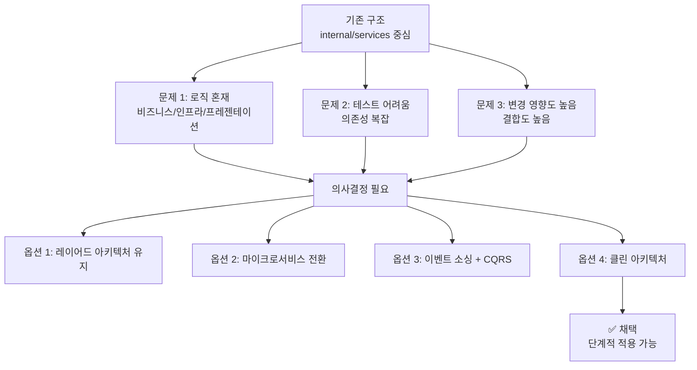
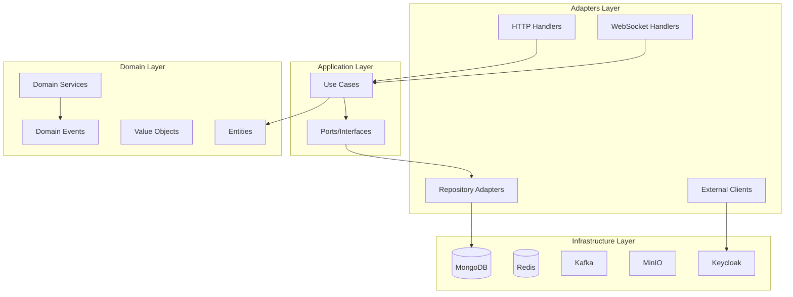
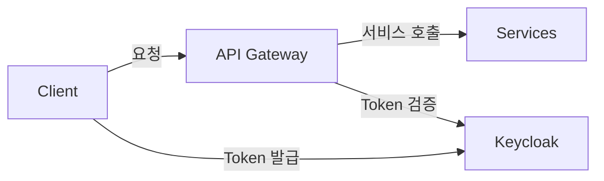
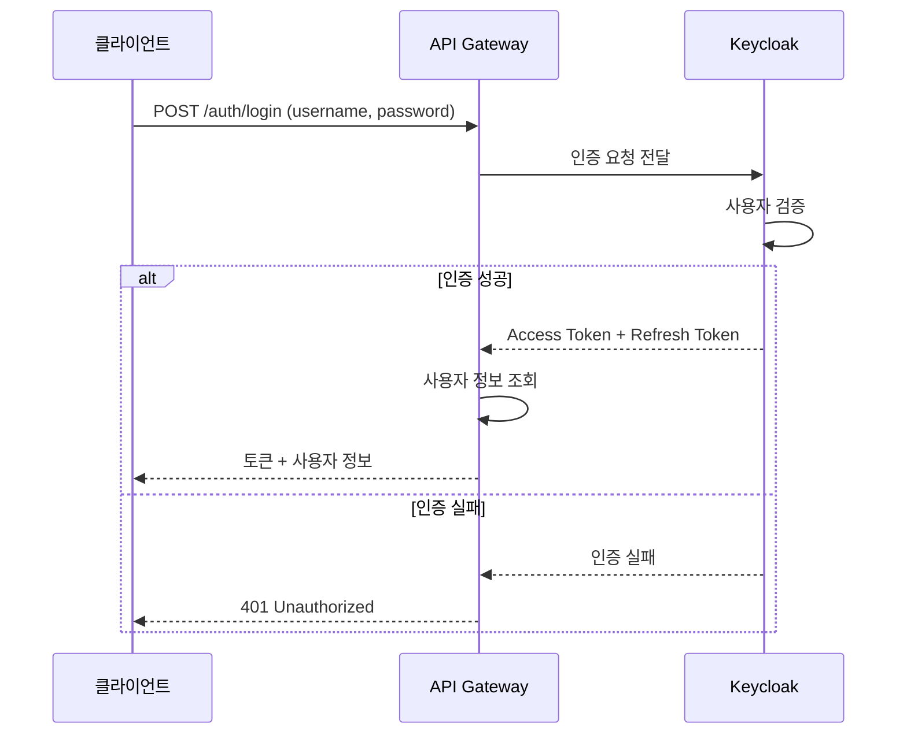
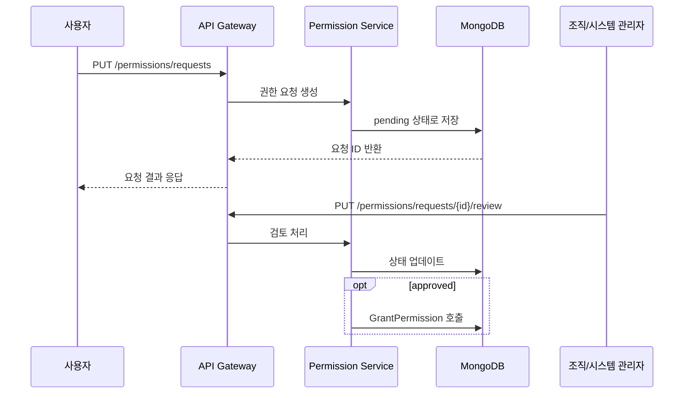
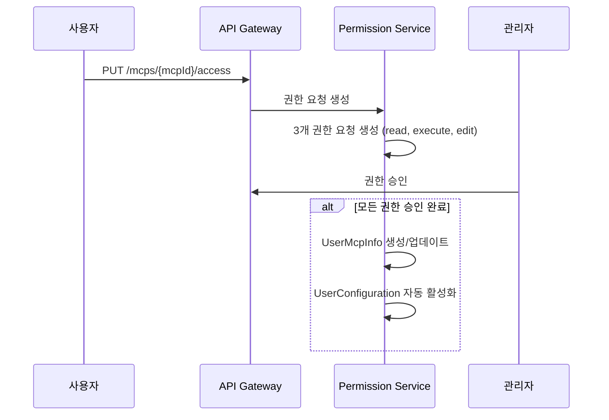
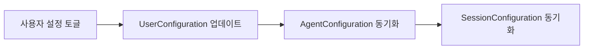

대규모 AI 플랫폼의 중앙 API Gateway를 Go로 개발하면서 적용한 Clean Architecture, DDD, TDD 원칙과 실제 구현 경험을 공유합니다.

## 프로젝트 개요

### 목표
- **통합 API 서버**: AI 에이전트, 세션, 파일, 채팅 등 다수의 AI 서비스 통합
- **인증/인가 시스템**: Keycloak SSO 기반 토큰 발급 및 검증
- **실시간 통신**: WebSocket, Server-Sent Events(SSE) 지원
- **파일 관리**: MinIO 기반 오브젝트 스토리지
- **MCP 프로토콜**: Model Context Protocol 서버 연결 및 관리

### 기술 스택

```
Backend: Go 1.24, Gin Framework
Database: MongoDB, Redis Cluster
Message Queue: Apache Kafka
Storage: MinIO
Auth: Keycloak (토큰 발급/검증 분리)
Infra: Docker, Kubernetes, GitLab CI
```

---

## Clean Architecture 채택 배경

### 기존 구조의 문제점

기존 `internal/services` 중심 구조에서 발생한 문제:



### 의사결정 (ADR)

**채택 이유:**
- 도메인 로직과 인프라 의존성을 분리하면 테스트 작성 및 유지보수가 용이
- 포트/어댑터 패턴으로 외부 시스템 교체나 모킹이 쉬워짐
- 단계별 적용이 가능해 기존 기능을 유지하면서 점진적 리팩토링 가능

**대안 검토:**
| 대안 | 거부 이유 |
|------|-----------|
| 레이어드 아키텍처 유지 | 도메인/인프라 혼재 문제 근본 해결 불가 |
| 마이크로서비스 전환 | 인프라 복잡성 증가, 팀 규모 대비 과도한 비용 |
| 이벤트 소싱 + CQRS | 학습 곡선 높음, 선행 단계로서 불필요한 위험 |

---

## 4계층 아키텍처 구조

### 디렉터리 구조

```
internal/contexts/
├── agent/              # AI 에이전트 바운디드 컨텍스트
├── session/            # 채팅 세션 컨텍스트
├── file/               # 파일 관리 컨텍스트
├── chat/               # 실시간 채팅 컨텍스트
├── authz/              # 권한 관리 컨텍스트
│   ├── domain/         # 엔터티, 값 객체, 도메인 서비스
│   ├── application/    # Use case, 포트 정의
│   ├── adapters/       # HTTP 핸들러, Repository 구현
│   └── infrastructure/ # 기술 세부사항
│
internal/platform/      # 공용 인프라 (persistence, messaging, security)
```

### 계층별 역할



### 핵심 원칙

1. **Domain-First Design**: 비즈니스 규칙은 외부 프레임워크에 의존하지 않음
2. **Dependency Inversion**: 애플리케이션 계층은 포트(interface)만 의존
3. **Testability**: 모든 도메인/유스케이스는 인메모리 어댑터로 검증 가능
4. **Observability by Design**: 계층 경계에서 로깅/트레이싱 주입 가능
5. **Incremental Evolution**: 이벤트 소싱 등은 구조 안정화 후 도입

---

## Keycloak 인증 시스템

### 아키텍처

API Gateway는 **토큰 검증만** 수행하며, 토큰 발급은 Keycloak이 담당합니다.



### 인증 흐름



### 토큰 검증 미들웨어

```go
// middleware/auth.go
func (m *AuthMiddleware) Authenticate() gin.HandlerFunc {
    return func(c *gin.Context) {
        token := extractToken(c)

        // Keycloak 토큰 검증 (발급 X, 검증만)
        err := m.jwtAuth.ValidateKeycloakToken(token)
        if err != nil {
            c.AbortWithStatusJSON(401, gin.H{"error": "invalid token"})
            return
        }

        // 사용자 정보 조회
        userInfo, err := m.jwtAuth.GetKeycloakUserInfo(token)
        if err != nil {
            c.AbortWithStatusJSON(401, gin.H{"error": "failed to get user info"})
            return
        }

        c.Set("user", userInfo)
        c.Next()
    }
}
```

### 주요 인증 API

| 엔드포인트 | 설명 |
|-----------|------|
| `POST /auth/login` | Keycloak을 통한 로그인 |
| `POST /auth/signup` | Keycloak Admin API로 사용자 생성 |
| `POST /auth/refresh-token` | 토큰 갱신 |
| `POST /auth/logout` | 토큰 무효화 |

---

## 권한 시스템 (Permission System)

### 4개 핵심 API

| API | 엔드포인트 | 용도 |
|-----|-----------|------|
| Metadata | `GET /permissions/metadata` | 전체 권한 메타데이터 |
| Availability | `GET /permissions/availability` | 요청 가능한 권한 목록 |
| Requestable | `GET /permissions/resources` | 권한 요청 가능한 리소스 타입 |
| Sharing | `GET /permissions/sharing` | 공유 가능한 권한 목록 |

### 권한 요청 워크플로우



### 권한 데이터 모델

```go
type Permission struct {
    ID           string       `json:"id"`
    Resource     string       `json:"resource"`      // agent, session, file, mcp, toolset
    ResourceID   string       `json:"resource_id"`
    Actions      []string     `json:"actions"`       // read, edit, delete, share, execute
    Status       string       `json:"status"`        // pending, approved, rejected, cancelled
    ReviewerID   string       `json:"reviewer_id"`
    ReviewedAt   *time.Time   `json:"reviewed_at"`
}
```

### 리소스별 공유 가능 액션

| 리소스 | ShareableActions |
|--------|------------------|
| Agent | read, execute, share |
| File | read, download, share |
| Session | read, write, share |

---

## MCP (Model Context Protocol) 지원

### 개요

MCP 서버 연결 및 관리 기능으로 사용자가 외부 MCP 서버를 연결하고 관리할 수 있습니다.

### 데이터 모델

```go
type McpServer struct {
    ID               string                 `json:"id"`
    Name             string                 `json:"name"`
    Description      string                 `json:"description"`
    Category         string                 `json:"category"`
    ServerURL        string                 `json:"server_url"`
    RequiredInfo     []McpServerRequiredInfo `json:"required_info"`
    IsKoreanSpecific bool                   `json:"is_korean_specific"`
}

type UserMcpInfo struct {
    ID           string          `json:"id"`
    UserID       string          `json:"user_id"`
    McpServerID  string          `json:"mcp_server_id"`
    RequiredInfo []KeyValueModel `json:"required_info"`  // API 키 등
}
```

### MCP 권한 요청 흐름



### Cascade 전파 메커니즘

MCP/ToolSet 활성화 시 User → Agent → Session으로 설정이 전파됩니다:

```
User Configuration (기본 상태: 빈 배열)
    ↓ 상속 (활성화된 것만)
Agent Configuration (User Configuration에서 활성화된 MCP/ToolSet만)
    ↓ 상속 (복사)
Session Configuration (Agent Configuration 복사)
```

---

## ToolSet API

### 개요

사전 구성된 도구 묶음(ToolSet)을 관리합니다. 예: "Drafting Suite"에 맞춤법 검사기, 문법 검사기, 번역 도구 포함.

### API 엔드포인트

| HTTP | 경로 | 설명 |
|------|------|------|
| GET | `/tool-sets` | 승인받은 ToolSet 목록 |
| GET | `/tool-sets/all` | 전체 ToolSet 목록 |
| PUT | `/tool-sets/{id}/me` | 사용자 ToolSet 정보 업데이트 |
| PUT | `/tool-sets/me` | ToolSet 활성화/비활성화 |
| PUT | `/tool-sets/{id}/access` | 접근 권한 요청 |

### 토글 동작

ToolSet 토글 시 포함된 모든 도구 상태가 함께 변경됩니다:



---

## 단계별 리팩토링 로드맵

### Phase 구성

| Phase | 주요 산출물 | 완료 조건 |
|-------|-------------|-----------|
| **0 – 준비 작업** | CI 테스트 도구 도입, TDD 워크샵 | 파이프라인 성공 |
| **1 – 도메인 코어 추출** | 도메인 엔터티/값 객체 분리 | 커버리지 40% |
| **2 – 애플리케이션 계층** | Use case + 포트 정의 | 포트 목 테스트 |
| **3 – 인터페이스 어댑터** | HTTP 핸들러 adapters 이동 | 인메모리 통합 테스트 |
| **4 – 인프라 계층 통합** | platform 모듈화, DI 정비 | 커버리지 60% |
| **5 – 테스트 자동화** | 커버리지 80% 이상 | E2E 테스트 자동화 |
| **6 – 하드닝** | 레거시 제거, 문서 업데이트 | 회귀 테스트 패스 |

### 테스트 피라미드

```
목표 비율:
├── Unit Tests: 60~70%
├── Integration Tests: 20%
└── E2E Tests: 10%

CI 목표:
├── Unit pipeline: 10분 이하
└── Integration pipeline: 20분 이하
```

---

## 프로젝트 규모

### 코드베이스 통계

| 구분 | 수량 |
|------|------|
| 모델 파일 | 65개 |
| 서비스 파일 | 80개 |
| 라우트 파일 | 34개 |
| 바운디드 컨텍스트 | 5개 (agent, session, file, chat, authz) |

### 지원 기능

- **인증**: Keycloak SSO, 토큰 갱신, 로그아웃
- **권한**: 리소스별 RBAC, 권한 요청/승인 워크플로우
- **실시간**: WebSocket, SSE
- **파일**: MinIO 업로드/다운로드, 벡터화
- **MCP**: 외부 도구 서버 연결
- **ToolSet**: 도구 묶음 관리

---

## 핵심 교훈

### 1. 점진적 마이그레이션의 중요성
- 빅뱅 리팩토링 대신 하이브리드 접근
- 기능별 우선순위에 따른 마이그레이션
- 레거시와 Clean Architecture 공존

### 2. 인증과 인가의 분리
- Keycloak은 토큰 발급만 담당
- API Gateway는 토큰 검증만 수행
- Single Source of Truth 유지

### 3. 권한 시스템은 초기에 제대로
- 요청/승인 워크플로우로 유연성 확보
- 나중에 바꾸기 매우 어려움
- 감사(Audit) 로그 필수

### 4. Configuration 상속 구조
- User → Agent → Session으로 설정 전파
- 명시적 활성화만 상속 (보안 강화)
- Cascade 삭제/비활성화 지원

---

## 참고

- [Clean Architecture - Robert C. Martin](https://blog.cleancoder.com/uncle-bob/2012/08/13/the-clean-architecture.html)
- [Keycloak Documentation](https://www.keycloak.org/documentation)
- [Model Context Protocol](https://modelcontextprotocol.io/)
- [Go 프로젝트 레이아웃](https://github.com/golang-standards/project-layout)
