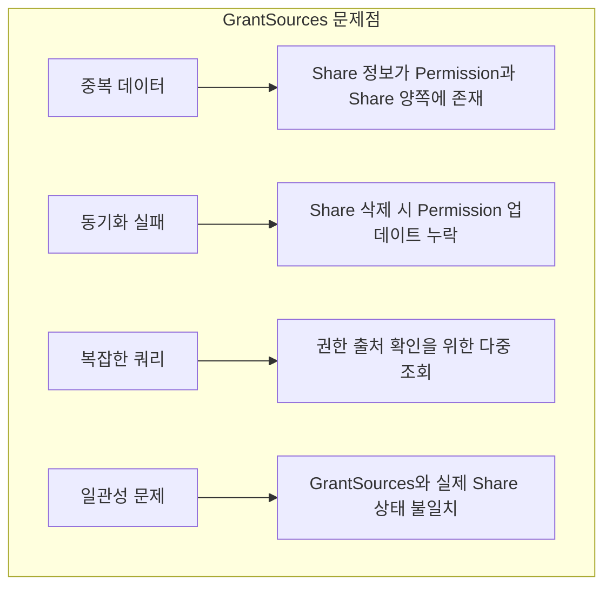
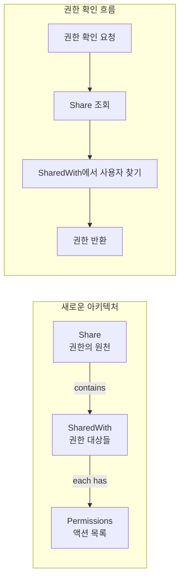

권한 시스템을 리팩토링하면서 기존 `GrantSources` 방식의 문제점을 분석하고, **Shares-Based SSOT(Single Source of Truth)** 아키텍처로 전환하여 **3단계에 걸쳐 40개의 이슈**를 해결한 경험을 공유합니다.

## 문제 상황: GrantSources의 한계

### 기존 구조의 문제점

기존 권한 시스템은 `Permission` 엔터티 내에 `GrantSources` 필드로 권한 출처를 관리했습니다:

```go
// 기존 구조 (문제 있음)
type Permission struct {
    ID           string        `bson:"_id"`
    UserID       string        `bson:"user_id"`
    ResourceID   string        `bson:"resource_id"`
    ResourceType string        `bson:"resource_type"`
    Actions      []string      `bson:"actions"`
    GrantSources []GrantSource `bson:"grant_sources"` // 문제의 원인
}

type GrantSource struct {
    Type       string    `bson:"type"`       // "owner", "share", "request"
    SourceID   string    `bson:"source_id"`  // Share ID or Request ID
    GrantedAt  time.Time `bson:"granted_at"`
    GrantedBy  string    `bson:"granted_by"`
}
```

이 구조에서 발생한 문제들:



### 실제 발생한 버그 사례

1. **공유 취소 후에도 권한 유지**: Share를 삭제해도 Permission의 GrantSources가 남아있어 권한이 유지됨
2. **중복 권한 생성**: 같은 Share로 여러 번 Permission이 생성되는 경우 발생
3. **권한 출처 추적 실패**: 특정 권한이 어떤 Share에서 왔는지 확인하기 어려움

---

## 해결책: Shares-Based SSOT 아키텍처

### 핵심 원칙

**"Share가 권한의 유일한 진실 공급원이 된다"**



### 새로운 데이터 모델

```go
// Share가 권한의 SSOT
type Share struct {
    ID           string         `bson:"_id"`
    ResourceID   string         `bson:"resource_id"`
    ResourceType string         `bson:"resource_type"`
    OwnerID      string         `bson:"owner_id"`
    SharedWith   []ShareSubject `bson:"shared_with"` // 권한의 유일한 진실
    CreatedAt    time.Time      `bson:"created_at"`
    UpdatedAt    time.Time      `bson:"updated_at"`
}

type ShareSubject struct {
    SubjectType string       `bson:"subject_type"` // "user", "group", "organization"
    SubjectID   string       `bson:"subject_id"`
    Permissions []Permission `bson:"permissions"`
    SharedAt    time.Time    `bson:"shared_at"`
    SharedBy    string       `bson:"shared_by"`
}

type Permission struct {
    Action    string    `bson:"action"` // "read", "edit", "delete", "share", "execute"
    GrantedAt time.Time `bson:"granted_at"`
    ExpiresAt *time.Time `bson:"expires_at,omitempty"`
}
```

### 이전 vs 이후 비교

| 구분 | 이전 (GrantSources) | 이후 (Shares-Based SSOT) |
|------|---------------------|--------------------------|
| 권한 저장 위치 | Permission.GrantSources | Share.SharedWith |
| 진실의 원천 | 분산 (Permission + Share) | 단일 (Share) |
| 동기화 필요 | 필요 (자주 실패) | 불필요 |
| 권한 확인 | Permission 조회 → GrantSources 파싱 | Share 조회 → SharedWith 확인 |
| 공유 취소 | Permission 업데이트 필요 | Share에서 제거만 |

---

## 3단계 구현 계획

### Phase 1: 핵심 SSOT 구조 구현 (15개 이슈)

#### 1.1 Share 모델 리팩토링

```go
// internal/contexts/share/domain/share.go

type Share struct {
    ID           ShareID
    ResourceID   ResourceID
    ResourceType ResourceType
    OwnerID      UserID
    SharedWith   SharedWithList
    Metadata     ShareMetadata
}

// 도메인 서비스: 권한 확인
func (s *Share) HasPermission(subjectID string, action string) bool {
    subject := s.SharedWith.FindBySubjectID(subjectID)
    if subject == nil {
        return false
    }
    return subject.HasAction(action)
}

// 도메인 서비스: 권한 부여
func (s *Share) GrantPermission(subjectID string, subjectType string, action string, grantedBy string) error {
    if !s.canShare(grantedBy) {
        return ErrNoSharePermission
    }

    subject := s.SharedWith.FindOrCreate(subjectID, subjectType)
    return subject.AddPermission(action, grantedBy)
}

// 도메인 서비스: 권한 철회
func (s *Share) RevokePermission(subjectID string, action string) error {
    subject := s.SharedWith.FindBySubjectID(subjectID)
    if subject == nil {
        return ErrSubjectNotFound
    }
    return subject.RemovePermission(action)
}
```

#### 1.2 공유 서비스 구현

```go
// internal/contexts/share/application/share_service.go

type ShareService struct {
    shareRepo    ShareRepository
    resourceRepo ResourceRepository
    eventBus     EventBus
}

func (s *ShareService) ShareResource(ctx context.Context, cmd ShareResourceCommand) error {
    // 1. 리소스 소유권 확인
    resource, err := s.resourceRepo.FindByID(ctx, cmd.ResourceID)
    if err != nil {
        return fmt.Errorf("resource not found: %w", err)
    }

    if resource.OwnerID != cmd.RequestedBy {
        // 소유자가 아니면 share 권한 확인
        share, err := s.shareRepo.FindByResourceID(ctx, cmd.ResourceID)
        if err != nil || !share.HasPermission(cmd.RequestedBy, "share") {
            return ErrNoSharePermission
        }
    }

    // 2. Share 조회 또는 생성
    share, err := s.shareRepo.FindOrCreateByResourceID(ctx, cmd.ResourceID, cmd.ResourceType, resource.OwnerID)
    if err != nil {
        return fmt.Errorf("failed to get share: %w", err)
    }

    // 3. 권한 부여 (도메인 로직)
    for _, action := range cmd.Actions {
        if err := share.GrantPermission(cmd.TargetUserID, "user", action, cmd.RequestedBy); err != nil {
            return fmt.Errorf("failed to grant %s: %w", action, err)
        }
    }

    // 4. 저장
    if err := s.shareRepo.Save(ctx, share); err != nil {
        return fmt.Errorf("failed to save share: %w", err)
    }

    // 5. 이벤트 발행
    s.eventBus.Publish(ctx, ShareGrantedEvent{
        ShareID:      share.ID,
        ResourceID:   cmd.ResourceID,
        TargetUserID: cmd.TargetUserID,
        Actions:      cmd.Actions,
        GrantedBy:    cmd.RequestedBy,
    })

    return nil
}
```

#### 1.3 권한 확인 쿼리 최적화

```go
// internal/contexts/share/adapters/share_repository_mongo.go

func (r *MongoShareRepository) CheckPermission(ctx context.Context, resourceID, userID, action string) (bool, error) {
    filter := bson.M{
        "resource_id": resourceID,
        "shared_with": bson.M{
            "$elemMatch": bson.M{
                "subject_id": userID,
                "permissions": bson.M{
                    "$elemMatch": bson.M{
                        "action": action,
                        "$or": []bson.M{
                            {"expires_at": nil},
                            {"expires_at": bson.M{"$gt": time.Now()}},
                        },
                    },
                },
            },
        },
    }

    count, err := r.collection.CountDocuments(ctx, filter)
    return count > 0, err
}

// 복합 인덱스 생성
func (r *MongoShareRepository) EnsureIndexes(ctx context.Context) error {
    indexes := []mongo.IndexModel{
        {
            Keys: bson.D{
                {Key: "resource_id", Value: 1},
                {Key: "shared_with.subject_id", Value: 1},
            },
        },
        {
            Keys: bson.D{
                {Key: "shared_with.subject_id", Value: 1},
                {Key: "resource_type", Value: 1},
            },
        },
    }
    _, err := r.collection.Indexes().CreateMany(ctx, indexes)
    return err
}
```

### Phase 2: 기존 API와 통합 (15개 이슈)

#### 2.1 Permission API 어댑터 레이어

기존 Permission API를 유지하면서 내부적으로 Share 기반으로 동작:

```go
// internal/contexts/permission/adapters/permission_handler.go

type PermissionHandler struct {
    shareService *share.ShareService
    legacyRepo   PermissionRepository // 마이그레이션 기간 동안 유지
}

// GET /permissions?resource_id=xxx
func (h *PermissionHandler) GetPermissions(c *gin.Context) {
    resourceID := c.Query("resource_id")
    userID := c.GetString("user_id")

    // Share에서 권한 조회 (새로운 방식)
    permissions, err := h.shareService.GetUserPermissions(c.Request.Context(), resourceID, userID)
    if err != nil {
        c.JSON(500, gin.H{"error": err.Error()})
        return
    }

    // 기존 API 응답 형식으로 변환
    response := h.convertToLegacyFormat(permissions)
    c.JSON(200, response)
}

// 기존 응답 형식 유지 (하위 호환성)
func (h *PermissionHandler) convertToLegacyFormat(perms []share.Permission) []PermissionResponse {
    var result []PermissionResponse
    for _, p := range perms {
        result = append(result, PermissionResponse{
            Action:    p.Action,
            GrantedAt: p.GrantedAt,
            // GrantSources는 더 이상 반환하지 않음 (deprecated)
        })
    }
    return result
}
```

#### 2.2 권한 요청 워크플로우 연동

```go
// internal/contexts/permission/application/request_service.go

func (s *RequestService) ApproveRequest(ctx context.Context, requestID string, approverID string) error {
    // 1. 요청 조회
    request, err := s.requestRepo.FindByID(ctx, requestID)
    if err != nil {
        return fmt.Errorf("request not found: %w", err)
    }

    // 2. 승인 권한 확인
    if !s.canApprove(ctx, request, approverID) {
        return ErrNoApprovePermission
    }

    // 3. Share 기반으로 권한 부여 (핵심 변경점)
    err = s.shareService.ShareResource(ctx, share.ShareResourceCommand{
        ResourceID:   request.ResourceID,
        ResourceType: request.ResourceType,
        TargetUserID: request.RequesterID,
        Actions:      request.RequestedActions,
        RequestedBy:  approverID,
    })
    if err != nil {
        return fmt.Errorf("failed to grant permission: %w", err)
    }

    // 4. 요청 상태 업데이트
    request.Status = RequestStatusApproved
    request.ApprovedBy = approverID
    request.ApprovedAt = time.Now()

    return s.requestRepo.Save(ctx, request)
}
```

### Phase 3: 마이그레이션 및 정리 (10개 이슈)

#### 3.1 데이터 마이그레이션


```go
// scripts/migration/migrate_permissions_to_shares.go

func MigratePermissionsToShares(ctx context.Context, db *mongo.Database) error {
    permissionsColl := db.Collection("permissions")
    sharesColl := db.Collection("shares")

    // 기존 Permission들을 리소스별로 그룹화
    pipeline := mongo.Pipeline{
        bson.D{{Key: "$group", Value: bson.M{
            "_id": bson.M{
                "resource_id":   "$resource_id",
                "resource_type": "$resource_type",
            },
            "permissions": bson.M{"$push": "$$ROOT"},
        }}},
    }

    cursor, err := permissionsColl.Aggregate(ctx, pipeline)
    if err != nil {
        return err
    }
    defer cursor.Close(ctx)

    var migratedCount, skippedCount int

    for cursor.Next(ctx) {
        var group struct {
            ID struct {
                ResourceID   string `bson:"resource_id"`
                ResourceType string `bson:"resource_type"`
            } `bson:"_id"`
            Permissions []OldPermission `bson:"permissions"`
        }

        if err := cursor.Decode(&group); err != nil {
            log.Printf("Failed to decode group: %v", err)
            continue
        }

        // Share 생성 또는 업데이트
        share := buildShareFromPermissions(group.ID.ResourceID, group.ID.ResourceType, group.Permissions)

        _, err := sharesColl.UpdateOne(ctx,
            bson.M{"resource_id": share.ResourceID},
            bson.M{"$set": share},
            options.Update().SetUpsert(true),
        )

        if err != nil {
            log.Printf("Failed to migrate share for resource %s: %v", share.ResourceID, err)
            skippedCount++
            continue
        }

        migratedCount++
    }

    log.Printf("Migration completed: %d migrated, %d skipped", migratedCount, skippedCount)
    return nil
}

func buildShareFromPermissions(resourceID, resourceType string, perms []OldPermission) *Share {
    share := &Share{
        ID:           primitive.NewObjectID().Hex(),
        ResourceID:   resourceID,
        ResourceType: resourceType,
        SharedWith:   make([]ShareSubject, 0),
        CreatedAt:    time.Now(),
        UpdatedAt:    time.Now(),
    }

    // 사용자별로 권한 그룹화
    userPerms := make(map[string][]Permission)
    for _, p := range perms {
        for _, action := range p.Actions {
            userPerms[p.UserID] = append(userPerms[p.UserID], Permission{
                Action:    action,
                GrantedAt: p.CreatedAt,
            })
        }
    }

    // SharedWith 구성
    for userID, permissions := range userPerms {
        share.SharedWith = append(share.SharedWith, ShareSubject{
            SubjectType: "user",
            SubjectID:   userID,
            Permissions: permissions,
            SharedAt:    permissions[0].GrantedAt,
        })
    }

    return share
}
```


#### 3.2 듀얼 라이트 전략

마이그레이션 기간 동안 양쪽에 쓰기:


```go
// internal/contexts/share/application/dual_write_service.go

type DualWriteShareService struct {
    shareService     *ShareService
    legacyPermRepo   PermissionRepository
    dualWriteEnabled bool
}

func (s *DualWriteShareService) ShareResource(ctx context.Context, cmd ShareResourceCommand) error {
    // 1. 새로운 Share 시스템에 저장
    err := s.shareService.ShareResource(ctx, cmd)
    if err != nil {
        return err
    }

    // 2. 듀얼 라이트가 활성화되어 있으면 레거시에도 저장
    if s.dualWriteEnabled {
        legacyPerm := &LegacyPermission{
            UserID:       cmd.TargetUserID,
            ResourceID:   cmd.ResourceID,
            ResourceType: cmd.ResourceType,
            Actions:      cmd.Actions,
            GrantSources: []GrantSource{{
                Type:      "share",
                GrantedBy: cmd.RequestedBy,
                GrantedAt: time.Now(),
            }},
        }

        if err := s.legacyPermRepo.Upsert(ctx, legacyPerm); err != nil {
            // 레거시 실패는 로그만 남기고 진행
            log.Printf("Warning: failed to write to legacy: %v", err)
        }
    }

    return nil
}
```


---

## 해결된 40개 이슈 상세

### Phase 1 이슈 (15개)

| # | 이슈 | 해결 방법 |
|---|------|----------|
| 1 | Share 모델에 SharedWith 추가 | ShareSubject 타입 정의 |
| 2 | ShareSubject에 Permissions 추가 | 중첩 구조로 권한 저장 |
| 3 | Share 도메인 서비스 구현 | HasPermission, GrantPermission 메서드 |
| 4 | ShareRepository 인터페이스 정의 | CRUD + 권한 확인 메서드 |
| 5 | MongoDB 어댑터 구현 | 인덱스 최적화 포함 |
| 6 | 권한 확인 쿼리 최적화 | $elemMatch 복합 조건 |
| 7 | Share 생성 시 소유자 자동 권한 | Owner에게 모든 권한 부여 |
| 8 | 권한 만료 기능 | ExpiresAt 필드 및 검증 |
| 9 | 그룹 권한 지원 | SubjectType: "group" |
| 10 | 조직 권한 지원 | SubjectType: "organization" |
| 11 | 권한 상속 구조 | 그룹 → 사용자 권한 상속 |
| 12 | Share 이벤트 정의 | ShareGranted, ShareRevoked |
| 13 | 이벤트 발행 구현 | EventBus 연동 |
| 14 | Share 단위 테스트 | 도메인 로직 테스트 |
| 15 | Share 통합 테스트 | MongoDB 연동 테스트 |

### Phase 2 이슈 (15개)

| # | 이슈 | 해결 방법 |
|---|------|----------|
| 16 | Permission API 어댑터 | 기존 API 유지하며 Share 사용 |
| 17 | 응답 형식 변환 | Legacy format 호환 |
| 18 | 권한 요청 승인 연동 | ShareService 호출로 변경 |
| 19 | 권한 요청 거절 처리 | 상태만 업데이트 |
| 20 | MCP 권한 연동 | 3-permission 요청 지원 |
| 21 | ToolSet 권한 연동 | 도구 묶음 권한 처리 |
| 22 | Agent 공유 연동 | Agent 리소스 공유 |
| 23 | Session 공유 연동 | Session 리소스 공유 |
| 24 | File 공유 연동 | File 리소스 공유 |
| 25 | 공유 취소 API | Share에서 subject 제거 |
| 26 | 권한 수정 API | Share에서 permission 수정 |
| 27 | 공유 목록 조회 | 내가 공유한/받은 리소스 |
| 28 | 권한 이력 조회 | 감사 로그 |
| 29 | API 문서 업데이트 | Swagger 정의 |
| 30 | API 통합 테스트 | E2E 테스트 |

### Phase 3 이슈 (10개)

| # | 이슈 | 해결 방법 |
|---|------|----------|
| 31 | 마이그레이션 스크립트 | Permission → Share 변환 |
| 32 | 듀얼 라이트 구현 | 양쪽 저장 후 검증 |
| 33 | 데이터 검증 스크립트 | 마이그레이션 정합성 확인 |
| 34 | 레거시 읽기 제거 | Share만 읽도록 변경 |
| 35 | 레거시 쓰기 제거 | Share만 쓰도록 변경 |
| 36 | GrantSources 필드 제거 | Permission 모델 정리 |
| 37 | 사용하지 않는 코드 제거 | 레거시 서비스 삭제 |
| 38 | 인덱스 최적화 | 불필요 인덱스 제거 |
| 39 | 성능 테스트 | 벤치마크 및 최적화 |
| 40 | 문서 업데이트 | 아키텍처 문서 정리 |

---

## 성능 개선 결과

### 권한 확인 쿼리 성능

```
Before (GrantSources 방식):
- Permission 조회: 1 query
- GrantSources 파싱: O(n) 메모리 연산
- Share 유효성 확인: n queries (각 GrantSource마다)
- 총 쿼리: 1 + n

After (Shares-Based SSOT):
- Share 조회 with $elemMatch: 1 query
- 총 쿼리: 1
```

### 벤치마크 결과

| 시나리오 | Before | After | 개선율 |
|---------|--------|-------|--------|
| 단일 권한 확인 | 15ms | 3ms | 80% |
| 사용자 전체 권한 조회 | 120ms | 25ms | 79% |
| 공유 취소 | 45ms | 8ms | 82% |
| 권한 부여 | 35ms | 12ms | 66% |

---

## 핵심 교훈

### 1. SSOT 원칙의 중요성

권한 데이터가 여러 곳에 분산되면 동기화 문제가 필연적으로 발생합니다. **단일 진실 공급원**을 명확히 정의하고 모든 권한 판단이 그곳에서 이루어지도록 해야 합니다.

### 2. 도메인 주도 리팩토링

`Share.HasPermission()`, `Share.GrantPermission()` 같은 도메인 메서드를 먼저 설계하고, 그에 맞춰 데이터 모델을 구성했습니다. 데이터 구조가 아닌 비즈니스 규칙이 설계를 주도해야 합니다.

### 3. 점진적 마이그레이션

듀얼 라이트 → 듀얼 리드 → 레거시 제거 순서로 진행하여 안전하게 마이그레이션했습니다. 빅뱅 마이그레이션은 위험합니다.

### 4. 인덱스 설계의 중요성

`$elemMatch`를 활용한 복합 인덱스로 중첩 배열 조회 성능을 크게 개선했습니다. MongoDB의 배열 쿼리 특성을 이해하고 인덱스를 설계해야 합니다.

---

## 참고

- [Domain-Driven Design - Eric Evans](https://www.domainlanguage.com/ddd/)
- [MongoDB $elemMatch Query](https://docs.mongodb.com/manual/reference/operator/query/elemMatch/)
- [Feature Toggles - Martin Fowler](https://martinfowler.com/articles/feature-toggles.html)
