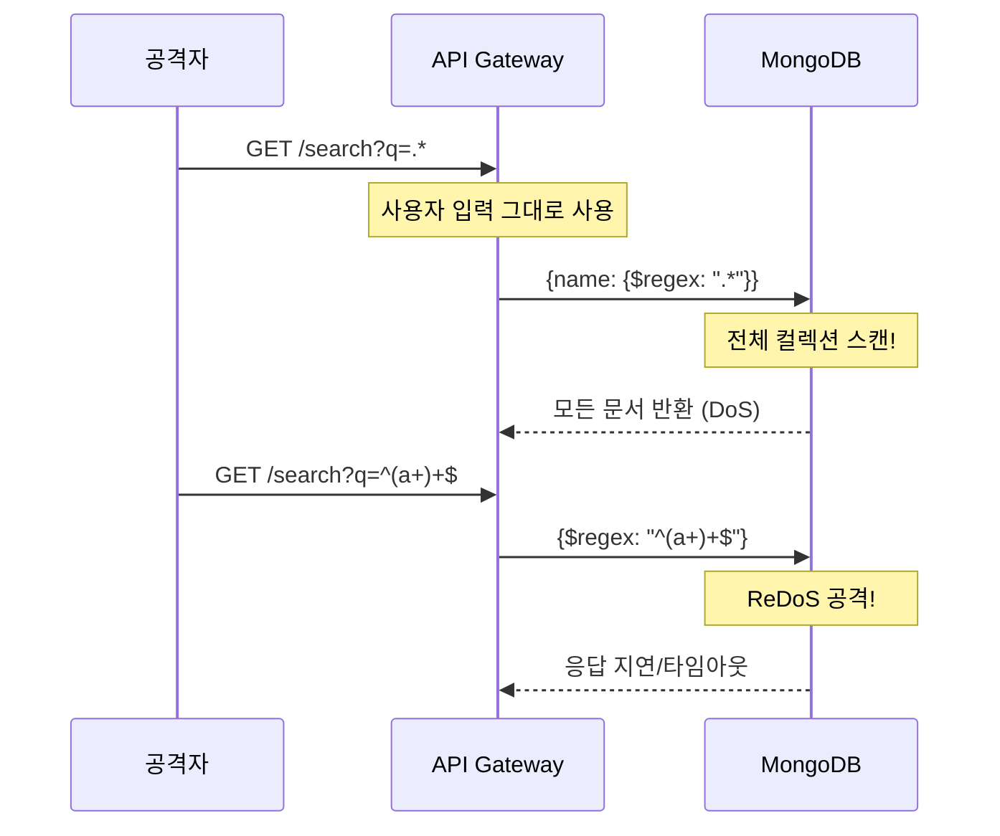
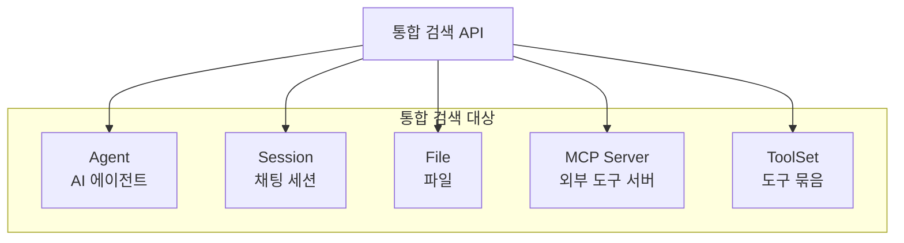

AI 플랫폼에서 Agent, Session, File, MCP, ToolSet 등 다양한 리소스를 통합 검색하는 시스템을 구현하면서 **MongoDB Regex Injection 취약점**을 발견하고 해결한 경험, 그리고 **병렬 검색으로 성능을 최적화**한 과정을 공유합니다.

## 문제 상황: 검색 기능의 보안 취약점

### 기존 검색 코드의 문제

초기 검색 구현에서 사용자 입력을 그대로 MongoDB regex 쿼리에 사용하고 있었습니다:

```go
// 취약한 코드 (NEVER DO THIS)
func SearchAgents(ctx context.Context, searchQuery string) ([]Agent, error) {
    filter := bson.M{
        "$or": []bson.M{
            {"name": bson.M{"$regex": searchQuery, "$options": "i"}},
            {"description": bson.M{"$regex": searchQuery, "$options": "i"}},
        },
    }
    // ... 쿼리 실행
}
```

### Regex Injection 공격 시나리오



### 발견된 취약점들

1. **전체 데이터 노출**: `.*` 입력 시 모든 데이터 반환
2. **ReDoS (Regular Expression DoS)**: 악의적인 정규식으로 서버 마비
3. **특수문자 이스케이프 누락**: `(`, `)`, `[`, `]` 등이 regex로 해석됨
4. **대소문자 구분 우회**: `$options` 조작 가능성

---

## 해결책: 보안 강화된 검색 유틸리티

### 핵심 함수: EscapeRegex

```go
// internal/platform/search/escape.go

// EscapeRegex는 MongoDB regex 쿼리에서 특수문자를 이스케이프합니다.
// 이 함수는 Regex Injection 공격을 방지하기 위해 반드시 사용해야 합니다.
func EscapeRegex(searchQuery string) string {
    // MongoDB regex 특수문자: . * + ? ^ $ { } [ ] ( ) | \
    specialChars := []string{
        "\\", ".", "*", "+", "?", "^", "$",
        "{", "}", "[", "]", "(", ")", "|",
    }

    result := searchQuery
    for _, char := range specialChars {
        result = strings.ReplaceAll(result, char, "\\"+char)
    }

    return result
}
```

### 검색 필터 빌더

```go
// internal/platform/search/filter.go

// SearchConfig는 검색 설정을 정의합니다.
type SearchConfig struct {
    Fields         []string // 검색할 필드들
    CaseSensitive  bool     // 대소문자 구분
    MaxQueryLength int      // 최대 쿼리 길이
    MinQueryLength int      // 최소 쿼리 길이
}

var DefaultSearchConfig = SearchConfig{
    Fields:         []string{"name", "description"},
    CaseSensitive:  false,
    MaxQueryLength: 100,
    MinQueryLength: 2,
}

// BuildSearchFilter는 안전한 검색 필터를 생성합니다.
func BuildSearchFilter(searchQuery string, fields []string) (bson.M, error) {
    // 1. 입력 검증
    if err := ValidateSearchQuery(searchQuery); err != nil {
        return nil, err
    }

    // 2. 특수문자 이스케이프 (핵심!)
    escapedQuery := EscapeRegex(searchQuery)

    // 3. 대소문자 무시 옵션
    options := "i"

    // 4. OR 조건으로 필드들 검색
    var conditions []bson.M
    for _, field := range fields {
        conditions = append(conditions, bson.M{
            field: bson.M{
                "$regex":   escapedQuery,
                "$options": options,
            },
        })
    }

    return bson.M{"$or": conditions}, nil
}

// ValidateSearchQuery는 검색 쿼리의 유효성을 검증합니다.
func ValidateSearchQuery(query string) error {
    query = strings.TrimSpace(query)

    if len(query) < DefaultSearchConfig.MinQueryLength {
        return fmt.Errorf("search query must be at least %d characters", DefaultSearchConfig.MinQueryLength)
    }

    if len(query) > DefaultSearchConfig.MaxQueryLength {
        return fmt.Errorf("search query must not exceed %d characters", DefaultSearchConfig.MaxQueryLength)
    }

    // 빈 문자열이나 공백만 있는 경우
    if len(strings.TrimSpace(query)) == 0 {
        return errors.New("search query cannot be empty")
    }

    return nil
}
```

### 이스케이프 동작 예시

```go
// 테스트 케이스
func TestEscapeRegex(t *testing.T) {
    tests := []struct {
        input    string
        expected string
    }{
        {"hello", "hello"},
        {"hello.world", "hello\\.world"},
        {"test*", "test\\*"},
        {"(admin)", "\\(admin\\)"},
        {"^root$", "\\^root\\$"},
        {"a+b", "a\\+b"},
        {"file[0-9]", "file\\[0-9\\]"},
        {"path|name", "path\\|name"},
        {"c:\\windows", "c:\\\\windows"},
        {"question?", "question\\?"},
    }

    for _, tt := range tests {
        result := EscapeRegex(tt.input)
        if result != tt.expected {
            t.Errorf("EscapeRegex(%q) = %q, want %q", tt.input, result, tt.expected)
        }
    }
}
```

---

## 통합 검색 서비스 구현

### 검색 대상 리소스



### 병렬 검색 구현

```go
// internal/contexts/search/application/unified_search_service.go

type UnifiedSearchService struct {
    agentRepo   AgentRepository
    sessionRepo SessionRepository
    fileRepo    FileRepository
    mcpRepo     McpRepository
    toolSetRepo ToolSetRepository
}

type SearchResult struct {
    Agents   []AgentSearchItem   `json:"agents"`
    Sessions []SessionSearchItem `json:"sessions"`
    Files    []FileSearchItem    `json:"files"`
    MCPs     []McpSearchItem     `json:"mcps"`
    ToolSets []ToolSetSearchItem `json:"tool_sets"`
}

func (s *UnifiedSearchService) Search(ctx context.Context, query string, userID string) (*SearchResult, error) {
    // 1. 검색 필터 생성 (보안 처리 포함)
    filter, err := search.BuildSearchFilter(query, []string{"name", "description"})
    if err != nil {
        return nil, fmt.Errorf("invalid search query: %w", err)
    }

    // 2. 병렬 검색 실행
    result := &SearchResult{}
    var wg sync.WaitGroup
    var mu sync.Mutex
    errChan := make(chan error, 5)

    // Agent 검색
    wg.Add(1)
    go func() {
        defer wg.Done()
        agents, err := s.searchAgents(ctx, filter, userID)
        if err != nil {
            errChan <- fmt.Errorf("agent search failed: %w", err)
            return
        }
        mu.Lock()
        result.Agents = agents
        mu.Unlock()
    }()

    // Session 검색
    wg.Add(1)
    go func() {
        defer wg.Done()
        sessions, err := s.searchSessions(ctx, filter, userID)
        if err != nil {
            errChan <- fmt.Errorf("session search failed: %w", err)
            return
        }
        mu.Lock()
        result.Sessions = sessions
        mu.Unlock()
    }()

    // File 검색
    wg.Add(1)
    go func() {
        defer wg.Done()
        files, err := s.searchFiles(ctx, filter, userID)
        if err != nil {
            errChan <- fmt.Errorf("file search failed: %w", err)
            return
        }
        mu.Lock()
        result.Files = files
        mu.Unlock()
    }()

    // MCP 검색
    wg.Add(1)
    go func() {
        defer wg.Done()
        mcps, err := s.searchMCPs(ctx, filter, userID)
        if err != nil {
            errChan <- fmt.Errorf("mcp search failed: %w", err)
            return
        }
        mu.Lock()
        result.MCPs = mcps
        mu.Unlock()
    }()

    // ToolSet 검색
    wg.Add(1)
    go func() {
        defer wg.Done()
        toolSets, err := s.searchToolSets(ctx, filter, userID)
        if err != nil {
            errChan <- fmt.Errorf("toolset search failed: %w", err)
            return
        }
        mu.Lock()
        result.ToolSets = toolSets
        mu.Unlock()
    }()

    // 모든 검색 완료 대기
    wg.Wait()
    close(errChan)

    // 에러 수집
    var errors []error
    for err := range errChan {
        errors = append(errors, err)
    }

    // 일부 실패해도 결과 반환 (Partial Response)
    if len(errors) > 0 {
        log.Printf("Some searches failed: %v", errors)
    }

    return result, nil
}
```

### 권한 기반 필터링

```go
// 사용자가 접근 가능한 리소스만 검색
func (s *UnifiedSearchService) searchAgents(ctx context.Context, filter bson.M, userID string) ([]AgentSearchItem, error) {
    // 권한 필터 추가: 소유자이거나 공유받은 Agent만
    permissionFilter := bson.M{
        "$or": []bson.M{
            {"owner_id": userID},                                    // 소유자
            {"shared_with.subject_id": userID},                      // 공유받음
        },
    }

    // 검색 필터와 권한 필터 결합
    combinedFilter := bson.M{
        "$and": []bson.M{filter, permissionFilter},
    }

    return s.agentRepo.Find(ctx, combinedFilter)
}
```

---

## 검색 결과 하이라이팅

### 매칭 텍스트 강조

```go
// internal/platform/search/highlight.go

type HighlightConfig struct {
    PreTag  string // 강조 시작 태그
    PostTag string // 강조 종료 태그
    MaxLen  int    // 미리보기 최대 길이
}

var DefaultHighlightConfig = HighlightConfig{
    PreTag:  "<mark>",
    PostTag: "</mark>",
    MaxLen:  200,
}

func HighlightMatches(text, query string, config HighlightConfig) string {
    if text == "" || query == "" {
        return text
    }

    // 대소문자 무시 매칭을 위한 정규식 생성
    escapedQuery := EscapeRegex(query)
    pattern := regexp.MustCompile("(?i)(" + escapedQuery + ")")

    highlighted := pattern.ReplaceAllString(text, config.PreTag+"$1"+config.PostTag)

    // 길이 제한
    if len(highlighted) > config.MaxLen {
        // 첫 번째 매칭 주변 컨텍스트 추출
        highlighted = extractContext(highlighted, config.MaxLen)
    }

    return highlighted
}

func extractContext(text string, maxLen int) string {
    // <mark> 태그 위치 찾기
    markIndex := strings.Index(text, "<mark>")
    if markIndex == -1 {
        if len(text) > maxLen {
            return text[:maxLen] + "..."
        }
        return text
    }

    // 매칭 주변 컨텍스트 추출
    start := markIndex - maxLen/4
    if start < 0 {
        start = 0
    }

    end := start + maxLen
    if end > len(text) {
        end = len(text)
    }

    result := text[start:end]
    if start > 0 {
        result = "..." + result
    }
    if end < len(text) {
        result = result + "..."
    }

    return result
}
```

### 검색 결과 정렬

```go
// 관련도 점수 계산
type SearchScore struct {
    NameMatch        int // 이름 매칭 가중치
    DescriptionMatch int // 설명 매칭 가중치
    RecentlyUsed     int // 최근 사용 가중치
    Relevance        int // 총 관련도 점수
}

func CalculateRelevance(item interface{}, query string) SearchScore {
    score := SearchScore{}
    query = strings.ToLower(query)

    switch v := item.(type) {
    case *Agent:
        // 이름에 정확히 매칭되면 높은 점수
        if strings.Contains(strings.ToLower(v.Name), query) {
            score.NameMatch = 100
        }
        // 설명에 매칭되면 중간 점수
        if strings.Contains(strings.ToLower(v.Description), query) {
            score.DescriptionMatch = 50
        }
        // 최근 사용 가중치
        if time.Since(v.LastUsedAt) < 24*time.Hour {
            score.RecentlyUsed = 30
        } else if time.Since(v.LastUsedAt) < 7*24*time.Hour {
            score.RecentlyUsed = 15
        }
    }

    score.Relevance = score.NameMatch + score.DescriptionMatch + score.RecentlyUsed
    return score
}
```

---

## 성능 최적화

### 인덱스 설계

```go
// 검색 성능을 위한 인덱스
func CreateSearchIndexes(db *mongo.Database) error {
    collections := []string{"agents", "sessions", "files", "mcp_servers", "tool_sets"}

    for _, collName := range collections {
        coll := db.Collection(collName)

        // 텍스트 인덱스 (풀텍스트 검색용)
        _, err := coll.Indexes().CreateOne(context.Background(), mongo.IndexModel{
            Keys: bson.D{
                {Key: "name", Value: "text"},
                {Key: "description", Value: "text"},
            },
            Options: options.Index().SetWeights(bson.M{
                "name":        10, // 이름에 더 높은 가중치
                "description": 5,
            }),
        })
        if err != nil {
            return fmt.Errorf("failed to create text index on %s: %w", collName, err)
        }

        // 소유자 + 이름 복합 인덱스 (권한 기반 검색용)
        _, err = coll.Indexes().CreateOne(context.Background(), mongo.IndexModel{
            Keys: bson.D{
                {Key: "owner_id", Value: 1},
                {Key: "name", Value: 1},
            },
        })
        if err != nil {
            return fmt.Errorf("failed to create compound index on %s: %w", collName, err)
        }
    }

    return nil
}
```

### 검색 결과 캐싱

```go
// internal/platform/search/cache.go

type SearchCache struct {
    redis    *redis.Client
    ttl      time.Duration
    keyPrefix string
}

func NewSearchCache(redis *redis.Client) *SearchCache {
    return &SearchCache{
        redis:    redis,
        ttl:      5 * time.Minute, // 검색 결과 5분 캐싱
        keyPrefix: "search:",
    }
}

func (c *SearchCache) Get(ctx context.Context, query, userID string) (*SearchResult, bool) {
    key := c.buildKey(query, userID)

    data, err := c.redis.Get(ctx, key).Bytes()
    if err != nil {
        return nil, false
    }

    var result SearchResult
    if err := json.Unmarshal(data, &result); err != nil {
        return nil, false
    }

    return &result, true
}

func (c *SearchCache) Set(ctx context.Context, query, userID string, result *SearchResult) error {
    key := c.buildKey(query, userID)

    data, err := json.Marshal(result)
    if err != nil {
        return err
    }

    return c.redis.Set(ctx, key, data, c.ttl).Err()
}

func (c *SearchCache) buildKey(query, userID string) string {
    // 쿼리 정규화: 소문자, 공백 제거
    normalized := strings.ToLower(strings.TrimSpace(query))
    hash := sha256.Sum256([]byte(normalized + userID))
    return c.keyPrefix + hex.EncodeToString(hash[:8])
}

func (c *SearchCache) Invalidate(ctx context.Context, userID string) error {
    // 사용자의 검색 캐시 무효화 (권한 변경 시)
    pattern := c.keyPrefix + "*" + userID + "*"
    keys, err := c.redis.Keys(ctx, pattern).Result()
    if err != nil {
        return err
    }

    if len(keys) > 0 {
        return c.redis.Del(ctx, keys...).Err()
    }
    return nil
}
```

---

## 성능 측정 결과

### 순차 vs 병렬 검색

```
순차 검색 (5개 리소스):
- Agent: 50ms
- Session: 45ms
- File: 60ms
- MCP: 30ms
- ToolSet: 35ms
- 총: 220ms

병렬 검색:
- 총: 65ms (가장 느린 쿼리 시간 + 오버헤드)
- 개선율: 70%
```

### 캐시 적용 효과

| 시나리오 | Without Cache | With Cache | 개선율 |
|---------|---------------|------------|--------|
| 첫 번째 검색 | 65ms | 65ms | 0% |
| 반복 검색 | 65ms | 3ms | 95% |
| 캐시 히트율 (일반) | - | ~40% | - |
| 캐시 히트율 (인기 검색어) | - | ~80% | - |

---

## 보안 테스트 결과

### Injection 공격 방어 확인

```go
func TestRegexInjectionPrevention(t *testing.T) {
    testCases := []struct {
        name     string
        input    string
        shouldBlock bool
    }{
        {"Normal query", "hello", false},
        {"Wildcard injection", ".*", false},  // 이스케이프되어 안전
        {"ReDoS pattern", "^(a+)+$", false}, // 이스케이프되어 안전
        {"Special chars", "admin()", false}, // 이스케이프되어 안전
        {"Empty query", "", true},           // 차단
        {"Too long query", strings.Repeat("a", 200), true}, // 차단
    }

    for _, tc := range testCases {
        t.Run(tc.name, func(t *testing.T) {
            _, err := BuildSearchFilter(tc.input, []string{"name"})
            if tc.shouldBlock && err == nil {
                t.Errorf("Expected query %q to be blocked", tc.input)
            }
            if !tc.shouldBlock && err != nil {
                t.Errorf("Expected query %q to pass, got error: %v", tc.input, err)
            }
        })
    }
}
```

---

## 핵심 교훈

### 1. 사용자 입력은 절대 신뢰하지 않는다

검색 쿼리처럼 무해해 보이는 입력도 공격 벡터가 될 수 있습니다. **모든 사용자 입력은 이스케이프하거나 검증**해야 합니다.

### 2. 공통 유틸리티의 중요성

`EscapeRegex`, `BuildSearchFilter`, `ValidateSearchQuery` 같은 함수를 한 곳에서 관리하면 보안 업데이트를 일괄 적용할 수 있습니다.

### 3. 병렬 처리의 효과

I/O 바운드 작업(DB 쿼리)은 병렬화로 큰 성능 향상을 얻을 수 있습니다. Go의 goroutine을 활용하면 구현도 간단합니다.

### 4. Partial Response 패턴

일부 검색이 실패해도 나머지 결과를 반환하면 사용자 경험이 향상됩니다. 전체 실패보다 부분 성공이 낫습니다.

---

## 참고

- [MongoDB Regex Query](https://docs.mongodb.com/manual/reference/operator/query/regex/)
- [OWASP Injection Prevention](https://cheatsheetseries.owasp.org/cheatsheets/Injection_Prevention_Cheat_Sheet.html)
- [ReDoS Attacks](https://owasp.org/www-community/attacks/Regular_expression_Denial_of_Service_-_ReDoS)
- [Go Concurrency Patterns](https://go.dev/blog/pipelines)
