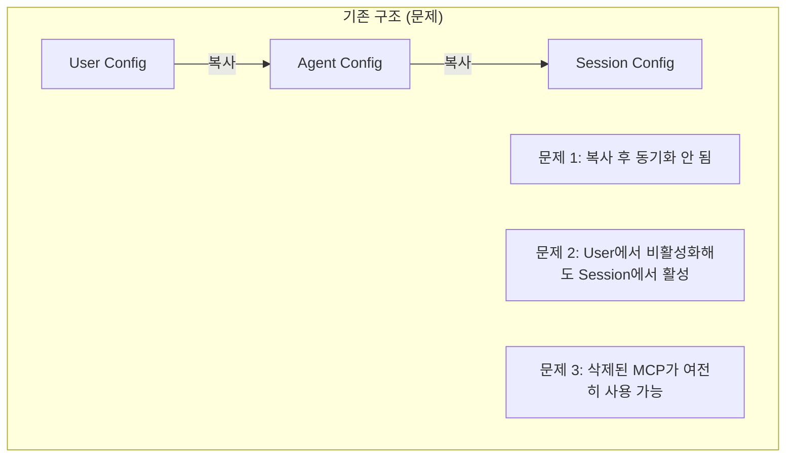
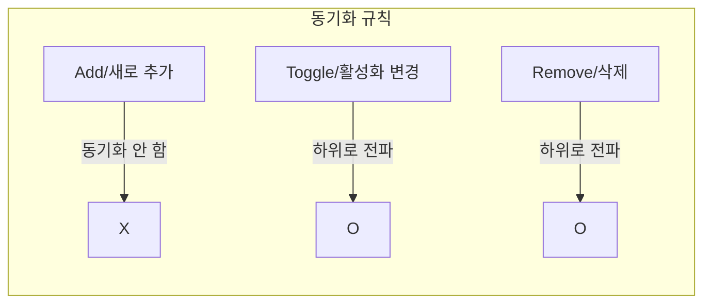
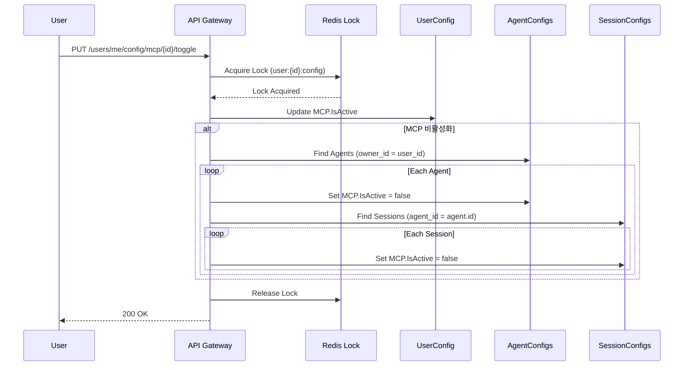

AI 플랫폼에서 MCP, ToolSet 등의 설정이 **User → Agent → Session**으로 계층적으로 동기화되는 시스템을 구현한 경험을 공유합니다. **Redis 분산 락**과 **MongoDB 트랜잭션**을 활용하여 동시성 문제를 해결하고, **Toggle/Remove만 동기화**하는 전략으로 보안과 유연성을 확보했습니다.

## 문제 상황: 설정 불일치 이슈

### 기존 구조의 문제점

초기에는 User, Agent, Session 각각이 독립적으로 설정을 관리했습니다:



### 실제 발생한 버그

1. **설정 불일치**: User가 MCP를 비활성화해도 이미 생성된 Session에서 계속 사용 가능
2. **보안 문제**: 권한이 취소된 ToolSet이 기존 Agent에서 여전히 동작
3. **관리 불가**: 설정 변경 시 어디까지 영향을 주는지 파악 어려움

---

## 해결책: 캐스케이드 동기화 아키텍처

### 핵심 원칙



**왜 Add는 동기화하지 않는가?**

- 새로운 MCP/ToolSet은 User 레벨에서만 추가되고
- Agent는 User가 가진 것 중 **명시적으로 선택한 것만** 활성화
- Session은 Agent 설정을 상속
- 보안상 자동 전파는 위험

### 데이터 모델

```go
// 사용자 설정 (최상위)
type UserConfiguration struct {
    ID                string               `bson:"_id"`
    UserID            string               `bson:"user_id"`
    MCPConfigurations []MCPConfiguration   `bson:"mcp_configurations"`
    ToolSetConfigs    []ToolSetConfig      `bson:"tool_set_configurations"`
    UpdatedAt         time.Time            `bson:"updated_at"`
}

// 에이전트 설정 (중간)
type AgentConfiguration struct {
    ID                string               `bson:"_id"`
    AgentID           string               `bson:"agent_id"`
    OwnerID           string               `bson:"owner_id"` // User 참조
    MCPConfigurations []MCPConfiguration   `bson:"mcp_configurations"`
    ToolSetConfigs    []ToolSetConfig      `bson:"tool_set_configurations"`
    UpdatedAt         time.Time            `bson:"updated_at"`
}

// 세션 설정 (최하위)
type SessionConfiguration struct {
    ID                string               `bson:"_id"`
    SessionID         string               `bson:"session_id"`
    AgentID           string               `bson:"agent_id"` // Agent 참조
    MCPConfigurations []MCPConfiguration   `bson:"mcp_configurations"`
    ToolSetConfigs    []ToolSetConfig      `bson:"tool_set_configurations"`
    UpdatedAt         time.Time            `bson:"updated_at"`
}

// MCP 설정 (공통)
type MCPConfiguration struct {
    MCPID       string `bson:"mcp_id"`
    IsActive    bool   `bson:"is_active"`
    CustomName  string `bson:"custom_name,omitempty"`
    CustomURL   string `bson:"custom_url,omitempty"`
}
```

---

## Toggle 동기화 구현

### 흐름도



### 동기화 서비스 구현

```go
// internal/contexts/config/application/sync_service.go

type ConfigSyncService struct {
    userConfigRepo    UserConfigRepository
    agentConfigRepo   AgentConfigRepository
    sessionConfigRepo SessionConfigRepository
    lockManager       DistributedLockManager
    mongoClient       *mongo.Client
}

// Toggle 동기화
func (s *ConfigSyncService) SyncMCPToggle(ctx context.Context, userID string, mcpID string, isActive bool) error {
    // 1. 분산 락 획득
    lockKey := fmt.Sprintf("config:sync:user:%s", userID)
    lock, err := s.lockManager.Acquire(ctx, lockKey, 30*time.Second)
    if err != nil {
        return fmt.Errorf("failed to acquire lock: %w", err)
    }
    defer lock.Release(ctx)

    // 2. MongoDB 트랜잭션 시작
    session, err := s.mongoClient.StartSession()
    if err != nil {
        return fmt.Errorf("failed to start session: %w", err)
    }
    defer session.EndSession(ctx)

    _, err = session.WithTransaction(ctx, func(sc mongo.SessionContext) (interface{}, error) {
        // 3. User 설정 업데이트
        if err := s.userConfigRepo.UpdateMCPActive(sc, userID, mcpID, isActive); err != nil {
            return nil, fmt.Errorf("failed to update user config: %w", err)
        }

        // 4. 비활성화인 경우에만 하위 동기화
        if !isActive {
            // Agent 설정 동기화
            agents, err := s.agentConfigRepo.FindByOwnerID(sc, userID)
            if err != nil {
                return nil, fmt.Errorf("failed to find agents: %w", err)
            }

            for _, agent := range agents {
                if err := s.agentConfigRepo.UpdateMCPActive(sc, agent.AgentID, mcpID, false); err != nil {
                    return nil, fmt.Errorf("failed to update agent %s: %w", agent.AgentID, err)
                }

                // Session 설정 동기화
                sessions, err := s.sessionConfigRepo.FindByAgentID(sc, agent.AgentID)
                if err != nil {
                    return nil, fmt.Errorf("failed to find sessions: %w", err)
                }

                for _, sess := range sessions {
                    if err := s.sessionConfigRepo.UpdateMCPActive(sc, sess.SessionID, mcpID, false); err != nil {
                        return nil, fmt.Errorf("failed to update session %s: %w", sess.SessionID, err)
                    }
                }
            }
        }

        return nil, nil
    })

    return err
}
```

---

## Remove 동기화 구현

### 삭제 시 캐스케이드

```go
// Remove 동기화 - 설정 완전 삭제
func (s *ConfigSyncService) SyncMCPRemove(ctx context.Context, userID string, mcpID string) error {
    lockKey := fmt.Sprintf("config:sync:user:%s", userID)
    lock, err := s.lockManager.Acquire(ctx, lockKey, 30*time.Second)
    if err != nil {
        return fmt.Errorf("failed to acquire lock: %w", err)
    }
    defer lock.Release(ctx)

    session, err := s.mongoClient.StartSession()
    if err != nil {
        return fmt.Errorf("failed to start session: %w", err)
    }
    defer session.EndSession(ctx)

    _, err = session.WithTransaction(ctx, func(sc mongo.SessionContext) (interface{}, error) {
        // 1. User 설정에서 MCP 제거
        if err := s.userConfigRepo.RemoveMCP(sc, userID, mcpID); err != nil {
            return nil, fmt.Errorf("failed to remove from user config: %w", err)
        }

        // 2. 모든 Agent 설정에서 MCP 제거
        agents, err := s.agentConfigRepo.FindByOwnerID(sc, userID)
        if err != nil {
            return nil, err
        }

        for _, agent := range agents {
            if err := s.agentConfigRepo.RemoveMCP(sc, agent.AgentID, mcpID); err != nil {
                return nil, fmt.Errorf("failed to remove from agent %s: %w", agent.AgentID, err)
            }

            // 3. 모든 Session 설정에서 MCP 제거
            if err := s.sessionConfigRepo.RemoveMCPByAgentID(sc, agent.AgentID, mcpID); err != nil {
                return nil, fmt.Errorf("failed to remove from sessions: %w", err)
            }
        }

        return nil, nil
    })

    return err
}
```

### Bulk 삭제 최적화

```go
// 대량 삭제 시 효율적인 쿼리
func (r *MongoSessionConfigRepo) RemoveMCPByAgentID(ctx context.Context, agentID, mcpID string) error {
    filter := bson.M{"agent_id": agentID}
    update := bson.M{
        "$pull": bson.M{
            "mcp_configurations": bson.M{"mcp_id": mcpID},
        },
        "$set": bson.M{"updated_at": time.Now()},
    }

    // UpdateMany로 일괄 처리
    _, err := r.collection.UpdateMany(ctx, filter, update)
    return err
}
```

---

## 분산 락 구현

### Redis 기반 분산 락

```go
// internal/platform/lock/redis_lock.go

type RedisLockManager struct {
    client *redis.Client
}

type DistributedLock struct {
    manager *RedisLockManager
    key     string
    value   string
    ttl     time.Duration
}

func (m *RedisLockManager) Acquire(ctx context.Context, key string, ttl time.Duration) (*DistributedLock, error) {
    value := uuid.New().String()

    // SET key value NX PX ttl
    success, err := m.client.SetNX(ctx, key, value, ttl).Result()
    if err != nil {
        return nil, fmt.Errorf("failed to acquire lock: %w", err)
    }

    if !success {
        return nil, ErrLockAlreadyHeld
    }

    return &DistributedLock{
        manager: m,
        key:     key,
        value:   value,
        ttl:     ttl,
    }, nil
}

func (l *DistributedLock) Release(ctx context.Context) error {
    // Lua 스크립트로 원자적 삭제 (자신이 획득한 락만 해제)
    script := redis.NewScript(`
        if redis.call("get", KEYS[1]) == ARGV[1] then
            return redis.call("del", KEYS[1])
        else
            return 0
        end
    `)

    _, err := script.Run(ctx, l.manager.client, []string{l.key}, l.value).Result()
    return err
}

// 락 연장 (장시간 작업용)
func (l *DistributedLock) Extend(ctx context.Context, ttl time.Duration) error {
    script := redis.NewScript(`
        if redis.call("get", KEYS[1]) == ARGV[1] then
            return redis.call("pexpire", KEYS[1], ARGV[2])
        else
            return 0
        end
    `)

    result, err := script.Run(ctx, l.manager.client, []string{l.key}, l.value, ttl.Milliseconds()).Int()
    if err != nil {
        return err
    }

    if result == 0 {
        return ErrLockLost
    }

    return nil
}
```

### 재시도 로직

```go
// 락 획득 재시도 (Backoff 적용)
func (m *RedisLockManager) AcquireWithRetry(ctx context.Context, key string, ttl time.Duration, maxRetries int) (*DistributedLock, error) {
    var lastErr error
    backoff := 100 * time.Millisecond

    for i := 0; i < maxRetries; i++ {
        lock, err := m.Acquire(ctx, key, ttl)
        if err == nil {
            return lock, nil
        }

        lastErr = err
        if !errors.Is(err, ErrLockAlreadyHeld) {
            return nil, err // 재시도 불가능한 에러
        }

        // Exponential backoff with jitter
        jitter := time.Duration(rand.Intn(50)) * time.Millisecond
        select {
        case <-ctx.Done():
            return nil, ctx.Err()
        case <-time.After(backoff + jitter):
        }

        backoff *= 2
        if backoff > 5*time.Second {
            backoff = 5 * time.Second
        }
    }

    return nil, fmt.Errorf("failed to acquire lock after %d retries: %w", maxRetries, lastErr)
}
```

---

## 동기화 이벤트 처리

### 이벤트 기반 동기화

```go
// internal/contexts/config/domain/events.go

type ConfigChangedEvent struct {
    EventID      string          `json:"event_id"`
    EventType    string          `json:"event_type"` // "mcp_toggled", "mcp_removed", "toolset_toggled"
    UserID       string          `json:"user_id"`
    ResourceType string          `json:"resource_type"` // "mcp", "toolset"
    ResourceID   string          `json:"resource_id"`
    NewValue     interface{}     `json:"new_value,omitempty"`
    OccurredAt   time.Time       `json:"occurred_at"`
}

// 이벤트 핸들러
type ConfigEventHandler struct {
    syncService *ConfigSyncService
}

func (h *ConfigEventHandler) Handle(ctx context.Context, event ConfigChangedEvent) error {
    switch event.EventType {
    case "mcp_toggled":
        isActive, ok := event.NewValue.(bool)
        if !ok {
            return errors.New("invalid value for mcp_toggled event")
        }
        return h.syncService.SyncMCPToggle(ctx, event.UserID, event.ResourceID, isActive)

    case "mcp_removed":
        return h.syncService.SyncMCPRemove(ctx, event.UserID, event.ResourceID)

    case "toolset_toggled":
        isActive, ok := event.NewValue.(bool)
        if !ok {
            return errors.New("invalid value for toolset_toggled event")
        }
        return h.syncService.SyncToolSetToggle(ctx, event.UserID, event.ResourceID, isActive)

    default:
        log.Printf("Unknown event type: %s", event.EventType)
        return nil
    }
}
```

### Kafka 연동

```go
// internal/platform/messaging/kafka_consumer.go

func (c *KafkaConsumer) ConsumeConfigEvents(ctx context.Context, handler *ConfigEventHandler) error {
    for {
        msg, err := c.reader.ReadMessage(ctx)
        if err != nil {
            if errors.Is(err, context.Canceled) {
                return nil
            }
            log.Printf("Error reading message: %v", err)
            continue
        }

        var event ConfigChangedEvent
        if err := json.Unmarshal(msg.Value, &event); err != nil {
            log.Printf("Error unmarshaling event: %v", err)
            continue
        }

        if err := handler.Handle(ctx, event); err != nil {
            log.Printf("Error handling event %s: %v", event.EventID, err)
            // 재처리를 위해 DLQ로 전송
            c.sendToDLQ(ctx, msg)
        }
    }
}
```

---

## 설정 검증 및 복구

### 일관성 검사

```go
// 정기적으로 실행되는 일관성 검사 작업
func (s *ConfigSyncService) ValidateConsistency(ctx context.Context, userID string) (*ConsistencyReport, error) {
    report := &ConsistencyReport{
        UserID:    userID,
        CheckedAt: time.Now(),
    }

    // User 설정 조회
    userConfig, err := s.userConfigRepo.FindByUserID(ctx, userID)
    if err != nil {
        return nil, err
    }

    // 비활성화된 MCP 목록
    inactiveMCPs := make(map[string]bool)
    for _, mcp := range userConfig.MCPConfigurations {
        if !mcp.IsActive {
            inactiveMCPs[mcp.MCPID] = true
        }
    }

    // Agent 설정 검사
    agents, err := s.agentConfigRepo.FindByOwnerID(ctx, userID)
    if err != nil {
        return nil, err
    }

    for _, agent := range agents {
        for _, mcp := range agent.MCPConfigurations {
            // User에서 비활성화된 MCP가 Agent에서 활성화되어 있으면 불일치
            if inactiveMCPs[mcp.MCPID] && mcp.IsActive {
                report.Inconsistencies = append(report.Inconsistencies, Inconsistency{
                    Level:      "agent",
                    ResourceID: agent.AgentID,
                    MCPID:      mcp.MCPID,
                    Expected:   false,
                    Actual:     true,
                })
            }
        }

        // Session 설정 검사
        sessions, err := s.sessionConfigRepo.FindByAgentID(ctx, agent.AgentID)
        if err != nil {
            continue
        }

        for _, sess := range sessions {
            for _, mcp := range sess.MCPConfigurations {
                if inactiveMCPs[mcp.MCPID] && mcp.IsActive {
                    report.Inconsistencies = append(report.Inconsistencies, Inconsistency{
                        Level:      "session",
                        ResourceID: sess.SessionID,
                        MCPID:      mcp.MCPID,
                        Expected:   false,
                        Actual:     true,
                    })
                }
            }
        }
    }

    return report, nil
}

// 불일치 자동 복구
func (s *ConfigSyncService) RepairInconsistencies(ctx context.Context, report *ConsistencyReport) error {
    for _, inc := range report.Inconsistencies {
        switch inc.Level {
        case "agent":
            if err := s.agentConfigRepo.UpdateMCPActive(ctx, inc.ResourceID, inc.MCPID, inc.Expected); err != nil {
                log.Printf("Failed to repair agent %s: %v", inc.ResourceID, err)
            }
        case "session":
            if err := s.sessionConfigRepo.UpdateMCPActive(ctx, inc.ResourceID, inc.MCPID, inc.Expected); err != nil {
                log.Printf("Failed to repair session %s: %v", inc.ResourceID, err)
            }
        }
    }
    return nil
}
```

---

## 성능 최적화

### Batch 처리

```go
// 대량 세션 업데이트 시 Batch 처리
func (r *MongoSessionConfigRepo) BatchUpdateMCPActive(ctx context.Context, sessionIDs []string, mcpID string, isActive bool) error {
    if len(sessionIDs) == 0 {
        return nil
    }

    // Bulk write 모델 생성
    var models []mongo.WriteModel
    for _, sessionID := range sessionIDs {
        filter := bson.M{
            "session_id":                  sessionID,
            "mcp_configurations.mcp_id": mcpID,
        }
        update := bson.M{
            "$set": bson.M{
                "mcp_configurations.$.is_active": isActive,
                "updated_at":                      time.Now(),
            },
        }
        models = append(models, mongo.NewUpdateOneModel().SetFilter(filter).SetUpdate(update))
    }

    // Batch 크기 제한 (1000개씩)
    batchSize := 1000
    for i := 0; i < len(models); i += batchSize {
        end := i + batchSize
        if end > len(models) {
            end = len(models)
        }

        _, err := r.collection.BulkWrite(ctx, models[i:end], options.BulkWrite().SetOrdered(false))
        if err != nil {
            return fmt.Errorf("bulk write failed: %w", err)
        }
    }

    return nil
}
```

### 인덱스 설계


```go
func CreateConfigIndexes(db *mongo.Database) error {
    // Agent Config 인덱스
    agentColl := db.Collection("agent_configurations")
    _, err := agentColl.Indexes().CreateMany(context.Background(), []mongo.IndexModel{
        {Keys: bson.D{{Key: "owner_id", Value: 1}}},
        {Keys: bson.D{{Key: "agent_id", Value: 1}}, Options: options.Index().SetUnique(true)},
    })
    if err != nil {
        return err
    }

    // Session Config 인덱스
    sessionColl := db.Collection("session_configurations")
    _, err = sessionColl.Indexes().CreateMany(context.Background(), []mongo.IndexModel{
        {Keys: bson.D{{Key: "agent_id", Value: 1}}},
        {Keys: bson.D{{Key: "session_id", Value: 1}}, Options: options.Index().SetUnique(true)},
    })
    return err
}
```


---

## 성능 측정 결과

### 동기화 성능

| 시나리오 | Agent 수 | Session 수 | 소요 시간 |
|---------|---------|-----------|----------|
| MCP Toggle | 5 | 50 | 45ms |
| MCP Toggle | 20 | 200 | 180ms |
| MCP Remove | 5 | 50 | 35ms |
| MCP Remove | 20 | 200 | 120ms |

### 락 경합 테스트

```
동시 요청 수: 10
락 획득 성공률: 100%
평균 대기 시간: 85ms
최대 대기 시간: 450ms
```

---

## 핵심 교훈

### 1. 동기화 범위 최소화

모든 변경을 동기화하지 않고 **Toggle/Remove만 동기화**함으로써 복잡도를 낮추고 보안을 강화했습니다.

### 2. 분산 락은 필수

여러 API 서버가 동시에 같은 사용자의 설정을 변경할 수 있으므로, **분산 락 없이는 데이터 정합성을 보장할 수 없습니다**.

### 3. 트랜잭션의 중요성

캐스케이드 업데이트는 **원자적으로 처리**해야 합니다. 중간에 실패하면 일부만 업데이트되어 불일치 상태가 됩니다.

### 4. 일관성 검사 자동화

아무리 잘 설계해도 엣지 케이스는 발생합니다. **정기적인 일관성 검사와 자동 복구**로 안전망을 구축했습니다.

---

## 참고

- [MongoDB Transactions](https://docs.mongodb.com/manual/core/transactions/)
- [Redis Distributed Locks](https://redis.io/docs/manual/patterns/distributed-locks/)
- [The Saga Pattern](https://microservices.io/patterns/data/saga.html)
- [Eventual Consistency](https://docs.aws.amazon.com/whitepapers/latest/microservices-on-aws/distributed-data-management.html)
