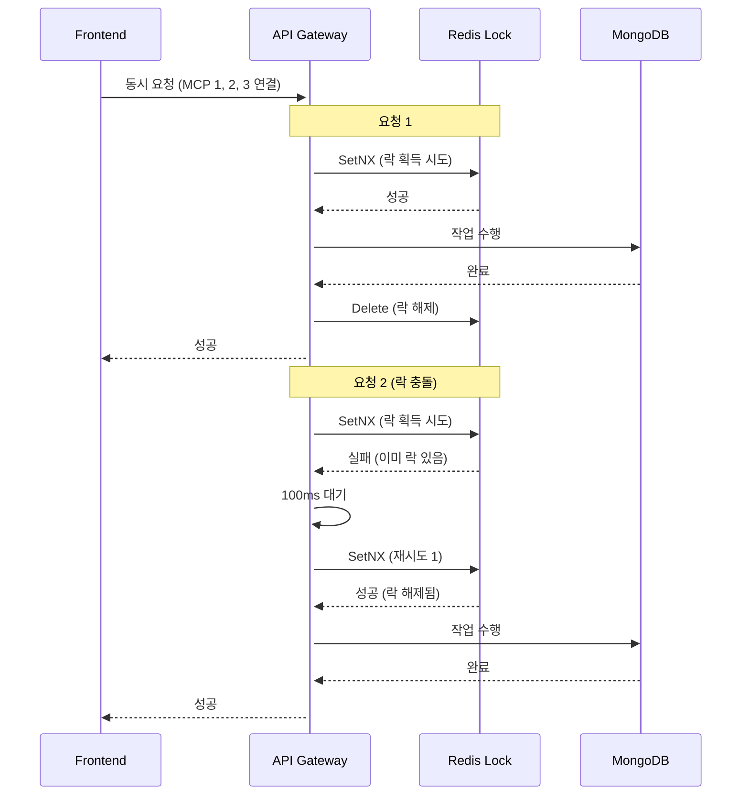
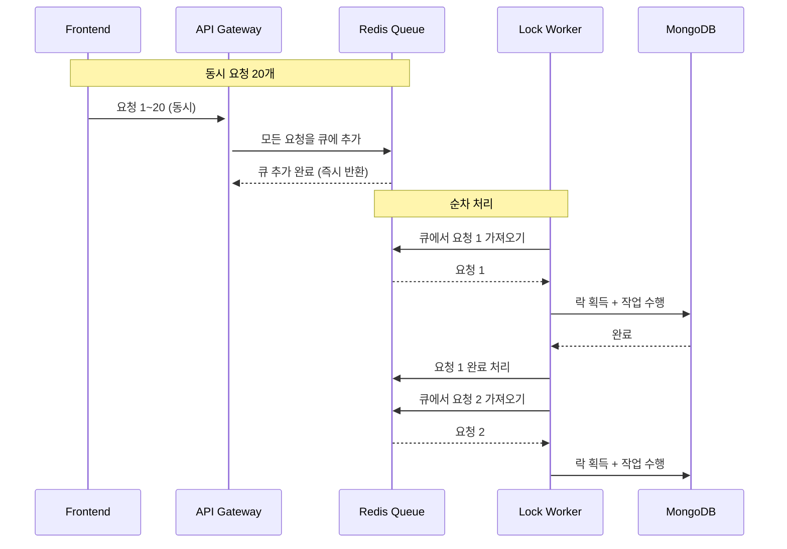

## 문제의 시작: 동시 요청 충돌

AI 플랫폼을 개발하면서 예상치 못한 문제를 마주했다. 프론트엔드에서 에이전트에 여러 MCP(Model Context Protocol)를 연결할 때, 요청들이 거의 동시에 발생했다.

```
06:40:27.735Z - web_search 요청
06:40:27.738Z - davinci 요청
06:40:27.769Z - file_read 요청
06:40:27.778Z - naver_news 요청
```

불과 43ms 사이에 4개의 요청이 몰려왔다. 문제는 기존 분산 락 메커니즘이 락 획득 실패 시 **즉시 에러를 반환**했다는 점이다.

```
WARN - failed to connect toolSet web_search: [RES_003] another operation is in progress
WARN - failed to connect toolSet file_read: [RES_003] another operation is in progress
```

첫 번째 요청만 성공하고 나머지는 모두 실패했다.

## 근본 원인 분석

### 1. 재시도 로직 부재

기존 코드는 락 획득에 실패하면 대기 없이 즉시 실패를 반환했다.


```go
func acquireAgentConfigLock(agentID string) (bool, error) {
    acquired, err := cache.SetNX(lockKey, value, ttl)
    if !acquired {
        return false, nil  // 즉시 실패 반환
    }
    return true, nil
}
```


### 2. Race Condition

일부 함수에서 더 심각한 문제가 있었다. `Exists → Set` 비원자적 패턴 사용으로 인한 race condition이다.


```go
// Before: Race Condition 존재
func acquireFileUploadLock(...) (bool, error) {
    if cache.Exists(key) {  // ← 두 요청이 동시에 false를 받을 수 있음
        return false, nil
    }
    cache.Set(key, value, ttl)  // ← 두 요청 모두 Set 실행
    return true, nil
}
```


두 요청이 동시에 `Exists`를 호출하면 둘 다 `false`를 받고, 둘 다 `Set`을 실행하게 된다.

## 해결책 1: 재시도 로직 구현

### 기본 아키텍처



### 재시도 로직 구현


```go
func acquireLock(ctx context.Context, lockKey string) (bool, error) {
    const (
        maxRetries = 10                     // 최대 재시도 횟수
        retryDelay = 100 * time.Millisecond // 재시도 간격
        lockTTL    = 30 * time.Second       // 락 TTL
    )

    lockValue := time.Now().UTC().Format(time.RFC3339Nano)

    for attempt := 0; attempt < maxRetries; attempt++ {
        // Context 취소 확인
        select {
        case <-ctx.Done():
            return false, ctx.Err()
        default:
        }

        // 원자적 락 획득 시도
        acquired, err := cache.SetNX(lockKey, lockValue, lockTTL)
        if err != nil {
            return false, err
        }

        if acquired {
            return true, nil
        }

        // 마지막 시도가 아니면 대기 후 재시도
        if attempt < maxRetries-1 {
            select {
            case <-ctx.Done():
                return false, ctx.Err()
            case <-time.After(retryDelay):
                // 재시도
            }
        }
    }

    return false, nil // 모든 재시도 실패
}
```


### 설계 결정 사항

| 설정 | 값 | 이유 |
|-----|-----|-----|
| `maxRetries` | 10회 | 일반적인 락 보유 시간(100~500ms) 대비 충분한 여유 |
| `retryDelay` | 100ms | 빠른 재시도가 더 효율적, exponential backoff보다 단순함 |
| `lockTTL` | 30초 | 락 만료 시간 |
| **총 최대 대기 시간** | **~1초** | 10회 × 100ms |

### Race Condition 수정


```go
// After: 원자적 연산
func acquireFileUploadLock(...) (bool, error) {
    acquired, err := cache.SetNX(key, value, ttl)  // ← 원자적으로 처리
    return acquired, err
}
```


Redis의 `SetNX`(Set if Not eXists)는 원자적 연산이므로, 여러 요청이 동시에 호출해도 하나만 성공한다.

## 성능 개선 결과

| 시나리오 | Before | After |
|---------|--------|-------|
| 동시 요청 없음 | 즉시 성공 | 즉시 성공 (동일) |
| 동시 요청 2개 | 1개 성공, 1개 실패 | 2개 모두 성공 (~100ms 추가) |
| 동시 요청 5개 | 1개 성공, 4개 실패 | 5개 모두 성공 (~400ms 추가) |
| 동시 요청 10개 | 1개 성공, 9개 실패 | 10개 모두 성공 (~900ms 추가) |

## 한계점 인식

하지만 이 방식에는 명확한 한계가 있었다.


```
시간축: 0ms    200ms   400ms   600ms   800ms   1000ms  1200ms  ...
요청1:  [락획득][작업][해제]
요청2:  [대기][대기][대기][대기][대기][대기][대기][대기][대기][대기][실패]
요청3:  [대기][대기][대기][대기][대기][대기][대기][대기][대기][대기][실패]
...
```


20개 이상의 동시 요청이 발생하면? 각 요청 처리 시간이 200ms라고 가정할 때:
- 20개 요청 처리 소요 시간: 20 × 200ms = **4초**
- 최대 대기 시간: 10회 × 100ms = **1초**
- 결과: 20개 중 약 5~6개만 성공, 나머지 실패

## 해결책 2: 큐 기반 처리로 진화

### 아키텍처 변경



### Redis List 기반 큐 구현


```go
type LockQueue struct {
    redis    *redis.Client
    queueKey string
}

// 요청을 큐에 추가
func (q *LockQueue) Enqueue(ctx context.Context, request LockRequest) error {
    data, _ := json.Marshal(request)
    return q.redis.LPush(ctx, q.queueKey, data).Err()
}

// Worker: 큐에서 요청을 가져와 처리
func (q *LockQueue) ProcessQueue(ctx context.Context) {
    for {
        // Blocking pop (큐가 비어있으면 대기)
        result, err := q.redis.BRPop(ctx, 5*time.Second, q.queueKey).Result()
        if err == redis.Nil {
            continue // 큐가 비어있음
        }

        var request LockRequest
        json.Unmarshal([]byte(result[1]), &request)

        // 락 획득 및 작업 수행
        q.processRequest(ctx, request)
    }
}
```


### 큐 기반 처리의 장점

| 장점 | 설명 |
|-----|------|
| **100% 성공 보장** | 큐에 들어간 모든 요청이 처리됨 |
| **순서 보장** | FIFO 순서로 처리 |
| **부하 분산** | Worker 수를 조절하여 처리량 제어 |
| **재시도 자동화** | 실패한 요청을 Dead Letter Queue로 이동 |
| **장애 격리** | Worker 장애 시에도 큐에 요청 보존 |

### 실제 적용: 동기 API 유지

프론트엔드 변경 없이 기존 API를 유지하면서 내부적으로 큐 기반 처리를 적용했다.


```go
func (s *AgentConfigurationService) ConnectMCPToAgent(
    ctx context.Context,
    user *models.User,
    agentID, mcpID string,
) error {
    if s.services.LockQueue != nil {
        // 큐 기반 처리
        requestID, _ := s.services.LockQueue.Enqueue(ctx, &models.LockQueueRequest{
            UserID:        user.ID,
            AgentID:       agentID,
            ResourceID:    mcpID,
            OperationType: models.LockOpConnectMCP,
        })

        // 동적 타임아웃으로 결과 대기
        timeout := s.services.LockQueue.CalculateDynamicTimeout(30 * time.Second)
        result, err := s.services.LockQueue.WaitForResult(ctx, requestID, timeout)

        return result.Error
    }

    // Fallback: 기존 방식
    return s.ConnectMCPToAgentDirect(ctx, user, agentID, mcpID)
}
```


## 운영 안정성 강화

### 1. 동적 타임아웃 계산

큐에 요청이 많이 쌓이면 타임아웃도 동적으로 늘려준다.


```go
func (s *lockQueueService) CalculateDynamicTimeout(baseTimeout time.Duration) time.Duration {
    const timeoutPerQueueItem = 2 * time.Second

    metrics := s.GetMetrics()
    additionalTimeout := time.Duration(metrics.QueueLength) * timeoutPerQueueItem
    dynamicTimeout := baseTimeout + additionalTimeout

    // 최대 타임아웃 제한 (5분)
    if dynamicTimeout > 5*time.Minute {
        dynamicTimeout = 5 * time.Minute
    }
    return dynamicTimeout
}
```


### 2. Circuit Breaker 패턴

Redis 장애 시 자동으로 기존 방식으로 Fallback한다.


```go
func (s *lockQueueService) IsHealthy(ctx context.Context) bool {
    const healthCheckCacheDuration = 1 * time.Second

    // 캐시된 결과 확인 (성능 최적화)
    if time.Since(s.lastHealthCheck) < healthCheckCacheDuration {
        return s.lastHealthResult
    }

    // 캐시 만료, 새로 확인
    healthCtx, cancel := context.WithTimeout(ctx, 1*time.Second)
    defer cancel()

    if err := s.cache.Ping(healthCtx); err != nil {
        s.lastHealthResult = false
        return false
    }
    s.lastHealthResult = true
    return true
}
```


### 3. 모니터링 메트릭


```go
type QueueMetrics struct {
    QueueLength      int64         // 현재 대기 중인 요청 수
    ProcessingRate   float64       // 초당 처리 속도
    AverageWaitTime  time.Duration // 평균 대기 시간
    FailureRate      float64       // 실패율
    DeadLetterCount  int64         // 실패 후 재시도 대기 중인 요청
}

// 임계값 체크 및 경고
func (s *lockQueueService) checkThresholds(metrics *QueueMetrics) {
    if metrics.QueueLength > 100 {
        s.logger.Warnf("큐 길이 임계값 초과: %d", metrics.QueueLength)
    }
    if metrics.DeadLetterCount > 10 {
        s.logger.Errorf("Dead Letter 큐 항목 증가: %d", metrics.DeadLetterCount)
    }
    if metrics.AverageWaitTime > 5*time.Second {
        s.logger.Warnf("평균 대기 시간 증가: %v", metrics.AverageWaitTime)
    }
}
```


## 최종 성능 비교

| 시나리오 | 재시도 방식 | 큐 기반 |
|---------|-----------|--------|
| **10개 동시 요청** | ✅ 모두 성공 (~1초) | ✅ 모두 성공 (~2초) |
| **20개 동시 요청** | ⚠️ 일부 실패 | ✅ 모두 성공 (~4초) |
| **100개 동시 요청** | 🔴 대부분 실패 | ✅ 모두 성공 (~20초) |

## 배운 점

### 1. 점진적 진화의 중요성

처음부터 큐 기반 시스템을 도입하지 않았다. 단순한 재시도 로직으로 시작해서, 실제 운영 데이터를 보고 한계를 인식한 후 큐 기반으로 진화했다.

### 2. Fallback은 필수

어떤 시스템이든 장애가 발생할 수 있다. Redis가 죽어도 서비스가 계속 동작하도록 Fallback을 구현해야 한다.

### 3. 모니터링 없는 시스템은 블랙박스

큐 길이, 대기 시간, 실패율을 모니터링하지 않으면 문제가 발생해도 알 수 없다. 처음부터 메트릭을 설계해야 한다.

### 4. API 하위 호환성

내부 구현이 완전히 바뀌어도 외부 API는 그대로 유지했다. 프론트엔드 변경 없이 배포할 수 있어서 리스크가 크게 줄었다.

## 결론

동시 요청 충돌 문제를 해결하면서 시스템이 점진적으로 진화했다:

1. **1단계**: 재시도 로직 추가 (10개 이하 동시 요청 해결)
2. **2단계**: 큐 기반 처리 (대규모 동시 요청 해결)
3. **3단계**: 운영 안정성 강화 (Circuit Breaker, 동적 타임아웃, 모니터링)

가장 중요한 것은 문제를 정확히 진단하고, 상황에 맞는 해결책을 선택하는 것이다. 10개 이하의 동시 요청만 발생한다면 단순한 재시도 로직으로 충분하다. 하지만 대규모 동시 요청이 예상된다면 처음부터 큐 기반 아키텍처를 고려해야 한다.
