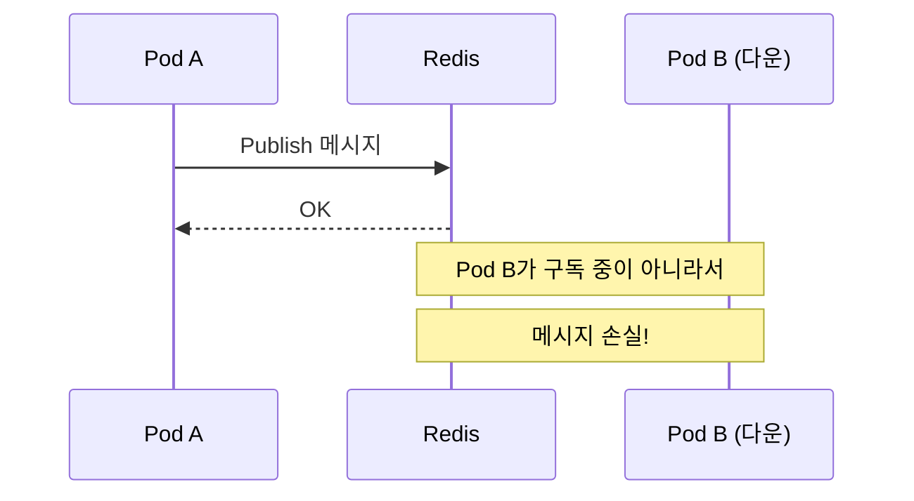
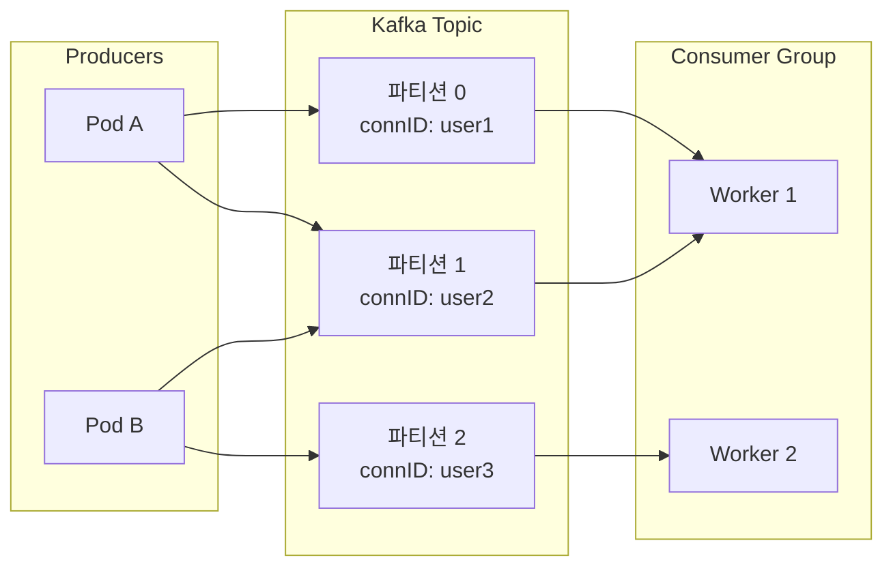
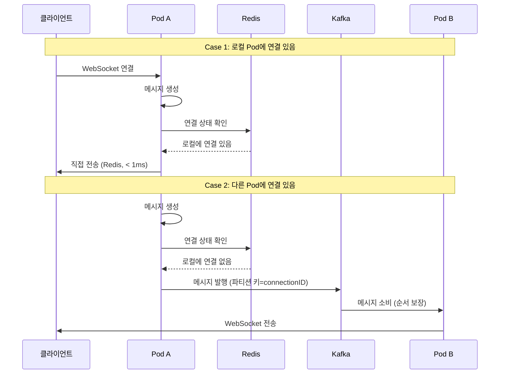

## 실시간 메시징의 딜레마

AI 플랫폼을 개발하면서 실시간 메시징 시스템을 설계해야 했다. LLM의 스트리밍 응답을 WebSocket과 SSE로 클라이언트에 전달하는데, 멀티 Pod 환경에서 메시지 순서 보장이 필요했다.

처음에는 Redis Pub/Sub을 사용했지만 한계가 드러났다. 그렇다면 Kafka로 바꿔야 할까? 결론부터 말하면, **둘 다 쓰는 하이브리드 접근법**이 정답이었다.

## Redis Pub/Sub의 장점과 한계

### 장점: 극한의 속도

Redis Pub/Sub은 **메모리 기반**이라 지연 시간이 **1ms 미만**이다. 스트리밍 응답처럼 실시간성이 중요한 경우 이 속도는 결정적이다.


```go
// 메시지 발행: 1ms 미만
if err := ws.redisClient.Publish(ctx, "websocket-messages", data); err != nil {
    return err
}
```


### 한계 1: 구독자 없으면 메시지 손실

Redis Pub/Sub은 **Fire and Forget** 방식이다. 메시지를 발행할 때 구독자가 없으면 메시지가 그냥 사라진다.



### 한계 2: 멀티 Pod 환경에서 순서 보장 불가

Redis Pub/Sub에는 **파티션 개념이 없다**. 여러 Pod가 메시지를 발행하면 네트워크 지연에 따라 순서가 뒤바뀔 수 있다.


```
Pod A: 메시지 1 발행 (네트워크 지연 50ms)
Pod B: 메시지 2 발행 (네트워크 지연 10ms)

클라이언트 수신: 메시지 2 → 메시지 1 (순서 뒤바뀜)
```


### 한계 3: 영속성 없음

메시지가 메모리에만 존재하므로 Redis 재시작 시 모든 메시지가 손실된다.

## Kafka가 해결하는 문제들

### 1. 파티션 내 순서 보장

Kafka는 **파티션 키**를 기반으로 같은 키의 메시지를 같은 파티션에 저장한다. 파티션 내에서는 **순서가 완벽하게 보장**된다.


```go
// connectionID를 파티션 키로 사용
kafkaMessage := kafka.Message{
    Topic: "websocket-messages",
    Key:   connectionID,  // 파티션 키 = connectionID
    Value: messageData,
}
producer.Send(kafkaMessage)

// 같은 connectionID의 메시지는 항상 같은 파티션에서 순서대로 수신
```




### 2. Consumer Group으로 중복 처리 방지

같은 Consumer Group 내에서 메시지는 **한 번만 처리**된다. 여러 Pod가 있어도 메시지 중복이 발생하지 않는다.


```go
// 여러 Pod가 같은 Consumer Group 사용
consumer := kafka.NewConsumer("websocket-messages", "api-gateway-group")

// 각 메시지는 그룹 내 하나의 Pod에서만 처리됨
```


### 3. 영속성 보장

Kafka는 모든 메시지를 **디스크에 저장**한다. Retention 기간 동안 메시지가 보관되므로 Pod 재시작 후에도 메시지를 재처리할 수 있다.

## Kafka의 새로운 문제들

완벽한 솔루션은 없다. Kafka도 자체적인 문제를 가져온다.

### 1. 지연 시간 증가

Kafka는 **디스크 기반**이라 Redis보다 느리다.

| 시스템 | 지연 시간 |
|-------|----------|
| Redis Pub/Sub | **< 1ms** |
| Kafka | **10-100ms** |

스트리밍 응답에서 이 차이는 사용자 경험에 직접 영향을 준다. LLM이 토큰 하나를 생성할 때마다 100ms씩 지연되면, 전체 응답 시간이 크게 늘어난다.

### 2. 운영 복잡도

Kafka 클러스터를 운영하려면:

- 브로커 관리 (최소 3대 권장)
- 주키퍼/KRaft 관리
- 토픽/파티션 설계
- 리플리케이션 팩터 설정
- Consumer Group 오프셋 관리
- 모니터링 및 알람 설정

Redis는 이미 캐시와 세션 저장에 사용 중이었다. Kafka를 추가하면 인프라 복잡도가 크게 증가한다.

### 3. 연결 상태 관리는 여전히 필요

Kafka는 **메시지 전달만 담당**한다. WebSocket 연결 상태 관리는 여전히 Redis나 메모리에서 해야 한다.


```go
// 스트리밍 차단 상태 확인 (Kafka로 대체 불가)
if s.webSocket.IsStreamingBlocked(connectionID) {
    // 버퍼에 저장하고 WebSocket 전송 건너뛰기
    return
}
```


### 4. 버퍼 관리도 여전히 필요

클라이언트가 연결 해제된 동안의 메시지를 버퍼에 저장하는 로직은 Kafka로 대체할 수 없다.


```go
// Redis List 기반 오프라인 버퍼 (Kafka로 대체 불가)
type OfflineQueue interface {
    AppendStreamingChunk(ctx context.Context, sessionID string, chunk string) error
    GetStreamingBuffer(ctx context.Context, sessionID string) (string, error)
}
```


## 하이브리드 접근법: 최선의 선택

결국 **Redis와 Kafka를 함께 사용**하는 하이브리드 접근법을 선택했다.

### 역할 분담

| 역할 | 기술 | 이유 |
|-----|-----|------|
| 로컬 Pod 내 메시지 전송 | **Redis** | 1ms 미만 지연, 실시간성 유지 |
| 멀티 Pod 간 메시지 전달 | **Kafka** | 순서 보장, 영속성 |
| 연결 상태 관리 | **Redis** | 기존 로직 유지 |
| 오프라인 버퍼 | **Redis List** | 기존 로직 유지 |

### 구현 방식



### 코드 구현


```go
func (s *RealtimeNotificationService) SendRealtimeUpdate(
    connectionID string,
    messageType string,
    payload interface{},
) error {
    // 1. 로컬 Pod에서 연결 확인 및 전송 시도
    if err := s.webSocket.SendToConnectionID(connectionID, messageType, payload); err == nil {
        return nil  // 로컬 전송 성공 (< 1ms)
    }

    // 2. 로컬에 연결이 없으면 Kafka로 다른 Pod에 전달
    messageData, _ := json.Marshal(RealtimeMessage{
        ConnectionID: connectionID,
        MessageType:  messageType,
        Payload:      payload,
    })

    kafkaMessage := kafka.Message{
        Topic: "websocket-messages",
        Key:   []byte(connectionID),  // 파티션 키로 순서 보장
        Value: messageData,
    }

    return s.kafkaProducer.Send(kafkaMessage)
}
```


### 장점 요약

1. **실시간성 유지**: 로컬 Pod는 Redis로 < 1ms 전송
2. **순서 보장**: 멀티 Pod 전달은 Kafka 파티션으로 순서 보장
3. **점진적 마이그레이션**: 기존 로직 유지하면서 Kafka 추가
4. **복잡도 최소화**: 필요한 부분에만 Kafka 사용

## Redis 기반 전역 SequenceID로 순서 문제 개선

Kafka를 도입하기 전에, Redis만으로도 순서 보장을 개선할 수 있었다.

### 문제: 메모리 기반 SequenceID

기존에는 각 Pod가 메모리에서 독립적으로 SequenceID를 생성했다. Pod 재시작 시 SequenceID가 리셋되어 순서가 꼬이는 문제가 있었다.


```go
// Before: 메모리 기반 (Pod별 독립)
func (m *MessageOrderingManager) GetNextSequenceID(orderingKey string) int64 {
    m.mutex.Lock()
    defer m.mutex.Unlock()
    m.sequenceCounters[orderingKey]++
    return m.sequenceCounters[orderingKey]
}
```


### 해결: Redis INCR로 전역 SequenceID

Redis의 `INCR` 명령은 **원자적**이다. 여러 Pod가 동시에 호출해도 전역적으로 일관된 SequenceID를 생성할 수 있다.


```go
// After: Redis 기반 (전역 일관성)
func (m *MessageOrderingManager) GetNextSequenceID(orderingKey string) int64 {
    if m.redisClient != nil {
        redisKey := fmt.Sprintf("ws:msg_seq:%s", orderingKey)
        seq, err := m.redisClient.Incr(ctx, redisKey).Result()
        if err == nil {
            return seq
        }
        // Redis 실패 시 로컬 fallback
    }
    return m.getNextSequenceIDLocal(orderingKey)
}
```


### 개선 효과

- ✅ **전역 SequenceID 보장**: 멀티 Pod 환경에서도 일관된 순서
- ✅ **Pod 재시작 후 연속성 유지**: Redis에 저장되므로 리셋되지 않음
- ✅ **Fallback 지원**: Redis 장애 시 로컬 메모리 사용

## 결론: 은탄환은 없다

### Kafka만으로 해결되지 않는 것들

- ❌ 실시간성 저하 (디스크 기반 지연)
- ❌ 운영 복잡도 증가
- ❌ WebSocket 연결 상태 관리 (여전히 Redis 필요)
- ❌ 오프라인 버퍼 관리 (여전히 Redis List 필요)

### 최종 권장 아키텍처

| 레이어 | 기술 | 용도 |
|-------|-----|------|
| 실시간 전송 | Redis Pub/Sub | 로컬 Pod 내 < 1ms 전송 |
| 멀티 Pod 메시징 | Kafka | 순서 보장, 영속성 |
| 전역 SequenceID | Redis INCR | 순서 일관성 보장 |
| 연결 상태 | Redis Hash | StreamingBlocked 등 |
| 오프라인 버퍼 | Redis List | 연결 해제 시 버퍼링 |

기술 선택은 항상 트레이드오프다. Redis의 속도와 Kafka의 신뢰성, 둘 다 필요했기에 하이브리드 접근법을 선택했다. 중요한 것은 **문제를 정확히 이해하고, 각 기술의 장단점을 파악한 후 선택**하는 것이다.
