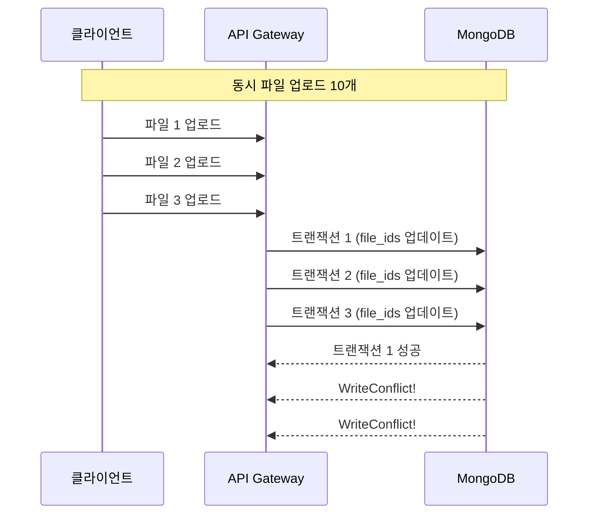
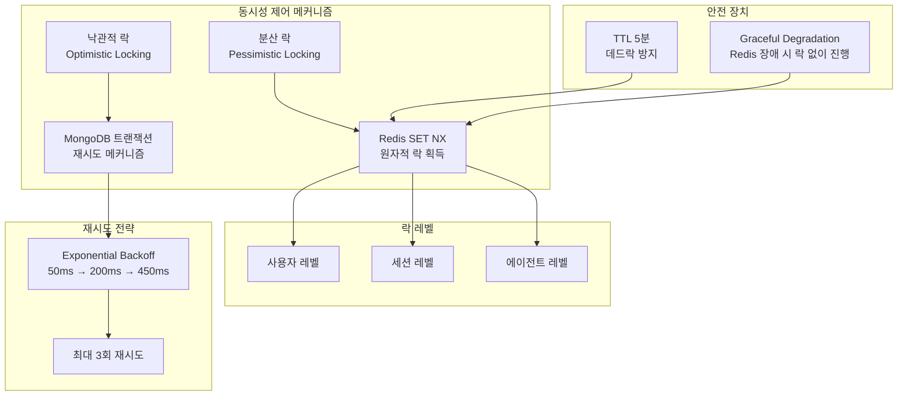
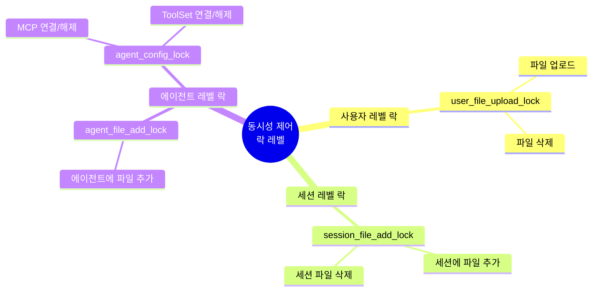

## 문제의 시작: WriteConflict 에러

AI 플랫폼에서 사용자가 10개 이상의 파일을 동시에 업로드하면 일부가 실패하는 문제가 발생했다.

```
ERROR - WriteConflict: write conflict during plan execution
ERROR - WriteConflict: write conflict during plan execution
```

MongoDB의 `WriteConflict` 에러였다. 원인은 명확했다: 동일한 사용자 문서의 `file_ids` 배열을 여러 트랜잭션이 동시에 업데이트하려고 했기 때문이다.

### 문제 상황



## 해결책: 비관적 락 + 낙관적 락

하나의 락 전략만으로는 부족했다. **Redis 분산 락(비관적 락)**과 **MongoDB 트랜잭션 재시도(낙관적 락)**를 결합했다.

### 전체 아키텍처



### 1단계: Redis 분산 락 획득

동시 접근을 원천적으로 차단한다.


```go
func (s *fileService) acquireUserFileUploadLock(ctx context.Context, lockKey string) (bool, error) {
    if s.services.Cache == nil {
        // Cache가 없으면 락 없이 진행 (graceful degradation)
        return true, nil
    }

    lockValue := time.Now().UTC().Format(time.RFC3339Nano)
    ttl := 5 * time.Minute

    // Redis SET NX: 키가 없을 때만 설정 (원자적)
    acquired, err := s.services.Cache.SetNX(lockKey, lockValue, ttl)
    if err != nil {
        return false, err
    }

    return acquired, nil
}
```


### 2단계: MongoDB 트랜잭션 재시도

분산 락 내에서 발생하는 일시적 충돌을 처리한다.


```go
func (s *fileService) uploadUserFileInternal(ctx context.Context, ...) (*models.File, error) {
    // 1. 락 획득
    lockKey := s.generateUserFileUploadLockKey(user.ID, fileSize)
    lockAcquired, err := s.acquireUserFileUploadLock(ctx, lockKey)
    if !lockAcquired {
        return nil, customErrors.New(customErrors.ErrConflict,
            "another file upload is in progress", nil)
    }
    defer s.releaseUserFileUploadLock(lockKey)

    // 2. MongoDB 트랜잭션 재시도 로직
    maxRetries := 3
    for attempt := 0; attempt < maxRetries; attempt++ {
        if attempt > 0 {
            // Exponential backoff: attempt² × 50ms
            waitTime := time.Duration(attempt*attempt) * 50 * time.Millisecond
            time.Sleep(waitTime)
        }

        session, _ := s.services.MongoDB.StartSession()
        defer session.EndSession(ctx)

        _, err = session.WithTransaction(ctx, func(mongoCtx mongo.SessionContext) (any, error) {
            // 파일 삽입, 권한 생성, 사용자 file_ids 업데이트
            return nil, nil
        })

        // WriteConflict가 아니면 즉시 반환
        if err == nil || !isWriteConflict(err) {
            break
        }
    }

    return file, err
}

func isWriteConflict(err error) bool {
    return strings.Contains(err.Error(), "WriteConflict") ||
           strings.Contains(err.Error(), "Write conflict")
}
```


## 파일 크기별 락 키 세분화

문제가 하나 더 있었다. 10GB 파일을 업로드하는 동안 1MB 파일도 대기해야 했다. 파일 크기별로 락 키를 분리했다.


```go
func getFileSizeCategory(fileSize int64) string {
    const (
        smallLimit  = 10 * 1024 * 1024   // 10MB
        mediumLimit = 100 * 1024 * 1024  // 100MB
    )

    if fileSize <= smallLimit {
        return "small"
    } else if fileSize <= mediumLimit {
        return "medium"
    }
    return "large"
}

func (s *fileService) generateUserFileUploadLockKey(userID string, fileSize int64) string {
    category := getFileSizeCategory(fileSize)
    return fmt.Sprintf("user_file_upload_lock:%s:%s", userID, category)
}
```


**결과:**
- 5MB 파일: `user_file_upload_lock:user123:small`
- 50MB 파일: `user_file_upload_lock:user123:medium`
- 200MB 파일: `user_file_upload_lock:user123:large`

이제 대용량 파일 업로드 중에도 소용량 파일을 바로 업로드할 수 있다.

## 서버 측 자동 재시도

처음에는 락 획득 실패 시 즉시 409 Conflict를 반환했다. 하지만 클라이언트 재시도 로직이 복잡해지고 네트워크 트래픽이 증가했다. 서버 측에서 자동 재시도하도록 변경했다.


```go
func (s *fileService) acquireUserFileUploadLock(ctx context.Context, lockKey string) (bool, error) {
    maxWaitTime := 30 * time.Second
    initialBackoff := 100 * time.Millisecond
    maxBackoff := 2 * time.Second
    backoff := initialBackoff
    startTime := time.Now()

    for {
        // Context 취소 확인
        if ctx.Err() != nil {
            return false, ctx.Err()
        }

        // 최대 대기 시간 확인
        if time.Since(startTime) > maxWaitTime {
            return false, customErrors.New(customErrors.ErrTimeout,
                "lock acquisition timeout: failed to acquire lock within 30 seconds", nil)
        }

        // 락 획득 시도
        acquired, err := s.services.Cache.SetNX(lockKey, lockValue, ttl)
        if err != nil {
            return false, err
        }
        if acquired {
            return true, nil
        }

        // Exponential backoff: 100ms → 150ms → 225ms → ...
        time.Sleep(backoff)
        backoff = time.Duration(float64(backoff) * 1.5)
        if backoff > maxBackoff {
            backoff = maxBackoff
        }
    }
}
```


**효과:**
- 클라이언트 재시도 로직 불필요
- 네트워크 트래픽 감소
- 사용자 경험 개선 (대부분 30초 이내 성공)

## 락 레벨 설계

어떤 단위로 락을 걸어야 할까? 파일 레벨은 너무 세밀하고, 전역 락은 너무 거칠다.



| 락 레벨 | 락 키 | 적용 대상 |
|--------|-------|----------|
| 사용자 | `user_file_upload_lock:{userID}:{size}` | 파일 업로드, 삭제 |
| 세션 | `session_file_add_lock:{sessionID}` | 세션 파일 추가/삭제 |
| 에이전트 | `agent_file_add_lock:{agentID}` | 에이전트 파일 추가 |
| 에이전트 설정 | `agent_config_lock:{agentID}` | MCP, ToolSet 연결 |

## MinIO 고아 객체 관리

파일 업로드는 MinIO에 저장 후 MongoDB에 메타데이터를 기록한다. 만약 MongoDB 저장이 실패하면? MinIO에 파일은 있지만 참조가 없는 **고아 객체**가 된다.


```go
// MinIO 삭제 실패 시 고아 객체 기록
func (s *fileService) recordOrphanMinIOObject(ctx context.Context, bucket, key string, err error) {
    orphan := models.OrphanMinIOObject{
        ID:        primitive.NewObjectID(),
        Bucket:    bucket,
        Key:       key,
        Status:    "pending",
        Retries:   0,
        Error:     err.Error(),
        CreatedAt: time.Now().UTC(),
    }

    s.services.MongoDB.Collection("orphan_minio_objects").InsertOne(ctx, orphan)
}

// 배치 작업으로 주기적 정리 (최대 3회 재시도, 1시간 간격)
func (s *fileService) CleanupOrphanMinIOObjects(ctx context.Context) error {
    filter := bson.M{
        "retries": bson.M{"$lt": 3},
        "last_retry_at": bson.M{
            "$lt": time.Now().UTC().Add(-1 * time.Hour),
        },
    }

    cursor, _ := s.services.MongoDB.Collection("orphan_minio_objects").Find(ctx, filter)

    for cursor.Next(ctx) {
        var orphan models.OrphanMinIOObject
        cursor.Decode(&orphan)

        // MinIO에서 삭제 시도
        err := s.services.MinIO.DeleteObject(ctx, orphan.Bucket, orphan.Key)
        if err == nil {
            // 성공: 상태를 deleted로 변경
            s.updateOrphanStatus(ctx, orphan.ID, "deleted")
        } else {
            // 실패: 재시도 횟수 증가
            s.incrementOrphanRetries(ctx, orphan.ID, err)
        }
    }

    return nil
}
```


## 성능 비교

| 시나리오 | Before | After |
|---------|--------|-------|
| 정상 케이스 | 즉시 성공 | 즉시 성공 + 2-4ms (Redis 호출) |
| 동시 업로드 10개 | 1개 성공, 9개 WriteConflict | 10개 모두 성공 (순차 처리) |
| 동시 업로드 + 대용량 | 대용량 완료까지 모두 대기 | 크기별 독립 처리 |

## Graceful Degradation

Redis가 죽으면? 락 없이 진행하도록 설계했다.


```go
func (s *fileService) acquireUserFileUploadLock(ctx context.Context, lockKey string) (bool, error) {
    if s.services.Cache == nil {
        // 개발 환경: 락 없이 진행
        return true, nil
    }

    acquired, err := s.services.Cache.SetNX(lockKey, lockValue, ttl)
    if err != nil {
        // 운영 환경: Redis 장애 시 에러 반환
        if s.isProduction() {
            return false, customErrors.New(customErrors.ErrDependency,
                "redis unavailable", err)
        }
        // 개발 환경: 경고만 남기고 락 없이 진행
        s.logger.Warnf("redis unavailable, proceeding without lock: %v", err)
        return true, nil
    }

    return acquired, nil
}
```


## 배운 점

### 1. 단일 락 전략의 한계

비관적 락만 사용하면 동시성이 떨어지고, 낙관적 락만 사용하면 충돌이 많아진다. 두 전략을 결합하면 각각의 단점을 보완할 수 있다.

### 2. 락 키 설계의 중요성

너무 세밀한 락(파일 단위)은 오버헤드가 크고, 너무 거친 락(전역)은 동시성을 죽인다. 실제 충돌 패턴을 분석해서 적절한 단위를 선택해야 한다.

### 3. 서버 측 재시도의 효과

클라이언트에 부담을 주지 않고 서버에서 재시도하면:
- 네트워크 트래픽 감소
- 클라이언트 코드 단순화
- 사용자 경험 개선

### 4. 장애 대응 설계

Redis 장애 시에도 서비스가 동작하도록 Graceful Degradation을 설계했다. 다만 운영 환경에서는 데이터 일관성을 위해 에러를 반환한다.

## 결론

파일 업로드 동시성 문제를 해결하면서 배운 것:

1. **비관적 락 + 낙관적 락 조합**: 동시 접근은 분산 락으로 차단, 일시적 충돌은 재시도로 해결
2. **락 키 세분화**: 파일 크기별로 분리하여 대용량이 소용량을 차단하지 않음
3. **서버 측 자동 재시도**: 30초 내 exponential backoff로 클라이언트 부담 제거
4. **고아 객체 관리**: 분산 시스템에서 불일치는 필연적, 정리 메커니즘 필수

가장 중요한 것은 문제 패턴을 정확히 분석하고, 상황에 맞는 전략을 조합하는 것이다.
