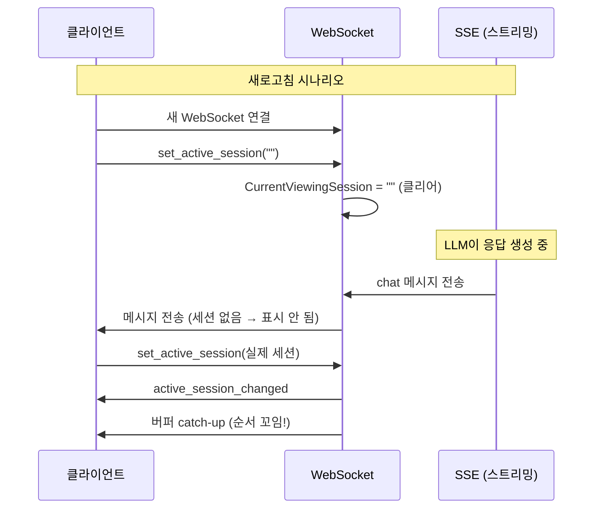
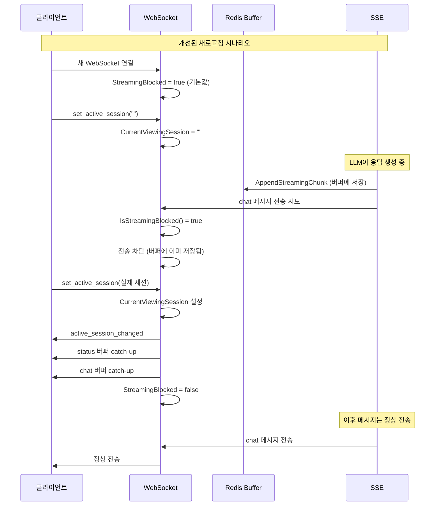
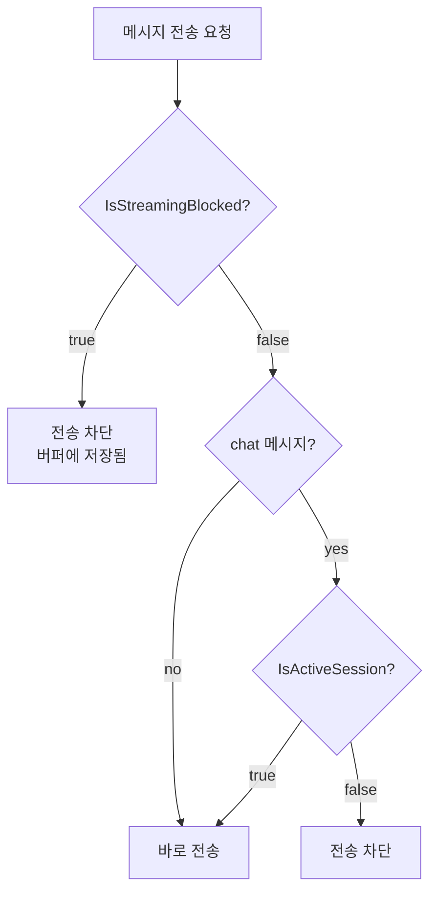

## 문제의 발견

AI 챗봇 플랫폼을 개발하면서 이상한 버그 리포트가 들어왔다.

> "채팅 중에 새로고침하면 응답이 뒤죽박죽으로 나와요."

로그를 분석했다.

```
15:34:08.260 - set_active_session (session_id="")      ← 새 연결
15:34:08.260 - chat 메시지 도착 (스트리밍 중)           ← 이게 문제!
15:34:08.273 - set_active_session (실제 세션)
15:34:08.320 - active_session_changed 응답
15:34:08.321 - 버퍼 catch-up 전송
```

문제가 보이는가? 새 연결이 활성 세션을 설정하기 **전에** 스트리밍 메시지가 도착했다.

## 왜 이런 일이 발생하는가?



### 핵심 문제점

1. 새 연결 시 빈 세션 ID로 `set_active_session("")` 전송
2. 서버가 `CurrentViewingSession`을 클리어
3. 그 사이에 스트리밍 메시지가 도착
4. 메시지가 어느 세션에도 연결되지 않아 손실되거나 순서가 꼬임

## 해결책: StreamingBlocked 플래그

새 연결이 완전히 설정되기 전까지 스트리밍 메시지를 **차단**하기로 했다.

### 아키텍처



## 구현 상세

### 1. connectionInfo에 StreamingBlocked 필드 추가


```go
type connectionInfo struct {
    // ... 기존 필드들 ...

    // 스트리밍 메시지 차단 플래그
    // 새 연결 시 true, set_active_session 완료 후 false
    StreamingBlocked bool `json:"streaming_blocked"`
}
```


### 2. 모든 새 연결은 차단 상태로 시작


```go
func (ws *webSocketImpl) RegisterConnection(connectionID string, conn *websocket.Conn) {
    info := &connectionInfo{
        ConnectionID:     connectionID,
        Conn:             conn,
        StreamingBlocked: true,  // 항상 차단 상태로 시작
        // ...
    }
    ws.connections.Store(connectionID, info)
}
```


**왜 기본값이 true인가?**

TOCTOU (Time Of Check To Time Of Use) 공격과 비슷한 race condition이 있다:

1. 새 연결 생성 (T0)
2. `set_active_session` 처리 시작 (T1)
3. SSE 메시지 도착 (T0 ~ T1 사이)

기본값을 `true`로 설정하면 이 사이에 도착하는 메시지도 차단된다.

### 3. set_active_session 핸들러 수정


```go
func (ws *webSocketImpl) handleSetActiveSession(connectionID, sessionID string) error {
    // 빈 세션 ID: 차단 설정
    if sessionID == "" {
        ws.SetStreamingBlocked(connectionID, true)
        ws.SetConnectionViewingSession(connectionID, "")
        return nil
    }

    // 실제 세션 ID 처리
    ws.SetConnectionViewingSession(connectionID, sessionID)

    // 1. active_session_changed 응답
    ws.sendActiveSessionChanged(connectionID, sessionID)

    // 2. status 버퍼 catch-up (chat보다 먼저)
    ws.sendStatusBufferCatchup(connectionID, sessionID)

    // 3. chat 버퍼 catch-up
    ws.sendChatBufferCatchup(connectionID, sessionID)

    // 4. 차단 해제 (모든 catch-up 완료 후)
    ws.SetStreamingBlocked(connectionID, false)

    return nil
}
```


### 4. 메시지 전송 시 차단 체크


```go
func (s *RealtimeNotificationService) SendRealtimeUpdate(
    connectionID string,
    messageType string,
    payload interface{},
) error {
    // 1단계: StreamingBlocked 체크
    if s.webSocket.IsStreamingBlocked(connectionID) {
        // status 메시지는 버퍼에 저장
        if messageType != models.WebSocketMessageChat {
            s.offlineQueue.AppendStatusMessage(ctx, sessionID, content)
        }
        // chat 메시지는 이미 SSE에서 버퍼에 저장됨
        return nil  // 전송 건너뛰기
    }

    // 2단계: ActiveSession 체크 (chat 메시지만)
    if messageType == models.WebSocketMessageChat {
        if !s.activeSessionManager.IsActiveSession(connectionID, sessionID) {
            return nil
        }
    }

    // 전송
    return s.webSocket.SendToConnectionID(connectionID, messageType, payload)
}
```


## 버퍼 Catch-up 순서 보장

메시지 손실을 방지하기 위해 **버퍼에 먼저 저장 → 나중에 catch-up** 전략을 사용한다.

### chat 메시지: SSE에서 버퍼에 먼저 저장


```go
// chat_sse.go
func (s *SSEService) streamLLMResponse(ctx context.Context, sessionID string) {
    for chunk := range llmStream {
        // 1. 먼저 버퍼에 저장 (손실 방지)
        s.offlineQueue.AppendStreamingChunk(ctx, sessionID, chunk)

        // 2. 그 다음 실시간 전송 시도
        s.realtimeNotifier.SendRealtimeUpdate(connectionID, "chat", chunk)
    }
}
```


### status 메시지: 차단 중에만 버퍼 저장


```go
// chat_realtime.go
func (s *RealtimeNotificationService) SendRealtimeUpdate(...) {
    if s.webSocket.IsStreamingBlocked(connectionID) {
        // 차단 중에만 버퍼에 저장 (중복 전송 방지)
        if messageType != models.WebSocketMessageChat {
            s.offlineQueue.AppendStatusMessage(ctx, sessionID, content)
        }
        return nil
    }

    // 차단되지 않으면 바로 전송 (버퍼 저장 안 함)
    return s.webSocket.SendToConnectionID(...)
}
```


**왜 status는 차단 중에만 버퍼 저장하는가?**

정상 전송된 status 메시지를 버퍼에도 저장하면, 새로고침 시 **중복 전송**된다.

## 멀티 Pod 환경 지원

`StreamingBlocked` 상태를 Redis에 저장하여 Pod 간 공유한다.


```go
// Write-through 캐시 패턴
func (ws *redisWebSocketImpl) SetStreamingBlocked(connectionID string, blocked bool) {
    // 1. 로컬 먼저 업데이트
    ws.webSocketImpl.SetStreamingBlocked(connectionID, blocked)

    // 2. Redis에 비동기 저장
    go func() {
        key := fmt.Sprintf("ws:streaming_blocked:%s", connectionID)
        ws.redis.Set(ctx, key, blocked, 5*time.Minute)
    }()
}

// Read-through 캐시 패턴
func (ws *redisWebSocketImpl) IsStreamingBlocked(connectionID string) bool {
    // 1. 로컬 먼저 조회
    if info, ok := ws.connections.Load(connectionID); ok {
        return info.StreamingBlocked
    }

    // 2. Redis에서 조회 (로컬에 없을 때만)
    key := fmt.Sprintf("ws:streaming_blocked:%s", connectionID)
    blocked, err := ws.redis.Get(ctx, key).Bool()
    if err == nil {
        return blocked
    }

    // 기본값: true (안전하게)
    return true
}
```


## Redis 기반 전역 SequenceID

멀티 Pod 환경에서 메시지 순서를 보장하기 위해 Redis INCR을 사용한다.


```go
func (m *MessageOrderingManager) GetNextSequenceID(orderingKey string) int64 {
    if m.redisClient != nil {
        key := fmt.Sprintf("ws:msg_seq:%s", orderingKey)
        seq, err := m.redisClient.Incr(ctx, key).Result()
        if err == nil {
            // TTL 설정 (메모리 절약)
            m.redisClient.Expire(ctx, key, 24*time.Hour)
            return seq
        }
        // Redis 실패 시 fallback
    }

    // 로컬 메모리 기반 (단일 Pod 또는 fallback)
    return m.getNextSequenceIDLocal(orderingKey)
}
```


**효과:**
- 멀티 Pod 환경에서 전역 SequenceID 보장
- Pod 재시작 후에도 SequenceID 연속성 유지
- Redis 실패 시 로컬 fallback

## 버퍼 전송 안정성 개선

버퍼 catch-up 중 연결이 끊기면? 전송 실패한 메시지를 다시 버퍼에 저장한다.


```go
func (ws *webSocketImpl) sendChatBufferCatchup(connectionID, sessionID string) {
    bufferedContent, _ := ws.offlineQueue.GetStreamingBuffer(ctx, sessionID)
    if bufferedContent == "" {
        return
    }

    // 재시도 포함
    chatSent := false
    for retry := 0; retry < 3; retry++ {
        if ws.sendBufferedContentDirect(connectionID, bufferedContent) {
            chatSent = true
            break
        }
        time.Sleep(100 * time.Millisecond)
    }

    if chatSent {
        // 성공: 버퍼 삭제
        ws.offlineQueue.ClearStreamingBuffer(ctx, sessionID)
    } else {
        // 실패: 버퍼에 다시 저장하여 다음 set_active_session에서 재시도
        ws.offlineQueue.AppendStreamingChunk(ctx, sessionID, bufferedContent)
    }
}
```


## 2단계 안전장치



| 단계 | 체크 항목 | 적용 대상 | 목적 |
|-----|----------|----------|------|
| 1단계 | `IsStreamingBlocked()` | 모든 메시지 | 새로고침 중 차단 |
| 2단계 | `IsActiveSession()` | chat 메시지만 | 활성 세션 검증 |

## 결과

### 메시지 순서 보장

```
[Before]
새 연결 → chat 메시지 도착 → set_active_session → active_session_changed → 버퍼 catch-up
         ↑ 여기서 순서 꼬임

[After]
새 연결 → chat 메시지 도착 (차단) → set_active_session → active_session_changed
       → status 버퍼 catch-up → chat 버퍼 catch-up → 차단 해제 → 정상 전송
```

### 성능 영향

| 항목 | 영향 |
|-----|-----|
| 메모리 | 연결당 1 byte 추가 (`bool`) |
| CPU | `IsStreamingBlocked()` 호출당 O(1) |
| 네트워크 | Redis 저장은 비동기, 조회는 로컬 우선 |

## 배운 점

### 1. 기본값의 중요성

`StreamingBlocked`의 기본값을 `true`로 설정함으로써 TOCTOU race condition을 방지했다. 기본값이 `false`였다면 연결 생성과 `set_active_session` 사이에 도착하는 메시지가 누락됐을 것이다.

### 2. 버퍼 먼저, 전송 나중

메시지 손실을 방지하려면:
1. **먼저** 버퍼에 저장
2. **그 다음** 실시간 전송 시도
3. 차단되면 버퍼에서 나중에 catch-up

### 3. 중복 전송 방지

status 메시지를 **차단 중에만** 버퍼에 저장하여 정상 전송된 메시지의 중복 전송을 방지했다.

### 4. 멀티 Pod 고려

단일 Pod에서 동작하던 코드를 멀티 Pod로 확장할 때, 로컬 상태를 Redis로 공유해야 하는 경우가 많다. Write-through/Read-through 캐시 패턴이 유용하다.

## 결론

WebSocket 스트리밍에서 race condition은 타이밍에 따라 발생하기 때문에 재현이 어렵다. 하지만 근본적인 원인을 분석하면:

1. **문제**: 새 연결 설정 완료 전에 메시지가 도착
2. **해결**: `StreamingBlocked` 플래그로 메시지 차단
3. **보완**: 버퍼에 먼저 저장하여 손실 방지, catch-up으로 순서 보장

가장 중요한 것은 **안전한 기본값**을 선택하는 것이다. 의심스러우면 차단하고, 확실해지면 해제한다.
