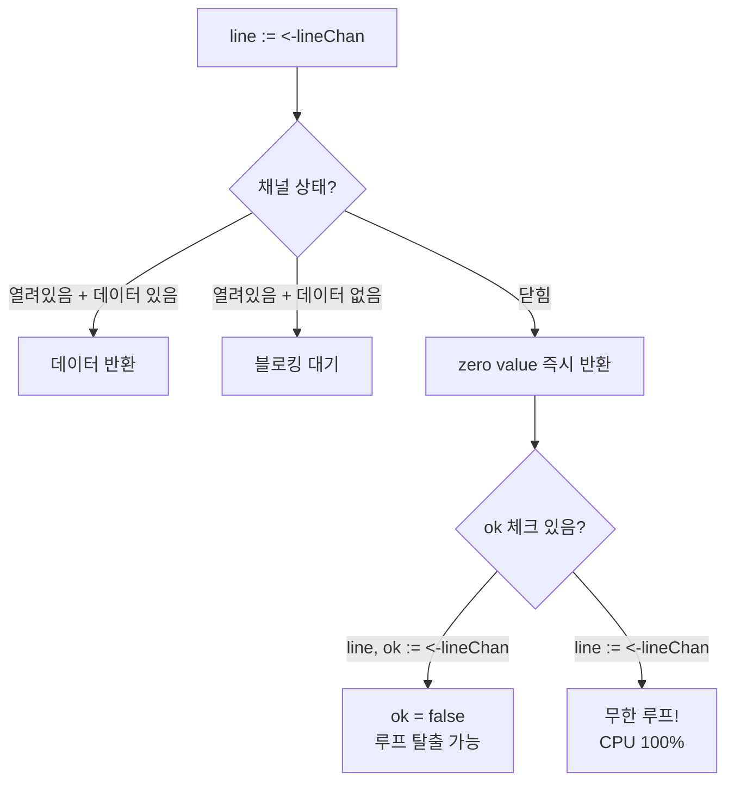
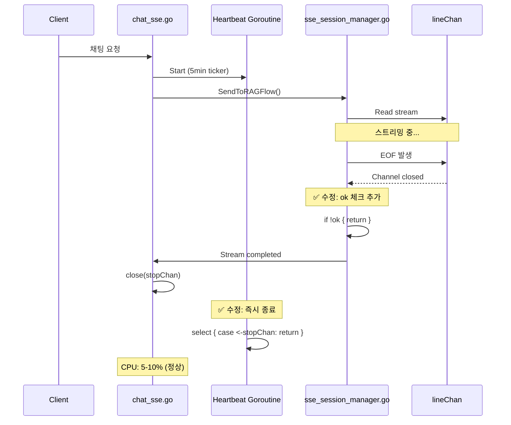

## 문제 발견

운영 환경에서 이상한 현상이 보고되었다.

```
[15:52:56] PID: 83831 | CPU: 94.8% | MEM: 0.1%
[15:52:57] PID: 83831 | CPU: 101.0% | MEM: 0.1%
[15:52:58] PID: 83831 | CPU: 99.4% | MEM: 0.1%
```

채팅 스트리밍이 완료된 후에도 CPU가 100%에서 떨어지지 않았다. 메모리는 정상인데 CPU만 폭발한다? Goroutine 문제다.

## 원인 분석

### 1. Closed Channel 무한 루프 (주범)

SSE 스트림 처리 코드에서 문제를 발견했다.


```go
// 문제 코드
drainLineChanOnEOF:
    for {
        select {
        case line := <-lineChan:  // ← ok 체크 없음!
            if line != "" {
                // 처리 로직
            }
            // line이 빈 문자열이어도 루프 계속
        default:
            break drainLineChanOnEOF
        }
    }
```


**문제점:**
- `lineChan`이 닫히면 `<-lineChan`은 **zero value(빈 문자열)**를 즉시 반환
- `ok` 체크가 없어서 채널이 닫혔는지 모름
- `default` case가 선택되기 전까지 **빈 문자열로 무한 루프**
- **이것이 CPU 100%의 직접적인 원인**

### Go Channel의 동작 원리



### 2. Ticker Goroutine 지연 종료

Heartbeat goroutine도 문제였다.


```go
// 문제 코드
go func() {
    ticker := time.NewTicker(5 * time.Minute)
    for {
        select {
        case <-ticker.C:      // ← 먼저 선택되면
            doWork()          // ← 작업 수행
        case <-stopChan:      // ← stopChan이 닫혀도 다음 cycle까지 대기
            return
        }
    }
}()
```


**문제점:**
- Go의 `select`는 여러 case가 ready일 때 **무작위 선택**
- `ticker.C`가 선택되면 `doWork()` 완료 후 다시 `select`로 돌아감
- `stopChan`이 닫혀도 다음 ticker cycle(최대 5분)까지 goroutine 살아있음
- 여러 채팅 세션 누적 시 goroutine이 쌓임 → CPU 폭발

### 3. 불필요한 정리 작업 호출


```go
// 문제 코드
sm.signalCompletion(sessionID)
go func() {
    // signalCompletion 직후인데 또 PrepareForNewStream?
    // 내부에서 WaitForStreamCompletion (1초 대기) 호출
    if err := sm.PrepareForNewStream(sessionID); err != nil {
        // ...
    }
}()
```


## 해결책

### 1. Channel Closed 체크 추가


```go
// 수정 후
drainLineChanOnEOF:
    for {
        line, ok := <-lineChan  // ← ok 체크 추가!
        if !ok {
            // 채널이 닫혔고 모든 메시지를 읽었음
            break drainLineChanOnEOF
        }
        if line != "" {
            // 처리 로직
        }
    }
```


**핵심 개선:**
- `select`와 `default` case 제거
- `ok` 체크로 채널이 닫혔을 때만 종료
- 모든 메시지 보장 (메시지 손실 방지)

### 2. Ticker Goroutine 즉시 종료


```go
// 수정 후
go func() {
    ticker := time.NewTicker(heartbeatInterval)
    defer ticker.Stop()
    for {
        select {
        case <-stopChan:  // 우선 확인
            return
        case <-ticker.C:
            // 작업 수행 전 재확인
            select {
            case <-stopChan:
                return
            default:
            }
            doWork()
        }
    }
}()
```


**핵심 개선:**
- `stopChan`을 작업 수행 전에 **재확인**
- Ticker cycle(5분)까지 대기하지 않고 즉시 종료
- Goroutine 누적 방지

### 3. 불필요한 호출 제거


```go
// 수정 후
sm.signalCompletion(sessionID)
// PrepareForNewStream은 다음 요청이 올 때 자동으로 호출되므로
// 여기서 호출 불필요
```


## 수정 흐름



## 결과

### CPU 사용량 변화

**수정 전:**
```
[15:52:56] CPU: 94.8%
[15:52:57] CPU: 101.0%
[15:52:58] CPU: 99.4%
```

**수정 후:**
```
[15:56:54] CPU: 1.0%
[15:56:55] CPU: 0.5%
[15:56:56] CPU: 1.0%
```

### 성능 영향

| 변경사항 | 성능 영향 | 중요도 |
|---------|----------|-------|
| Channel closed 체크 | 무한 루프 제거 → CPU 100% → 5% | 🔥 최우선 |
| Ticker goroutine 최적화 | 즉시 종료 → Goroutine 누적 방지 | ⚠️ 중요 |
| PrepareForNewStream 제거 | 1초 대기 제거 | ⚠️ 중요 |

## 배운 점

### 1. Channel 읽기의 두 가지 방식


```go
// 방식 1: ok 체크 없음 (위험!)
line := <-lineChan
// 채널이 닫히면 zero value가 계속 반환 → 무한 루프 가능

// 방식 2: ok 체크 있음 (안전)
line, ok := <-lineChan
if !ok {
    // 채널이 닫혔음을 확실히 알 수 있음
}
```


**규칙:** 닫힐 수 있는 채널에서 읽을 때는 **항상 `ok` 체크**

### 2. select와 default의 함정


```go
select {
case line := <-lineChan:
    // 처리
default:
    break  // 채널이 비어있으면 즉시 탈출
}
```


`default`가 있으면 채널이 **비어있을 때** 즉시 탈출하지만, 채널이 **닫혔을 때**는 zero value가 계속 반환된다. 다른 개념이다!

### 3. Goroutine 종료 패턴


```go
// 패턴: 작업 전 stop 신호 재확인
for {
    select {
    case <-stopChan:
        return  // 우선 확인
    case <-ticker.C:
        select {
        case <-stopChan:
            return  // 재확인
        default:
        }
        doWork()  // 작업 수행
    }
}
```


### 4. CPU 100% 디버깅 체크리스트

1. **Goroutine 누수 확인**: `runtime.NumGoroutine()` 모니터링
2. **Channel 상태 확인**: closed channel에서 읽을 때 `ok` 체크 여부
3. **무한 루프 확인**: `for` 루프 내 탈출 조건 검토
4. **Ticker/Timer 정리**: `defer ticker.Stop()` 확인
5. **Stop 신호 전파**: `stopChan` 닫힘 후 즉시 종료 여부

## 결론

CPU 100% 버그의 원인은 의외로 단순했다:

1. **Closed channel에서 `ok` 체크 누락** → 무한 루프
2. **Ticker goroutine의 지연 종료** → Goroutine 누적
3. **불필요한 정리 작업** → 추가 CPU 소모

가장 중요한 교훈: **Go channel에서 읽을 때는 항상 `ok`를 체크하라.**


```go
// 이렇게 하지 마세요
line := <-lineChan

// 이렇게 하세요
line, ok := <-lineChan
if !ok {
    return
}
```

