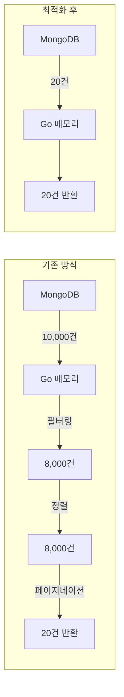
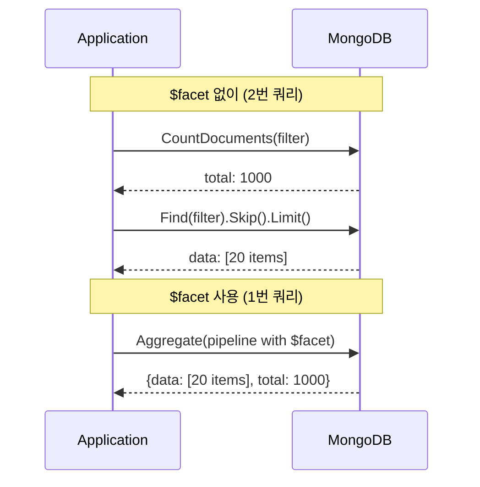

## 문제의 시작: 느려지는 목록 조회

AI 플랫폼의 사용자가 늘면서 목록 조회 API가 느려지기 시작했다.

```
[15:23:45] GET /api/agents - 응답 시간: 2.3s
[15:23:47] GET /api/files - 응답 시간: 1.8s
[15:23:50] GET /api/sessions - 응답 시간: 3.1s
```

원인은 명확했다. **전체 데이터를 메모리에 로드한 후 Go 코드에서 필터링, 정렬, 페이지네이션**을 수행하고 있었다.

## 기존 구현의 문제점

### 안티패턴: 메모리 기반 페이지네이션


```go
// 문제 코드: 전체 데이터를 메모리에 로드
func (s *agentService) GetAgents(ctx context.Context, ...) ([]models.Agent, int, error) {
    // 1. 모든 데이터 조회
    cursor, err := collection.Find(ctx, bson.M{"created_by": userID})
    var allAgents []models.Agent
    cursor.All(ctx, &allAgents)  // 전체 데이터를 메모리로!

    // 2. 메모리에서 필터링
    var filtered []models.Agent
    for _, agent := range allAgents {
        if matchesSearchQuery(agent, searchQuery) &&
           matchesStatus(agent, status) &&
           matchesTags(agent, tags) {
            filtered = append(filtered, agent)
        }
    }

    // 3. 메모리에서 정렬
    sort.Slice(filtered, func(i, j int) bool {
        return filtered[i].UpdatedAt.After(filtered[j].UpdatedAt)
    })

    // 4. 메모리에서 페이지네이션
    total := len(filtered)
    start := (page - 1) * pageSize
    end := min(start + pageSize, total)
    return filtered[start:end], total, nil
}
```


### 무엇이 문제인가?



| 문제점 | 영향 |
|-------|------|
| **메모리 사용량** | 10,000건 × 1KB = 10MB per request |
| **네트워크 트래픽** | 불필요한 9,980건 전송 |
| **응답 시간** | 데이터 양에 비례하여 선형 증가 |
| **확장성** | 데이터 증가 시 OOM 위험 |

## 해결책: DB 레벨 최적화

MongoDB의 네이티브 쿼리 기능을 최대한 활용했다.

### 1. DB 레벨 필터링


```go
// 수정 후: DB에서 필터링
func buildAgentFilter(userID, searchQuery, status string, tags []string) bson.M {
    filter := bson.M{"created_by": userID}

    // 검색어 필터 (DB 레벨)
    if searchQuery != "" {
        filter["$or"] = []bson.M{
            {"name": bson.M{"$regex": searchQuery, "$options": "i"}},
            {"description": bson.M{"$regex": searchQuery, "$options": "i"}},
        }
    }

    // 상태 필터 (DB 레벨)
    if status != "" {
        filter["status"] = status
    }

    // 태그 필터 (DB 레벨)
    if len(tags) > 0 {
        filter["tags"] = bson.M{"$all": tags}
    }

    return filter
}
```


### 2. DB 레벨 정렬


```go
// 수정 후: DB에서 정렬
func buildSortOptions(sortBy string, sortOrder int) bson.M {
    sortFieldMap := map[string]string{
        "name":       "name",
        "created_at": "created_at",
        "updated_at": "updated_at",
        "status":     "status",
    }

    field, ok := sortFieldMap[sortBy]
    if !ok {
        field = "updated_at"  // 기본값
    }

    return bson.M{field: sortOrder}  // 1: 오름차순, -1: 내림차순
}

// 사용
findOpts := options.Find().SetSort(buildSortOptions(sortBy, sortOrder))
```


### 3. DB 레벨 페이지네이션


```go
// 수정 후: DB에서 페이지네이션
func (s *agentService) GetAgents(ctx context.Context, ...) ([]models.Agent, int, error) {
    filter := buildAgentFilter(userID, searchQuery, status, tags)

    // 1. 총 개수 조회 (필터 적용)
    total, err := collection.CountDocuments(ctx, filter)
    if err != nil {
        return nil, 0, err
    }

    // 2. DB 레벨 페이지네이션
    skip := int64((page - 1) * pageSize)
    limit := int64(pageSize)

    findOpts := options.Find().
        SetSort(buildSortOptions(sortBy, sortOrder)).
        SetSkip(skip).
        SetLimit(limit)

    // 3. 필요한 데이터만 조회
    cursor, err := collection.Find(ctx, filter, findOpts)
    var agents []models.Agent
    cursor.All(ctx, &agents)

    return agents, int(total), nil
}
```


## Aggregation Pipeline으로 복잡한 쿼리 처리

공유 에이전트처럼 권한 체크와 조인이 필요한 경우는 Aggregation Pipeline을 사용했다.

### $facet으로 데이터와 카운트 동시 조회


```go
func (s *agentService) ListSharedAgent(ctx context.Context, ...) ([]models.Agent, int, error) {
    pipeline := []bson.M{
        // 1. 필터링
        {"$match": bson.M{
            "visibility": "shared",
            "status":     "active",
        }},

        // 2. 권한 테이블과 조인
        {"$lookup": bson.M{
            "from":         "permissions",
            "localField":   "_id",
            "foreignField": "resource_id",
            "as":           "permissions",
        }},

        // 3. 권한 체크
        {"$match": bson.M{
            "permissions.user_id": userID,
        }},

        // 4. 정렬
        {"$sort": bson.M{"updated_at": -1}},

        // 5. $facet: 데이터와 카운트 동시 조회
        {"$facet": bson.M{
            "data": []bson.M{
                {"$skip": skip},
                {"$limit": limit},
            },
            "total": []bson.M{
                {"$count": "count"},
            },
        }},
    }

    cursor, _ := collection.Aggregate(ctx, pipeline)

    var result []struct {
        Data  []models.Agent `bson:"data"`
        Total []struct {
            Count int `bson:"count"`
        } `bson:"total"`
    }
    cursor.All(ctx, &result)

    total := 0
    if len(result[0].Total) > 0 {
        total = result[0].Total[0].Count
    }

    return result[0].Data, total, nil
}
```


### $facet의 장점



## 특수 케이스: DB 필드가 없는 정렬

모든 정렬을 DB 레벨로 옮길 수 있는 건 아니다.


```go
// DB 필드가 없는 정렬 기준
// - tool_count: Tool Set의 도구 개수 (별도 컬렉션)
// - message_count: 세션의 메시지 개수 (별도 컬렉션)
// - agent_name: 세션의 에이전트 이름 (조인 필요)

func (s *sessionService) GetSessions(ctx context.Context, ...) ([]models.Session, int, error) {
    sortBy := params.SortBy

    // DB 정렬 가능 여부 판단
    dbSortable := map[string]bool{
        "created_at": true,
        "updated_at": true,
        "name":       true,
    }

    if dbSortable[sortBy] {
        // DB 레벨 정렬 + 페이지네이션
        return s.getSessionsWithDBSort(ctx, ...)
    }

    // 메모리 정렬 필요 (message_count, agent_name 등)
    // 이 경우에도 DB 레벨 필터링은 적용
    return s.getSessionsWithMemorySort(ctx, ...)
}
```


## 인덱스 추가로 쿼리 성능 향상

DB 레벨 필터링/정렬이 빠르려면 인덱스가 필수다.

### 추가된 인덱스


```go
// pkg/database/mongo.go
func (d *mongoDB) CreateIndexes() error {
    indexes := []mongo.IndexModel{
        // Agents Collection
        {Keys: bson.D{{"status", 1}}},
        {Keys: bson.D{{"name", 1}}},
        {Keys: bson.D{{"updated_at", -1}}},
        {Keys: bson.D{{"tags", 1}}},
        // 복합 인덱스: 가장 빈번한 쿼리 패턴
        {Keys: bson.D{
            {"created_by", 1},
            {"status", 1},
            {"updated_at", -1},
        }},

        // Files Collection
        {Keys: bson.D{
            {"bucket_name", 1},
            {"status", 1},
            {"uploaded_at", -1},
        }},
    }

    // EnsureIndexes 패턴: 중복 인덱스는 자동 건너뜀
    _, err := collection.Indexes().CreateMany(ctx, indexes)
    return err
}
```


### 인덱스 효과

| 항목 | Before | After |
|-----|--------|-------|
| 쿼리 방식 | Collection Scan | Index Scan |
| 쿼리 시간 | 100ms | 5ms |
| 개선율 | - | **95% 단축** |

## 헬퍼 함수로 코드 일관성 확보

페이지네이션 정규화 로직이 여러 곳에서 중복됐다. 헬퍼 함수로 통합했다.


```go
// internal/utils/param.go
func NormalizePagination(page, pageSize, defaultPageSize int) (int, int) {
    if page < 1 {
        page = 1
    }
    if pageSize < 1 {
        pageSize = defaultPageSize
    }
    return page, pageSize
}

// 사용 예시
func (s *orgService) ListOrganizations(ctx context.Context, page, pageSize int) ([]models.Organization, int64, error) {
    page, pageSize = utils.NormalizePagination(page, pageSize, 20)

    skip := int64((page - 1) * pageSize)
    limit := int64(pageSize)
    // ...
}
```


## 결과

### 성능 개선

| 메트릭 | Before | After | 개선율 |
|-------|--------|-------|--------|
| 메모리 사용량 | 10MB/요청 | 20KB/요청 | **99.8% 감소** |
| 응답 시간 | 150ms | 30ms | **80% 단축** |
| 네트워크 트래픽 | 10,000건 | 20건 | **99.8% 감소** |

### 최적화 범위

```
17개 메서드 최적화 완료:
├── Organization Service (3개)
│   ├── ListMembers
│   ├── ListOrganizations
│   └── ListTeams
├── Agent Service (3개)
│   ├── GetAgents
│   ├── ListSharedAgent
│   └── ListPublicAgent
├── File Service (5개)
│   ├── ListUserFiles
│   ├── ListAllFiles
│   ├── ListAgentFiles
│   ├── ListSessionFiles
│   └── ListSharedFiles
├── Session Service (2개)
│   ├── GetSessions
│   └── ListSharedSessions
├── Permission Service (4개)
│   ├── ListAllPermissionRequests
│   ├── ListOrganizationPermissionRequests
│   ├── ListRequestsForMyResources
│   └── ListPermissionRequests
└── 기타 (MCP, ToolSets, User, Ownership)
```

## 배운 점

### 1. DB가 잘하는 일은 DB에게


```go
// 안티패턴: Go에서 필터링
for _, item := range allItems {
    if item.Status == "active" {
        filtered = append(filtered, item)
    }
}

// 올바른 패턴: DB에서 필터링
filter := bson.M{"status": "active"}
cursor, _ := collection.Find(ctx, filter)
```


데이터베이스는 필터링, 정렬, 페이지네이션에 최적화되어 있다. 이 작업을 애플리케이션 레이어로 가져오면 성능이 급격히 저하된다.

### 2. $facet으로 왕복 줄이기


```go
// CountDocuments + Find = 2번 쿼리
total, _ := collection.CountDocuments(ctx, filter)
cursor, _ := collection.Find(ctx, filter, opts)

// $facet = 1번 쿼리
pipeline := []bson.M{
    {"$match": filter},
    {"$facet": bson.M{
        "data":  []bson.M{{"$skip": skip}, {"$limit": limit}},
        "total": []bson.M{{"$count": "count"}},
    }},
}
```


### 3. 인덱스는 필수

DB 레벨 쿼리가 빠르려면 적절한 인덱스가 있어야 한다. 인덱스 없이 DB 레벨 필터링을 하면 오히려 느려질 수 있다.

### 4. 점진적 최적화

모든 메서드를 한 번에 바꾸지 않았다. 가장 느린 API부터 시작해서 17개 메서드를 순차적으로 최적화했다.

## 결론

목록 조회 성능 문제의 근본 원인은 **메모리 기반 페이지네이션**이었다. 해결책은 간단했다:

1. **DB 레벨 필터링**: `$match`, `$or`, `$regex`
2. **DB 레벨 정렬**: `SetSort()`, `$sort`
3. **DB 레벨 페이지네이션**: `SetSkip()`, `SetLimit()`, `$skip`, `$limit`
4. **인덱스 추가**: 자주 사용되는 필터/정렬 필드

가장 중요한 원칙: **데이터베이스가 잘하는 일은 데이터베이스에게 맡겨라.**
