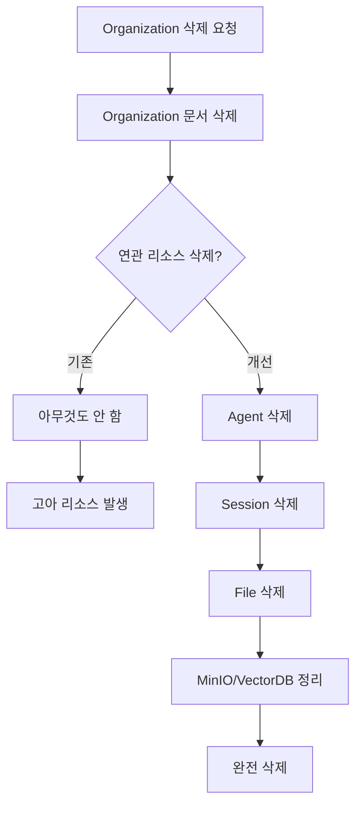
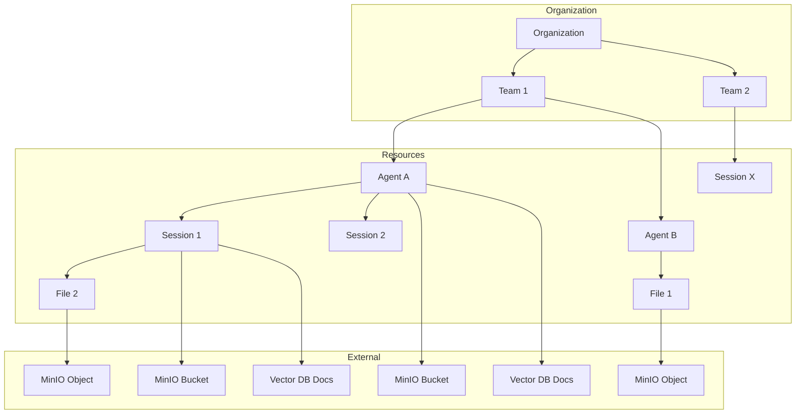
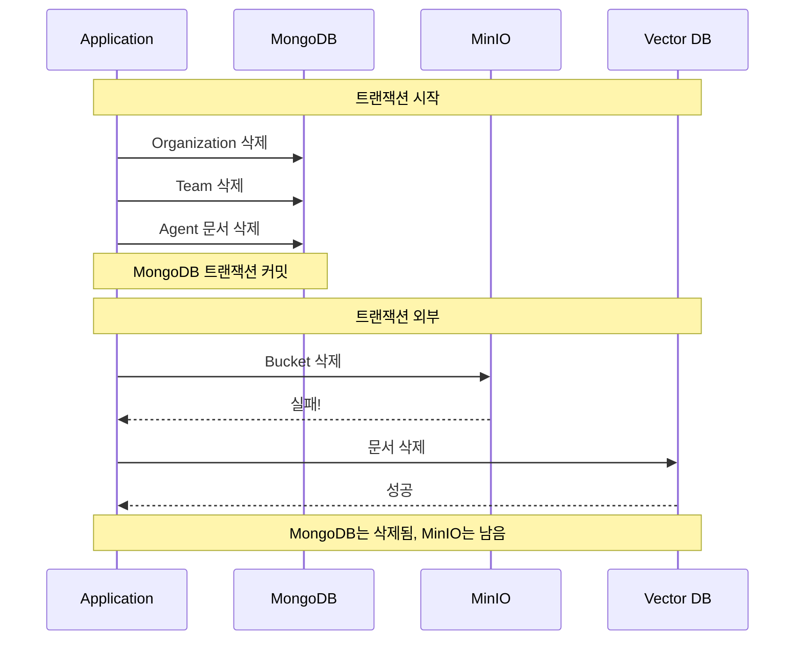
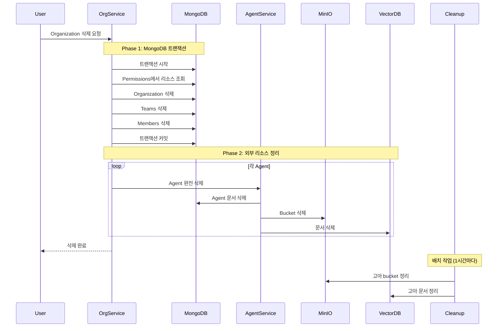

## 문제의 발견

AI 플랫폼 운영 중 이상한 현상이 발견됐다.

```
- MinIO 용량이 계속 증가하는데 사용 중인 파일이 아님
- Vector DB에 검색되지 않는 문서들이 쌓임
- 삭제된 Organization의 Agent가 여전히 조회됨
```

**고아 리소스(Orphaned Resources)** 문제였다. Organization이나 Team을 삭제해도 그 안에 있던 Agent, Session, File이 남아있었다.

## 왜 고아 리소스가 발생하는가?



### 기존 코드의 문제


```go
// 문제 코드: Organization만 삭제하고 끝
func (s *orgService) DeleteOrganization(ctx context.Context, orgID string) error {
    // Organization 문서만 삭제
    _, err := s.orgCollection.DeleteOne(ctx, bson.M{"_id": orgID})
    if err != nil {
        return err
    }

    // Team, Member 문서 삭제
    s.teamCollection.DeleteMany(ctx, bson.M{"organization_id": orgID})
    s.memberCollection.DeleteMany(ctx, bson.M{"organization_id": orgID})

    return nil  // Agent, Session, File은? MinIO는? Vector DB는?
}
```


## 해결책: 완전한 캐스케이드 삭제

Organization이 소유한 모든 리소스를 찾아서 **완전히** 삭제해야 한다.

### 리소스 의존성 파악



### 리소스 조회 및 분류


```go
func (s *orgService) getOwnedResources(ctx context.Context, subjectType string, subjectID string) ([]string, []string, []string, error) {
    // Permissions 컬렉션에서 주체가 소유한 모든 리소스 조회
    cursor, err := s.permissionCollection.Find(ctx, bson.M{
        "subject.type": subjectType,
        "subject.id":   subjectID,
    })

    var agentIDs, sessionIDs, fileIDs []string

    for cursor.Next(ctx) {
        var perm models.Permission
        cursor.Decode(&perm)

        // 리소스 타입별 분류
        switch perm.Resource.Type {
        case models.ResourceAgent:
            agentIDs = append(agentIDs, perm.Resource.ID)
        case models.ResourceSession:
            sessionIDs = append(sessionIDs, perm.Resource.ID)
        case models.ResourceFile:
            fileIDs = append(fileIDs, perm.Resource.ID)
        }
    }

    // 중복 제거
    return unique(agentIDs), unique(sessionIDs), unique(fileIDs), nil
}
```


### 완전한 리소스 삭제


```go
func (s *orgService) deleteTeamResources(ctx context.Context, agentIDs, sessionIDs, fileIDs []string) error {
    // 1. Agent 삭제 (가장 복잡함)
    for _, agentID := range agentIDs {
        if err := s.deleteAgentCompletely(ctx, agentID); err != nil {
            s.logger.Warnf("failed to delete agent %s: %v", agentID, err)
            // 계속 진행 (best effort)
        }
    }

    // 2. Session 삭제
    for _, sessionID := range sessionIDs {
        if err := s.deleteSessionCompletely(ctx, sessionID); err != nil {
            s.logger.Warnf("failed to delete session %s: %v", sessionID, err)
        }
    }

    // 3. File 삭제
    for _, fileID := range fileIDs {
        if err := s.deleteFileCompletely(ctx, fileID); err != nil {
            s.logger.Warnf("failed to delete file %s: %v", fileID, err)
        }
    }

    return nil
}

func (s *orgService) deleteAgentCompletely(ctx context.Context, agentID string) error {
    // Agent가 가진 모든 리소스 정리
    agent, err := s.agentService.GetAgent(ctx, agentID)
    if err != nil {
        return err
    }

    // 1. 관련 Session들 삭제
    sessions, _ := s.sessionService.GetSessionsByAgent(ctx, agentID)
    for _, session := range sessions {
        s.deleteSessionCompletely(ctx, session.ID.Hex())
    }

    // 2. MinIO Bucket 삭제
    bucketName := fmt.Sprintf("agent-%s", agentID)
    if err := s.minioService.DeleteBucket(ctx, bucketName); err != nil {
        s.logger.Warnf("failed to delete minio bucket %s: %v", bucketName, err)
    }

    // 3. Vector DB 문서 삭제
    if err := s.vectorDB.DeleteByFilter(ctx, bson.M{"agent_id": agentID}); err != nil {
        s.logger.Warnf("failed to delete vector db docs for agent %s: %v", agentID, err)
    }

    // 4. Configuration 삭제
    s.configCollection.DeleteOne(ctx, bson.M{"agent_id": agentID})

    // 5. Share 정보 삭제
    s.shareCollection.DeleteMany(ctx, bson.M{"resource_id": agentID})

    // 6. Agent 문서 삭제
    _, err = s.agentCollection.DeleteOne(ctx, bson.M{"_id": agent.ID})
    return err
}
```


## 트랜잭션과 외부 리소스 처리

### 딜레마: MongoDB vs 외부 리소스

MongoDB 트랜잭션은 MongoDB 내부만 보장한다. MinIO나 Vector DB는 트랜잭션에 포함되지 않는다.



### 해결책: Best Effort + 로깅


```go
func (s *orgService) DeleteOrganization(ctx context.Context, orgID string) error {
    // Phase 1: MongoDB 트랜잭션
    session, _ := s.mongoClient.StartSession()
    defer session.EndSession(ctx)

    _, err := session.WithTransaction(ctx, func(mongoCtx mongo.SessionContext) (interface{}, error) {
        // MongoDB 문서들만 삭제
        if err := s.deleteOrgDocuments(mongoCtx, orgID); err != nil {
            return nil, err  // 롤백
        }
        return nil, nil
    })

    if err != nil {
        return err  // MongoDB 작업 실패 시 전체 실패
    }

    // Phase 2: 외부 리소스 정리 (best effort)
    // MongoDB 트랜잭션 완료 후 실행
    agentIDs, sessionIDs, fileIDs, _ := s.getOwnedResources(ctx, "organization", orgID)
    if err := s.deleteTeamResources(ctx, agentIDs, sessionIDs, fileIDs); err != nil {
        s.logger.Errorf("failed to cleanup external resources for org %s: %v", orgID, err)
        // Organization 삭제는 성공으로 처리
    }

    return nil
}
```


**왜 이렇게 설계했는가?**

1. **MongoDB 일관성 우선**: 핵심 데이터(Organization, Team, Permission)는 트랜잭션으로 보장
2. **외부 리소스는 Best Effort**: 실패해도 재시도 가능
3. **사용자 경험**: 외부 리소스 정리 실패로 전체 삭제가 막히면 안 됨

### 실패한 외부 리소스 정리

외부 리소스 삭제가 실패하면 어떻게 하나? **배치 작업**으로 정기적으로 정리한다.


```go
// 1시간마다 실행되는 배치 작업
func (s *cleanupService) CleanupOrphanedResources(ctx context.Context) error {
    // 1. MongoDB에 없는데 MinIO에 있는 bucket 찾기
    buckets, _ := s.minioService.ListBuckets(ctx)
    for _, bucket := range buckets {
        if strings.HasPrefix(bucket.Name, "agent-") {
            agentID := strings.TrimPrefix(bucket.Name, "agent-")
            exists, _ := s.agentExists(ctx, agentID)
            if !exists {
                s.logger.Infof("cleaning up orphaned bucket: %s", bucket.Name)
                s.minioService.DeleteBucket(ctx, bucket.Name)
            }
        }
    }

    // 2. MongoDB에 없는데 Vector DB에 있는 문서 찾기
    // ...

    return nil
}
```


## Bucket 권한 삭제도 잊지 말자

Agent나 Session을 삭제할 때 연관된 bucket 권한도 삭제해야 한다.


```go
func (s *agentService) DeleteAgent(ctx context.Context, agentID string) error {
    // ... 기존 삭제 로직 ...

    // bucket 권한 삭제 (자주 빠뜨리는 부분!)
    subject := models.Subject{Type: models.SubjectUser, ID: userID}
    actions := []models.Action{
        models.ActionRead,
        models.ActionEdit,
        models.ActionDelete,
        models.ActionDownload,
        models.ActionShare,
    }
    bucketName := fmt.Sprintf("agent-%s", agentID)

    if _, err := s.permissionService.RevokePermission(ctx, subject, models.ResourceBucket, actions, bucketName); err != nil {
        if err != mongo.ErrNoDocuments {
            s.logger.Warnf("failed to revoke bucket permission: %v", err)
        }
    }

    return nil
}
```


## 전체 삭제 흐름



## 배운 점

### 1. 삭제는 생각보다 복잡하다

단순히 document 하나 지우는 게 아니다. 연관된 모든 리소스를 추적하고 정리해야 한다.

### 2. 외부 리소스는 트랜잭션에 포함되지 않는다

MongoDB 트랜잭션은 MongoDB 내부만 보장한다. MinIO, Vector DB, Redis 등 외부 시스템은 별도 처리가 필요하다.

### 3. Best Effort + 배치 정리

모든 것을 완벽하게 처리하려 하지 말고, 핵심은 트랜잭션으로 보장하고 나머지는 배치로 정리하자.

### 4. 권한도 리소스다

파일이나 bucket만 삭제하고 권한을 남겨두면 데이터 불일치가 발생한다.

## 결론

캐스케이드 삭제를 구현할 때 고려해야 할 것들:

1. **리소스 의존성 맵핑**: 어떤 리소스가 어떤 리소스를 소유하는지 파악
2. **삭제 순서**: 의존성 역순으로 삭제 (자식 먼저, 부모 나중)
3. **트랜잭션 경계**: MongoDB 내부는 트랜잭션, 외부는 best effort
4. **배치 정리**: 실패한 외부 리소스는 배치로 정리
5. **권한 정리**: 리소스와 함께 권한도 삭제

고아 리소스는 시스템에 쌓이면서 스토리지 비용 증가, 검색 성능 저하, 데이터 불일치를 유발한다. **삭제할 때는 완전하게.**
