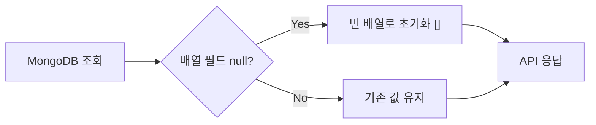

## 문제의 발견

프론트엔드 개발자로부터 버그 리포트가 들어왔다.

> "가끔 앱이 크래시해요. `Cannot read properties of null (reading 'map')` 에러가 나요."

API 응답을 확인해보니 같은 엔드포인트가 이렇게 다른 응답을 반환하고 있었다.

**정상 케이스:**
```json
{
  "id": "user123",
  "name": "홍길동",
  "roles": ["admin", "user"],
  "file_ids": ["file1", "file2"]
}
```

**문제 케이스:**
```json
{
  "id": "user456",
  "name": "김철수",
  "roles": null,
  "file_ids": null
}
```

프론트엔드에서 이렇게 사용하면 크래시가 발생한다.


```javascript
// 프론트엔드 코드
const roleList = user.roles.map(role => role.toUpperCase());
// TypeError: Cannot read properties of null (reading 'map')
```


## 왜 Null이 반환되는가?

MongoDB에서 배열 필드가 null인 상황:

1. **문서 생성 시 배열 필드 미설정**
2. **명시적으로 null 저장**
3. **필드가 아예 존재하지 않음** (Go에서는 nil로 디코딩)


```go
// Go struct
type User struct {
    ID      string   `bson:"_id"`
    Name    string   `bson:"name"`
    Roles   []string `bson:"roles"`   // MongoDB에 없으면 nil
    FileIds []string `bson:"file_ids"`
}

// MongoDB에서 조회
var user User
collection.FindOne(ctx, filter).Decode(&user)

// user.Roles가 nil일 수 있음!
```


## 해결책: 조회 함수에서 Null 체크

### 패턴 정의

모든 조회 함수에서 배열 필드를 체크하고 초기화한다.


```go
// 조회 후 null 체크 패턴
func (s *userService) GetUserByID(ctx context.Context, userID string) (*models.User, error) {
    var user models.User
    err := s.collection.FindOne(ctx, bson.M{"_id": userID}).Decode(&user)
    if err != nil {
        return nil, err
    }

    // Null 배열 초기화
    if user.Roles == nil {
        user.Roles = []string{}
    }
    if user.FileIds == nil {
        user.FileIds = []string{}
    }
    if user.OrgRoles == nil {
        user.OrgRoles = []models.OrgRole{}
    }

    return &user, nil
}
```


### 헬퍼 함수로 추상화


```go
// 헬퍼 함수
func initializeUserArrays(user *models.User) {
    if user.Roles == nil {
        user.Roles = []string{}
    }
    if user.FileIds == nil {
        user.FileIds = []string{}
    }
    if user.OrgRoles == nil {
        user.OrgRoles = []models.OrgRole{}
    }
}

// 사용
func (s *userService) GetUserByID(ctx context.Context, userID string) (*models.User, error) {
    var user models.User
    err := s.collection.FindOne(ctx, bson.M{"_id": userID}).Decode(&user)
    if err != nil {
        return nil, err
    }

    initializeUserArrays(&user)
    return &user, nil
}
```


## 적용 대상 모델

### 주요 모델과 배열 필드

| 모델 | 배열 필드 |
|-----|----------|
| User | `Roles`, `OrgRoles`, `FileIds` |
| Agent | `Tags`, `FileIds`, `McpServerIds`, `SubAgentIds`, `ToolSetIds` |
| Session | `Messages`, `Tags`, `FileIds` |
| Configuration | `McpConfig`, `ToolSetConfig`, `SubAgentConfig` |
| Organization | `Settings.AllowedRoles` |
| Team | `Members` |

### Agent 서비스 예시


```go
func initializeAgentArrays(agent *models.Agent) {
    if agent.Tags == nil {
        agent.Tags = []string{}
    }
    if agent.FileIds == nil {
        agent.FileIds = []string{}
    }
    if agent.McpServerIds == nil {
        agent.McpServerIds = []string{}
    }
    if agent.SubAgentIds == nil {
        agent.SubAgentIds = []string{}
    }
    if agent.ToolSetIds == nil {
        agent.ToolSetIds = []string{}
    }
}

func (s *agentService) GetAgent(ctx context.Context, agentID string) (*models.Agent, error) {
    var agent models.Agent
    err := s.collection.FindOne(ctx, bson.M{"_id": agentID}).Decode(&agent)
    if err != nil {
        return nil, err
    }

    initializeAgentArrays(&agent)
    return &agent, nil
}
```


### 중첩 구조체 처리


```go
// 중첩된 배열 필드도 체크
func initializeOrganizationArrays(org *models.Organization) {
    if org.Settings.AllowedRoles == nil {
        org.Settings.AllowedRoles = []string{}
    }
}

func initializeAlarmArrays(alarm *models.Alarm) {
    if alarm.Tags == nil {
        alarm.Tags = []string{}
    }
    if alarm.Channels == nil {
        alarm.Channels = []string{}
    }
    // 중첩 구조체 내부의 배열
    if alarm.RichContent != nil && alarm.RichContent.Attachments == nil {
        alarm.RichContent.Attachments = []models.AlarmAttachment{}
    }
}
```


## 리스트 조회 함수에도 적용

단일 조회뿐 아니라 리스트 조회에도 적용해야 한다.


```go
func (s *agentService) GetAgents(ctx context.Context, userID string) ([]models.Agent, error) {
    cursor, err := s.collection.Find(ctx, bson.M{"created_by": userID})
    if err != nil {
        return nil, err
    }
    defer cursor.Close(ctx)

    var agents []models.Agent
    if err := cursor.All(ctx, &agents); err != nil {
        return nil, err
    }

    // 각 Agent에 대해 null 체크
    for i := range agents {
        initializeAgentArrays(&agents[i])
    }

    return agents, nil
}
```


## API 응답 변화



**Before:**
```json
{
  "id": "user456",
  "roles": null,
  "file_ids": null
}
```

**After:**
```json
{
  "id": "user456",
  "roles": [],
  "file_ids": []
}
```

## 왜 DB 레벨에서 안 하는가?

### MongoDB 기본값 설정의 한계

MongoDB는 스키마리스이므로 Go 코드에서 기본값을 지정해도 기존 문서에는 적용되지 않는다.


```go
// Go struct 기본값은 새 문서 생성 시에만 적용
type User struct {
    Roles []string `bson:"roles" default:"[]"`  // 의미 없음
}
```


### 마이그레이션 비용

기존 데이터를 모두 업데이트하는 것은 비용이 크다.


```javascript
// 수백만 건의 문서를 업데이트해야 함
db.users.updateMany(
  { roles: null },
  { $set: { roles: [] } }
)
```


**결론:** 애플리케이션 레벨에서 처리하는 것이 안전하고 유연하다.

## 프론트엔드 개발자 경험 개선

### Before (방어적 프로그래밍 필요)


```javascript
// 프론트엔드에서 매번 체크해야 함
const roleList = (user.roles || []).map(role => role.toUpperCase());
const fileCount = user.file_ids?.length ?? 0;
```


### After (안전하게 사용 가능)


```javascript
// null 걱정 없이 사용
const roleList = user.roles.map(role => role.toUpperCase());
const fileCount = user.file_ids.length;
```


## 체크리스트

API 응답 일관성을 보장하기 위한 체크리스트:

1. **모델 정의 검토**: 배열 필드 목록 작성
2. **조회 함수 식별**: `Get*`, `List*`, `Find*` 함수들
3. **헬퍼 함수 작성**: 모델별 `initialize*Arrays` 함수
4. **단일 조회 적용**: `GetByID`, `GetByEmail` 등
5. **리스트 조회 적용**: `List*`, `GetAll*` 등
6. **테스트 작성**: null 반환 케이스 검증

## 결론

API 응답에서 null 배열 문제를 해결하는 핵심:

1. **조회 함수에서 null 체크**: DB에서 조회 후 빈 배열로 초기화
2. **헬퍼 함수로 추상화**: 중복 코드 방지
3. **모든 조회 경로에 적용**: 단일 조회, 리스트 조회 모두
4. **일관성 보장**: 같은 API는 항상 같은 형태의 응답

이 패턴을 적용하면:
- 프론트엔드 런타임 에러 방지
- API 응답 예측 가능성 향상
- 방어적 프로그래밍 불필요
- 개발자 경험 개선

**null 대신 빈 배열, 작은 변화가 큰 차이를 만든다.**
