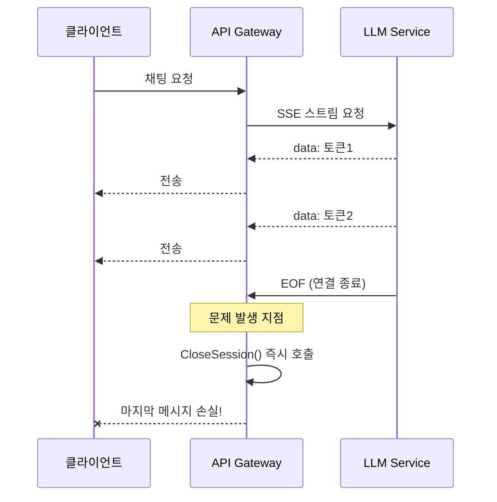
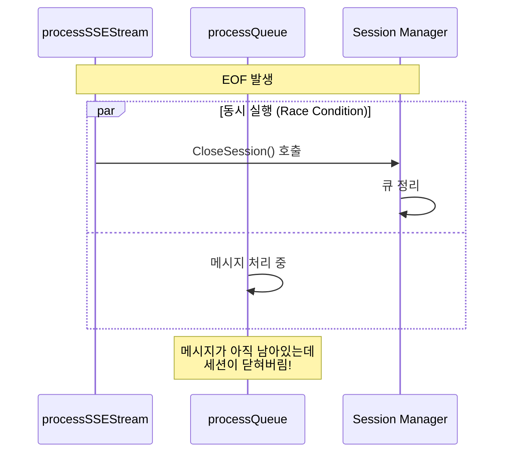
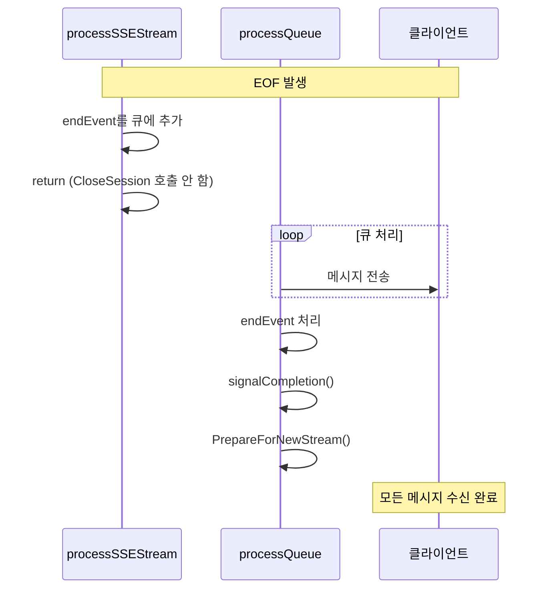

## 문제의 발견

AI 채팅 서비스에서 이상한 버그 리포트가 들어왔다.

> "가끔 AI 응답이 중간에 끊겨요. 마지막 문장이 안 나와요."

로그를 분석했다.

```
05:07:33.598 - 200 응답 반환
05:07:33.601 - sse stream ended (err: EOF)
05:07:33.601 - sse stream completed
05:07:33.601 - queue has 1 pending messages... clearing immediately  ← 문제!
05:07:33.609 - closed SSE session
05:07:33.619 - connection not found for ID: xxx
```

**0ms 내에 세션이 닫히고 큐가 정리됐다.** 아직 전송 안 된 메시지가 있는데!

## 원인 분석: EOF와 Race Condition

### SSE 스트리밍 구조



### 버그가 발생하는 순서


```go
// 문제 코드: EOF 발생 시 즉시 세션 닫기
case err := <-errChan:
    if err == io.EOF {
        endEvent := map[string]any{"status": "end", "done": true}
        sm.safeEnqueue(sessionID, string(b))
        go func() {
            _ = sm.CloseSession(closeCtx, sessionID)  // ← 즉시 호출!
        }()
        return
    }
```


**문제점:**
1. EOF 발생 → `endEvent`를 큐에 추가
2. **동시에** `CloseSession()` 호출 → 큐 즉시 정리
3. `endEvent` 전에 있던 메시지들이 아직 전송 안 됨
4. **Race Condition!**

## 버그 1: `err == io.EOF` 직접 비교

### 문제


```go
// 문제 코드
if err == io.EOF || err == io.ErrUnexpectedEOF {
    // EOF 처리
}
```


Go에서 에러는 **wrap**될 수 있다. `bufio.Reader`나 HTTP 레이어에서 에러를 감싸면 직접 비교가 실패한다.


```go
// 이런 상황에서 실패
err := fmt.Errorf("read failed: %w", io.EOF)
err == io.EOF  // false! (감싸진 에러)
```


### 해결: `errors.Is()` 사용


```go
// 수정 후
import "errors"

isEOF := errors.Is(err, io.EOF)
isUnexpectedEOF := errors.Is(err, io.ErrUnexpectedEOF)
containsEOF := err != nil && strings.Contains(err.Error(), "EOF")

if isEOF || isUnexpectedEOF || containsEOF {
    // EOF 처리
}
```


`errors.Is()`는 에러 체인을 따라가면서 대상 에러가 있는지 확인한다.

## 버그 2: `ReadString` EOF 시 마지막 데이터 손실

### 문제


```go
// 문제 코드
for {
    line, err := reader.ReadString('\n')
    if err != nil {
        errChan <- err  // line 데이터 무시!
        return
    }
    lineChan <- line
}
```


`ReadString('\n')`은 EOF를 반환할 때도 `line`에 마지막 데이터가 있을 수 있다. 에러만 확인하고 데이터를 버리면 마지막 줄이 손실된다.

### 해결: 데이터 먼저 처리


```go
// 수정 후
for {
    line, err := reader.ReadString('\n')
    // EOF일 때도 마지막 데이터가 있을 수 있으므로 먼저 처리
    if line != "" {
        lineChan <- line
    }
    if err != nil {
        errChan <- err
        return
    }
}
```


**순서가 중요하다:** 데이터 → 에러

## 버그 3: Race Condition - 세션 즉시 종료

### 문제

EOF 발생 시 `CloseSession()`을 즉시 호출하면 큐에 있는 메시지가 전송되기 전에 세션이 닫힌다.



### 해결: EOF 시 `CloseSession` 호출 제거


```go
// 수정 전
case err := <-errChan:
    if isEOF || isUnexpectedEOF || containsEOF {
        endEvent := map[string]any{"status": "end", "done": true}
        sm.safeEnqueue(sessionID, string(b))
        go func() {
            _ = sm.CloseSession(closeCtx, sessionID)  // ← 제거!
        }()
        return
    }

// 수정 후
case err := <-errChan:
    if isEOF || isUnexpectedEOF || containsEOF {
        endEvent := map[string]any{"status": "end", "done": true}
        sm.safeEnqueue(sessionID, string(b))
        // 세션 정리는 processQueue에서 end 이벤트 처리 시 수행됨
        // 여기서는 CloseSession을 호출하지 않음 (경쟁 상태 방지)
        return
    }
```


## 버그 4: 고정 대기 시간 대신 완료 채널

### 문제


```go
// 문제 코드: 고정 대기 시간
go func() {
    time.Sleep(2 * time.Second)  // ← 임의의 대기 시간
    if err := sm.PrepareForNewStream(sessionID); err != nil {
        sm.logger.Warnf("...")
    }
}()
```


2초가 충분한지 어떻게 알 수 있나? 네트워크 상황에 따라 더 걸릴 수도 있고, 빠르게 끝날 수도 있다.

### 해결: 완료 채널로 정확한 완료 시점 감지


```go
// QueueState에 완료 채널 추가
type QueueState struct {
    Queue          chan string
    CompletionChan chan struct{}  // 완료 신호 채널
    IsCompleted    bool           // 완료 상태 추적
}

// 완료 신호 전송
func (sm *sseSessionManagerImpl) signalCompletion(sessionID string) {
    state := sm.getQueueState(sessionID)
    if !state.IsCompleted && state.CompletionChan != nil {
        state.IsCompleted = true
        close(state.CompletionChan)  // 대기 중인 모든 goroutine에 신호
    }
}

// 완료 대기 (타임아웃 포함)
func (sm *sseSessionManagerImpl) waitForCompletion(sessionID string, timeout time.Duration) bool {
    state := sm.getQueueState(sessionID)
    select {
    case <-state.CompletionChan:
        return true   // 정확한 완료 시점
    case <-time.After(timeout):
        return false  // 타임아웃 (안전장치)
    }
}
```


## 버그 5: 채널 닫힘 확인 시 메시지 손실

### 문제


```go
// 문제 코드: 채널에서 읽어서 닫힘 확인
select {
case <-state.Queue:
    // 채널이 닫혔거나 데이터가 있음
    // ← 데이터가 있으면 그 데이터가 손실됨!
default:
    close(state.Queue)
}
```


### 해결: `IsClosed` 플래그로 상태 추적


```go
// QueueState에 IsClosed 플래그 추가
type QueueState struct {
    Queue    chan string
    IsClosed bool  // 채널이 실제로 닫혔는지 추적
}

// 채널 닫기 시 플래그 확인
func (sm *sseSessionManagerImpl) safeCloseQueue(sessionID string) {
    state := sm.getQueueState(sessionID)
    if !state.IsClosed {
        state.IsClosed = true
        close(state.Queue)
    }
}
```


## 수정된 전체 흐름



## 결과

### 로그 변화

**수정 전:**
```
sse stream ended (err: EOF)
sse stream completed
queue has 1 pending messages, clearing immediately  ← 손실
closed SSE session
connection not found
```

**수정 후:**
```
sse stream ended (err: EOF, isEOF: true)
sse stream completed
[모든 메시지 전송 완료]
preparing for new stream
queue has 0 pending messages  ← 정상
```

### 핵심 수정 사항

| 버그 | 원인 | 해결 |
|-----|------|------|
| EOF 감지 실패 | `err == io.EOF` 직접 비교 | `errors.Is()` 사용 |
| 마지막 데이터 손실 | 에러만 확인, 데이터 무시 | 데이터 먼저 처리 |
| Race Condition | EOF 시 즉시 `CloseSession()` | 호출 제거, 큐에서 처리 |
| 고정 대기 시간 | `time.Sleep(2초)` | 완료 채널 사용 |
| 채널 상태 확인 | 채널에서 읽기로 확인 | `IsClosed` 플래그 |

## 배운 점

### 1. Go 에러 비교는 `errors.Is()` 사용


```go
// 안티패턴
if err == io.EOF { ... }

// 올바른 패턴
if errors.Is(err, io.EOF) { ... }
```


에러가 wrap될 수 있으므로 직접 비교는 위험하다.

### 2. `ReadString` EOF 시 데이터 우선 처리


```go
line, err := reader.ReadString('\n')
// 데이터 먼저!
if line != "" {
    process(line)
}
// 그 다음 에러
if err != nil {
    return err
}
```


### 3. Race Condition은 순서로 해결

동시에 실행되는 것을 막을 수 없다면, **순서를 강제**하라. 완료 채널은 "이 작업이 끝났다"는 신호를 정확하게 전달한다.

### 4. 고정 시간 대기는 안티패턴


```go
// 안티패턴
time.Sleep(2 * time.Second)

// 올바른 패턴
select {
case <-completionChan:
    // 완료
case <-time.After(timeout):
    // 타임아웃 (안전장치)
}
```


## 결론

SSE 스트리밍에서 EOF 버그의 원인은 여러 가지였다:

1. **`errors.Is()` 미사용**: wrap된 에러 감지 실패
2. **데이터보다 에러 먼저 처리**: 마지막 데이터 손실
3. **Race Condition**: EOF 시 즉시 세션 종료
4. **고정 대기 시간**: 정확한 완료 시점 모름

가장 중요한 교훈: **스트리밍 종료는 "이벤트"가 아니라 "상태 전이"다.** 종료 신호를 받으면 즉시 정리하지 말고, 모든 처리가 끝났는지 확인한 후 정리하라.
