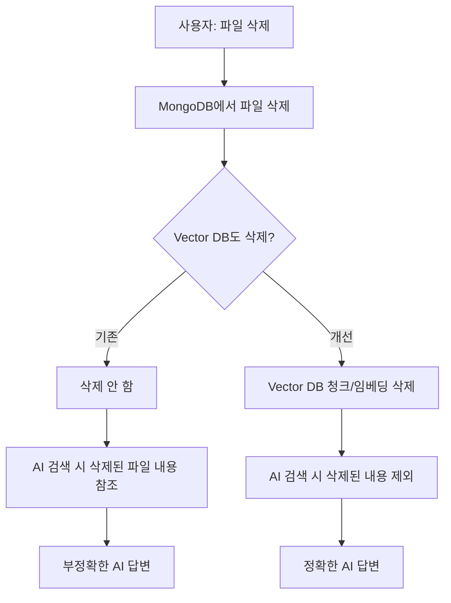
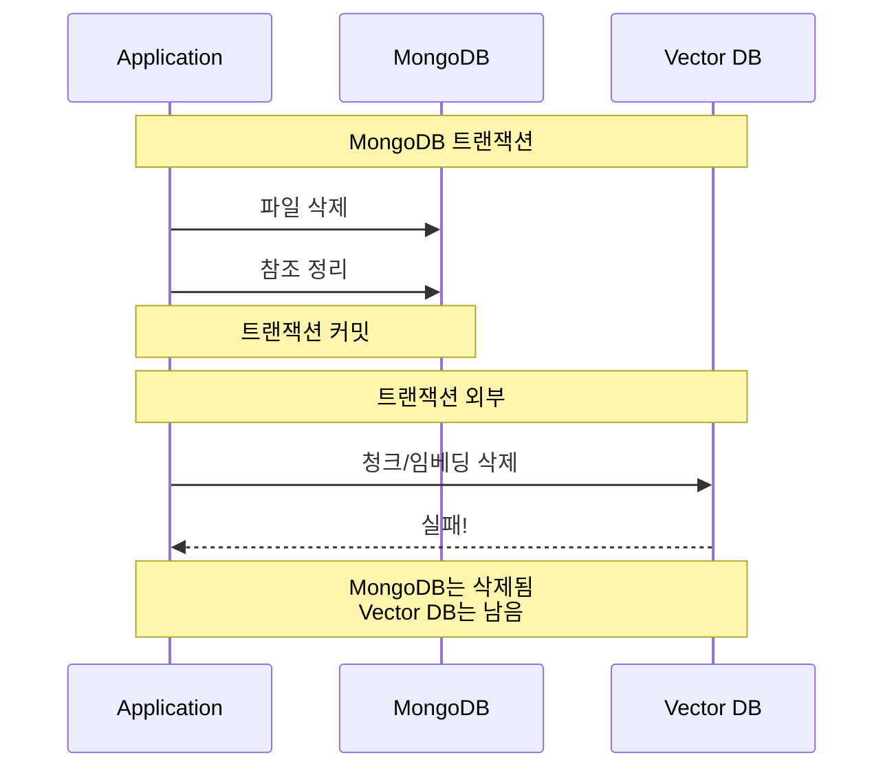
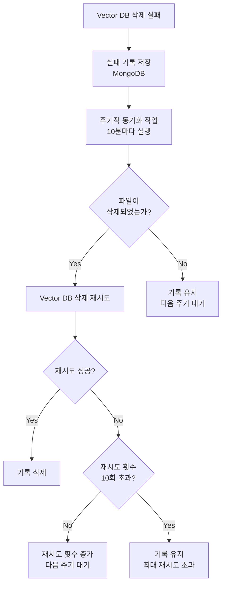

## 문제의 발견

AI 채팅 서비스 운영 중 이상한 버그 리포트가 들어왔다.

> "분명히 삭제한 파일인데, AI가 그 파일 내용을 계속 참조해요."

로그를 분석해보니 **고아 데이터(Orphaned Data)** 문제였다. MongoDB에서 파일을 삭제해도 Milvus Vector DB에는 해당 문서의 청크와 임베딩이 그대로 남아있었다.

## 왜 문제인가?

### 데이터 불일치로 인한 AI 답변 오염



### 영향받는 삭제 작업

| 삭제 대상 | 연관 Vector DB 데이터 |
|----------|---------------------|
| 파일 삭제 | 해당 파일의 청크/임베딩 |
| 에이전트 삭제 | 에이전트의 모든 파일 청크/임베딩 |
| 세션 삭제 | 세션의 모든 파일 청크/임베딩 |
| 사용자 삭제 | 사용자 소유 모든 파일 청크/임베딩 |

## 해결책: Vector DB Service 연동

### API 설계


```go
// Vector DB 삭제 요청/응답 구조
type VectorDBDeleteRequest struct {
    FileIDs []string `json:"file_ids"`
}

type VectorDBDeleteResponse struct {
    Status string `json:"status"`
    Result struct {
        DeleteCount int `json:"delete_count"`
        Cost        int `json:"cost"`
    } `json:"result"`
}
```


### 클라이언트 구현


```go
type VectorDBClient struct {
    baseURL    string
    httpClient *http.Client
    logger     logger.Logger
    retryCount int           // 재시도 횟수 (기본: 3)
    retryDelay time.Duration // 재시도 간격 (기본: 1초)
}

func (c *VectorDBClient) DeleteDocuments(ctx context.Context, fileIDs []string) error {
    if len(fileIDs) == 0 {
        return nil // 삭제할 파일이 없으면 성공으로 처리
    }

    // 재시도 로직 포함
    return c.deleteDocumentsWithRetry(ctx, fileIDs)
}
```


## 핵심 문제: 분산 트랜잭션

MongoDB 트랜잭션은 MongoDB 내부만 보장한다. Vector DB는 별도 서비스이므로 분산 트랜잭션이 불가능하다.



### 해결: 비동기 처리 + 재시도 메커니즘


```go
func (s *fileService) DeleteFile(ctx context.Context, fileID string) error {
    // Phase 1: MongoDB 트랜잭션
    _, err = session.WithTransaction(ctx, func(mongoCtx mongo.SessionContext) (any, error) {
        // 1. 에이전트/세션 컬렉션에서 파일 참조 제거
        if err := s.removeFileReferences(mongoCtx, fileID); err != nil {
            return nil, err
        }

        // 2. 파일 삭제
        if _, err := s.collection.DeleteOne(mongoCtx, bson.M{"_id": fileID}); err != nil {
            return nil, err
        }

        return nil, nil
    })

    if err != nil {
        return err  // MongoDB 실패 시 전체 실패
    }

    // Phase 2: Vector DB 삭제 (트랜잭션 외부, best effort)
    if s.vectorDBClient != nil {
        if err := s.vectorDBClient.DeleteDocuments(ctx, []string{fileID}); err != nil {
            s.logger.Warnf("failed to delete from vector db: %v", err)
            // 실패 기록 저장 (자동 동기화를 위해)
            s.RecordVectorDBDeletionFailure(ctx, fileID, err)
        }
    }

    return nil  // 파일 삭제는 성공
}
```


## 재시도 메커니즘

### 즉시 재시도 (3회)


```go
func (c *VectorDBClient) deleteDocumentsWithRetry(ctx context.Context, fileIDs []string) error {
    var lastErr error
    for i := 0; i < c.retryCount; i++ {
        err := c.deleteDocuments(ctx, fileIDs)
        if err == nil {
            c.logger.Infof("Successfully deleted documents on attempt %d", i+1)
            return nil
        }

        lastErr = err
        c.logger.Warnf("Vector db deletion attempt %d failed: %v", i+1, err)

        // 마지막 시도가 아니면 점진적 백오프
        if i < c.retryCount-1 {
            waitTime := time.Duration(i+1) * c.retryDelay
            time.Sleep(waitTime)
        }
    }

    return fmt.Errorf("failed after %d retries: %w", c.retryCount, lastErr)
}
```


### 비동기 재시도 (실패 기록 기반)




```go
// 실패 기록 저장
func (s *fileService) RecordVectorDBDeletionFailure(ctx context.Context, fileID string, err error) {
    failure := models.VectorDBDeletionFailure{
        FileID:     fileID,
        Error:      err.Error(),
        FailedAt:   time.Now(),
        Status:     "pending",
        RetryCount: 0,
    }
    s.failureCollection.InsertOne(ctx, failure)
}

// 주기적 동기화 (10분마다)
func (s *fileService) SyncVectorDBDeletions(ctx context.Context) {
    failures, _ := s.failureCollection.Find(ctx, bson.M{
        "status":      "pending",
        "retry_count": bson.M{"$lt": 10},
    })

    for failures.Next(ctx) {
        var failure models.VectorDBDeletionFailure
        failures.Decode(&failure)

        // 파일이 실제로 삭제되었는지 확인
        exists, _ := s.fileExists(ctx, failure.FileID)
        if exists {
            continue  // 파일이 아직 있으면 스킵
        }

        // Vector DB 삭제 재시도
        if err := s.vectorDBClient.DeleteDocuments(ctx, []string{failure.FileID}); err != nil {
            // 재시도 횟수 증가
            s.failureCollection.UpdateOne(ctx,
                bson.M{"_id": failure.ID},
                bson.M{"$inc": bson.M{"retry_count": 1}},
            )
        } else {
            // 성공 시 기록 삭제
            s.failureCollection.DeleteOne(ctx, bson.M{"_id": failure.ID})
        }
    }
}
```


## 리소스별 삭제 처리

### 에이전트 삭제


```go
func (s *agentService) DeleteAgent(ctx context.Context, agentID string) error {
    // 1. 에이전트 소유 파일 ID 수집
    agent, _ := s.GetAgent(ctx, agentID)
    fileIDs := agent.FileIds

    // 2. 관련 세션들의 파일 ID도 수집
    sessions, _ := s.sessionService.GetSessionsByAgent(ctx, agentID)
    for _, session := range sessions {
        fileIDs = append(fileIDs, session.FileIds...)
    }

    // 3. 에이전트 삭제 (MongoDB 트랜잭션)
    if err := s.deleteAgentDocuments(ctx, agentID); err != nil {
        return err
    }

    // 4. Vector DB에서 관련 문서 삭제
    if len(fileIDs) > 0 && s.vectorDBClient != nil {
        if err := s.vectorDBClient.DeleteDocuments(ctx, fileIDs); err != nil {
            s.logger.Warnf("failed to delete from vector db: %v", err)
            s.RecordVectorDBDeletionFailures(ctx, fileIDs, err)
        }
    }

    return nil
}
```


### 사용자 삭제


```go
func (s *userService) DeleteUser(ctx context.Context, userID string) error {
    // 1. 사용자 소유 파일 ID 수집 (에이전트/세션 포함)
    fileIDs := s.collectUserFileIDs(ctx, userID)

    // 2. 사용자 삭제 (트랜잭션)
    if err := s.deleteUserDocuments(ctx, userID); err != nil {
        return err
    }

    // 3. Vector DB에서 관련 문서 삭제
    if len(fileIDs) > 0 && s.vectorDBClient != nil {
        if err := s.vectorDBClient.DeleteDocuments(ctx, fileIDs); err != nil {
            s.logger.Warnf("failed to delete from vector db: %v", err)
            s.RecordVectorDBDeletionFailures(ctx, fileIDs, err)
        }
    }

    return nil
}
```


## 설정


```yaml
# config.yaml
services:
  vector_db:
    url: https://vectordb.example.com
    timeout: 60s
    sync_interval: 10m      # 동기화 주기
    max_retries: 10         # 최대 재시도 횟수
    cleanup_older_days: 30  # 오래된 실패 기록 정리 기간
```


## 왜 이렇게 설계했는가?

### 비동기 처리를 선택한 이유

| 방식 | 장점 | 단점 |
|-----|-----|-----|
| 동기식 (Vector DB 실패 시 롤백) | 완전한 일관성 | Vector DB 장애 시 파일 삭제 불가 |
| 비동기식 (best effort) | 높은 가용성 | 일시적 불일치 가능 |

**결론:** 사용자 경험을 위해 비동기 처리 선택. Vector DB 장애로 파일 삭제가 막히면 안 된다.

### 재시도 횟수가 10회인 이유

- 너무 적으면 일시적 장애 극복 불가
- 너무 많으면 영구적 문제를 반복 시도
- 10분마다 10회 = 약 100분간 복구 시도

## 결과

### 데이터 정합성 개선

| 지표 | Before | After |
|-----|--------|-------|
| 고아 Vector DB 문서 | 수천 건 | 0건 |
| AI 답변 오염 | 발생 | 없음 |
| 데이터 정합성 | 불일치 | 일치 |

### 로그 변화

**수정 전:**
```
[15:23:45] file deleted: file123
(Vector DB에 청크 남아있음)
```

**수정 후:**
```
[15:23:45] file deleted: file123
[15:23:45] vector db deletion successful: delete_count=15
```

## 배운 점

### 1. 분산 시스템에서 완전한 트랜잭션은 불가능

MongoDB 트랜잭션은 MongoDB 내부만 보장한다. 외부 시스템(Vector DB, Redis, MinIO)은 별도 처리가 필요하다.

### 2. Best Effort + 재시도 패턴


```go
// 핵심 패턴: 핵심 로직은 트랜잭션, 부가 로직은 best effort
if err := coreTransaction(); err != nil {
    return err  // 핵심 실패 시 전체 실패
}

if err := externalSystemCall(); err != nil {
    log.Warn(err)
    recordFailureForRetry(err)
    // 부가 실패는 로그만, 재시도로 해결
}
```


### 3. 점진적 백오프로 부하 분산


```go
// 1초, 2초, 3초 점진적 대기
waitTime := time.Duration(attempt+1) * baseDelay
time.Sleep(waitTime)
```


일시적 장애 시 급격한 재시도로 인한 추가 부하를 방지한다.

## 결론

Vector DB 문서 삭제 전략의 핵심:

1. **비동기 처리**: 외부 시스템 장애로 핵심 기능이 막히면 안 됨
2. **즉시 재시도**: 일시적 네트워크 오류 대응 (3회, 점진적 백오프)
3. **비동기 재시도**: 영구적 장애 대응 (10분마다, 최대 10회)
4. **실패 기록**: 데이터 정합성 추적 및 관리

**삭제된 파일의 유령이 AI 답변을 오염시키지 않도록, 모든 흔적을 완전히 정리하라.**
