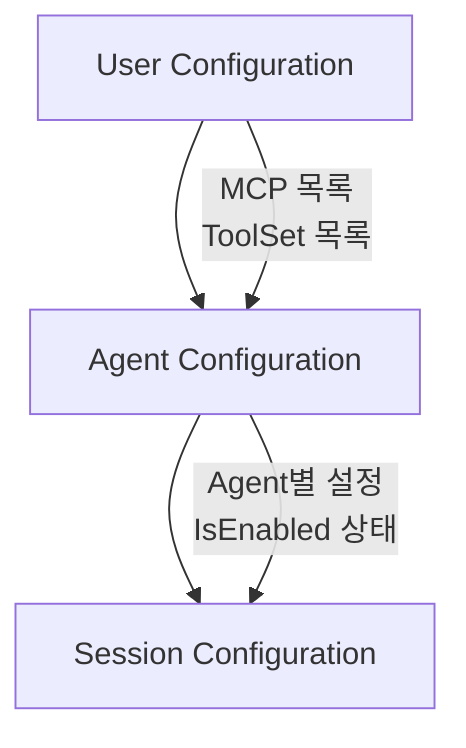
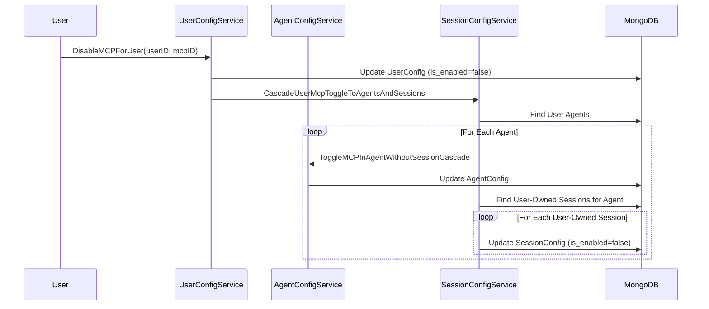

## 문제의 발견

AI 플랫폼에서 보안 이슈가 보고되었다.

> "관리자가 특정 MCP 서버를 Disable했는데, 기존 세션에서는 계속 사용할 수 있어요."

확인해보니 User 레벨에서 기능을 비활성화해도 **기존 Agent/Session에는 전파되지 않았다.** 이로 인해 보안 정책이 즉시 적용되지 않는 문제가 발생했다.

## Configuration 계층 구조

우리 시스템은 3단계 계층 구조를 가진다.



### 계층별 역할

| 계층 | 역할 | 예시 |
|-----|-----|-----|
| User | 사용 가능한 리소스 목록 | "MCP A, B, C 사용 가능" |
| Agent | 에이전트별 활성화 설정 | "이 Agent에서는 MCP A만 사용" |
| Session | 세션별 실제 사용 설정 | "이 대화에서 MCP A 활성화" |

## 동기화가 필요한 상황

### 1. Toggle (Enable/Disable)

User가 MCP를 Disable하면 **즉시** 모든 Agent와 Session에서도 Disable되어야 한다.


```go
// User: MCP Disable
DisableMCPForUser(userID, mcpID)

// 기대 결과:
// - 모든 Agent: IsEnabled = false
// - 모든 Session: IsEnabled = false
```


### 2. Remove

User가 MCP를 제거하면 모든 Agent와 Session에서도 제거되어야 한다.

### 3. Add (동기화 안 함)

User가 새로운 MCP를 추가해도 Agent/Session에는 **자동으로 추가되지 않는다.** 명시적으로 추가해야 한다.

**이유:** User Configuration은 "사용 가능한 목록"이고, Agent/Session은 "실제 사용할 목록"이므로 자동 추가는 부적절하다.

## 해결책: Cascade 동기화

### Toggle 전파 로직


```go
func (s *userConfigService) DisableMCPForUser(ctx context.Context, userID, mcpID string) error {
    // 1. User Configuration 업데이트
    if err := s.updateUserMCPStatus(ctx, userID, mcpID, false); err != nil {
        return err
    }

    // 2. Agent/Session에 Cascade 전파
    return s.sessionConfigService.CascadeUserMcpToggleToAgentsAndSessions(ctx, userID, mcpID, false)
}
```


### Cascade 구현


```go
func (s *sessionConfigService) CascadeUserMcpToggleToAgentsAndSessions(
    ctx context.Context,
    userID, mcpID string,
    isEnabled bool,
) error {
    // 1. User가 소유한 모든 Agent 조회
    agents, err := s.agentService.GetAgentsByOwner(ctx, userID)
    if err != nil {
        return err
    }

    for _, agent := range agents {
        // 2. 각 Agent의 Configuration 업데이트
        if err := s.ToggleMCPInAgentWithoutSessionCascade(ctx, agent.ID, mcpID, isEnabled); err != nil {
            s.logger.Warnf("failed to toggle agent %s: %v", agent.ID, err)
            continue  // 계속 진행
        }

        // 3. Agent에 속한 Session 중 User가 소유한 Session만 조회
        sessions, _ := s.sessionService.GetSessions(ctx, bson.M{
            "agent_id":   agent.ID,
            "created_by": userID,  // User가 만든 Session만
        })

        // 4. 각 Session의 Configuration 업데이트
        for _, session := range sessions {
            if err := s.ToggleMcpInSession(ctx, session.ID, mcpID, isEnabled); err != nil {
                s.logger.Warnf("failed to toggle session %s: %v", session.ID, err)
            }
        }
    }

    return nil
}
```


## 시퀀스 다이어그램



## 안전 장치

### 1. 무한 루프 방지 (Cascade Depth Limit)


```go
type CascadeContext struct {
    Depth    int
    MaxDepth int
    Source   string
}

func createCascadeContext(source string) *CascadeContext {
    return &CascadeContext{
        Depth:    0,
        MaxDepth: 3,  // User -> Agent -> Session (3단계 제한)
        Source:   source,
    }
}

func (c *CascadeContext) CanContinue() bool {
    return c.Depth < c.MaxDepth
}

func (c *CascadeContext) Increment() *CascadeContext {
    return &CascadeContext{
        Depth:    c.Depth + 1,
        MaxDepth: c.MaxDepth,
        Source:   c.Source,
    }
}
```


### 2. Redis 분산 락


```go
func (s *userConfigService) DisableMCPForUser(ctx context.Context, userID, mcpID string) error {
    // User 단위 락으로 동시 수정 방지
    lockKey := fmt.Sprintf("config:user:%s", userID)
    lock, err := s.redis.AcquireLock(ctx, lockKey, 30*time.Second)
    if err != nil {
        return fmt.Errorf("failed to acquire lock: %w", err)
    }
    defer lock.Release(ctx)

    // 동기화 로직...
}
```


### 3. MongoDB 트랜잭션


```go
func (s *sessionConfigService) syncSessionsForAgent(ctx context.Context, agentID string) error {
    session, _ := s.mongoDB.StartSession()
    defer session.EndSession(ctx)

    _, err := session.WithTransaction(ctx, func(mongoCtx mongo.SessionContext) (any, error) {
        // 여러 Session 업데이트를 트랜잭션으로 묶음
        for _, sessionID := range sessionIDs {
            if err := s.updateSessionConfig(mongoCtx, sessionID); err != nil {
                return nil, err
            }
        }
        return nil, nil
    })

    return err
}
```


## Toggle vs Remove vs Add

### 동작 비교

| 동작 | User | Agent | Session | 비고 |
|-----|------|-------|---------|-----|
| Toggle (Disable) | Disable | 강제 Disable | 강제 Disable | 보안상 즉시 전파 |
| Toggle (Enable) | Enable | 강제 Enable | 강제 Enable | 동일하게 전파 |
| Remove | 제거 | 제거 | 제거 | 모두 제거 |
| Add | 추가 | 추가 안 됨 | 추가 안 됨 | 명시적 추가 필요 |

### Add가 동기화되지 않는 이유


```go
func (s *userConfigService) EnableMCPForUser(ctx context.Context, userID, mcpID string) error {
    // User Configuration에 MCP 추가
    if err := s.addMCPToUser(ctx, userID, mcpID); err != nil {
        return err
    }

    // 새로 추가된 경우에는 동기화하지 않음
    // Agent/Session에 자동 추가되지 않음
    // 사용자가 명시적으로 Agent/Session에 추가해야 함

    return nil
}
```


**정책 결정:**
- User Configuration = "사용 가능한 리소스 목록"
- Agent/Session Configuration = "실제 사용할 리소스 목록"
- 새 리소스 추가 시 모든 Agent/Session에 자동 추가되면 의도하지 않은 동작 발생

## 성능 고려사항

### 시간 복잡도

- User Toggle: O(N × M) (N = Agent 수, M = 평균 Session 수)
- 최적화: 필요한 경우에만 DB 업데이트


```go
func (s *sessionConfigService) ToggleMcpInSession(ctx context.Context, sessionID, mcpID string, isEnabled bool) error {
    // 이미 같은 상태면 업데이트 스킵
    result, err := s.collection.UpdateOne(ctx,
        bson.M{
            "_id":                  sessionID,
            "mcp_config.mcp_id":    mcpID,
            "mcp_config.is_enabled": bson.M{"$ne": isEnabled},  // 다른 경우만
        },
        bson.M{"$set": bson.M{"mcp_config.$.is_enabled": isEnabled}},
    )

    if result.ModifiedCount == 0 {
        // 이미 같은 상태, 스킵
        return nil
    }

    return err
}
```


### 주의사항

대량의 Session을 가진 Agent의 경우 동기화 지연이 발생할 수 있다. 모니터링 필요.

## 사이드 이펙트 분석

### 안전한 변경

| 동작 | 영향 | 안전성 |
|-----|-----|-------|
| Remove 동기화 | User가 삭제한 항목이 하위에서도 삭제 | 안전 |
| Add 동기화 없음 | 기존 설정에 영향 없음 | 안전 |

### 주의 필요

| 동작 | 영향 | 주의사항 |
|-----|-----|---------|
| Toggle 강제 전파 | 모든 활성 세션에 즉시 반영 | 사용자 안내 필요 |


```
// UI 안내 메시지 예시
"이 변경사항은 모든 에이전트와 진행 중인 세션에 즉시 적용됩니다."
```


## 결과

### 보안 개선

| 지표 | Before | After |
|-----|--------|-------|
| 설정 전파 지연 | 수분~무한 | 즉시 |
| 보안 정책 적용 | 일부만 | 전체 |
| 데이터 일관성 | 불일치 | 일치 |

### 로그 변화

**수정 전:**
```
[15:23:45] User disabled MCP: mcp123
(Agent/Session에는 여전히 활성화)
```

**수정 후:**
```
[15:23:45] User disabled MCP: mcp123
[15:23:45] Cascading to 5 agents
[15:23:45] Cascading to 23 sessions
[15:23:46] Cascade complete: 28 configs updated
```

## 배운 점

### 1. 계층형 데이터는 동기화 전략이 필수


```go
// 단순 업데이트 (문제)
UpdateUserConfig(userID, config)  // 하위 계층에 전파 안 됨

// Cascade 업데이트 (해결)
UpdateUserConfig(userID, config)
CascadeToAgents(userID, config)
CascadeToSessions(userID, config)
```


### 2. 무한 루프 방지 필수


```go
// Depth 제한으로 무한 루프 방지
if cascadeCtx.Depth >= cascadeCtx.MaxDepth {
    return nil  // 더 이상 전파하지 않음
}
```


### 3. Add와 Remove의 비대칭 동기화

- **Remove:** 상위에서 제거되면 하위에서도 제거 (일관성)
- **Add:** 상위에 추가해도 하위에 자동 추가 안 함 (명시적 제어)

이 비대칭이 의도적인 설계임을 문서화해야 한다.

## 결론

계층형 Configuration 동기화의 핵심:

1. **Toggle 강제 전파:** 보안상 즉시 전파 필요
2. **Remove 동기화:** 일관성 유지
3. **Add 동기화 없음:** 명시적 제어 보장
4. **안전 장치:** Depth 제한, 분산 락, 트랜잭션

**설정 변경은 단순한 업데이트가 아니다. 계층 구조를 따라 전파되는 이벤트다.**
