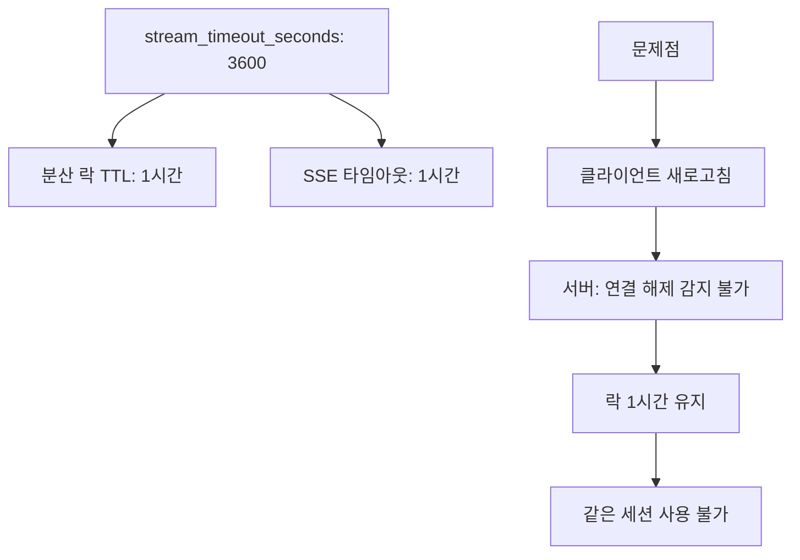
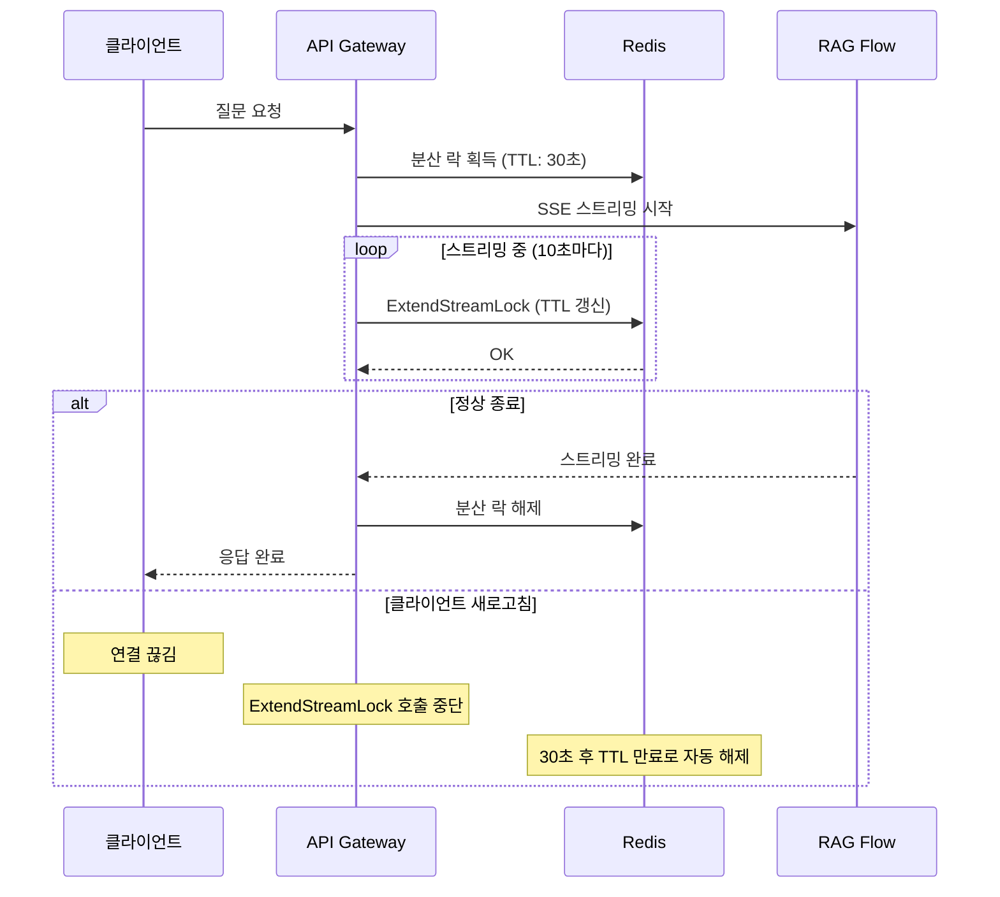

## 문제의 발견

AI 채팅 서비스에서 답답한 버그 리포트가 들어왔다.

> "채팅 중에 새로고침했더니 '에이전트 사용중'이라고 나와요. 1시간 동안 못 써요."

로그를 확인해보니 분산 락의 TTL이 **1시간**으로 설정되어 있었다. 클라이언트가 새로고침해도 서버에서는 알 수 없어서 락이 1시간 동안 유지되고 있었다.

## 왜 1시간이었는가?



**초기 설계의 의도:**
- RAG Flow 응답이 최대 1시간까지 걸릴 수 있음
- 스트리밍 타임아웃과 락 TTL을 동일하게 설정

**문제점:**
- RAG Flow SSE 연결은 **서버→클라이언트 단방향**
- 클라이언트가 연결을 끊어도 서버에서 감지 불가
- 락이 1시간 동안 유지되어 같은 세션 재사용 불가

## 해결책: TTL 단축 + 자동 갱신

### 핵심 아이디어


```
기존: TTL 1시간 (고정)
개선: TTL 30초 + 스트리밍 중 10초마다 갱신
```


정상적인 스트리밍 중에는 락이 계속 갱신되고, 클라이언트가 사라지면 30초 후 자동 해제된다.

### 설정 변경


```yaml
# config.yaml
connection:
  sse:
    stream_timeout_seconds: 3600           # RAG Flow 응답 대기 최대 시간 (1시간)
    distributed_lock_ttl_seconds: 30       # 분산 락 TTL (30초)
    lock_extend_interval_seconds: 10       # 분산 락 갱신 주기 (10초)
```


### 시퀀스 다이어그램



## 구현

### 락 갱신 메서드


```go
func (s *chatService) ExtendStreamLock(ctx context.Context, sessionID string) error {
    lockKey := fmt.Sprintf("stream_lock:%s", sessionID)
    ttl := time.Duration(s.config.Connection.SSE.DistributedLockTTL) * time.Second

    // EXPIRE 명령으로 TTL 갱신
    return s.redis.Expire(ctx, lockKey, ttl).Err()
}
```


### 자동 갱신 고루틴


```go
func (s *sseService) startLockExtender(ctx context.Context, sessionID string, stopChan chan struct{}) {
    interval := time.Duration(s.config.Connection.SSE.LockExtendInterval) * time.Second
    ticker := time.NewTicker(interval)
    defer ticker.Stop()

    for {
        select {
        case <-stopChan:
            // 스트리밍 종료
            return
        case <-ctx.Done():
            // 컨텍스트 취소
            return
        case <-ticker.C:
            // 10초마다 TTL 갱신
            if err := s.lockExtender(ctx, sessionID); err != nil {
                s.logger.Warnf("failed to extend lock: %v", err)
            }
        }
    }
}
```


### SSE 스트리밍에 통합


```go
func (s *sseService) ProcessSSEStream(ctx context.Context, sessionID string, ...) error {
    // 락 갱신 고루틴 시작
    stopExtender := make(chan struct{})
    go s.startLockExtender(ctx, sessionID, stopExtender)
    defer close(stopExtender)  // 스트리밍 종료 시 갱신 중단

    // SSE 스트리밍 처리
    for {
        select {
        case line := <-lineChan:
            // 메시지 처리
        case err := <-errChan:
            if errors.Is(err, io.EOF) {
                return nil  // 정상 종료
            }
            return err
        case <-ctx.Done():
            return ctx.Err()
        }
    }
}
```


## 멀티 탭 문제

### 추가로 발견된 문제

> "탭1에서 세션A, 탭2에서 세션B를 열면 탭1이 이상해져요."

`ActiveSessionManager`가 **사용자당 하나의 활성 세션만** 인식하고 있었다.


```go
// 문제 코드: 사용자당 하나의 세션만
func (m *ActiveSessionManager) IsActiveSession(userID, sessionID string) bool {
    activeSession, exists := m.activeSessions[userID]
    if !exists {
        return true
    }
    return activeSession == sessionID  // 마지막 세션만 활성
}
```


### 해결: 연결별 활성 세션 관리


```go
// 수정 후: 연결(탭)별 활성 세션
func (m *ActiveSessionManager) IsActiveSession(connectionID, sessionID string) bool {
    activeSession, exists := m.activeSessions[connectionID]
    if !exists {
        return true  // 하위 호환성
    }
    return activeSession == sessionID
}
```


각 WebSocket 연결(탭)마다 독립적인 활성 세션을 관리한다.

## TTL 값 선택 근거

### 왜 30초인가?

| TTL | 장점 | 단점 |
|-----|-----|-----|
| 5초 | 빠른 복구 | 네트워크 지연 시 락 만료 위험 |
| 30초 | 안전 마진 + 빠른 복구 | - |
| 60초 | 충분한 안전 마진 | 복구 대기 시간 길어짐 |
| 1시간 | - | 복구 불가 수준 |

### 왜 10초 갱신인가?


```
TTL: 30초
갱신 주기: 10초
안전 마진: 30 - 10 = 20초
```


- 네트워크 지연이 최대 20초까지 발생해도 락 만료 없음
- Redis 호출 빈도가 너무 높지 않음 (10초당 1회)

### 권장 설정

| 환경 | TTL | 갱신 주기 | 비고 |
|-----|-----|----------|-----|
| 일반 | 30초 | 10초 | 기본 권장값 |
| 불안정 네트워크 | 60초 | 20초 | 지연 대비 |

## 고려했지만 채택하지 않은 방안

### 1. 클라이언트 연결 상태 감지 (ctx.Done())


```go
// 시도했지만 효과 없음
select {
case <-ctx.Done():
    // 클라이언트 연결 해제 감지?
}
```


**문제:** RAG Flow SSE 연결은 서버→클라이언트 단방향이라 클라이언트 상태를 감지할 수 없다.

### 2. 분산 락 TTL 0초 (락 없음)

**문제:**
- 동일 세션에 동시 요청 시 중복 스트리밍 발생
- 메시지 순서 보장 불가

### 3. Heartbeat 기반 감지

**문제:**
- 클라이언트 구현 필요
- SSE 단방향 특성상 클라이언트→서버 통신 불가

## 결과

### 성능 영향

| 항목 | 영향 |
|-----|-----|
| Redis 호출 증가 | 스트리밍 중 10초마다 EXPIRE 1회 (경미) |
| 메모리 사용 | 고루틴 1개 추가 (무시 가능) |
| CPU 사용 | Ticker 1개 추가 (무시 가능) |

### 사용자 경험 개선

| 지표 | Before | After |
|-----|--------|-------|
| 새로고침 후 대기 시간 | 최대 1시간 | 최대 30초 |
| 멀티 탭 지원 | 불가 | 가능 |

### 로그 변화

**수정 전:**
```
[15:23:45] Client refreshed
[15:23:45] Lock still held: 59m remaining
[15:23:45] Error: Agent is busy
```

**수정 후:**
```
[15:23:45] Client refreshed
[15:23:45] Lock extend stopped
[15:24:15] Lock expired (30s TTL)
[15:24:16] New request accepted
```

## 배운 점

### 1. TTL은 "최악의 상황"을 기준으로 설정하지 마라


```
// 안티패턴: 최악의 경우(1시간 스트리밍)에 맞춤
lockTTL = streamTimeout  // 1시간

// 올바른 패턴: 짧은 TTL + 자동 갱신
lockTTL = 30s
extendInterval = 10s
```


### 2. 자동 갱신 패턴


```go
// 패턴: 짧은 TTL + 주기적 갱신
func keepAlive(ctx context.Context, resource string) {
    ticker := time.NewTicker(extendInterval)
    defer ticker.Stop()

    for {
        select {
        case <-ctx.Done():
            return  // 컨텍스트 취소 시 갱신 중단 → TTL 만료
        case <-ticker.C:
            extend(resource)  // TTL 갱신
        }
    }
}
```


### 3. 단방향 연결의 한계 인식

SSE는 서버→클라이언트 단방향이다. 클라이언트 상태를 감지하려면:
- 양방향 통신 (WebSocket) 사용
- 또는 짧은 TTL + 자동 갱신 (이 방식)

## 결론

분산 락 TTL 최적화의 핵심:

1. **짧은 TTL:** 1시간 → 30초로 단축
2. **자동 갱신:** 10초마다 TTL 연장
3. **우아한 종료:** 정상 종료 시 즉시 해제, 비정상 종료 시 TTL 만료

**락은 "보유하는 동안만" 유효해야 한다. 소유자가 사라지면 빠르게 해제되어야 한다.**
