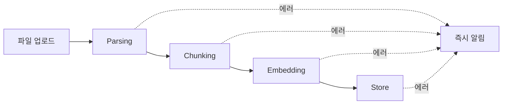
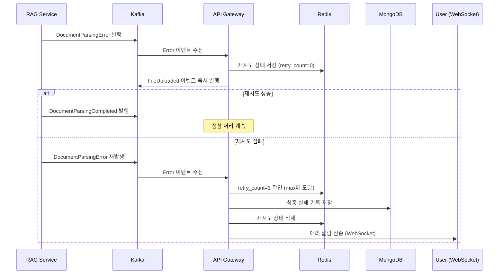

## 문제의 발견

AI 플랫폼에서 문서 업로드 실패 알림이 급증했다.

> "파일 업로드했는데 바로 에러가 나요. 다시 올리면 되는데 매번 그래요."

로그를 분석해보니 대부분 **일시적 네트워크 장애**였다. RAG Flow 서비스가 잠깐 불안정해도 즉시 에러 알림이 전송되고 있었다.

## 기존 에러 처리의 문제

### 문서 처리 파이프라인



### 문제점

| 에러 타입 | 원인 | 기존 처리 |
|----------|-----|----------|
| Parsing Error | 일시적 네트워크 장애 | 즉시 에러 알림 |
| Chunking Error | RAG Flow 일시적 과부하 | 즉시 에러 알림 |
| Embedding Error | 외부 API 타임아웃 | 즉시 에러 알림 |
| Store Error | Milvus 일시적 장애 | 즉시 에러 알림 |

**결과:** 재시도하면 성공할 수 있는 에러도 즉시 사용자에게 알림 → 불필요한 UX 저하

## 해결책: 자동 재시도 메커니즘

### 핵심 아이디어


```
기존: 에러 발생 → 즉시 알림
개선: 에러 발생 → 자동 재시도 → 최종 실패 시에만 알림
```


### 재시도 흐름



## 설계

### 단계별 이전 이벤트 매핑

재시도 시 파이프라인을 재개하기 위해 **이전 단계의 완료 이벤트**를 발행한다.

| 에러 이벤트 | 이전 단계 Completed 이벤트 |
|------------|---------------------------|
| `DocumentParsingError` | `FileUploaded` |
| `DocumentChunkingError` | `DocumentParsingCompleted` |
| `DocumentEmbeddingError` | `DocumentChunkingCompleted` |
| `DocumentStoreError` | `DocumentEmbeddingCompleted` |


```go
// 에러 이벤트 -> 이전 단계 completed 이벤트 매핑
var DocumentErrorToRetryEventMapping = map[RagEventType]RagEventType{
    DocumentParsingError:    FileUploaded,
    DocumentChunkingError:   DocumentParsingCompleted,
    DocumentEmbeddingError:  DocumentChunkingCompleted,
    DocumentStoreError:      DocumentEmbeddingCompleted,
}
```


### Redis 상태 저장 구조


```go
// Redis Key: doc:retry:{file_id}:{event_type}
// 예시: doc:retry:file123:document_parsing_error

type DocRetryState struct {
    FileID        string           `json:"file_id"`
    UserID        string           `json:"user_id"`
    EventType     string           `json:"event_type"`
    RetryCount    int              `json:"retry_count"`
    CreatedAt     string           `json:"created_at"`
    LastRetryAt   string           `json:"last_retry_at"`
    PreviousStage string           `json:"previous_stage"`
    Errors        []DocRetryError  `json:"errors,omitempty"`
    OriginalEvent *RagEventMessage `json:"original_event,omitempty"`
}
```


### 설정


```yaml
# config.yaml
document_retry:
  redis_key_prefix: "doc:retry:"  # Redis 키 prefix
  redis_ttl_hours: 24             # Redis TTL (시간 단위)
  max_retry_count: 1              # 최대 재시도 횟수
```


## 구현

### 에러 핸들러


```go
func (s *kafkaService) handleDocumentProcessingError(services *services.Services, event *models.RagEventMessage) error {
    // 1. Redis에서 재시도 상태 조회
    state, err := s.getRetryState(event.FileID, event.EventType)

    if err != nil || state == nil {
        // 2a. 첫 번째 에러: 재시도 상태 생성 및 즉시 재시도
        state = s.createInitialRetryState(event)
        if err := s.saveRetryState(state); err != nil {
            return s.handleErrorEventFallback(services, event, err)
        }
        return s.executeRetry(state)
    }

    // 2b. 이미 재시도 중인 경우
    if state.RetryCount < s.config.DocumentRetry.MaxRetryCount {
        // 3. 재시도 횟수 증가 및 재시도 실행
        state.RetryCount++
        state.Errors = append(state.Errors, DocRetryError{
            Attempt:      state.RetryCount,
            ErrorMessage: event.ErrorMessage,
            Timestamp:    time.Now().Format(time.RFC3339),
        })
        s.saveRetryState(state)
        return s.executeRetry(state)
    }

    // 4. 최대 재시도 횟수 도달: 최종 실패 처리
    return s.handleFinalFailure(services, state, event)
}
```


### 재시도 실행


```go
func (s *kafkaService) executeRetry(state *DocRetryState) error {
    // 이전 단계 completed 이벤트 타입 조회
    previousEventType, ok := models.DocumentErrorToRetryEventMapping[state.EventType]
    if !ok {
        return fmt.Errorf("unknown event type: %s", state.EventType)
    }

    // 이전 단계 completed 이벤트 발행
    return s.publishPreviousStageEvent(state, previousEventType)
}

func (s *kafkaService) publishPreviousStageEvent(state *DocRetryState, eventType models.RagEventType) error {
    event := &models.RagEventMessage{
        EventType: eventType,
        FileID:    state.FileID,
        UserID:    state.UserID,
        // OriginalEvent에서 필요한 정보 복사
    }

    return s.kafkaProducer.Publish(ctx, event)
}
```


### 최종 실패 처리


```go
func (s *kafkaService) handleFinalFailure(services *services.Services, state *DocRetryState, event *models.RagEventMessage) error {
    // 1. MongoDB에 최종 실패 기록 저장
    failure := &models.DocumentProcessingFailure{
        ID:             uuid.New().String(),
        FileID:         state.FileID,
        UserID:         state.UserID,
        EventType:      state.EventType,
        RetryCount:     state.RetryCount,
        Errors:         state.Errors,
        CreatedAt:      time.Now(),
        FinalFailureAt: time.Now(),
    }
    if err := s.saveFailureToMongoDB(failure); err != nil {
        s.logger.Errorf("failed to save failure record: %v", err)
    }

    // 2. Redis 재시도 상태 삭제
    s.deleteRetryState(state.FileID, state.EventType)

    // 3. 사용자에게 에러 알림 전송
    return s.sendErrorNotification(services, event)
}
```


### 처리 중인 파일 조회


```go
func (s *kafkaService) GetProcessingFiles(ctx context.Context, userID string) ([]ProcessingFile, error) {
    // Redis에서 재시도 중인 파일 목록 조회
    pattern := fmt.Sprintf("%s*", s.config.DocumentRetry.RedisKeyPrefix)
    keys, err := s.redis.Keys(ctx, pattern).Result()
    if err != nil {
        return nil, err
    }

    var files []ProcessingFile
    for _, key := range keys {
        state, _ := s.getRetryStateByKey(key)
        if state != nil && state.UserID == userID {
            files = append(files, ProcessingFile{
                FileID:         state.FileID,
                CurrentStage:   getStageFromEventType(state.EventType),
                RetryCount:     state.RetryCount,
                MaxRetry:       s.config.DocumentRetry.MaxRetryCount,
                RemainingRetry: s.config.DocumentRetry.MaxRetryCount - state.RetryCount,
            })
        }
    }

    return files, nil
}
```


## 채팅 시 처리 중 파일 안내

재시도 중인 파일이 있을 때 채팅 요청 시 사용자에게 알린다.


```go
func (s *chatService) HandleChat(ctx context.Context, userID, sessionID, message string) (*ChatResponse, error) {
    // 처리 중인 파일 확인
    processingFiles, _ := s.kafkaService.GetProcessingFiles(ctx, userID)

    if len(processingFiles) > 0 {
        return &ChatResponse{
            Status:          "processing",
            ProcessingFiles: processingFiles,
            Message:         "일부 파일이 처리 중입니다. 잠시 후 다시 시도해주세요.",
        }, nil
    }

    // 정상 채팅 처리
    return s.processChat(ctx, userID, sessionID, message)
}
```


## 왜 즉시 재시도인가?

### 고려했던 대안

| 방식 | 장점 | 단점 |
|-----|-----|-----|
| 스케줄러 (주기적 재시도) | 부하 분산 | 지연 발생, 복잡도 증가 |
| 지수 백오프 | 안정적 | 지연 발생 |
| 즉시 재시도 | 빠른 복구 | 부하 집중 가능 |

### 즉시 재시도를 선택한 이유

1. **사용자 경험:** 재시도 지연 없이 빠른 복구
2. **단순성:** 스케줄러 없이 이벤트 기반 처리
3. **일시적 장애 대응:** 네트워크 순간 장애는 즉시 재시도로 해결 가능

## 사이드 이펙트 분석

### 성능 영향

| 항목 | 영향 |
|-----|-----|
| Redis 메모리 | 재시도 중인 파일당 ~1KB |
| MongoDB 쓰기 | 최종 실패 시에만 발생 |
| Kafka 메시지 | 재시도 시 이전 단계 이벤트 1회 추가 |

### 주의 필요한 부분


```
RAG 서비스의 Idempotency 보장 필요
- 동일 파일에 대해 여러 번 이벤트가 발행될 수 있음
- RAG 서비스가 중복 이벤트를 안전하게 처리해야 함
```


## 결과

### 에러 알림 감소

| 지표 | Before | After |
|-----|--------|-------|
| 일시적 에러 알림 | 100% | 0% |
| 최종 실패 알림만 | 0% | 100% |
| 사용자 재업로드 횟수 | 많음 | 감소 |

### 로그 변화

**수정 전:**
```
[15:23:45] DocumentParsingError: file123
[15:23:45] Sending error notification to user
```

**수정 후:**
```
[15:23:45] DocumentParsingError: file123
[15:23:45] Retry attempt 1 for file123
[15:23:45] Publishing FileUploaded event for retry
[15:23:46] DocumentParsingCompleted: file123
[15:23:46] Retry successful, deleting retry state
```

## 배운 점

### 1. 에러는 즉시 알리지 마라


```go
// 안티패턴: 즉시 에러 알림
if err != nil {
    notifyUser(err)
}

// 올바른 패턴: 재시도 후 최종 실패 시에만 알림
if err != nil {
    if canRetry(err) {
        scheduleRetry(err)
        return
    }
    notifyUser(err)
}
```


### 2. 이벤트 기반 재시도


```go
// 패턴: 이전 단계 이벤트 재발행
// Parsing 에러 → FileUploaded 이벤트 재발행 → 파이프라인 재개
previousEvent := errorToRetryMapping[errorEvent]
publish(previousEvent)
```


### 3. 상태 추적의 중요성

Redis에 재시도 상태를 저장하여:
- 재시도 횟수 추적
- 에러 히스토리 기록
- 처리 중인 파일 목록 제공

## 결론

문서 처리 재시도 메커니즘의 핵심:

1. **즉시 재시도:** 일시적 장애 빠르게 복구
2. **이벤트 재발행:** 이전 단계 completed 이벤트로 파이프라인 재개
3. **최종 실패 시에만 알림:** 불필요한 에러 알림 감소
4. **상태 추적:** Redis로 재시도 상태 관리

**사용자에게 알림을 보내기 전에 먼저 해결을 시도하라.**
