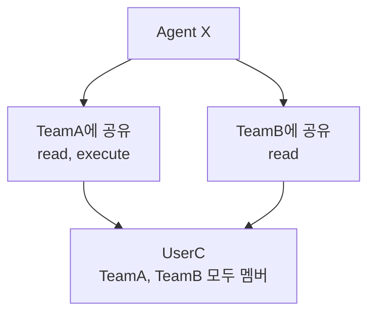
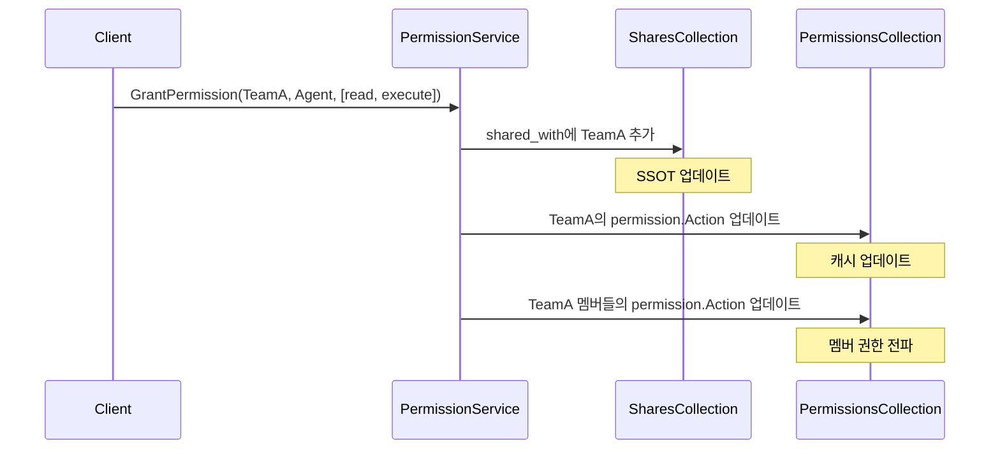
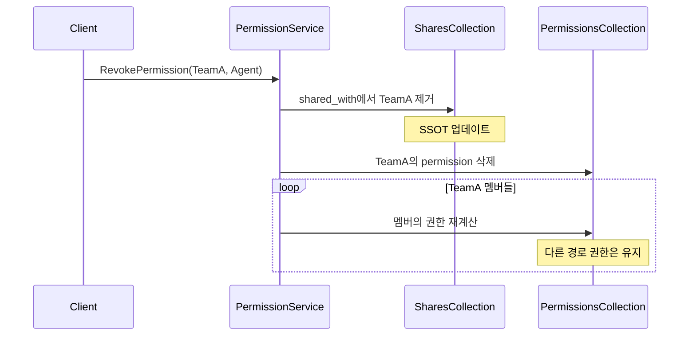

## 문제의 발견

복잡한 권한 버그가 지속적으로 보고되었다.

> "TeamA 멤버인데 리소스 접근이 안 돼요."
> "팀에서 나갔다가 다시 들어왔더니 권한이 사라졌어요."
> "같은 리소스인데 탭마다 권한이 다르게 보여요."

원인을 분석하니 **다중 경로 권한 문제**였다.

## 다중 경로 권한 문제

### 시나리오



UserC는 TeamA와 TeamB를 통해 **두 경로**로 Agent X에 대한 권한을 받는다.

### 기존 시스템의 문제


```go
// 기존 방식: Permission.Action[]에 직접 저장
type Permission struct {
    Subject    Subject   // UserC
    Resource   string    // agent
    ResourceID string    // Agent X
    Action     []Action  // ["read", "execute"]  ← 어디서 온 권한인지 모름
}
```


**문제점:**
1. TeamA 공유 해제 시 TeamB에서 받은 `read` 권한도 함께 삭제
2. 권한의 출처(Source)를 추적할 수 없음
3. 멤버십 변경 시 권한 재계산이 불가능

## 해결책: Shares-Based SSOT

### 핵심 아이디어


```
┌─────────────────────────────────────────────────────────────────┐
│                     SSOT (Single Source of Truth)                │
│                                                                   │
│   shares.shared_with[].permissions  ◀── 진실의 원천 (SSOT)       │
│   shares.shared_with[].shared_by    ◀── 공유자 추적 (SSOT)       │
│                     │                                             │
│                     ▼                                             │
│           Permission.Action  ◀── 캐시 (shares에서 계산됨)        │
│                                                                   │
└─────────────────────────────────────────────────────────────────┘
```


**원칙:**
- `shares.shared_with[].permissions`가 권한의 유일한 진실
- `Permission.Action`은 빠른 조회를 위한 캐시
- shares 변경 시 Permission.Action 자동 재계산

### 데이터 모델


```go
// Share 구조체 (SSOT)
type Share struct {
    ID           string         `bson:"_id"`
    ResourceID   string         `bson:"resource_id"`
    ResourceType string         `bson:"resource_type"`
    SharedWith   []ShareSubject `bson:"shared_with"`    // ◀ SSOT
    CreatedAt    time.Time      `bson:"created_at"`
    UpdatedAt    time.Time      `bson:"updated_at"`
}

type ShareSubject struct {
    Type        SubjectType `bson:"type"`              // user, team, organization
    ID          string      `bson:"id"`
    TargetName  string      `bson:"target_name"`
    Permissions []Action    `bson:"permissions"`       // ◀ 권한의 진실
    SharedBy    Subject     `bson:"shared_by"`         // 공유한 주체
    SharedAt    time.Time   `bson:"shared_at"`
    ExpiresAt   *time.Time  `bson:"expires_at"`        // 만료 시점
}

// Permission 구조체 (캐시)
type Permission struct {
    ID         string     `bson:"_id"`
    Subject    Subject    `bson:"subject"`
    Resource   Resource   `bson:"resource"`
    ResourceID string     `bson:"resource_id"`
    Action     []Action   `bson:"action"`         // ◀ 캐시 (shares에서 계산)
    CreatedAt  time.Time  `bson:"created_at"`
    UpdatedAt  time.Time  `bson:"updated_at"`
    ExpiresAt  *time.Time `bson:"expires_at"`
}
```


### MongoDB 예시


```json
// shares 컬렉션 (SSOT)
{
  "_id": "share-abc123",
  "resource_id": "agent-xyz789",
  "resource_type": "agent",
  "shared_with": [
    {
      "type": "team",
      "id": "team-alpha",
      "target_name": "개발팀",
      "permissions": ["read", "execute"],
      "shared_by": { "type": "user", "id": "owner-001" },
      "shared_at": "2026-01-02T15:30:00Z"
    },
    {
      "type": "team",
      "id": "team-beta",
      "target_name": "QA팀",
      "permissions": ["read"],
      "shared_by": { "type": "user", "id": "owner-001" },
      "shared_at": "2026-01-03T10:00:00Z"
    }
  ]
}

// permissions 컬렉션 (캐시) - UserC가 TeamA, TeamB 모두 멤버인 경우
{
  "_id": "perm-001",
  "subject": { "type": "user", "id": "user-c" },
  "resource": "agent",
  "resource_id": "agent-xyz789",
  "action": ["read", "execute"]  // 합집합
}
```


## 권한 흐름

### 권한 부여 (Grant)



### 권한 확인 (HasPermission)


```go
func HasPermission(subject Subject, resource string, actions []Action, resourceID string) bool {
    // 1. 캐시 확인 (Permission.Action)
    if hasDirectPermission(subject, resource, actions, resourceID) {
        return true
    }

    // 2. 팀 권한 확인 (사용자인 경우)
    if subject.Type == "user" {
        teams := getUserTeams(subject.ID)
        for _, team := range teams {
            if hasTeamPermission(team, resource, actions, resourceID) {
                return true
            }
        }
    }

    // 3. 조직 권한 확인
    if subject.Type == "user" {
        orgs := getUserOrganizations(subject.ID)
        for _, org := range orgs {
            if hasOrgPermission(org, resource, actions, resourceID) {
                return true
            }
        }
    }

    // 4. 소유자 확인
    if isOwner(subject, resourceID) {
        return true
    }

    return false
}
```


### 권한 해제 (Revoke)



## Source 기반 권한 해제

### 핵심: 다른 경로 권한 보존


```
시나리오: TeamA 공유 해제, TeamB 공유는 유지

Before:
  shared_with: [
    { type: "team", id: "TeamA", permissions: ["read", "execute"] },
    { type: "team", id: "TeamB", permissions: ["read"] }
  ]
  UserC(TeamA, TeamB 멤버)의 permission.Action: ["read", "execute"]

RevokePermission 호출:
  source: { type: "team", id: "TeamA" }

After:
  shared_with: [
    { type: "team", id: "TeamB", permissions: ["read"] }
  ]
  UserC의 permission.Action: ["read"]  // TeamB 권한만 남음
```



```go
func (s *permissionService) RevokePermissionFromSource(
    ctx context.Context,
    subject Subject,
    resource string,
    resourceID string,
    source Subject,
) error {
    // 1. shares에서 source 제거
    err := s.removeFromSharedWith(ctx, resourceID, source)
    if err != nil {
        return err
    }

    // 2. subject의 권한 재계산 (다른 경로 확인)
    newActions := s.calculateActionsFromAllSources(ctx, subject, resource, resourceID)

    if len(newActions) == 0 {
        // 모든 경로가 사라진 경우: permission 삭제
        return s.deletePermission(ctx, subject, resource, resourceID)
    }

    // 일부 권한만 남은 경우: 업데이트
    return s.updatePermissionActions(ctx, subject, resource, resourceID, newActions)
}
```


## 특수 시나리오

### 팀 멤버 추가/제거


```go
// 팀에 새 멤버 추가
func (s *teamService) AddMember(ctx context.Context, teamID, userID string) error {
    // 1. 팀 멤버로 추가
    err := s.addMemberToTeam(ctx, teamID, userID)
    if err != nil {
        return err
    }

    // 2. 팀이 가진 모든 리소스 권한을 새 멤버에게 전파
    teamShares, _ := s.getSharesBySubject(ctx, Subject{Type: "team", ID: teamID})
    for _, share := range teamShares {
        for _, sw := range share.SharedWith {
            if sw.ID == teamID {
                // 팀의 권한을 새 멤버에게 전파
                s.grantPermissionToUser(ctx, userID, share.ResourceType, share.ResourceID, sw.Permissions)
            }
        }
    }

    return nil
}

// 팀에서 멤버 제거
func (s *teamService) RemoveMember(ctx context.Context, teamID, userID string) error {
    // 1. 팀 멤버에서 제거
    err := s.removeMemberFromTeam(ctx, teamID, userID)
    if err != nil {
        return err
    }

    // 2. 해당 팀에서 받은 권한 재계산 (다른 경로 유지)
    return s.recalculateUserPermissionsFromTeam(ctx, userID, teamID)
}
```


### 권한 충돌 해결


```
규칙: 권한은 항상 합집합으로 계산 (가장 관대한 권한 적용)

User가 Agent를 TeamA에 [read]로, TeamB에 [read, execute]로 공유
UserC는 TeamA, TeamB 모두의 멤버

shares.shared_with:
  - { type: "team", id: "TeamA", permissions: ["read"] }
  - { type: "team", id: "TeamB", permissions: ["read", "execute"] }

UserC의 permission.Action: ["read", "execute"]  // 합집합
```


## 아키텍처 진화

| 버전 | 방식 | 문제점 |
|-----|-----|-------|
| v1 | `Permission.Action[]` 직접 저장 | 다중 경로 권한 추적 불가 |
| v2 | `Permission.GrantSources[]` 추가 | 복잡성 증가, 불일치 발생 |
| v3 | Shares-Based SSOT | 현재 사용 중 |

### v3의 장점

1. **단일 진실의 원천:** shares가 권한의 유일한 진실
2. **추적 가능성:** 누가, 언제, 어떤 권한을 부여했는지 기록
3. **재계산 가능:** shares를 기반으로 언제든 권한 재계산 가능
4. **캐시 무효화:** shares 변경 시 permission 캐시 갱신

## 해결된 이슈 요약

### 핵심 버그 수정 (Phase 1)

| 문제 | 해결 방안 |
|-----|---------|
| Multi-path Permission 손실 | Source 기반 Revoke |
| 멤버십 변경 시 권한 손실 | shares에서 권한 재계산 |
| 팀 삭제 시 권한 미회수 | Cascade 권한 회수 |
| 계정 삭제 시 권한 미회수 | cleanupUserShareChains 패턴 |

### 성능 개선 (Phase 3)

| 문제 | 해결 방안 |
|-----|---------|
| HasPermission N+1 쿼리 | PermissionContext 패턴 |
| GetResourcesActionsBatch O(n×m) | $in 연산자 일괄 쿼리 |
| grantActionsToGroupMembers 개별 호출 | BulkWrite 병렬 실행 |

## 배운 점

### 1. SSOT 원칙의 중요성


```go
// 안티패턴: 두 곳에서 진실 관리
shares.shared_with[].permissions = ["read", "execute"]
permission.Action = ["read"]  // 불일치!

// 올바른 패턴: 하나의 진실 + 캐시
shares.shared_with[].permissions = ["read", "execute"]  // SSOT
permission.Action = calculateFromShares()               // 캐시
```


### 2. 권한 출처 추적의 필요성


```go
// 안티패턴: 출처 없이 권한만 저장
permission.Action = ["read", "execute"]

// 올바른 패턴: 출처와 함께 저장
share.SharedWith = [
    {Type: "team", ID: "TeamA", Permissions: ["read", "execute"], SharedBy: ownerSubject},
    {Type: "team", ID: "TeamB", Permissions: ["read"], SharedBy: ownerSubject},
]
```


### 3. 합집합 권한 계산


```go
// 다중 경로 권한 계산
func calculateFinalPermissions(sources []ShareSubject) []Action {
    actionSet := make(map[Action]bool)
    for _, source := range sources {
        for _, action := range source.Permissions {
            actionSet[action] = true
        }
    }
    return setToSlice(actionSet)  // 합집합
}
```


## 결론

Shares-Based SSOT 권한 시스템의 핵심:

1. **단일 진실의 원천:** `shares.shared_with[].permissions`
2. **캐시로서의 Permission:** 빠른 조회를 위한 계산된 결과
3. **출처 추적:** 누가, 언제, 어떤 권한을 부여했는지 기록
4. **합집합 권한:** 다중 경로 시 가장 관대한 권한 적용

**권한은 "누가 갖고 있는가"보다 "어디서 왔는가"가 더 중요하다.**
