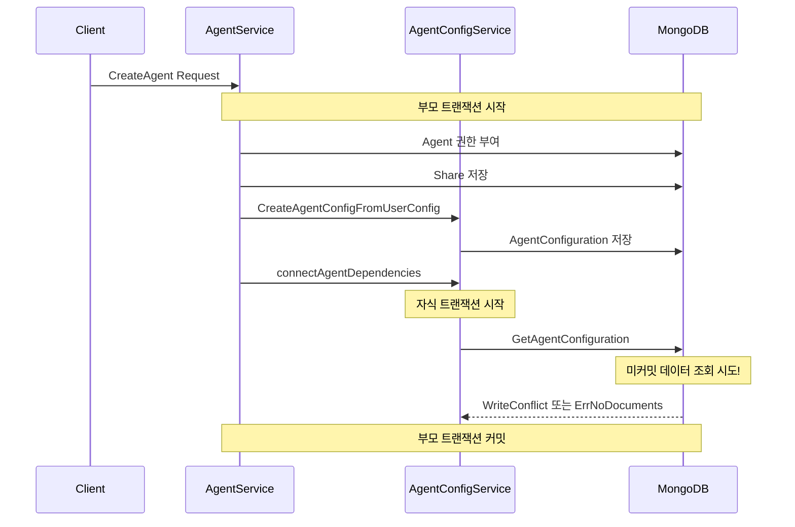
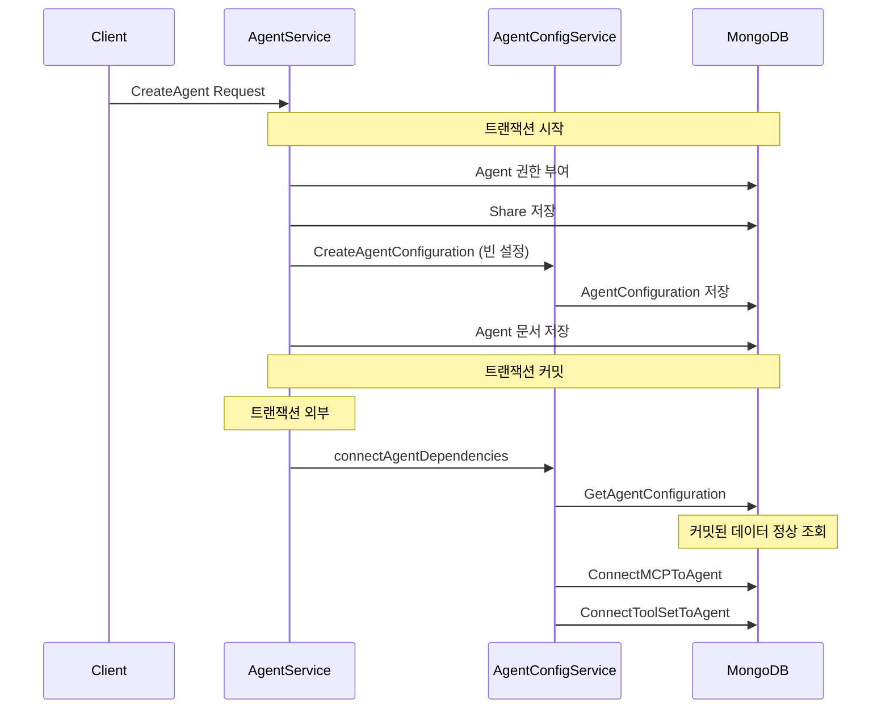

## 문제의 발견

Agent 생성 API에서 간헐적으로 이상한 에러가 발생했다.

```
WriteConflict: this operation conflicted with another operation
```

로그를 분석해보니 **트랜잭션 격리 문제**였다. 부모 트랜잭션 내부에서 자식 트랜잭션이 시작되어, 아직 커밋되지 않은 데이터를 조회하려다 충돌이 발생하고 있었다.

## 문제 상황 분석

### 기존 구조



### 왜 문제가 발생하는가?


```go
// 문제 코드
_, err = session.WithTransaction(ctx, func(mongoCtx mongo.SessionContext) (any, error) {
    // ... 권한 부여, Share 저장 ...

    // 1. AgentConfiguration 생성 (부모 트랜잭션 내부)
    _, err = s.services.AgentConfiguration.CreateAgentConfigurationFromUserConfig(mongoCtx, user, agentID)

    // 2. Agent 문서 저장
    _, err = s.collection.InsertOne(mongoCtx, newAgent)

    // 3. MCP/ToolSet 연결 (별도 트랜잭션 시작!)
    if err := s.connectAgentDependencies(mongoCtx, agentID, request, user); err != nil {
        return nil, err
    }

    return nil, nil
})
```


**문제점:**
1. `CreateAgentConfigurationFromUserConfig`가 AgentConfiguration을 생성하지만 **아직 커밋 안 됨**
2. `connectAgentDependencies` 내부에서 **별도 트랜잭션** 시작
3. 자식 트랜잭션이 `GetAgentConfiguration` 호출
4. 부모 트랜잭션이 커밋되지 않아 **데이터가 보이지 않음**
5. `ErrNoDocuments` 발생 → 자동 생성 시도 → **WriteConflict**

## 해결책: 트랜잭션 외부에서 의존성 연결

### 변경된 구조



### 구현


```go
// 수정된 코드
_, err = session.WithTransaction(ctx, func(mongoCtx mongo.SessionContext) (any, error) {
    // ... 권한 부여, Share 저장 ...

    // 1. 빈 AgentConfiguration 생성 (트랜잭션 내부)
    _, err = s.services.AgentConfiguration.CreateAgentConfiguration(mongoCtx, agentID)
    if err != nil {
        return nil, customErrors.Wrap("failed to create agent configuration", err)
    }

    // 2. Agent 문서 저장
    _, err = s.collection.InsertOne(mongoCtx, newAgent)
    if err != nil {
        return nil, customErrors.Wrap("failed to insert agent", err)
    }

    return nil, nil
})

// 3. 트랜잭션 커밋 후 의존성 연결
if err := s.connectAgentDependencies(ctx, agentID, request, user); err != nil {
    // Agent는 생성됨, 의존성 연결만 실패
    s.logger.Warnf("failed to connect dependencies for agent %s: %v", agentID, err)
    return &newAgent, customErrors.Wrap("agent created but some dependencies failed", err)
}
```


## 자동 생성 로직 제거

### 기존 문제


```go
// 문제: GetAgentConfiguration에서 자동 생성
func (s *agentConfigService) GetAgentConfiguration(ctx context.Context, agentID string) (*models.AgentConfiguration, error) {
    var config models.AgentConfiguration
    err := s.collection.FindOne(ctx, bson.M{"agent_id": agentID}).Decode(&config)
    if err != nil {
        if err == mongo.ErrNoDocuments {
            // 없으면 자동 생성 → 트랜잭션 충돌 원인!
            createdConfig, createErr := s.CreateAgentConfiguration(ctx, agentID)
            if createErr != nil {
                return nil, createErr
            }
            return createdConfig, nil
        }
        return nil, err
    }
    return &config, nil
}
```


### 해결: 명시적 생성만 허용


```go
// 수정: 자동 생성 제거
func (s *agentConfigService) GetAgentConfiguration(ctx context.Context, agentID string) (*models.AgentConfiguration, error) {
    var config models.AgentConfiguration
    err := s.collection.FindOne(ctx, bson.M{"agent_id": agentID}).Decode(&config)
    if err != nil {
        if err == mongo.ErrNoDocuments {
            // 명시적 에러 반환, 자동 생성 안 함
            return nil, customErrors.New(customErrors.ErrNotFound,
                fmt.Sprintf("agent configuration not found for agent: %s", agentID), nil)
        }
        return nil, customErrors.New(customErrors.ErrDatabase,
            fmt.Sprintf("failed to get agent configuration for agent: %s", agentID), err)
    }
    return &config, nil
}
```


## 의존성 연결 실패 처리

### 설계 결정

**질문:** 의존성 연결 실패 시 Agent를 롤백해야 하나?

**결정:** Agent는 유지하고, 에러만 반환한다.

**이유:**
1. Agent는 이미 트랜잭션으로 생성됨
2. MCP/ToolSet 연결은 나중에 수동으로 가능
3. 일부 연결 실패로 전체 생성이 막히면 UX 저하


```go
func (s *agentService) connectAgentDependencies(ctx context.Context, agentID string, request *models.CreateAgentRequest, user *auth.UserClaims) error {
    var connectionErrors []string

    // MCP 연결 시도
    for _, mcpID := range request.McpServerIds {
        if err := s.connectMCPToAgent(ctx, agentID, mcpID, user); err != nil {
            connectionErrors = append(connectionErrors, fmt.Sprintf("MCP %s: %v", mcpID, err))
        }
    }

    // ToolSet 연결 시도
    for _, toolSetID := range request.ToolSetIds {
        if err := s.connectToolSetToAgent(ctx, agentID, toolSetID, user); err != nil {
            connectionErrors = append(connectionErrors, fmt.Sprintf("ToolSet %s: %v", toolSetID, err))
        }
    }

    // SubAgent 연결 시도
    for _, subAgentID := range request.SubAgentIds {
        if err := s.connectSubAgentToAgent(ctx, agentID, subAgentID, user); err != nil {
            connectionErrors = append(connectionErrors, fmt.Sprintf("SubAgent %s: %v", subAgentID, err))
        }
    }

    if len(connectionErrors) > 0 {
        return fmt.Errorf("some dependencies failed to connect: %v", connectionErrors)
    }

    return nil
}
```


## MongoDB 트랜잭션 격리 레벨

### Snapshot Isolation

MongoDB는 **Snapshot Isolation**을 사용한다.


```
트랜잭션 T1 시작 → 스냅샷 S1 생성
                 │
                 ▼
        T1은 S1만 볼 수 있음
        T1 내부에서 생성한 데이터도 T1 내에서는 보임
                 │
                 ▼
        하지만 다른 트랜잭션 T2는 T1의 미커밋 데이터를 볼 수 없음
```


### 중첩 트랜잭션의 함정


```go
// 함정: MongoDB는 진정한 중첩 트랜잭션을 지원하지 않음
session.WithTransaction(ctx, func(mongoCtx) {
    // 부모 트랜잭션 T1

    // 이 내부에서 또 트랜잭션을 시작하면?
    innerSession.WithTransaction(ctx, func(innerCtx) {
        // 자식 트랜잭션 T2
        // T1의 미커밋 데이터를 볼 수 없음!
    })
})
```


## 트랜잭션 설계 패턴

### 패턴 1: 트랜잭션 범위 최소화


```go
// 핵심 데이터만 트랜잭션으로 보호
_, err = session.WithTransaction(ctx, func(mongoCtx) {
    // 원자적으로 처리해야 하는 핵심 로직만
    createCoreData(mongoCtx)
    return nil, nil
})

// 부가 작업은 트랜잭션 외부에서
if err == nil {
    connectDependencies(ctx)  // 실패해도 핵심 데이터는 유지
}
```


### 패턴 2: 단계적 커밋


```go
// 단계 1: 핵심 데이터 생성 (트랜잭션)
agent, err := createAgentWithTransaction(ctx, request)
if err != nil {
    return nil, err
}

// 단계 2: 의존성 연결 (트랜잭션 외부)
if err := connectDependencies(ctx, agent.ID); err != nil {
    // Agent는 생성됨, 연결만 실패
    log.Warn("dependencies connection failed", err)
}

return agent, nil
```


### 패턴 3: 명시적 생성 vs 암묵적 생성


```go
// 안티패턴: 조회 시 자동 생성 (예측 불가능)
func Get(id string) (*Data, error) {
    data, err := find(id)
    if err == ErrNotFound {
        return create(id)  // 암묵적 생성
    }
    return data, err
}

// 올바른 패턴: 명시적 생성만 허용
func Get(id string) (*Data, error) {
    data, err := find(id)
    if err == ErrNotFound {
        return nil, ErrNotFound  // 명시적 에러 반환
    }
    return data, err
}

func Create(id string) (*Data, error) {
    return create(id)  // 명시적 생성
}
```


## 결과

### 성능 개선

| 지표 | Before | After |
|-----|--------|-------|
| WriteConflict 발생률 | 약 5% | 0% |
| Agent 생성 재시도 | 빈번 | 없음 |
| 트랜잭션 시간 | 길음 | 짧음 |

### 코드 품질 개선

| 항목 | Before | After |
|-----|--------|-------|
| 에러 메시지 | 불일치 | 정확함 |
| 동작 예측 가능성 | 낮음 | 높음 |
| 디버깅 용이성 | 어려움 | 쉬움 |

## 배운 점

### 1. 트랜잭션 내부에서 다른 트랜잭션 시작하지 마라


```go
// 안티패턴
session.WithTransaction(ctx, func(mongoCtx) {
    anotherSession.WithTransaction(ctx, func(innerCtx) {
        // 부모의 미커밋 데이터 볼 수 없음
    })
})

// 올바른 패턴
session.WithTransaction(ctx, func(mongoCtx) {
    // 모든 작업을 같은 트랜잭션에서
})
// 또는
session.WithTransaction(ctx, func(mongoCtx) { /* 핵심 */ })
anotherWork(ctx)  // 트랜잭션 외부에서
```


### 2. 자동 생성 로직은 위험하다


```go
// 위험: 조회 실패 시 자동 생성
if err == ErrNotFound {
    return create(id)
}

// 안전: 명시적 에러 반환
if err == ErrNotFound {
    return nil, ErrNotFound
}
```


### 3. 의존성 연결 실패는 전체 실패가 아니다


```go
// Agent 생성 성공 후 의존성 연결 실패
// → Agent는 유지, 에러만 반환
// → 사용자가 나중에 수동으로 연결 가능
```


## 결론

중첩 트랜잭션 격리 문제 해결의 핵심:

1. **트랜잭션 범위 최소화:** 핵심 데이터만 트랜잭션으로 보호
2. **의존성 연결은 트랜잭션 외부:** 커밋된 데이터에 대해 작업
3. **자동 생성 로직 제거:** 명시적 생성만 허용
4. **부분 실패 허용:** 핵심 성공 + 부가 실패 → 전체 실패 아님

**트랜잭션은 원자성을 보장하지만, 중첩되면 격리성을 위협한다.**
