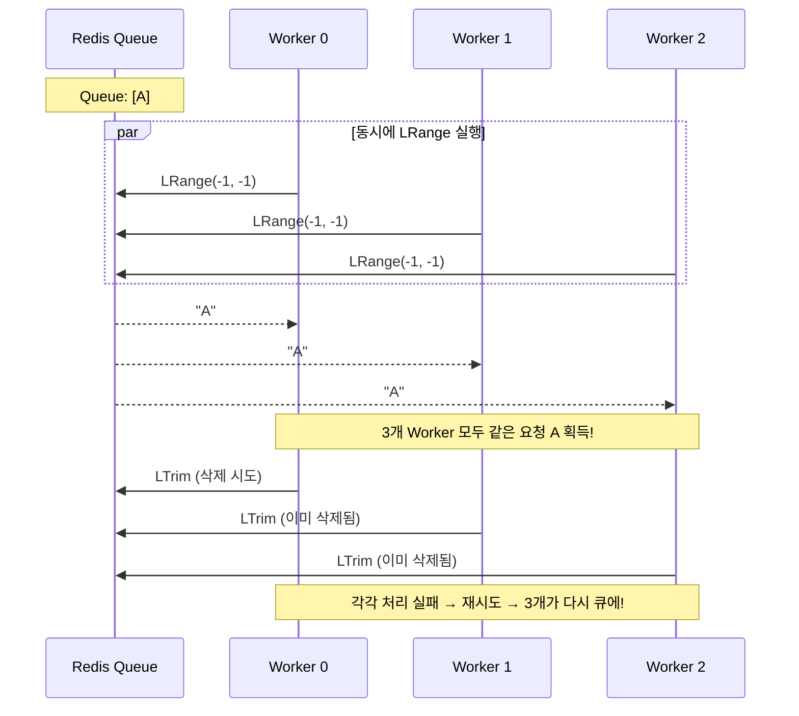
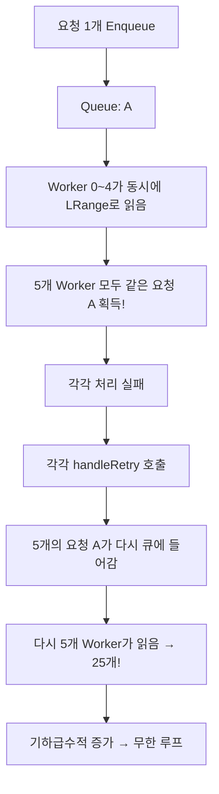
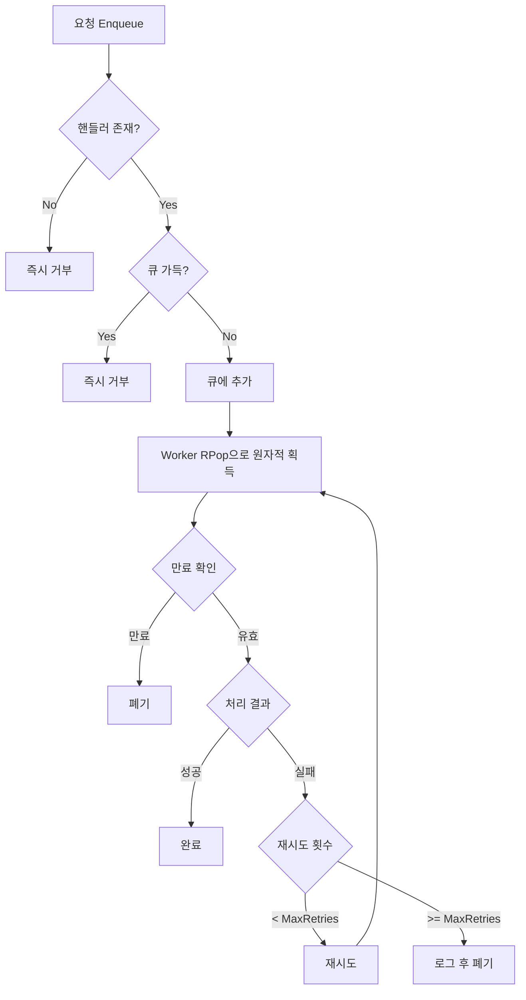

## 문제의 발견

운영 환경에서 Redis 메모리 분석 중 충격적인 결과를 발견했다.

```bash
$ redis-cli --bigkeys
Biggest list found "lock_queue:dead_letter" has 2236660 items
```

**223만 6,660건**의 데이터가 Dead Letter Queue에 쌓여 있었다. 분명히 재처리 로직도 있고, 정리 로직도 있는데 왜 이렇게 쌓였을까?

## 근본 원인: Race Condition

로그를 분석해보니 **비원자적 Dequeue 연산**이 문제였다.

### 기존 코드의 문제


```go
func (s *lockQueueService) popFromQueue(queueKey string) (string, error) {
    // 1. LRange로 읽기 (여러 Worker가 동시에 같은 값 읽음!)
    data, err := s.cache.LRange(queueKey, -1, -1)

    // ⚠️ 이 사이에 다른 Worker도 같은 값을 읽음!

    // 2. LTrim으로 삭제 (너무 늦음!)
    s.cache.LTrim(queueKey, 0, length-2)

    return data[0], nil  // 모든 Worker가 같은 요청 반환!
}
```


### Race Condition 흐름



### 기하급수적 증가



**문제 요약:**
1. **비원자적 Dequeue:** `LRange + LTrim` 사이에 Race Condition 발생
2. **요청 복제:** 1개 요청이 5개, 25개, 125개... 기하급수적 증가
3. **Dead Letter 무한 축적:** 최대 재시도 후 Dead Letter로 이동 → 223만 건

## 해결책: 원자적 연산 + Dead Letter 제거

### 1. RPop 원자적 연산


```go
// Before: 비원자적 (Race Condition)
func (s *lockQueueService) popFromQueue(queueKey string) (string, error) {
    data, err := s.cache.LRange(queueKey, -1, -1)
    // ⚠️ Race Condition 발생 지점
    s.cache.LTrim(queueKey, 0, length-2)
    return data[0], nil
}

// After: 원자적
func (s *lockQueueService) popFromQueue(queueKey string) (string, error) {
    // RPop은 원자적으로 읽기+삭제를 수행
    // 한 Worker가 가져가면 다른 Worker는 다음 요청을 가져감
    return s.cache.RPop(queueKey)
}
```


### 2. Dead Letter Queue 완전 제거


```go
// Before: Dead Letter로 이동 (무한 축적!)
func (w *lockQueueWorker) handleDeadLetter(ctx context.Context, request *models.LockQueueRequest) {
    _ = w.service.cache.LPush(models.LockQueueKeyDeadLetter, string(data))
}

// After: 로그만 남기고 폐기
func (w *lockQueueWorker) handleFinalFailure(ctx context.Context, request *models.LockQueueRequest) {
    request.Status = models.LockQueueStatusFailed
    _ = w.service.saveRequestStatus(ctx, request)
    // Dead Letter 없음 - 로그만 남기고 폐기
    w.service.logger.Warnf("Request %s failed permanently after %d retries: %s",
        request.ID, request.RetryCount, request.Error)
}
```


**Dead Letter 제거 이유:**
- Dead Letter에 쌓인 요청은 대부분 재처리해도 같은 결과 (데이터 문제 등)
- 수동 재처리는 운영 부담, 실제로 거의 안 함
- 무한 축적의 근본 원인

### 3. 추가 안전 장치

#### 메인 큐 크기 제한 (백프레셔)


```go
if s.config.MainQueueMaxSize > 0 {
    totalQueueLen := s.getTotalQueueLength()
    if totalQueueLen >= s.config.MainQueueMaxSize {
        return "", customErrors.New(customErrors.ErrRateLimitExceeded,
            fmt.Sprintf("queue is full (current: %d, max: %d)",
                totalQueueLen, s.config.MainQueueMaxSize), nil)
    }
}
```


#### 요청 만료 메커니즘 (RequestTTL)


```go
if w.service.config.RequestTTL > 0 {
    expiresAt := request.CreatedAt.Add(w.service.config.RequestTTL)
    if time.Now().After(expiresAt) {
        // 만료된 요청은 처리하지 않고 폐기
        request.Status = models.LockQueueStatusFailed
        request.Error = fmt.Sprintf("request expired after %s", w.service.config.RequestTTL)
        return
    }
}
```


#### 핸들러 검증 (Fail-fast)


```go
if !s.HasHandler(request.OperationType) {
    return "", customErrors.New(customErrors.ErrValidation,
        fmt.Sprintf("no handler registered for operation type: %s", request.OperationType), nil)
}
```


## 전체 보호 장치



## 설정값

| 설정 | 기본값 | 설명 |
|-----|--------|-----|
| `MainQueueMaxSize` | 100,000 | 메인 큐 최대 크기 (초과 시 Enqueue 거부) |
| `RequestTTL` | 30분 | 요청 만료 시간 (만료 시 폐기) |
| `MaxRetries` | 3 | 최대 재시도 횟수 |
| `RetryDelay` | 500ms | 재시도 간격 |

## 운영 조치


```bash
# 기존 Dead Letter 큐 정리 (한 번만 실행)
redis-cli DEL lock_queue:dead_letter

# 메인 큐 정리 (복제된 요청 제거)
redis-cli DEL lock_queue:main
redis-cli DEL lock_queue:priority:high
redis-cli DEL lock_queue:priority:medium
```


## Redis Cluster 호환성

| 항목 | 상태 | 설명 |
|-----|-----|-----|
| RPop | ✅ | 단일 키 원자적 연산, Cluster 완벽 지원 |
| LPush | ✅ | 단일 키 연산, Cluster 완벽 지원 |
| LLen | ✅ | 단일 키 연산, Cluster 완벽 지원 |
| 트랜잭션 | ✅ | 사용 안 함, 크로스 슬롯 문제 없음 |

## 결과

### 개선 효과

| 지표 | Before | After |
|-----|--------|-------|
| Dead Letter 축적 | 223만 건 | 0건 |
| 요청 복제 | 기하급수적 증가 | 없음 |
| Redis 메모리 | 수 GB | 정상 |

### 로그 변화

**수정 전:**
```
[15:23:45] Request A dequeued by Worker 0
[15:23:45] Request A dequeued by Worker 1
[15:23:45] Request A dequeued by Worker 2
[15:23:46] Request A failed, retrying...
[15:23:46] Request A failed, retrying...
[15:23:46] Request A failed, retrying...
(무한 반복)
```

**수정 후:**
```
[15:23:45] Request A dequeued by Worker 0
[15:23:46] Request A completed successfully
```

## 배운 점

### 1. Redis 복합 연산은 원자성을 보장하지 않는다


```go
// 안티패턴: 두 연산 사이에 Race Condition
data := redis.LRange(key, -1, -1)
redis.LTrim(key, 0, len-2)

// 올바른 패턴: 원자적 연산 사용
data := redis.RPop(key)
```


### 2. Dead Letter Queue는 문제를 숨긴다


```go
// 안티패턴: 실패하면 Dead Letter로 이동
if err != nil {
    deadLetterQueue.Push(request)  // 나중에 처리... 언제?
}

// 올바른 패턴: 실패하면 로그 후 폐기
if err != nil {
    logger.Error("Request failed permanently", request)
    // 모니터링 알림 설정
}
```


### 3. 백프레셔는 필수다

큐가 무한정 커지도록 두면 안 된다. 시스템이 처리할 수 있는 한계를 설정하고, 초과 시 요청을 거부해야 한다.


```go
if queueLen >= maxSize {
    return ErrRateLimitExceeded  // 빠른 실패
}
```


## 결론

Redis Lock Queue 안정성 개선의 핵심:

1. **원자적 연산:** `LRange + LTrim` → `RPop`
2. **Dead Letter 제거:** 무한 축적 원인 제거
3. **백프레셔:** 큐 크기 제한으로 과부하 방지
4. **요청 만료:** 오래된 요청 자동 폐기

**복합 연산의 원자성은 스스로 보장해야 한다. Redis가 알아서 해주지 않는다.**
