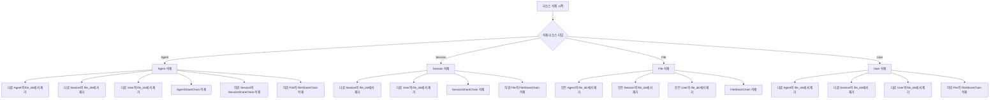
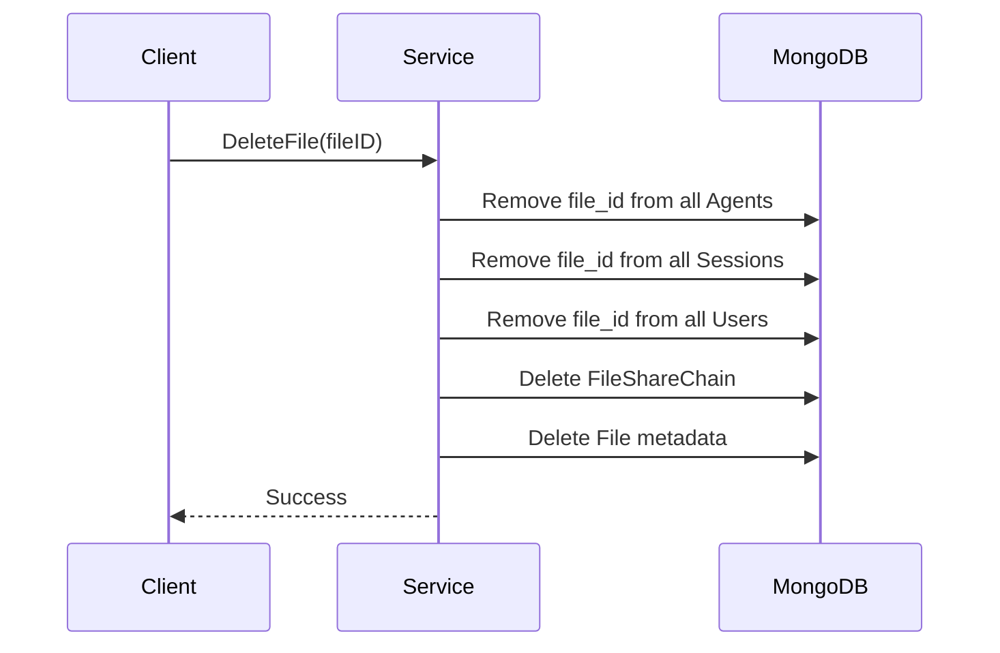

## 문제의 발견

데이터 정합성 검사 중 이상한 패턴을 발견했다.

> "삭제된 파일 ID가 Agent, Session, User의 file_ids 배열에 남아있어요."

확인해보니 리소스 삭제 시 **자기 자신만 삭제**하고, 다른 컬렉션에서 참조하는 `file_ids` 배열은 정리하지 않고 있었다.

## 문제 상황

### 데이터 구조


```go
// Agent, Session, User 모두 file_ids 배열을 가짐
type Agent struct {
    ID      string   `bson:"_id"`
    FileIDs []string `bson:"file_ids"`  // 참조하는 파일들
}

type Session struct {
    ID      string   `bson:"_id"`
    FileIDs []string `bson:"file_ids"`  // 참조하는 파일들
}

type User struct {
    ID      string   `bson:"_id"`
    FileIDs []string `bson:"file_ids"`  // 사용자 bucket의 파일들
}
```


### 누락된 정리 작업

| 삭제 대상 | 정리 안 됨 |
|----------|-----------|
| Agent 삭제 | 다른 Agent, Session, User의 `file_ids`에서 미제거 |
| Session 삭제 | 다른 Session, User의 `file_ids`에서 미제거 |
| File 삭제 | Agent, Session, User의 `file_ids`에서 미제거 |
| User 삭제 | 다른 User의 `file_ids`에서 미제거 |

### Share Chain 누락

| 삭제 대상 | 정리 안 됨 |
|----------|-----------|
| Agent 삭제 | `agent_share_chains` 컬렉션에서 미삭제 |
| Session 삭제 | `session_share_chains` 컬렉션에서 미삭제 |
| File 삭제 | `file_share_chains` 컬렉션에서 일부 경로 미삭제 |

## 영향

1. **데이터 무결성 문제:** 존재하지 않는 파일 ID 참조
2. **저장 공간 낭비:** 불필요한 참조 데이터 누적
3. **쿼리 성능 저하:** 존재하지 않는 리소스 조회 시도
4. **예상치 못한 에러:** Orphaned Data로 인한 런타임 에러

## 해결책: 완전한 Cascade 정리

### 삭제 경로별 정리 로직



## 구현

### Helper 함수


```go
// 모든 Agent에서 파일 ID 제거
func (s *fileService) removeFileFromAgents(ctx context.Context, fileID string) error {
    _, err := s.services.MongoDB.Collection(models.CollAgents).UpdateMany(ctx,
        bson.M{"file_ids": fileID},
        bson.M{"$pull": bson.M{"file_ids": fileID}},
    )
    return err
}

// 모든 Session에서 파일 ID 제거
func (s *fileService) removeFileFromSessions(ctx context.Context, fileID string) error {
    _, err := s.services.MongoDB.Collection(models.CollSessions).UpdateMany(ctx,
        bson.M{"file_ids": fileID},
        bson.M{"$pull": bson.M{"file_ids": fileID}},
    )
    return err
}

// 모든 User에서 파일 ID 제거
func (s *fileService) removeFileFromUsers(ctx context.Context, fileID string) error {
    _, err := s.services.MongoDB.Collection(models.CollUsers).UpdateMany(ctx,
        bson.M{"file_ids": fileID},
        bson.M{"$pull": bson.M{"file_ids": fileID}},
    )
    return err
}

// 여러 파일 ID를 한 번에 Session에서 제거 (배치 처리)
func (s *fileService) removeFilesFromSessions(ctx context.Context, fileIDs []string) error {
    if len(fileIDs) == 0 {
        return nil
    }
    _, err := s.services.MongoDB.Collection(models.CollSessions).UpdateMany(ctx,
        bson.M{"file_ids": bson.M{"$in": fileIDs}},
        bson.M{"$pullAll": bson.M{"file_ids": fileIDs}},
    )
    return err
}
```


### DeleteFile 개선


```go
func (s *fileService) DeleteFile(ctx context.Context, fileID string) error {
    // 1. 모든 컬렉션에서 파일 참조 제거
    if err := s.removeFileReferences(ctx, fileID); err != nil {
        s.logger.Warnf("failed to remove file references: %v", err)
        // 경고만 남기고 계속 진행
    }

    // 2. FileShareChain 삭제
    if _, err := s.services.MongoDB.Collection(models.CollFileShareChains).DeleteMany(ctx, bson.M{
        "file_id": fileID,
    }); err != nil && err != mongo.ErrNoDocuments {
        s.logger.Warnf("failed to delete file share chains: %v", err)
    }

    // 3. 파일 메타데이터 삭제
    if err := s.deleteFileMetadata(ctx, fileID); err != nil {
        return err
    }

    // 4. MinIO에서 물리적 삭제
    return s.deleteFromStorage(ctx, fileID)
}

func (s *fileService) removeFileReferences(ctx context.Context, fileID string) error {
    // 1. 모든 에이전트에서 파일 ID 제거
    if err := s.removeFileFromAgents(ctx, fileID); err != nil {
        return customErrors.Wrap("failed to remove file from agents", err)
    }

    // 2. 모든 세션에서 파일 ID 제거
    if err := s.removeFileFromSessions(ctx, fileID); err != nil {
        return customErrors.Wrap("failed to remove file from sessions", err)
    }

    // 3. 모든 사용자 bucket에서 파일 ID 제거
    if err := s.removeFileFromUsers(ctx, fileID); err != nil {
        return customErrors.Wrap("failed to remove file from users", err)
    }

    return nil
}
```


### DeleteAgent 개선


```go
func (s *agentService) DeleteAgent(ctx context.Context, agentID string) error {
    // ... 기존 삭제 로직 ...

    // AgentShareChain 삭제
    if _, err := s.services.MongoDB.Collection(models.CollAgentShareChains).DeleteMany(mongoCtx, bson.M{
        "agent_id": agentID,
    }); err != nil && err != mongo.ErrNoDocuments {
        s.logger.Warnf("failed to delete agent share chains for agent %s: %v", agentID, err)
    }

    // 하위 파일들의 ID 수집
    fileIDs := collectFileIDs(agent)

    // 다른 Agent, Session, User에서 파일 참조 제거
    if len(fileIDs) > 0 {
        s.removeFileReferencesFromOtherResources(mongoCtx, fileIDs)
    }

    // ... Agent 삭제 ...
}
```


### DeleteAgentSession 개선


```go
func (s *agentService) DeleteAgentSession(ctx context.Context, sessionID string) error {
    // ... 기존 삭제 로직 ...

    // SessionShareChain 삭제
    if _, err := s.services.MongoDB.Collection(models.CollSessionShareChains).DeleteMany(mongoCtx, bson.M{
        "session_id": sessionID,
    }); err != nil && err != mongo.ErrNoDocuments {
        s.logger.Warnf("Failed to delete session share chains for session %s: %v", sessionID, err)
    }

    // FileShareChain 일괄 삭제 (삭제 가능한 파일과 관련된 모든 공유 체인)
    if len(deleteableFileIDs) > 0 {
        if _, err := s.services.MongoDB.Collection(models.CollFileShareChains).DeleteMany(mongoCtx, bson.M{
            "file_id": bson.M{"$in": deleteableFileIDs},
        }); err != nil && err != mongo.ErrNoDocuments {
            s.logger.Warnf("failed to delete file share chains for session files: %v", err)
        }

        // 배치 처리로 다른 Session에서 파일 참조 제거
        if err := s.services.File.(*fileService).removeFilesFromSessions(mongoCtx, deleteableFileIDs); err != nil {
            s.logger.Warnf("failed to remove files from sessions: %v", err)
        }
    }

    // ... Session 삭제 ...
}
```


### DeleteAccount 개선


```go
func (s *userService) DeleteAccount(ctx context.Context, userID string) error {
    // ... 기존 삭제 로직 ...

    // 다른 에이전트에서 파일 참조 제거
    if err := s.removeFileReferencesFromAgents(mongoCtx, userResourceIDs.fileIDs); err != nil {
        s.logger.Warnf("failed to remove file references from agents during user delete: %v", err)
    }

    // 다른 세션에서 파일 참조 일괄 제거 (배치 처리)
    if s.services.File != nil {
        if err := s.services.File.(*fileService).removeFilesFromSessions(mongoCtx, userResourceIDs.fileIDs); err != nil {
            s.logger.Warnf("failed to remove files from sessions during user delete: %v", err)
        }
    }

    // 다른 사용자 bucket에서 파일 참조 제거 (현재 사용자 제외)
    if err := s.removeFileReferencesFromOtherUsers(mongoCtx, userResourceIDs.fileIDs, userID); err != nil {
        s.logger.Warnf("failed to remove file references from other users during user delete: %v", err)
    }

    // FileShareChain 일괄 삭제
    if _, err := s.services.MongoDB.Collection(models.CollFileShareChains).DeleteMany(mongoCtx, bson.M{
        "file_id": bson.M{"$in": userResourceIDs.fileIDs},
    }); err != nil && err != mongo.ErrNoDocuments {
        s.logger.Warnf("failed to delete file share chains for user files: %v", err)
    }

    // ... User 삭제 ...
}
```


## 데이터 흐름



## 설계 결정

### 1. 경고만 남기고 계속 진행


```go
// 참조 제거 실패 시 전체 삭제를 중단하지 않음
if err := s.removeFileFromAgents(ctx, fileID); err != nil {
    s.logger.Warnf("failed to remove file from agents: %v", err)
    // 경고만 남기고 계속 진행
}
```


**이유:**
- 참조 제거 실패로 전체 삭제가 실패하면 더 큰 문제 발생
- 핵심 리소스 삭제가 성공하면 참조는 Orphaned Data로 남지만, 시스템 동작에 영향 없음
- 모니터링으로 Orphaned Data 추적 가능

### 2. 배치 처리로 성능 최적화


```go
// Before: 파일별 루프 (N번 쿼리)
for _, fileID := range deleteableFileIDs {
    if err := s.removeFileFromSessions(ctx, fileID); err != nil {
        s.logger.Warnf("failed to remove file %s from sessions: %v", fileID, err)
    }
}

// After: 배치 처리 (1번 쿼리)
if err := s.removeFilesFromSessions(ctx, deleteableFileIDs); err != nil {
    s.logger.Warnf("failed to remove files from sessions: %v", err)
}
```


### 3. 트랜잭션 범위 최소화

참조 제거를 트랜잭션에 포함하지 않음:
- 트랜잭션 실패로 인한 전체 롤백 방지
- 실패해도 경고만 남기고 계속 진행
- 핵심 삭제만 트랜잭션으로 보호

## Share Chain 정리 매트릭스

| 삭제 작업 | AgentShareChain | SessionShareChain | FileShareChain |
|----------|-----------------|-------------------|----------------|
| DeleteAgent | ✅ 삭제 | ✅ (하위 세션) | ✅ (하위 파일) |
| DeleteAgentSession | N/A | ✅ 삭제 | ✅ (하위 파일) |
| DeleteAgentFile | N/A | N/A | ✅ 삭제 |
| DeleteAgentSessionFile | N/A | N/A | ✅ 삭제 |
| DeleteFile | N/A | N/A | ✅ 삭제 |
| DeleteAccount | N/A | N/A | ✅ (하위 파일) |

## 성능 고려사항

### 시간 복잡도

- 단일 파일 삭제: O(1) per collection (인덱스 사용)
- 배치 삭제: O(1) per collection (`$in` + `$pullAll`)

### 인덱스 활용


```go
// file_ids 배열에 대한 인덱스가 이미 존재
// MongoDB의 multikey index 활용
db.agents.createIndex({"file_ids": 1})
db.sessions.createIndex({"file_ids": 1})
db.users.createIndex({"file_ids": 1})
```


## 결과

### 데이터 무결성 개선

| 지표 | Before | After |
|-----|--------|-------|
| Orphaned file_ids | 발생 | 없음 |
| 잔여 Share Chain | 발생 | 없음 |
| 데이터 일관성 | 불일치 | 일치 |

### 로그 변화

**수정 전:**
```
[15:23:45] File file123 deleted
(Agent, Session, User의 file_ids에 file123 남아있음)
```

**수정 후:**
```
[15:23:45] Removing file123 from 3 agents
[15:23:45] Removing file123 from 5 sessions
[15:23:45] Removing file123 from 2 users
[15:23:45] Deleting FileShareChain for file123
[15:23:45] File file123 deleted completely
```

## 배운 점

### 1. 삭제는 자기 자신만 지우면 안 된다


```go
// 안티패턴: 자기만 삭제
func DeleteFile(fileID string) {
    db.files.DeleteOne(fileID)
}

// 올바른 패턴: 참조도 함께 정리
func DeleteFile(fileID string) {
    removeFromAllAgents(fileID)
    removeFromAllSessions(fileID)
    removeFromAllUsers(fileID)
    deleteShareChains(fileID)
    db.files.DeleteOne(fileID)
}
```


### 2. 배치 처리로 성능 확보


```go
// N번 쿼리 → 1번 쿼리
UpdateMany(
    bson.M{"file_ids": bson.M{"$in": fileIDs}},
    bson.M{"$pullAll": bson.M{"file_ids": fileIDs}},
)
```


### 3. 실패해도 계속 진행

참조 제거 실패로 핵심 삭제가 실패하면 더 큰 문제. 경고만 남기고 계속 진행하는 것이 안전하다.

## 결론

리소스 삭제 시 파일 참조 정리의 핵심:

1. **완전한 Cascade:** 모든 관련 컬렉션에서 참조 제거
2. **배치 처리:** 성능을 위해 `$in` + `$pullAll` 사용
3. **Graceful Failure:** 참조 제거 실패 시 경고만 남기고 계속 진행
4. **Share Chain 정리:** 공유 체인도 함께 삭제

**삭제는 생성의 역순이다. 생성할 때 만든 모든 참조를 삭제할 때 정리해야 한다.**
