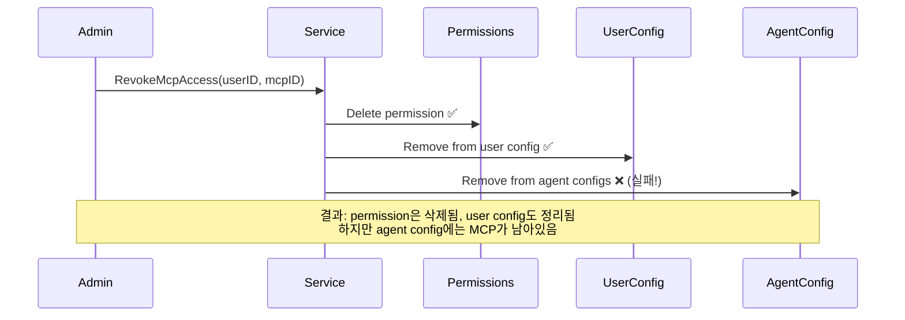
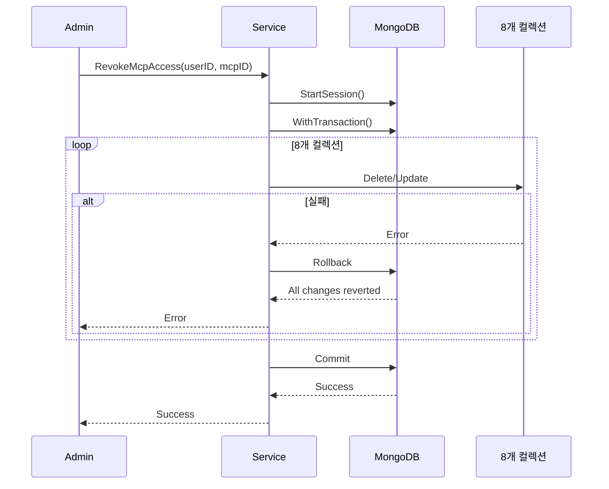
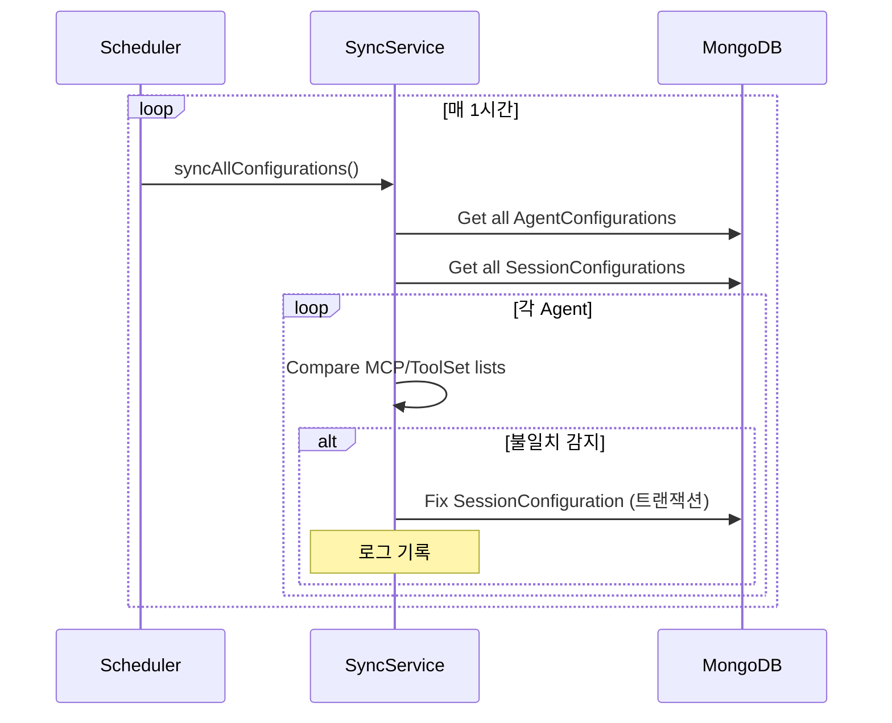

## 문제의 발견

MCP/ToolSet 관련 버그 리포트가 여러 건 들어왔다.

> "MCP 권한을 취소했는데 Agent에서는 여전히 사용할 수 있어요."
> "Agent 설정과 Session 설정이 다르게 보여요."

로그를 분석해보니 **부분 실패로 인한 데이터 불일치**였다. 여러 컬렉션에 걸친 작업 중 일부만 성공하고 나머지가 실패하면서 데이터가 일관되지 않게 남아있었다.

## 문제 상황

### 영향받는 작업들

| 작업 | 관련 컬렉션 | 문제점 |
|-----|------------|--------|
| Revoke | permissions, user_configurations, agent_configurations, session_configurations 등 8개 | 일부 삭제 후 실패 시 불일치 |
| Connect/Disconnect | agent_configurations, agents, session_configurations | Agent와 Configuration 불일치 |
| Cascade | agent_configurations, session_configurations, sub_agent_configurations | 부분 전파 실패 |

### 데이터 불일치 시나리오



## 해결책: 트랜잭션 + 배치 동기화

### 1. Revoke 작업 트랜잭션


```go
func (s *permissionService) RevokeMcpAccess(ctx context.Context, userID, mcpID string) error {
    session, err := s.mongoDB.StartSession()
    if err != nil {
        return err
    }
    defer session.EndSession(ctx)

    _, err = session.WithTransaction(ctx, func(mongoCtx mongo.SessionContext) (any, error) {
        // 1. permissions 컬렉션에서 삭제
        if err := s.deletePermission(mongoCtx, userID, mcpID); err != nil {
            return nil, err
        }

        // 2. permission_requests 컬렉션에서 삭제
        if err := s.deletePermissionRequests(mongoCtx, userID, mcpID); err != nil {
            return nil, err
        }

        // 3. user_mcp_info 컬렉션에서 삭제
        if err := s.deleteUserMcpInfo(mongoCtx, userID, mcpID); err != nil {
            return nil, err
        }

        // 4. user_configurations 컬렉션에서 삭제
        if err := s.removeFromUserConfig(mongoCtx, userID, mcpID); err != nil {
            return nil, err
        }

        // 5. agents 컬렉션에서 삭제
        if err := s.removeFromAgents(mongoCtx, userID, mcpID); err != nil {
            return nil, err
        }

        // 6. agent_configurations 컬렉션에서 삭제
        if err := s.removeFromAgentConfigs(mongoCtx, userID, mcpID); err != nil {
            return nil, err
        }

        // 7. session_configurations 컬렉션에서 삭제
        if err := s.removeFromSessionConfigs(mongoCtx, userID, mcpID); err != nil {
            return nil, err
        }

        // 8. sub_agent_configurations 컬렉션에서 삭제
        if err := s.removeFromSubAgentConfigs(mongoCtx, userID, mcpID); err != nil {
            return nil, err
        }

        return nil, nil
    })

    return err
}
```


**핵심:** 8개 컬렉션에 걸친 작업을 하나의 트랜잭션으로 처리. 하나라도 실패하면 전체 롤백.

### 2. Connect/Disconnect 트랜잭션


```go
func (s *agentConfigService) ConnectMCPToAgent(ctx context.Context, agentID, mcpID string) error {
    session, err := s.mongoDB.StartSession()
    if err != nil {
        return err
    }
    defer session.EndSession(ctx)

    _, err = session.WithTransaction(ctx, func(mongoCtx mongo.SessionContext) (any, error) {
        // 1. Agent Configuration 업데이트
        if err := s.addMcpToAgentConfig(mongoCtx, agentID, mcpID); err != nil {
            return nil, err
        }

        // 2. Agent 모델의 mcp_server_ids 업데이트
        if err := s.addMcpToAgent(mongoCtx, agentID, mcpID); err != nil {
            return nil, err
        }

        return nil, nil
    })

    return err
}
```


### 3. Cascade 작업 트랜잭션


```go
func (s *agentConfigService) CascadeAgentMcpConnectToSessions(ctx context.Context, agentID, mcpID string) error {
    session, err := s.mongoDB.StartSession()
    if err != nil {
        return err
    }
    defer session.EndSession(ctx)

    _, err = session.WithTransaction(ctx, func(mongoCtx mongo.SessionContext) (any, error) {
        // Agent의 모든 Session Configuration을 한 번에 업데이트
        sessions, err := s.getSessionsByAgentID(mongoCtx, agentID)
        if err != nil {
            return nil, err
        }

        for _, sess := range sessions {
            if err := s.addMcpToSessionConfig(mongoCtx, sess.ID, mcpID); err != nil {
                return nil, err  // 하나라도 실패하면 전체 롤백
            }
        }

        return nil, nil
    })

    return err
}
```


### 4. 정기적 동기화 배치 작업


```go
type ConfigurationSyncService struct {
    mongoDB     *mongo.Client
    logger      *zap.Logger
    ticker      *time.Ticker
    stopChan    chan struct{}
}

func (s *ConfigurationSyncService) Start() {
    s.ticker = time.NewTicker(1 * time.Hour)
    go func() {
        for {
            select {
            case <-s.ticker.C:
                s.syncAllConfigurations()
            case <-s.stopChan:
                return
            }
        }
    }()
}

func (s *ConfigurationSyncService) syncAllConfigurations() {
    ctx := context.Background()

    // 1. Agent Configuration과 Session Configuration 동기화
    s.syncAgentSessionConfigs(ctx)

    // 2. Agent 모델과 Agent Configuration 동기화
    s.syncAgentModels(ctx)

    // 3. SubAgent Configuration과 Parent Agent Configuration 동기화
    s.syncSubAgentConfigs(ctx)
}

func (s *ConfigurationSyncService) syncAgentSessionConfigs(ctx context.Context) {
    // Agent Configuration의 MCP/ToolSet 목록과
    // Session Configuration의 MCP/ToolSet 목록 비교
    agentConfigs, _ := s.getAgentConfigurations(ctx)

    for _, agentConfig := range agentConfigs {
        sessions, _ := s.getSessionsByAgentID(ctx, agentConfig.AgentID)

        for _, session := range sessions {
            sessionConfig, _ := s.getSessionConfiguration(ctx, session.ID)

            // 불일치 감지 및 수정
            if !equalMcpLists(agentConfig.McpServers, sessionConfig.McpServers) {
                s.logger.Warnf("MCP mismatch detected: agent=%s, session=%s", agentConfig.AgentID, session.ID)
                s.fixSessionConfiguration(ctx, session.ID, agentConfig.McpServers)
            }
        }
    }
}
```


## 시퀀스 다이어그램

### 트랜잭션 기반 Revoke



### 배치 동기화



## 설계 결정

### 1. All-or-Nothing vs Best Effort

| 방식 | 장점 | 단점 |
|-----|-----|-----|
| All-or-Nothing (트랜잭션) | 데이터 일관성 보장 | 일부 실패 시 전체 실패 |
| Best Effort (기존) | 부분 성공 가능 | 데이터 불일치 발생 |

**결정:** All-or-Nothing. 부분 실패로 인한 불일치가 더 큰 문제.

### 2. 배치 동기화 주기


```yaml
configuration_sync:
  interval: 1h  # 1시간마다 실행
  enabled: true
```


**이유:**
- 실시간 동기화는 성능 부담
- 1시간 주기는 불일치 허용 시간과 성능 사이의 균형점
- 트랜잭션 적용 후에는 새로운 불일치 발생 최소화

### 3. 트랜잭션 범위


```
┌─────────────────────────────────────────────────────────────────┐
│                     트랜잭션 범위                                │
├─────────────────────────────────────────────────────────────────┤
│                                                                 │
│  ✅ 트랜잭션 적용                                               │
│  - Revoke 작업 (8개 컬렉션)                                     │
│  - Connect/Disconnect 작업 (2개 컬렉션)                         │
│  - Cascade 작업 (N개 Session Configuration)                     │
│                                                                 │
│  ❌ 트랜잭션 미적용                                             │
│  - 단일 컬렉션 읽기 작업                                        │
│  - 배치 동기화 (개별 수정은 트랜잭션)                           │
│                                                                 │
└─────────────────────────────────────────────────────────────────┘
```


## 결과

### 데이터 일관성 개선

| 지표 | Before | After |
|-----|--------|-------|
| Revoke 후 불일치 | 발생 | 없음 |
| Connect/Disconnect 불일치 | 발생 | 없음 |
| Cascade 부분 실패 | 발생 | 없음 |

### 로그 변화

**수정 전:**
```
[15:23:45] RevokeMcpAccess: permission deleted
[15:23:45] RevokeMcpAccess: user config updated
[15:23:46] RevokeMcpAccess: ERROR agent config update failed
(불일치 상태로 남음)
```

**수정 후:**
```
[15:23:45] RevokeMcpAccess: starting transaction
[15:23:46] RevokeMcpAccess: ERROR agent config update failed
[15:23:46] RevokeMcpAccess: transaction rolled back
(모든 변경사항 롤백됨)
```

## 배운 점

### 1. 여러 컬렉션에 걸친 작업은 트랜잭션 필수


```go
// 안티패턴: 개별 업데이트
deleteFromCollection1(id)  // 성공
deleteFromCollection2(id)  // 실패! → 불일치
deleteFromCollection3(id)  // 실행 안 됨

// 올바른 패턴: 트랜잭션
session.WithTransaction(ctx, func(mongoCtx) {
    deleteFromCollection1(id)
    deleteFromCollection2(id)
    deleteFromCollection3(id)
    // 하나라도 실패하면 전체 롤백
})
```


### 2. 배치 동기화는 보험이다

트랜잭션을 적용해도 과거 데이터의 불일치는 해결되지 않는다. 배치 동기화로 기존 불일치를 자동 복구한다.


```go
// 1시간마다 실행
func (s *ConfigurationSyncService) syncAllConfigurations() {
    // 불일치 감지 → 로그 기록 → 자동 수정
}
```


### 3. Warn 로그만 남기고 계속 진행하지 마라


```go
// 안티패턴: 경고만 남기고 계속
if err := updateAgentConfig(ctx, agentID); err != nil {
    logger.Warnf("failed to update agent config: %v", err)
    // 계속 진행... 불일치 발생!
}

// 올바른 패턴: 트랜잭션 실패 시 롤백
if err := updateAgentConfig(mongoCtx, agentID); err != nil {
    return nil, err  // 트랜잭션 롤백
}
```


## 결론

MCP/ToolSet 데이터 일관성 보장의 핵심:

1. **트랜잭션 적용:** 여러 컬렉션에 걸친 작업은 All-or-Nothing
2. **배치 동기화:** 1시간마다 불일치 감지 및 자동 복구
3. **명시적 에러 처리:** Warn 로그만 남기는 대신 트랜잭션 롤백

**데이터 일관성은 "일부 성공"보다 "전체 실패"가 낫다.**
