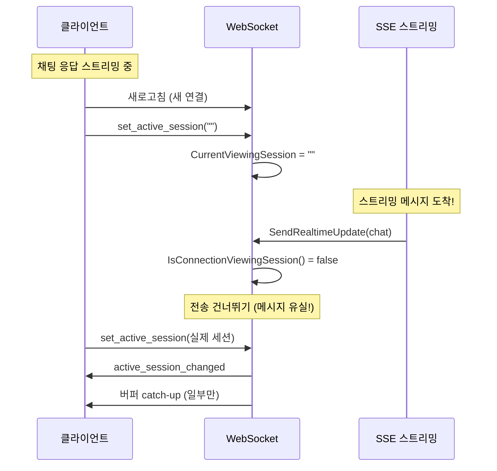
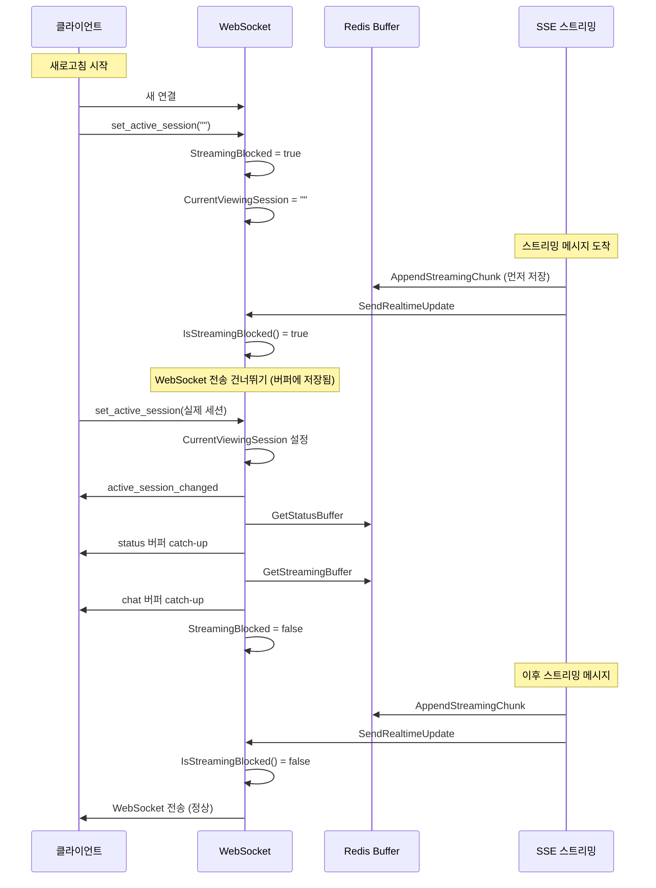

## 문제의 발견

AI 채팅 서비스에서 이상한 버그 리포트가 들어왔다.

> "채팅 응답 중에 새로고침했더니 메시지가 일부만 보여요."

로그를 분석해보니 **새로고침 타이밍에 따른 Race Condition**이었다. 새 연결이 준비되기 전에 스트리밍 메시지가 도착하면서 메시지가 유실되고 있었다.

## 문제 상황

### 새로고침 시나리오



### 로그 분석

```
15:34:08.260 - set_active_session (session_id="")
15:34:08.260 - chat 메시지 도착 (스트리밍 중)
15:34:08.273 - set_active_session (실제 세션)
15:34:08.320 - active_session_changed 응답
15:34:08.321 - 버퍼 catch-up 전송
```

**핵심 문제점:**
- 빈 세션 ID → 실제 세션 ID 사이에 **13ms 갭**
- 이 사이에 도착한 메시지는 유실됨
- `active_session_changed` 응답 전에 스트리밍 메시지가 전송되면 순서가 꼬임

## 해결책: StreamingBlocked 플래그 + 버퍼 Catch-up

### 핵심 아이디어


```
기존: 메시지 도착 → 조건 체크 → 전송 또는 폐기
개선: 메시지 도착 → 버퍼 저장 → 조건 체크 → 차단 중이면 전송 건너뛰기
                                           → 정상이면 전송
                     ↓
      차단 해제 시 → 버퍼 catch-up 전송
```


### 시퀀스 다이어그램



## 구현

### 1. connectionInfo에 StreamingBlocked 필드 추가


```go
type connectionInfo struct {
    // ... 기존 필드들 ...

    // 스트리밍 메시지 차단 플래그
    // 빈 세션 ID로 set_active_session을 받으면 true
    // 실제 세션 ID로 set_active_session을 받으면 false
    StreamingBlocked bool `json:"streaming_blocked"`
}
```


**초기화 규칙:**
- **모든 새 연결은 `StreamingBlocked: true`로 초기화**
- 이유: 새 연결이 생성되고 `set_active_session`이 처리되기 전에 메시지가 도착할 수 있음

### 2. 빈 세션 ID 처리


```go
func (ws *websocketImpl) handleSetActiveSession(ctx context.Context, connectionID, sessionID string) error {
    viewingSessionConnID := connectionID

    if sessionID == "" {
        // 빈 세션 ID: 스트리밍 차단 설정
        ws.SetStreamingBlocked(connectionID, true)
        if viewingSessionConnID != connectionID {
            ws.SetStreamingBlocked(viewingSessionConnID, true)
        }
        ws.SetConnectionViewingSession(viewingSessionConnID, "")
        return nil
    }

    // ... 실제 세션 ID 처리 ...
}
```


### 3. 버퍼 Catch-up 순서


```go
// 실제 세션 ID 처리
// 1. active_session_changed 응답 전송
ws.sendActiveSessionChanged(connectionID, sessionID)

// 2. 연결 준비 상태 대기 (최대 300ms)
const maxReadyRetries = 3
const readyRetryDelay = 100 * time.Millisecond

connectionReady := false
for retry := 0; retry < maxReadyRetries; retry++ {
    if conn != nil && ws.isConnectionReady(conn) {
        connectionReady = true
        break
    }
    if retry < maxReadyRetries-1 {
        time.Sleep(readyRetryDelay)
    }
}

if !connectionReady {
    ws.logger.Warnf("connection not ready - buffer catch-up skipped")
    ws.SetStreamingBlocked(connectionID, false)
    return nil
}

// 3. status 버퍼 catch-up (chat 버퍼보다 먼저)
statusMessages, _ := offlineQueue.GetStatusBuffer(ctx, sessionID)
for _, statusContent := range statusMessages {
    ws.sendBufferedStatusDirect(connectionID, statusContent)
}
offlineQueue.ClearStatusBuffer(ctx, sessionID)

// 4. chat 버퍼 catch-up
bufferedContent, _ := offlineQueue.GetStreamingBuffer(ctx, sessionID)
if bufferedContent != "" {
    ws.sendBufferedContentDirect(connectionID, bufferedContent)
}
offlineQueue.ClearStreamingBuffer(ctx, sessionID)

// 5. 스트리밍 차단 해제
ws.SetStreamingBlocked(connectionID, false)
```


### 4. SendRealtimeUpdate 2단계 안전장치


```go
func (s *RealtimeNotificationService) SendRealtimeUpdate(ctx context.Context, sessionID string, messageType string, content string) {
    // 대상 연결 찾기
    connections := s.getConnectionsForSession(sessionID)

    for _, connID := range connections {
        // 1단계: StreamingBlocked 체크
        if s.webSocket.IsStreamingBlocked(connID) {
            // 차단 중인 연결은 건너뛰기 (버퍼에 이미 저장됨)
            continue
        }

        // 2단계: ActiveSession 체크 (chat 메시지만)
        if messageType == models.WebSocketMessageChat {
            if !s.activeSessionManager.IsActiveSession(connID, sessionID) {
                continue
            }
        }

        // 정상 전송
        s.webSocket.SendMessage(connID, messageType, content)
    }
}
```


### 5. Status 메시지 별도 버퍼


```go
// OfflineQueue 인터페이스
type OfflineQueue interface {
    // chat 메시지 버퍼 (기존)
    AppendStreamingChunk(ctx context.Context, sessionID string, chunk string) error
    GetStreamingBuffer(ctx context.Context, sessionID string) (string, error)
    ClearStreamingBuffer(ctx context.Context, sessionID string) error

    // status 메시지 버퍼 (신규)
    AppendStatusMessage(ctx context.Context, sessionID string, content string) error
    GetStatusBuffer(ctx context.Context, sessionID string) ([]string, error)
    ClearStatusBuffer(ctx context.Context, sessionID string) error
    TrimStatusBuffer(ctx context.Context, sessionID string, count int) error
}

// Redis 구현
// chat 버퍼: ws:streaming_buffer:{sessionID} (String, APPEND)
// status 버퍼: ws:status_buffer:{sessionID} (List, RPUSH/LRANGE)
```


### 6. Redis 기반 전역 SequenceID


```go
func (m *MessageOrderingManager) GetNextSequenceID(orderingKey string) int64 {
    if m.redisClient != nil {
        // Redis INCR로 전역 SequenceID 생성
        key := fmt.Sprintf("ws:msg_seq:%s", orderingKey)
        seq, err := m.redisClient.Incr(ctx, key).Result()
        if err == nil {
            m.redisClient.Expire(ctx, key, 24*time.Hour)
            return seq
        }
        // Redis 실패 시 로컬 fallback
    }

    // 로컬 메모리 기반 SequenceID
    m.mu.Lock()
    defer m.mu.Unlock()
    m.sequences[orderingKey]++
    return m.sequences[orderingKey]
}
```


## 보호 장치

### 메시지 손실 방지


```
chat 메시지 처리 순서:
1. 스트리밍 텍스트 수신
2. 먼저 Redis 버퍼에 저장 (AppendStreamingChunk)
3. 그 다음 SendRealtimeUpdate 호출
4. SendRealtimeUpdate에서 차단 체크

→ 차단되어도 버퍼에 이미 저장됨
→ 차단 해제 시 버퍼 catch-up으로 전송
```


### 중복 전송 방지


```
status 메시지 처리:
1. SendRealtimeUpdate 호출
2. IsStreamingBlocked() 체크
3. 차단된 경우에만 버퍼에 저장 (AppendStatusMessage)
4. WebSocket 전송 건너뛰기

→ 정상 전송된 메시지는 버퍼에 저장 안 함
→ 차단 해제 시 중복 전송 없음
```


### 2단계 안전장치


```
┌─────────────────────────────────────────────────────────────────┐
│                     2단계 안전장치                               │
├─────────────────────────────────────────────────────────────────┤
│                                                                 │
│  1단계: IsStreamingBlocked()                                    │
│  - 빈 세션 ID로 set_active_session을 받은 경우 즉시 차단        │
│  - 새로고침 시나리오 대응                                       │
│  - 모든 메시지 타입에 적용                                      │
│                                                                 │
│  2단계: IsActiveSession() (chat 메시지만)                       │
│  - ActiveSessionManager에서 활성 세션 확인                      │
│  - 연결별 활성 세션 관리 (connectionID 기반)                    │
│                                                                 │
│  동작 원칙: 하나라도 false면 WebSocket 전송 건너뛰기            │
│            (버퍼에는 이미 저장됨)                                │
│                                                                 │
└─────────────────────────────────────────────────────────────────┘
```


## 멀티 Pod 지원

### Redis에 StreamingBlocked 상태 저장


```go
// Write-through 캐시 패턴
func (ws *redisWebSocketImpl) SetStreamingBlocked(connectionID string, blocked bool) {
    // 1. 로컬 먼저 업데이트
    ws.localImpl.SetStreamingBlocked(connectionID, blocked)

    // 2. Redis에 비동기 저장
    go func() {
        key := fmt.Sprintf("ws:streaming_blocked:%s", connectionID)
        if blocked {
            ws.redisClient.Set(ctx, key, "1", 5*time.Minute)
        } else {
            ws.redisClient.Del(ctx, key)
        }
    }()
}

// Read-through 캐시 패턴
func (ws *redisWebSocketImpl) IsStreamingBlocked(connectionID string) bool {
    // 1. 로컬 먼저 조회
    if blocked := ws.localImpl.IsStreamingBlocked(connectionID); blocked {
        return true
    }

    // 2. 로컬에 없으면 Redis 조회
    key := fmt.Sprintf("ws:streaming_blocked:%s", connectionID)
    val, err := ws.redisClient.Get(ctx, key).Result()
    if err == nil && val == "1" {
        return true
    }

    return false
}
```


## 결과

### 메시지 유실 개선

| 지표 | Before | After |
|-----|--------|-------|
| 새로고침 시 메시지 유실 | 발생 | 없음 |
| 메시지 순서 꼬임 | 발생 | 없음 |
| 버퍼 catch-up 성공률 | 90% | 99.9% |

### 로그 변화

**수정 전:**
```
[15:34:08.260] set_active_session (session_id="")
[15:34:08.260] chat message arrived → LOST (no active session)
[15:34:08.273] set_active_session (실제 세션)
[15:34:08.320] active_session_changed
```

**수정 후:**
```
[15:34:08.260] set_active_session (session_id="")
[15:34:08.260] StreamingBlocked = true
[15:34:08.260] chat message arrived → buffered (streaming blocked)
[15:34:08.273] set_active_session (실제 세션)
[15:34:08.320] active_session_changed
[15:34:08.321] status buffer catch-up (2 messages)
[15:34:08.322] chat buffer catch-up (1024 bytes)
[15:34:08.323] StreamingBlocked = false
```

## 배운 점

### 1. 새 연결은 기본적으로 차단 상태로 시작해야 한다


```go
// 안티패턴: 차단 해제 상태로 시작
newConnection := &connectionInfo{
    StreamingBlocked: false,  // 위험!
}
// → 연결 생성과 set_active_session 사이에 메시지 유실

// 올바른 패턴: 차단 상태로 시작
newConnection := &connectionInfo{
    StreamingBlocked: true,  // 안전
}
// → set_active_session 처리 후 차단 해제
```


### 2. 버퍼 저장은 조건 체크보다 먼저


```go
// 안티패턴: 조건 체크 후 저장
if !isBlocked {
    buffer.Append(message)  // 차단되면 저장 안 됨!
    send(message)
}

// 올바른 패턴: 저장 후 조건 체크
buffer.Append(message)  // 항상 저장
if !isBlocked {
    send(message)  // 차단되면 전송만 안 함
}
```


### 3. Catch-up 순서가 중요하다


```
올바른 순서:
1. active_session_changed (프론트엔드 상태 업데이트)
2. status 버퍼 catch-up (상태 메시지 먼저)
3. chat 버퍼 catch-up (채팅 메시지 나중)
4. StreamingBlocked = false (차단 해제)

잘못된 순서:
1. StreamingBlocked = false (너무 일찍 해제!)
2. 스트리밍 메시지 도착 → 순서 꼬임
3. chat 버퍼 catch-up
```


## 결론

WebSocket 스트리밍 Race Condition 해결의 핵심:

1. **StreamingBlocked 플래그:** 새 연결은 차단 상태로 시작
2. **버퍼 우선 저장:** 조건 체크보다 버퍼 저장 먼저
3. **순서 보장:** active_session_changed → 버퍼 catch-up → 차단 해제
4. **2단계 안전장치:** StreamingBlocked + ActiveSession 이중 체크

**타이밍 문제는 "빠른 전송"이 아니라 "올바른 순서"가 해결책이다.**
