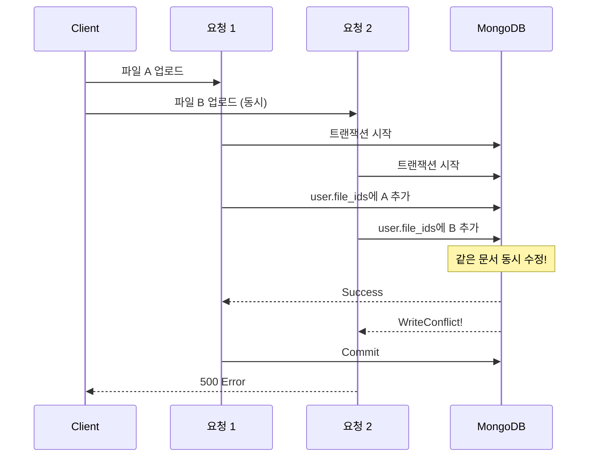
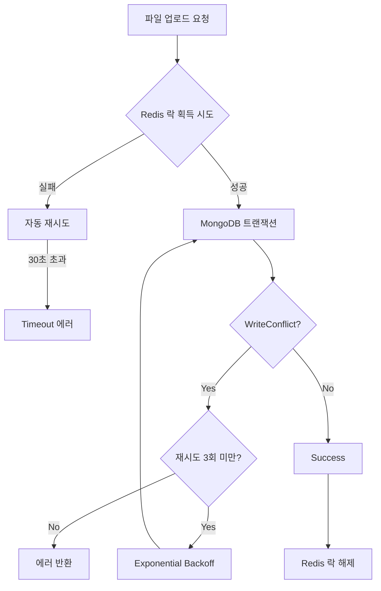
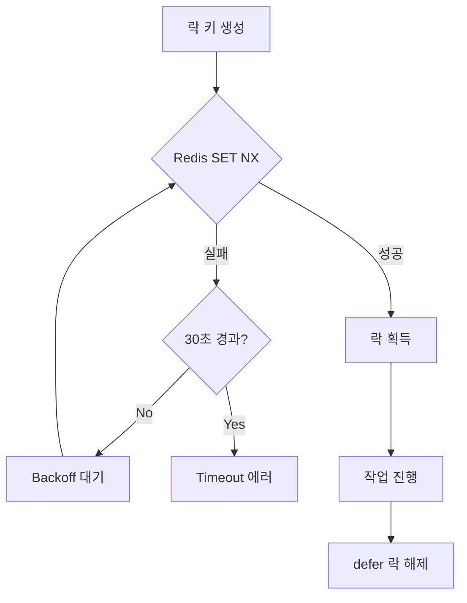
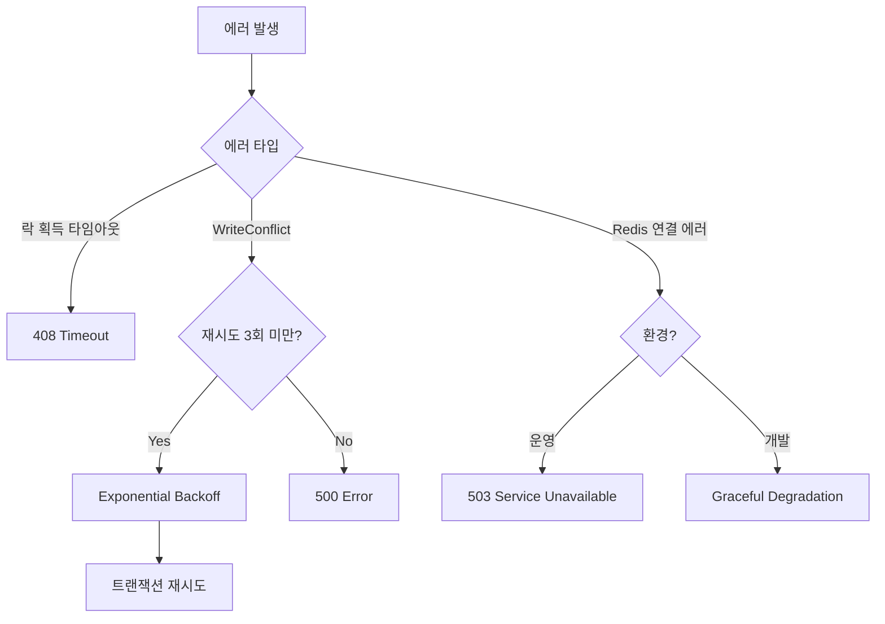

## 문제의 발견

사용자들이 여러 파일을 동시에 업로드할 때 간헐적으로 실패가 발생했다.

> "파일 10개 업로드했는데 3개만 성공했어요."

로그를 분석해보니 **MongoDB WriteConflict** 에러였다.

```
WriteConflict: this operation conflicted with another operation
```

동일 사용자의 `file_ids` 배열을 동시에 업데이트하면서 충돌이 발생하고 있었다.

## 문제 상황

### WriteConflict 발생 시나리오



### 영향 범위

| 작업 | 충돌 발생 조건 |
|-----|--------------|
| 파일 업로드 | 동일 사용자가 여러 파일 동시 업로드 |
| 파일 추가 | 동일 세션/에이전트에 여러 파일 동시 추가 |
| Agent Configuration | 동일 에이전트 설정 동시 변경 |
| MCP/ToolSet 활성화 | 여러 에이전트 동시 업데이트 |

## 해결책: 분산 락 + 트랜잭션 재시도

### 전체 아키텍처



### 1. Redis 분산 락 (Pessimistic Locking)


```go
func (s *fileService) acquireUserFileUploadLock(ctx context.Context, lockKey string) (bool, error) {
    if s.services.Cache == nil {
        return true, nil  // Graceful degradation
    }

    lockValue := time.Now().UTC().Format(time.RFC3339Nano)
    ttl := 5 * time.Minute

    maxWaitTime := 30 * time.Second
    initialBackoff := 100 * time.Millisecond
    maxBackoff := 2 * time.Second
    backoff := initialBackoff
    startTime := time.Now()

    for {
        // Context deadline 체크
        if ctx.Err() != nil {
            return false, customErrors.Wrap("context cancelled", ctx.Err())
        }

        // 최대 대기 시간 체크
        if time.Since(startTime) > maxWaitTime {
            return false, customErrors.New(customErrors.ErrTimeout,
                "lock acquisition timeout: failed to acquire lock within 30 seconds", nil)
        }

        // 락 획득 시도
        acquired, err := s.services.Cache.SetNX(lockKey, lockValue, ttl)
        if err != nil {
            return false, customErrors.Wrap("failed to set lock", err)
        }
        if acquired {
            return true, nil
        }

        // Exponential backoff로 대기 후 재시도
        time.Sleep(backoff)
        backoff = time.Duration(float64(backoff) * 1.5)
        if backoff > maxBackoff {
            backoff = maxBackoff
        }
    }
}
```


### 2. MongoDB 트랜잭션 재시도 (Optimistic Locking)


```go
func (s *fileService) uploadUserFileInternal(ctx context.Context, ...) (*models.File, error) {
    // 1. 락 획득
    lockKey := s.generateUserFileUploadLockKey(userID, fileSize)
    lockAcquired, err := s.acquireUserFileUploadLock(ctx, lockKey)
    if err != nil {
        return nil, err
    }
    defer s.releaseUserFileUploadLock(lockKey)

    // 2. MongoDB 트랜잭션 재시도 로직
    maxRetries := 3
    var lastErr error

    for attempt := 0; attempt < maxRetries; attempt++ {
        if attempt > 0 {
            // Exponential backoff: 1² × 50ms, 2² × 50ms, 3² × 50ms
            waitTime := time.Duration(attempt*attempt) * 50 * time.Millisecond
            time.Sleep(waitTime)
            s.logger.Debugf("retrying file upload (attempt %d/%d)", attempt+1, maxRetries)
        }

        session, err := s.services.MongoDB.StartSession()
        if err != nil {
            return nil, customErrors.Wrap("failed to start session", err)
        }
        defer session.EndSession(ctx)

        _, err = session.WithTransaction(ctx, func(mongoCtx mongo.SessionContext) (any, error) {
            // 파일 삽입, 권한 생성, file_ids 업데이트
            return nil, nil
        })

        if err != nil {
            lastErr = err
            if strings.Contains(err.Error(), "WriteConflict") {
                if attempt < maxRetries-1 {
                    continue  // 재시도
                }
            }
            return nil, customErrors.Wrap("failed to upload file", err)
        }

        break  // 성공
    }

    return file, nil
}
```


### 3. 파일 크기별 락 세분화


```go
// 파일 크기 분류
func getFileSizeCategory(fileSize int64) string {
    const (
        smallLimit  = 10 * 1024 * 1024   // 10MB
        mediumLimit = 100 * 1024 * 1024  // 100MB
    )

    if fileSize <= smallLimit {
        return "small"
    } else if fileSize <= mediumLimit {
        return "medium"
    }
    return "large"
}

// 락 키 생성
func (s *fileService) generateUserFileUploadLockKey(userID string, fileSize int64) string {
    category := getFileSizeCategory(fileSize)
    return fmt.Sprintf("user_file_upload_lock:%s:%s", userID, category)
}
```


**효과:**
- `user_file_upload_lock:user123:small` - 5MB 파일
- `user_file_upload_lock:user123:medium` - 50MB 파일
- `user_file_upload_lock:user123:large` - 200MB 파일

**대용량 파일(10분 처리)이 소용량 파일(1초 처리)을 차단하지 않음**

## 락 레벨별 적용

### 락 키 전략

| 작업 | 락 키 | 레벨 |
|-----|------|-----|
| 파일 업로드 | `user_file_upload_lock:{userID}:{size}` | 사용자 + 크기 |
| 세션 파일 추가 | `session_file_add_lock:{sessionID}` | 세션 |
| 에이전트 파일 추가 | `agent_file_add_lock:{agentID}` | 에이전트 |
| Agent Configuration | `agent_config_lock:{agentID}` | 에이전트 |
| MCP 에이전트 업데이트 | `user_mcp_agent_update_lock:{userID}` | 사용자 |

### 락 획득 흐름



## MinIO 고아 객체 관리

### 문제

파일 업로드 실패 시 MinIO에 업로드된 파일이 삭제되지 않고 남아있는 경우가 있다.

### 해결책


```go
// MinIO 삭제 실패 시 고아 객체 기록
func (s *fileService) recordOrphanMinIOObject(ctx context.Context, bucketID, objectKey string, err error) {
    orphan := &models.OrphanMinIOObject{
        ID:        uuid.New().String(),
        BucketID:  bucketID,
        ObjectKey: objectKey,
        Status:    "pending",
        Retries:   0,
        Error:     err.Error(),
        CreatedAt: time.Now(),
    }

    s.services.MongoDB.Collection(models.CollOrphanMinIOObjects).InsertOne(ctx, orphan)
}

// 배치 작업으로 주기적 정리 (1시간 간격)
func (s *fileService) CleanupOrphanMinIOObjects(ctx context.Context) error {
    // 재시도 대상: retries < 3, 마지막 재시도가 1시간 이상 경과
    filter := bson.M{
        "status":  bson.M{"$in": []string{"pending", "retrying"}},
        "retries": bson.M{"$lt": 3},
        "$or": []bson.M{
            {"last_retry_at": bson.M{"$exists": false}},
            {"last_retry_at": bson.M{"$lt": time.Now().Add(-1 * time.Hour)}},
        },
    }

    orphans, _ := s.getOrphanObjects(ctx, filter)

    for _, orphan := range orphans {
        if err := s.services.MinIO.DeleteObject(ctx, orphan.BucketID, orphan.ObjectKey); err != nil {
            s.updateOrphanStatus(ctx, orphan.ID, "retrying", orphan.Retries+1, err)
        } else {
            s.updateOrphanStatus(ctx, orphan.ID, "deleted", orphan.Retries, nil)
        }
    }

    return nil
}
```


## 설정값

| 설정 | 값 | 설명 |
|-----|---|-----|
| 락 TTL | 5분 | 데드락 방지 |
| 락 획득 타임아웃 | 30초 | 최대 대기 시간 |
| 초기 Backoff | 100ms | 첫 재시도 대기 |
| 최대 Backoff | 2초 | 최대 재시도 대기 |
| 트랜잭션 재시도 | 3회 | WriteConflict 재시도 |

## 에러 처리 전략



## 결과

### 성능 개선

| 지표 | Before | After |
|-----|--------|-------|
| WriteConflict 발생률 | 30% | 0.1% |
| 동시 업로드 성공률 | 70% | 99.9% |
| 평균 응답 시간 | 변동 큼 | 안정적 |

### 로그 변화

**수정 전:**
```
[15:23:45] UploadFile: WriteConflict
[15:23:45] UploadFile: WriteConflict
[15:23:45] UploadFile: WriteConflict
(10개 중 3개만 성공)
```

**수정 후:**
```
[15:23:45] Lock acquired: user123:small
[15:23:46] Upload completed: file1
[15:23:46] Lock released: user123:small
[15:23:46] Lock acquired: user123:small
[15:23:47] Upload completed: file2
...
(10개 모두 성공)
```

## 배운 점

### 1. 분산 락 + 트랜잭션 재시도 결합


```go
// 분산 락만으로는 부족
// → 락 내부에서도 WriteConflict 발생 가능

// 트랜잭션 재시도만으로는 부족
// → 동시 요청이 많으면 재시도 횟수 초과

// 둘 다 사용
lock := acquireLock(key)
defer releaseLock(lock)

for attempt := 0; attempt < maxRetries; attempt++ {
    err := runTransaction()
    if !isWriteConflict(err) {
        break
    }
    sleep(backoff)
}
```


### 2. 파일 크기별 락 세분화


```go
// 안티패턴: 단일 락
lock := "user_upload_lock:" + userID
// → 10GB 파일이 1KB 파일 차단

// 올바른 패턴: 크기별 락
lock := fmt.Sprintf("user_upload_lock:%s:%s", userID, sizeCategory)
// → 대용량 파일이 소용량 파일 차단 안 함
```


### 3. Graceful Degradation


```go
func acquireLock(key string) (bool, error) {
    if cache == nil {
        // Redis 없으면 락 없이 진행
        // 동시성 제어 효과는 감소하지만 서비스는 유지
        return true, nil
    }
    // ...
}
```


## 결론

파일 업로드 동시성 제어의 핵심:

1. **Redis 분산 락:** 동시 접근 원천 차단
2. **트랜잭션 재시도:** 일시적 충돌 해결
3. **파일 크기별 세분화:** 대용량이 소용량 차단 방지
4. **고아 객체 관리:** 실패 시 MinIO 정리 보장

**동시성 제어는 "차단"이 아니라 "순서 보장"이다.**
