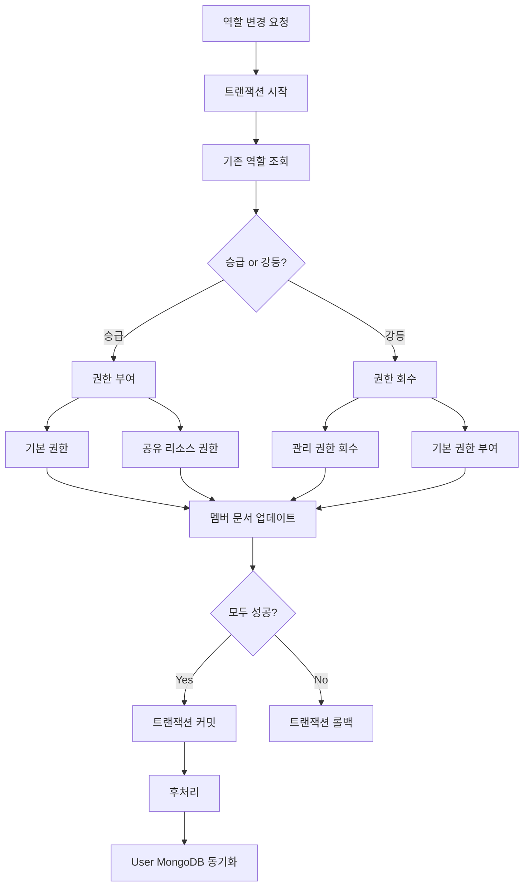
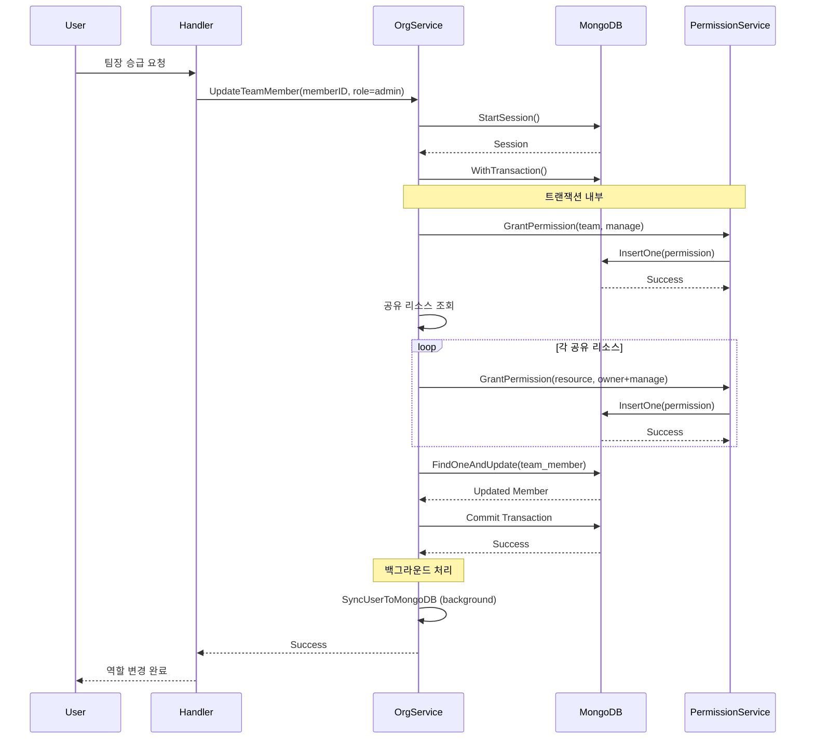

## 문제의 발견

조직 관리 기능에서 이상한 버그 리포트가 들어왔다.

> "팀장으로 승급시켰는데 권한이 일부만 적용됐어요."

로그를 분석해보니 **부분 실패로 인한 권한 불일치**였다. 팀장 승급 시 여러 권한을 부여하는데, 중간에 실패하면 일부 권한만 적용되고 있었다.

## 문제 상황

### 기존 로직


```go
// 문제 코드: 트랜잭션 없이 순차 실행
func UpdateTeamMember(ctx context.Context, memberID string, newRole string) error {
    // 1. 팀 manage 권한 부여
    if err := grantPermission(ctx, teamID, ActionManage); err != nil {
        log.Warn("failed to grant manage permission")
        // 계속 진행!
    }

    // 2. 공유 리소스 권한 부여
    for _, share := range shares {
        if err := grantResourcePermission(ctx, share); err != nil {
            log.Warn("failed to grant resource permission")
            // 계속 진행!
        }
    }

    // 3. 멤버 문서 업데이트
    return updateMemberDocument(ctx, memberID, newRole)
}
```


### 문제점

| 단계 | 결과 | 상태 |
|-----|------|-----|
| 1. manage 권한 부여 | ✅ 성공 | 권한 있음 |
| 2. 공유 리소스 권한 부여 | ❌ 실패 | 권한 없음 |
| 3. 멤버 문서 업데이트 | ✅ 성공 | 팀장으로 표시 |

**결과:** 팀장인데 공유 리소스에 접근 못하는 상태

## 해결책: 트랜잭션으로 원자성 보장

### 권한 처리 구조



## 구현

### 팀장 승급/강등 트랜잭션


```go
func (s *orgService) UpdateTeamMember(ctx context.Context, teamID, memberID string, req *UpdateMemberRequest) (*models.TeamMember, error) {
    // 기존 멤버 조회
    originalMember, err := s.getTeamMember(ctx, teamID, memberID)
    if err != nil {
        return nil, err
    }

    // 트랜잭션 시작
    session, err := s.services.MongoDB.StartSession()
    if err != nil {
        return nil, customErrors.Wrap("failed to start session", err)
    }
    defer session.EndSession(ctx)

    result, err := session.WithTransaction(ctx, func(mongoCtx mongo.SessionContext) (any, error) {
        subject := models.Subject{Type: "user", ID: originalMember.UserID}

        // 팀장 승급
        if req.Role == string(models.TeamRoleAdmin) && originalMember.Role != models.TeamRoleAdmin {
            // 1. 팀 manage 권한 부여
            if _, err := s.services.Permission.GrantPermission(mongoCtx, subject,
                models.ResourceTeam, []models.Action{models.ActionManage}, teamID); err != nil {
                return nil, customErrors.Wrap("failed to grant team manage permission", err)
            }

            // 2. 공유 리소스 권한 부여
            if err := s.grantSharedResourcePermissions(mongoCtx, teamID, subject); err != nil {
                return nil, customErrors.Wrap("failed to grant shared resource permissions", err)
            }
        }

        // 팀장 강등
        if originalMember.Role == models.TeamRoleAdmin && req.Role == string(models.TeamRoleMember) {
            // 1. 팀 manage 권한 회수
            if err := s.services.Permission.RevokePermission(mongoCtx, subject,
                models.ResourceTeam, []models.Action{models.ActionManage}, teamID); err != nil {
                return nil, customErrors.Wrap("failed to revoke team manage permission", err)
            }

            // 2. 기본 권한 부여
            if _, err := s.services.Permission.GrantPermission(mongoCtx, subject,
                models.ResourceTeam, models.GetSharedDefaultActions(), teamID); err != nil {
                return nil, customErrors.Wrap("failed to grant default permissions", err)
            }
        }

        // 3. 멤버 문서 업데이트
        filter := bson.M{"_id": memberID, "team_id": teamID}
        update := bson.M{
            "$set": bson.M{
                "role":       req.Role,
                "updated_at": time.Now(),
            },
        }

        var updatedMember models.TeamMember
        if err := s.services.MongoDB.Collection(models.CollTeamMembers).
            FindOneAndUpdate(mongoCtx, filter, update, opts).Decode(&updatedMember); err != nil {
            return nil, customErrors.Wrap("failed to update member", err)
        }

        return &updatedMember, nil
    })

    if err != nil {
        return nil, err
    }

    // 후처리 (백그라운드)
    go s.syncUserToMongoDB(context.Background(), originalMember.UserID)

    return result.(*models.TeamMember), nil
}
```


### 공유 리소스 권한 부여


```go
func (s *orgService) grantSharedResourcePermissions(ctx mongo.SessionContext, teamID string, subject models.Subject) error {
    // 팀에 공유된 모든 리소스 조회
    shares, err := s.getSharesForTeam(ctx, teamID)
    if err != nil {
        return err
    }

    for _, share := range shares {
        // 각 리소스에 Owner Actions + manage 부여
        actions := append(models.GetOwnerActions(), models.ActionManage)

        if _, err := s.services.Permission.GrantPermission(ctx, subject,
            models.Resource(share.ResourceType), actions, share.ResourceID); err != nil {
            return customErrors.Wrapf("failed to grant permission for resource %s", share.ResourceID, err)
        }
    }

    return nil
}
```


## 시퀀스 다이어그램



## 역할별 트랜잭션 범위

### 조직장 승급/강등


```go
_, err = session.WithTransaction(ctx, func(mongoCtx mongo.SessionContext) (any, error) {
    // 조직장 승급
    if req.Role == string(models.OrgRoleAdmin) {
        // 1. 조직 manage 권한 부여
        s.services.Permission.GrantPermission(mongoCtx, subject,
            models.ResourceOrganization, []models.Action{models.ActionManage}, orgID)

        // 2. 조직에 공유된 모든 리소스 권한 부여
        s.grantOrgSharedResourcePermissions(mongoCtx, orgID, subject)
    }

    // 조직장 강등
    if originalMember.Role == models.OrgRoleAdmin && req.Role == string(models.OrgRoleMember) {
        // 1. 조직 manage 권한 회수
        s.services.Permission.RevokePermission(mongoCtx, subject,
            models.ResourceOrganization, []models.Action{models.ActionManage}, orgID)

        // 2. 기본 권한 부여
        s.services.Permission.GrantPermission(mongoCtx, subject,
            models.ResourceOrganization, models.GetSharedDefaultActions(), orgID)
    }

    // 3. 멤버 문서 업데이트
    return s.updateOrgMember(mongoCtx, memberID, req)
})
```


### 조직원 제거


```go
_, err = session.WithTransaction(ctx, func(mongoCtx mongo.SessionContext) (any, error) {
    // 1. 조직 소유의 모든 리소스 권한 취소
    s.services.Permission.RevokePermission(mongoCtx, subject,
        models.ResourceOrganization, models.GetAllActions(), orgID)

    // 2. 사용자가 속한 팀의 모든 리소스 권한 취소
    for _, team := range teams {
        s.services.Permission.RevokePermission(mongoCtx, subject,
            models.ResourceTeam, models.GetAllActions(), team.ID)
    }

    // 3. 조직 멤버 제거
    s.services.MongoDB.Collection(models.CollOrganizationMembers).
        DeleteOne(mongoCtx, bson.M{"organization_id": orgID, "_id": memberID})

    // 4. 팀 멤버 제거
    for _, team := range teams {
        s.services.MongoDB.Collection(models.CollTeamMembers).
            DeleteOne(mongoCtx, bson.M{"team_id": team.ID, "user_id": member.UserID})
    }

    // 5. shares 컬렉션 정리
    s.removeFromShares(mongoCtx, member.UserID, orgID)

    return nil, nil
})

// 트랜잭션 외부: 공유 리소스 개별 권한 회수 (성능 최적화)
for _, share := range sharesToRevoke {
    s.services.Permission.RevokePermission(ctx, userSubject, resource,
        models.GetAllActions(), share.ResourceID)
}
```


### 팀 이동


```go
_, err = session.WithTransaction(ctx, func(mongoCtx mongo.SessionContext) (any, error) {
    // 1. 기존 상위 팀 권한 제거
    if oldParentTeamID != nil && *oldParentTeamID != "" {
        s.revokeParentTeamPermissionsFromAllSubTeams(mongoCtx, *oldParentTeamID, teamID)
    }

    // 2. 새로운 상위 팀 권한 부여
    if req.NewParentTeamID != nil && *req.NewParentTeamID != "" {
        s.grantParentTeamPermissionsToAllSubTeams(mongoCtx, *req.NewParentTeamID, teamID, now)
    }

    // 3. 사용자 레벨 권한 업데이트
    s.updateTeamMovePermissions(mongoCtx, teamID, oldAccessibleTeams, updatedTeam)

    // 4. 팀 문서 업데이트
    return s.updateTeamDocument(mongoCtx, teamID, req)
})
```


## 트랜잭션 범위 결정

### 트랜잭션 내부

| 작업 | 이유 |
|-----|-----|
| 기본 권한 부여/회수 | 원자성 필수 |
| 공유 리소스 권한 부여 | 일관성 필요 |
| 멤버 문서 업데이트 | 상태 동기화 |

### 트랜잭션 외부

| 작업 | 이유 |
|-----|-----|
| User MongoDB 동기화 | 백그라운드 가능 |
| 개별 공유 리소스 회수 | 성능 최적화 |

## 고려사항

### 공유 리소스가 많은 경우


```
문제: 공유 리소스 100개 → 트랜잭션 내 100번 권한 부여 → 타임아웃

해결: 팀원 추가 시 백그라운드에서 처리
go func(userID string, teamID string) {
    s.services.Permission.SyncTeamMemberSharedPermissions(ctx, teamID, userID)
}(member.UserID, teamID)
```


### 백그라운드 동기화 실패


```go
// 백그라운드 동기화는 실패해도 로그만 남김
go func() {
    if err := s.syncUserToMongoDB(ctx, userID); err != nil {
        s.logger.Warnf("failed to sync user to mongodb: %v", err)
        // 알림 시스템 연동 (선택적)
    }
}()
```


## 결과

### 데이터 정합성 개선

| 지표 | Before | After |
|-----|--------|-------|
| 권한 불일치 | 발생 | 없음 |
| 부분 실패 | 발생 | 자동 롤백 |
| 역할 ↔ 권한 일치 | 불안정 | 보장 |

### 로그 변화

**수정 전:**
```
[15:23:45] GrantPermission(team, manage): success
[15:23:45] GrantPermission(agent, owner): failed
[15:23:45] UpdateMember(role=admin): success
(팀장인데 Agent 접근 불가)
```

**수정 후:**
```
[15:23:45] Transaction started
[15:23:45] GrantPermission(team, manage): success
[15:23:45] GrantPermission(agent, owner): failed
[15:23:45] Transaction rolled back
(모든 변경사항 취소됨)
```

## 배운 점

### 1. 권한 변경은 트랜잭션 필수


```go
// 안티패턴: 순차 실행
grantPermission(teamID, manage)      // 성공
grantResourcePermission(agentID)     // 실패!
updateMember(role=admin)             // 성공 → 불일치

// 올바른 패턴: 트랜잭션
session.WithTransaction(ctx, func(mongoCtx) {
    grantPermission(mongoCtx, teamID, manage)
    grantResourcePermission(mongoCtx, agentID)  // 실패 시 전체 롤백
    updateMember(mongoCtx, role=admin)
})
```


### 2. 백그라운드 동기화로 성능 최적화


```go
// 트랜잭션 내: 핵심 권한만
session.WithTransaction(ctx, func(mongoCtx) {
    grantPermission(mongoCtx, teamID, manage)  // 필수
    updateMember(mongoCtx)                      // 필수
})

// 트랜잭션 외: 부가 작업
go syncUserToMongoDB(userID)  // 백그라운드
```


### 3. Warn 로그만 남기고 계속 진행하지 마라


```go
// 안티패턴
if err := grantPermission(ctx, id); err != nil {
    log.Warn("failed but continuing...")
}

// 올바른 패턴
if err := grantPermission(mongoCtx, id); err != nil {
    return nil, err  // 트랜잭션 롤백
}
```


## 결론

팀/조직 멤버 역할 변경 트랜잭션의 핵심:

1. **트랜잭션 필수:** 권한 부여/회수 + 멤버 업데이트 원자성
2. **All-or-Nothing:** 부분 실패 시 전체 롤백
3. **백그라운드 최적화:** 성능과 일관성 균형
4. **명시적 에러 처리:** Warn 로그 대신 롤백

**역할과 권한은 항상 동기화되어야 한다. 트랜잭션이 이를 보장한다.**
