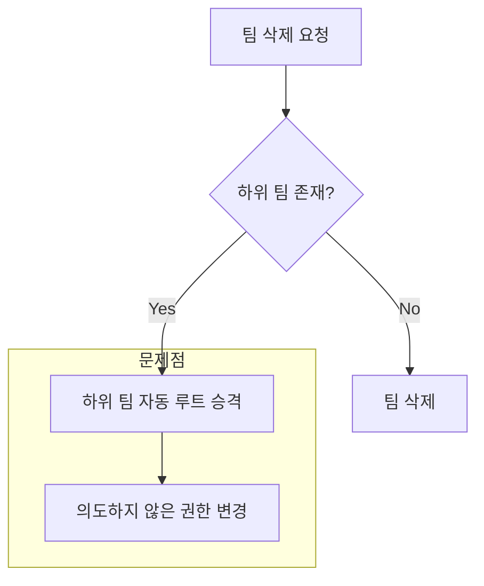
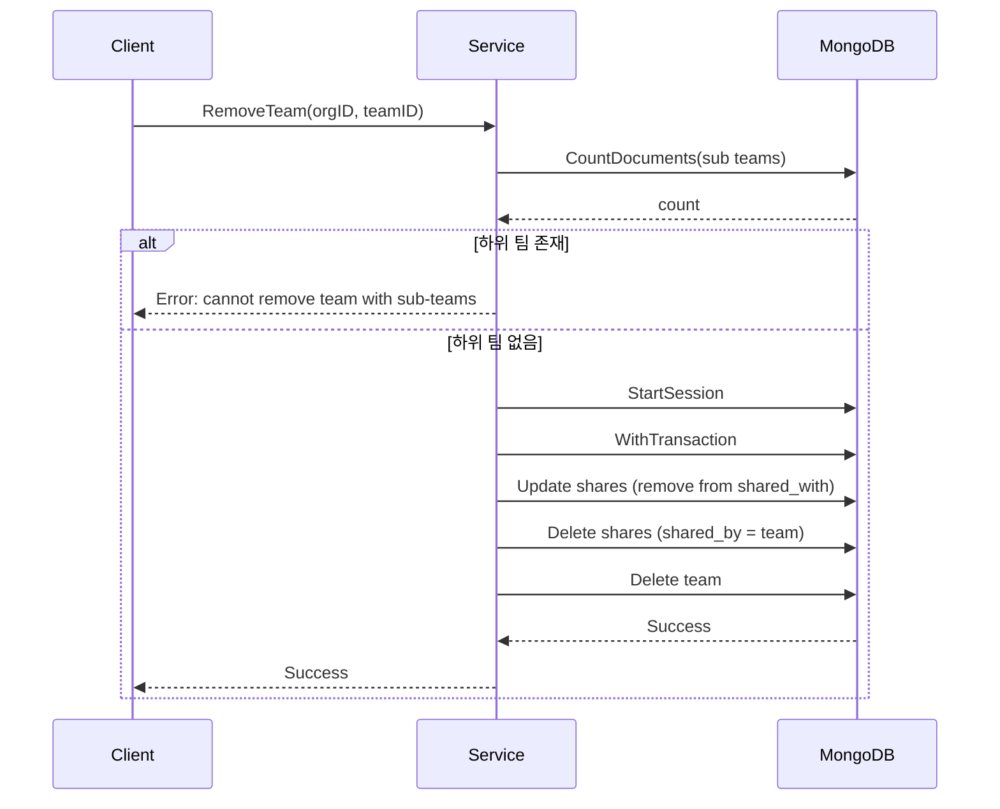

## 문제의 발견

팀 관련 버그 리포트가 여러 건 들어왔다.

> "팀 이름을 변경했는데 하위 팀 경로가 그대로예요."
> "팀을 삭제했는데 데이터가 남아있어요."
> "팀 구조가 UI에서 이상하게 보여요."

로그와 데이터를 분석해보니 **15개의 팀 계층 관리 문제점**이 발견되었다.

## 문제 상황

### 1. 중복된 컬렉션 구조


```
organization_teams 컬렉션: 조직-팀 관계만 저장 (조인 테이블 역할)
teams 컬렉션: 실제 팀 엔티티 데이터 (organization_id 필드 포함)

→ 두 컬렉션이 같은 정보를 다르게 저장
→ 데이터 일관성 문제 발생 가능
```


### 2. 치명적 문제들 (15개 중 3개)

| 문제 | 설명 | 영향 |
|-----|------|-----|
| UpdateTeam | 팀 이름 변경 시 `fullpath` 업데이트 안됨 | 팀 계층 구조 손상, UI 오류 |
| RemoveTeam | 같은 문서를 두 번 삭제 시도 | 불필요한 에러 로그 |
| CreateTeam | 일반 팀 생성 시 `level: 0`, `fullpath: ""` | API 응답 시 잘못된 데이터 |

### 3. 자동 승격/이동으로 인한 예측 불가능성



기존에는 팀 삭제 시 하위 팀이 자동으로 루트 팀으로 승격되어 **사용자 의도와 다른 계층 구조 변경**이 발생했다.

## 해결책: 단일 소스의 진실 + 명시적 관리 정책

### 핵심 원칙

> **자동 승격/이동 금지**: 상위 팀 제거나 이동 시, 하위 팀이 자동으로 승격되거나 따라 이동하지 않는다.

### 1. Collection 통합


```go
// 변경 전: 두 컬렉션 사용
CollOrganizationTeams = "organization_teams"  // 조인 테이블
CollTeams = "teams"                           // 실제 데이터

// 변경 후: teams 컬렉션만 사용 (단일 소스의 진실)
CollTeams = "teams"  // organization_id 필드로 관계 표현
```


### 2. RemoveTeam: 하위 팀이 있으면 삭제 차단


```go
func (s *organizationService) RemoveTeam(ctx context.Context, orgID, teamID string) error {
    // 하위 팀 존재 여부 확인
    subTeamCount, err := s.services.MongoDB.Collection(models.CollTeams).CountDocuments(
        mongoCtx,
        bson.M{"parent_team_id": teamID, "organization_id": orgID},
    )
    if err != nil {
        return customErrors.Wrap("failed to count sub teams", err)
    }

    if subTeamCount > 0 {
        return customErrors.New(
            customErrors.ErrValidation,
            "cannot remove team with sub-teams: please remove or move sub-teams first",
            nil,
        )
    }

    // 하위 팀이 없으면 삭제 진행
    // ...
}
```


### 3. UpdateTeam: 이름 변경 시 fullpath/level 자동 업데이트


```go
func (s *organizationService) UpdateTeam(ctx context.Context, ...) (*models.Team, error) {
    // 1. 기존 팀 정보 조회
    var existingTeam models.Team
    if err := s.services.MongoDB.Collection(models.CollTeams).FindOne(ctx, filter).Decode(&existingTeam); err != nil {
        return nil, customErrors.New(customErrors.ErrNotFound, "team not found", err)
    }

    // 2. 이름 변경이 없으면 설명만 업데이트
    if existingTeam.Name == req.Name {
        // 설명만 업데이트
        return &updatedTeam, nil
    }

    // 3. 이름 변경 시 full_path 및 level 재계산
    var newFullPath string
    var newLevel int

    if existingTeam.ParentTeamID == "" {
        // 루트 팀인 경우
        newLevel = 1
        newFullPath = req.Name
    } else {
        // 하위 팀인 경우: 부모 경로 + 새 이름
        var parentTeam models.Team
        if err := s.services.MongoDB.Collection(models.CollTeams).FindOne(ctx,
            bson.M{"_id": existingTeam.ParentTeamID}).Decode(&parentTeam); err != nil {
            return nil, customErrors.New(customErrors.ErrDatabase, "failed to find parent team", err)
        }
        newLevel = parentTeam.Level + 1
        newFullPath = parentTeam.FullPath + "/" + req.Name
    }

    // 4. 하위 팀들의 full_path 및 level 재귀적으로 업데이트
    if err := s.updateSubTeamPaths(ctx, teamID); err != nil {
        return nil, customErrors.New(customErrors.ErrDatabase, "failed to update sub team paths", err)
    }

    return &updatedTeam, nil
}
```


**변경 시나리오:**

```
초기: Engineering
      └── Backend
          └── API

"Engineering" → "Tech"로 변경

결과:
- Tech (level: 1, fullpath: "Tech")
  └── Backend (level: 2, fullpath: "Tech/Backend")
      └── API (level: 3, fullpath: "Tech/Backend/API")
```

### 4. RemoveSubTeam: 고아(Orphan) 상태로 유지


```go
func (s *organizationService) RemoveSubTeam(ctx context.Context, parentTeamID, subTeamID string) error {
    // 하위 팀 업데이트: parent_team_id만 제거 (level, full_path는 그대로 유지)
    _, err := s.services.MongoDB.Collection(models.CollTeams).UpdateOne(ctx,
        bson.M{"_id": subTeamID},
        bson.M{"$set": bson.M{
            "parent_team_id": "",  // 부모 연결만 끊음
            "updated_at":     now,
            "updated_by":     user.ID,
        }},
    )

    // 결과: 고아 팀 생성
    // - parent_team_id: "" (부모 없음)
    // - level: 원래 레벨 유지 (예: 3)
    // - full_path: 원래 경로 유지 (예: "RootTeam/ParentTeam/SubTeam")

    return err
}
```


### 5. 고아 팀 API 지원


```go
type TeamTreeResponse struct {
    MainTree      *TeamTree  `json:"main_tree"`                  // 정상 루트 팀 트리
    OrphanedTrees []TeamTree `json:"orphaned_trees,omitempty"`   // 고아 팀 목록
    Warning       string     `json:"warning,omitempty"`          // 경고 메시지
}

type TeamTree struct {
    ID       string     `json:"id"`
    Name     string     `json:"name"`
    Level    int        `json:"level"`
    FullPath string     `json:"full_path"`
    Children []TeamTree `json:"children"`
    IsOrphan bool       `json:"is_orphan,omitempty"`  // 고아 팀 표시
}
```


**고아 팀 발견 쿼리:**


```javascript
db.teams.find({
    parent_team_id: "",
    $or: [
        { level: { $ne: 1 } },
        { full_path: { $regex: "/" } }
    ]
})
```


## 트랜잭션 적용

### AddSubTeam/RemoveSubTeam 트랜잭션


```go
func (s *organizationService) AddSubTeam(ctx context.Context, parentTeamID, subTeamID string) (*models.Team, error) {
    session, err := s.services.MongoDB.StartSession()
    if err != nil {
        return nil, customErrors.New(customErrors.ErrDatabase, "failed to start session", err)
    }
    defer session.EndSession(ctx)

    var updatedSubTeam models.Team
    _, err = s.services.MongoDB.WithTransaction(ctx, session, func(mongoCtx mongo.SessionContext) (any, error) {
        // 모든 DB 작업이 트랜잭션 내에서 실행
        // - parent_team_id 업데이트
        // - 권한 회수 및 부여
        // - updateSubTeamHierarchy 호출
        // - 업데이트된 팀 조회
        return nil, nil
    })

    return &updatedSubTeam, err
}
```


### RemoveTeam 시 shares 컬렉션 정리


```go
// 팀과 관련된 공유 정보 제거
// 1. 팀이 공유받은 리소스의 shared_with에서 팀 제거
shareFilter := bson.M{
    "shared_with": bson.M{
        "$elemMatch": bson.M{
            "type": models.SubjectTeam,
            "id":   teamID,
        },
    },
}
shareUpdate := bson.M{
    "$pull": bson.M{
        "shared_with": bson.M{
            "type": models.SubjectTeam,
            "id":   teamID,
        },
    },
}
s.services.MongoDB.Collection(models.CollShares).UpdateMany(mongoCtx, shareFilter, shareUpdate)

// 2. 팀이 소유한(shared_by) 공유 정보 삭제
shareDeleteFilter := bson.M{
    "shared_by.type": models.SubjectTeam,
    "shared_by.id":   teamID,
}
s.services.MongoDB.Collection(models.CollShares).DeleteMany(mongoCtx, shareDeleteFilter)
```


## 시퀀스 다이어그램

### 팀 삭제 흐름



## 결과

### 데이터 일관성 개선

| 지표 | Before | After |
|-----|--------|-------|
| 중복 컬렉션 | 2개 | 1개 (단일 소스) |
| fullpath 불일치 | 발생 | 없음 |
| 고아 팀 관리 | 불가능 | API 지원 |
| 트랜잭션 일관성 | 부분적 | 완전 |

### 완성도

| 카테고리 | 완성도 |
|---------|--------|
| 팀 계층 관리 정책 | 100% |
| fullpath/level 업데이트 | 100% |
| 고아 팀 API 지원 | 100% |
| Collection 통합 | 100% |
| 트랜잭션 일관성 | 100% |
| shares 컬렉션 정리 | 100% |

## 배운 점

### 1. 단일 소스의 진실 (Single Source of Truth)


```go
// 안티패턴: 중복 컬렉션
organization_teams (조인)
teams (데이터)
→ 동기화 필요, 불일치 가능

// 올바른 패턴: 단일 컬렉션
teams (organization_id 필드 포함)
→ 동기화 불필요, 일관성 보장
```


### 2. 자동 동작보다 명시적 동작


```go
// 안티패턴: 자동 승격
if 하위팀_존재 {
    하위팀_자동_루트_승격()  // 의도하지 않은 권한 변경
    상위팀_삭제()
}

// 올바른 패턴: 명시적 차단
if 하위팀_존재 {
    return Error("하위 팀을 먼저 처리하세요")
}
상위팀_삭제()
```


### 3. 고아 데이터는 숨기지 말고 노출


```go
// 안티패턴: 고아 팀 무시
return mainTree  // 고아 팀은 사라짐

// 올바른 패턴: 고아 팀 노출
return TeamTreeResponse{
    MainTree:      mainTree,
    OrphanedTrees: orphanedTrees,
    Warning:       "고아 팀이 발견되었습니다",
}
```


## 결론

팀 계층 관리 개선의 핵심:

1. **단일 소스의 진실:** 중복 컬렉션 제거로 데이터 일관성 보장
2. **명시적 관리 정책:** 자동 승격/이동 금지, 사용자 명시적 조치 유도
3. **fullpath 자동 동기화:** 이름 변경 시 하위 팀 경로 자동 업데이트
4. **고아 팀 노출:** 문제를 숨기지 않고 API로 노출하여 관리 가능하게

**데이터 구조는 "중복 없이 명확하게", 동작은 "예측 가능하게".**
