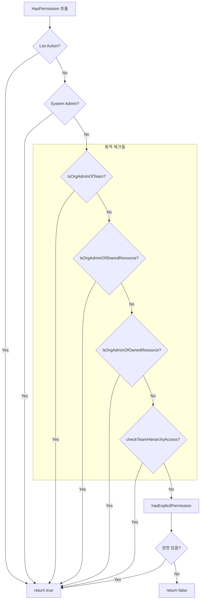
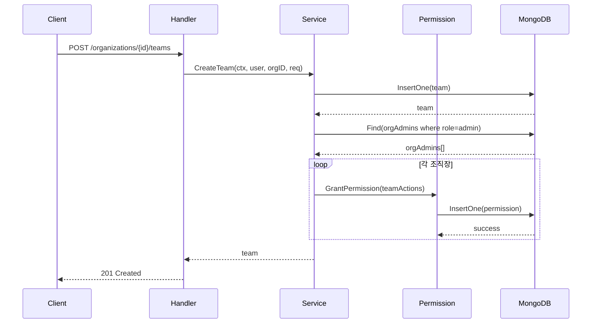
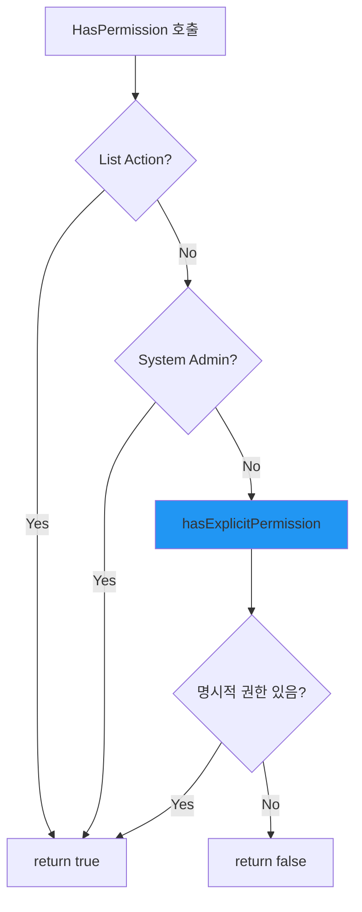

## 문제의 발견

권한 관련 버그와 혼란이 지속적으로 발생했다.

> "조직장인데 왜 팀에 접근이 안 되죠?"
> "권한이 언제 부여되고 언제 회수되는지 모르겠어요."
> "헷갈려요. 그냥 명시적으로 주는 걸로 해주세요."

사용자의 직접적인 피드백이 설계 변경의 시작점이었다.

## 문제 상황

### 동적 권한 체크의 복잡성


```go
// 기존 hasPermissionLegacy 함수
func (s *permissionService) hasPermissionLegacy(...) (bool, error) {
    // 1. System Admin 체크
    // 2. IsOrganizationAdminOfTeam 체크 (동적)
    // 3. IsOrganizationAdminOfSharedResource 체크 (동적)
    // 4. IsOrganizationAdminOfOwnedResource 체크 (동적)
    // 5. checkTeamHierarchyResourceAccess 체크 (동적)
    // 6. 명시적 권한 체크

    // 매번 여러 DB 쿼리 발생
    // 권한이 실제로 DB에 저장되지 않아 추적 불가
}
```


### 동적 체크의 문제점

| 문제 | 설명 |
|-----|------|
| 복잡성 | 권한 체크 로직이 여러 동적 함수로 분산 |
| 성능 | 권한 체크 시마다 다수의 DB 쿼리 발생 |
| 추적 불가 | 권한이 DB에 저장되지 않아 히스토리 추적 불가 |
| 디버깅 어려움 | 동적 계산 결과 예측이 어려움 |

### 권한 체크 흐름 (기존)



## 해결책: 명시적 권한 부여로 전환

### 핵심 원칙

> **동적 체크 제거, 명시적 권한만 확인**: 권한은 반드시 DB에 저장되어야 하고, 권한 체크는 저장된 권한만 확인한다.

### 1. 권한 체크 로직 단순화


```go
func (s *permissionService) hasPermissionLegacy(...) (bool, error) {
    // 1. list action은 각 서비스에서 처리
    if len(actions) == 1 && actions[0] == models.ActionList {
        return true, nil
    }

    // 2. 시스템 관리자 확인
    if subject.Type == models.SubjectUser {
        if isAdmin, err := s.IsSystemAdmin(ctx, subject.ID); err == nil && isAdmin {
            return true, nil
        }
    }

    // 3. 명시적 권한 확인 (DB 쿼리 1회)
    hasExplicit, err := s.hasExplicitPermission(ctx, subject, resource, actions, resourceID)
    if err != nil {
        return false, customErrors.New(customErrors.ErrDatabase, "failed to check explicit permission", err)
    }
    if hasExplicit {
        return true, nil
    }

    // 4. 모든 검사 실패 - 권한 없음
    return false, nil
}
```


### 2. 팀 생성 시 조직장 권한 자동 부여


```go
func (s *organizationService) CreateTeam(...) (*models.Team, error) {
    // ... 기존 팀 생성 로직 ...

    // 조직장에게 팀 권한 명시적 부여
    if err := s.grantTeamPermissionsToOrgAdmins(ctx, orgID, team.ID); err != nil {
        s.logger.Warnf("failed to grant team permissions to org admins: %v", err)
        // 권한 부여 실패가 팀 생성을 막지 않음
    }

    return team, nil
}

func (s *organizationService) grantTeamPermissionsToOrgAdmins(ctx context.Context, orgID, teamID string) error {
    // 조직의 모든 조직장 조회
    cursor, err := s.services.MongoDB.Collection(models.CollOrganizationMembers).Find(ctx, bson.M{
        "organization_id": orgID,
        "role":            models.OrgRoleAdmin,
    })
    if err != nil {
        return customErrors.Wrap("failed to find org admins", err)
    }
    defer cursor.Close(ctx)

    var orgAdmins []models.OrganizationMember
    if err := cursor.All(ctx, &orgAdmins); err != nil {
        return customErrors.Wrap("failed to decode org admins", err)
    }

    teamAdminActions := models.GetTeamAdminActions() // [read, edit, delete, manage]

    for _, admin := range orgAdmins {
        subject := models.Subject{
            Type: models.SubjectUser,
            ID:   admin.UserID,
        }
        // 조직장에게 팀 관리 권한 부여
        if _, err := s.services.Permission.GrantPermission(ctx, subject, models.ResourceTeam, teamAdminActions, teamID, nil); err != nil {
            s.logger.Warnf("failed to grant team permissions to org admin %s: %v", admin.UserID, err)
        }
    }
    return nil
}
```


### 3. 조직장 추가/승격 시 기존 팀 권한 부여


```go
func (s *organizationService) AddMember(...) ([]models.OrganizationMember, error) {
    // ... 기존 멤버 추가 로직 ...

    // 조직장으로 추가된 경우 기존 모든 팀에 대한 권한 부여
    for _, req := range reqs {
        if req.Role == string(models.OrgRoleAdmin) {
            teams, err := s.getAllTeamsForOrganization(ctx, orgID)
            if err != nil {
                s.logger.Warnf("failed to list teams: %v", err)
                continue
            }

            teamAdminActions := models.GetTeamAdminActions()
            subject := models.Subject{Type: models.SubjectUser, ID: req.UserID}

            for _, team := range teams {
                if _, err := s.services.Permission.GrantPermission(ctx, subject, models.ResourceTeam, teamAdminActions, team.ID, nil); err != nil {
                    s.logger.Warnf("failed to grant team permission: %v", err)
                }
            }
        }
    }

    return members, nil
}
```


### 4. 조직장 강등/멤버 제거 시 권한 회수


```go
// 조직장 → 일반 멤버 강등 시
if originalMember.Role == models.OrgRoleAdmin && req.Role == string(models.OrgRoleMember) {
    teams, _ := s.getAllTeamsForOrganization(mongoCtx, orgID)
    teamAdminActions := models.GetTeamAdminActions()

    for _, team := range teams {
        s.services.Permission.RevokePermission(mongoCtx, subject, models.ResourceTeam, teamAdminActions, team.ID)
    }
}

// 멤버 제거 시
teams, _ := s.getAllTeamsForOrganization(mongoCtx, orgID)
teamAdminActions := models.GetTeamAdminActions()

for _, team := range teams {
    s.services.Permission.RevokePermission(mongoCtx, subject, models.ResourceTeam, teamAdminActions, team.ID)
}
```


## 마이그레이션 구현

### 기존 배포 환경을 위한 마이그레이션


```go
func (s *permissionService) MigrateOrgAdminTeamPermissions(ctx context.Context) error {
    s.logger.Info("Starting org admin team permissions migration...")

    var (
        totalOrgCount   int
        appliedCount    int
        skippedCount    int
        processedAdmins = make(map[string]bool) // 중복 방지
    )

    // 1. 모든 조직 조회
    orgCursor, _ := s.services.MongoDB.Collection(models.CollOrganizations).Find(ctx, bson.M{})
    teamAdminActions := models.GetTeamAdminActions()

    for orgCursor.Next(ctx) {
        totalOrgCount++
        var org models.Organization
        orgCursor.Decode(&org)

        // 2. 조직의 조직장 조회
        adminCursor, _ := s.services.MongoDB.Collection(models.CollOrganizationMembers).Find(ctx, bson.M{
            "organization_id": org.ID,
            "role":            models.OrgRoleAdmin,
        })

        var orgAdmins []models.OrganizationMember
        adminCursor.All(ctx, &orgAdmins)
        adminCursor.Close(ctx)

        // 3. 조직의 모든 팀 조회
        teamCursor, _ := s.services.MongoDB.Collection(models.CollTeams).Find(ctx, bson.M{
            "organization_id": org.ID,
        })

        var teams []models.Team
        teamCursor.All(ctx, &teams)
        teamCursor.Close(ctx)

        // 4. 각 조직장에게 모든 팀 권한 부여
        for _, admin := range orgAdmins {
            subject := models.Subject{Type: models.SubjectUser, ID: admin.UserID}

            for _, team := range teams {
                key := admin.UserID + ":" + team.ID
                if processedAdmins[key] {
                    skippedCount++
                    continue
                }
                processedAdmins[key] = true

                // 이미 권한이 있는지 확인 (멱등성)
                hasPerm, _ := s.hasExplicitPermission(ctx, subject, models.ResourceTeam, teamAdminActions, team.ID)
                if hasPerm {
                    skippedCount++
                    continue
                }

                // 권한 부여
                s.GrantPermission(ctx, subject, models.ResourceTeam, teamAdminActions, team.ID, nil)
                appliedCount++
            }
        }
    }

    s.logger.Infof("Migration completed: orgs=%d applied=%d skipped=%d", totalOrgCount, appliedCount, skippedCount)
    return nil
}
```


## 시퀀스 다이어그램

### 팀 생성 시 권한 부여



### 권한 체크 흐름 (변경 후)



## 결과

### 성능 개선

| 지표 | Before | After |
|-----|--------|-------|
| 권한 체크 DB 쿼리 | 4-6회 | 1회 |
| 권한 체크 시간 | 변동 | 20-30% 감소 |
| 권한 추적 | 불가능 | 가능 |
| 디버깅 용이성 | 어려움 | 쉬움 |

### 권한 부여 시점

| 이벤트 | 권한 부여 |
|-------|----------|
| 팀 생성 | 모든 조직장에게 팀 권한 부여 |
| 조직장 추가 | 기존 모든 팀 권한 부여 |
| 일반 멤버 → 조직장 | 기존 모든 팀 권한 부여 |
| 조직장 → 일반 멤버 | 모든 팀 권한 회수 |
| 멤버 제거 | 모든 팀 권한 회수 |

## 추가 마이그레이션

### 조직장의 공유/소유 리소스 권한


```go
// MigrateOrgAdminSharedResourcePermissions
// - 조직/팀에 공유된 모든 리소스에 대해 조직장에게 권한 부여
// - Agent: [read, edit, delete, execute, share]
// - Session: [read, edit, delete, write, share]
// - File: [read, edit, delete, download, share]

// MigrateOrgAdminOwnedResourcePermissions
// - 조직/팀이 소유한 모든 리소스에 대해 조직장에게 권한 부여
```


### 팀 계층 권한


```go
// MigrateTeamHierarchyResourcePermissions
// - 상위 팀장: 하위팀 리소스에 대한 모든 권한
// - 상위 팀원: 하위팀 리소스에 대한 기본 권한
//   - Agent: [read, execute]
//   - Session: [read]
//   - File: [read, download]
```


## 배운 점

### 1. 동적 체크보다 명시적 권한


```go
// 안티패턴: 동적 체크
func hasPermission() bool {
    if isOrgAdmin() { return true }  // 매번 계산
    if isTeamLead() { return true }  // 매번 계산
    // ...
}

// 올바른 패턴: 명시적 권한
func hasPermission() bool {
    return hasExplicitPermission()  // DB에서 조회
}
```


### 2. 권한은 저장되어야 추적 가능


```go
// 안티패턴: 동적 계산 (추적 불가)
if isOrgAdminOf(team) {
    return true  // 권한 히스토리 없음
}

// 올바른 패턴: 명시적 저장 (추적 가능)
GrantPermission(subject, resource, actions, resourceID)
// → permissions 컬렉션에 저장
// → 언제 부여되었는지 추적 가능
```


### 3. 마이그레이션 멱등성 보장


```go
// 이미 권한이 있는지 확인
hasPerm, _ := s.hasExplicitPermission(ctx, subject, resource, actions, resourceID)
if hasPerm {
    skippedCount++
    continue  // 중복 부여 방지
}

// 여러 번 실행해도 결과는 동일
s.GrantPermission(ctx, subject, resource, actions, resourceID, nil)
```


## 결론

동적 권한 체크에서 명시적 권한 부여로 전환의 핵심:

1. **권한 체크 단순화:** System Admin + 명시적 권한만 확인
2. **자동 권한 부여:** 팀 생성, 조직장 추가/승격 시 자동 권한 부여
3. **자동 권한 회수:** 강등, 멤버 제거 시 자동 권한 회수
4. **마이그레이션:** 기존 데이터에 대한 멱등성 있는 마이그레이션

**권한은 "계산"이 아니라 "부여"되어야 한다.**
