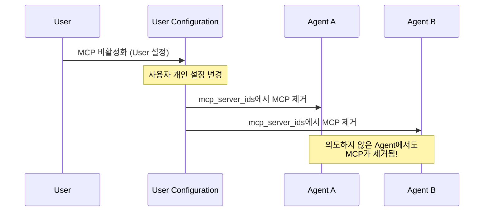
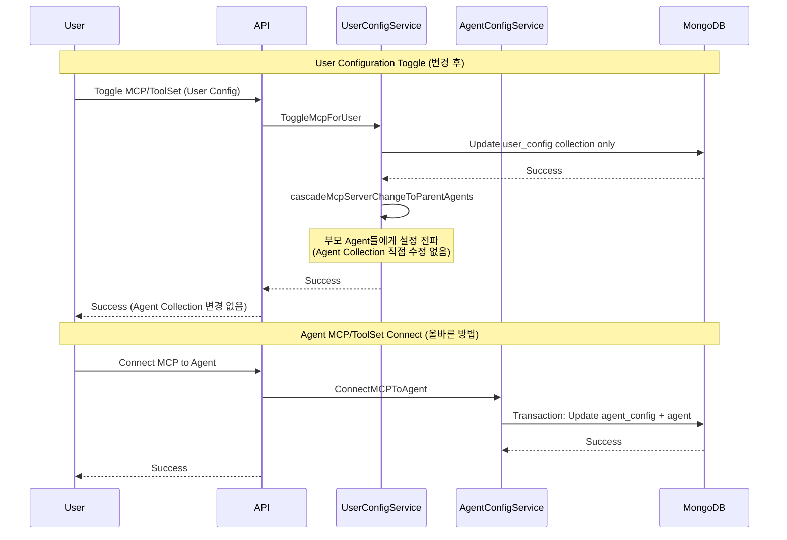

## 문제의 발견

MCP/ToolSet 관련 혼란스러운 동작이 보고되었다.

> "User Configuration에서 MCP를 비활성화했는데 왜 Agent에서도 사라지죠?"
> "의도하지 않은 Agent에 MCP가 연결되어 있어요."

로그를 분석해보니 **개념 혼동으로 인한 데이터 불일치**였다.

## 문제 상황

### 기존 구현의 문제


```go
func (s *mcpService) ToggleMcpForUser(...) (*models.McpServer, error) {
    // ... User Configuration 업데이트 ...

    // 문제: Agent Collection 자동 업데이트
    if err := s.updateAgentCollectionMcpServerIds(ctx, user.ID, request.ID, request.IsEnabled); err != nil {
        s.logger.Warnf("toggle mcp for user: %s", err)
    }

    return &mcpServer, nil
}
```


User Configuration toggle이 **모든 Agent의 `mcp_server_ids`를 자동으로 업데이트**하고 있었다.

### 개념 혼동으로 인한 문제

| 문제 | 설명 |
|-----|------|
| 개념 혼동 | User 설정과 Agent 연결이 혼재 |
| 데이터 불일치 | 의도하지 않은 Agent에 MCP 연결/해제 |
| 명시성 부재 | 암묵적 연결로 예측 불가능한 동작 |

### 문제 시나리오



## 해결책: 개념 분리

### 핵심 원칙

> **User Configuration과 Agent Collection은 완전히 독립적인 개념**

### 개념 정의

**User Configuration (`user_config` collection):**
- 사용자가 **사용할 수 있는** MCP/ToolSet 목록
- 사용자 개인 설정
- Agent와 독립적

**Agent Collection (`agent` collection):**
- Agent에 **연결된** MCP/ToolSet 목록
- `ConnectMCPToAgent` / `DisconnectMCPFromAgent` API로만 변경
- 명시적 연결/해제 필요

### 변경 후 구현


```go
func (s *mcpService) ToggleMcpForUser(...) (*models.McpServer, error) {
    // 1. MCP 서버 조회
    // 2. User Configuration 업데이트 (EnableMCPForUser / DisableMCPForUser)

    // Note: User Configuration toggle은 Agent Collection을 직접 수정하지 않음
    // Agent Collection의 mcp_server_ids는 Agent에 MCP를 연결/해제할 때만 변경됨

    // 3. MCP 서버 변경을 부모 Agent들에게 전파
    // (Agent Collection을 직접 수정하지 않고, 설정만 전파)
    if err := s.cascadeMcpServerChangeToParentAgents(ctx, user.ID, request.ID, request.IsEnabled); err != nil {
        s.logger.Warnf("toggle mcp for user: %s", err)
    }

    return &mcpServer, nil
}
```


### Cascade 함수의 역할


```go
// cascadeMcpServerChangeToParentAgents
// 중요: Agent Collection의 mcp_server_ids를 직접 수정하지 않음!

func (s *mcpService) cascadeMcpServerChangeToParentAgents(ctx context.Context, userID, mcpID string, isEnabled bool) error {
    // 1. 사용자가 소유한 Agent들 조회 (Ownership 서비스 사용)
    agents, err := s.services.Ownership.GetOwnedAgents(ctx, userID)
    if err != nil {
        return err
    }

    // 2. 각 Agent를 SubAgent로 사용하는 부모 Agent들 찾기
    for _, agent := range agents {
        parentAgents, err := s.findParentAgentsUsingSubAgent(ctx, agent.ID)
        if err != nil {
            continue
        }

        // 3. 부모 Agent의 Configuration에 변경사항 전파
        for _, parentAgent := range parentAgents {
            // Agent Configuration과 Session Configuration 업데이트
            // (Agent Collection의 mcp_server_ids는 수정하지 않음!)
            s.propagateToConfigurations(ctx, parentAgent.ID, mcpID, isEnabled)
        }
    }

    return nil
}
```


## 데이터 흐름

### 변경 후 흐름



### 올바른 API 사용

| 목적 | API | 영향 |
|-----|-----|-----|
| 사용자 설정 변경 | `ToggleMcpForUser` | user_config만 변경 |
| Agent에 MCP 연결 | `POST /agents/{id}/mcps/{mcpId}` | agent + agent_config 변경 |
| Agent에서 MCP 해제 | `DELETE /agents/{id}/mcps/{mcpId}` | agent + agent_config 변경 |

## 삭제된 코드

다음 함수/핸들러들이 완전히 제거되었다:


```go
// 제거된 함수들
updateAgentCollectionMcpServerIds       // Agent Collection 직접 수정
updateAgentCollectionToolSetIds         // Agent Collection 직접 수정
updateAgentCollectionMcpServerIdsDirect // 직접 수정 (Direct 버전)
updateAgentCollectionToolSetIdsDirect   // 직접 수정 (Direct 버전)

// 제거된 핸들러들
HandleUpdateMcpAgentConfig              // Lock Queue 핸들러
HandleUpdateToolSetAgentConfig          // Lock Queue 핸들러

// 제거된 작업 타입
LockOpUpdateMcpAgentConfig              // Lock 작업 타입
LockOpUpdateToolSetAgentConfig          // Lock 작업 타입
```


## 결과

### 데이터 일관성 개선

| 지표 | Before | After |
|-----|--------|-------|
| 개념 분리 | 혼재 | 완전 분리 |
| 의도하지 않은 변경 | 발생 | 없음 |
| Agent 연결 방식 | 암묵적 + 명시적 | 명시적만 |
| Toggle 성능 | Agent 수에 비례 | 일정 (user_config만) |

### 명확한 책임 분리

**User Configuration Service:**
- 사용자 개인 설정 관리
- 사용 가능한 MCP/ToolSet 활성화/비활성화
- Agent Collection 수정 **안 함**

**Agent Configuration Service:**
- Agent에 MCP/ToolSet 연결/해제
- 트랜잭션으로 agent + agent_config 동시 업데이트
- 명시적 API 호출 필요

## 배운 점

### 1. 개념 분리의 중요성


```go
// 안티패턴: 두 개념이 혼재
func ToggleMcpForUser() {
    updateUserConfig()              // 사용자 설정
    updateAllAgentCollections()     // Agent 연결 (암묵적)
}

// 올바른 패턴: 개념 분리
func ToggleMcpForUser() {
    updateUserConfig()              // 사용자 설정만
}

func ConnectMCPToAgent() {
    updateAgentConfig()             // Agent 연결 (명시적)
    updateAgentCollection()
}
```


### 2. 암묵적 동작은 혼란을 야기


```go
// 안티패턴: 암묵적 연결
// "User 설정 변경" → "모든 Agent에 자동 반영"
// 사용자: "왜 다른 Agent에도 영향이?"

// 올바른 패턴: 명시적 연결
// "User 설정 변경" → "User 설정만 변경"
// "Agent에 MCP 연결" → "해당 Agent만 변경"
// 사용자: "예상대로 동작하네"
```


### 3. Cascade는 "직접 수정"이 아닌 "전파"


```go
// 안티패턴: Cascade가 직접 수정
func cascade() {
    for _, agent := range agents {
        agent.mcp_server_ids = append(...)  // 직접 수정
    }
}

// 올바른 패턴: Cascade는 설정 전파
func cascade() {
    for _, parentAgent := range parentAgents {
        // Agent Collection은 수정하지 않음
        // Configuration만 전파
        propagateToConfigurations(parentAgent.ID, ...)
    }
}
```


## 결론

User Configuration과 Agent Collection 분리의 핵심:

1. **개념 분리:** User 설정과 Agent 연결은 독립적인 개념
2. **명시적 API:** Agent 연결은 반드시 전용 API로만 변경
3. **Cascade 역할 명확화:** 직접 수정이 아닌 설정 전파
4. **Dead Code 제거:** 혼란을 야기하는 함수/핸들러 완전 제거

**"설정 변경"과 "연결 관리"는 별개의 작업이다.**
