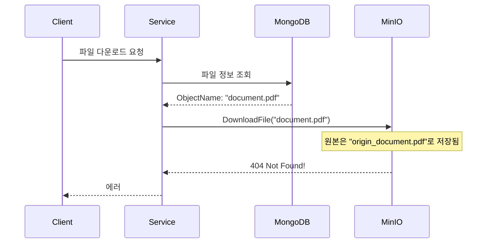
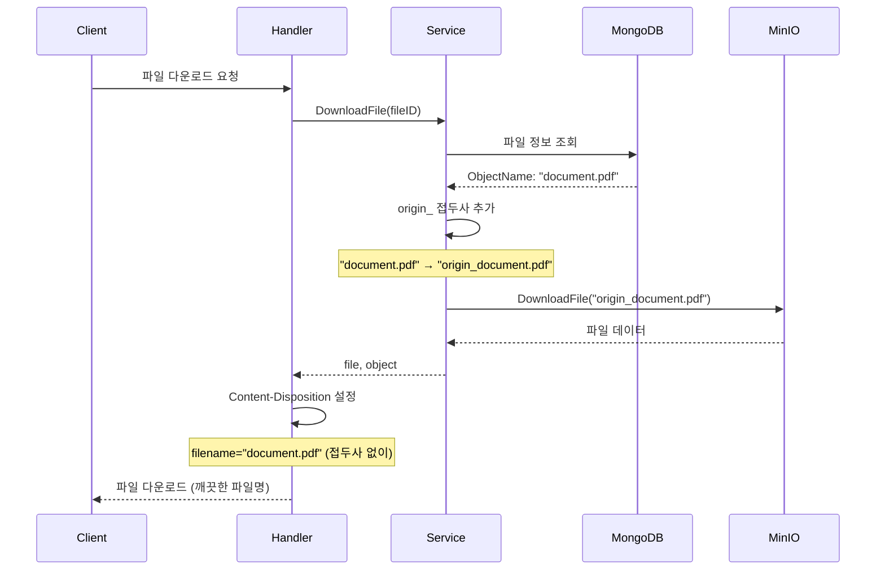

## 문제의 발견

파일 다운로드 시 간헐적으로 404 에러가 발생했다.

> "분명히 업로드한 파일인데 다운로드가 안 돼요."

로그를 분석해보니 **파일명 불일치** 문제였다.

## 문제 상황

### 파일 저장 구조


```
MongoDB (메타데이터)
└── files
    └── ObjectName: "document.pdf"  ← 접두사 없음 (DRM 해제된 이름)

MinIO (실제 파일)
└── bucket
    ├── origin_document.pdf  ← 원본 파일 (접두사 있음)
    └── document.pdf         ← DRM 해제된 파일 (접두사 없음)
```


### 문제 발생 시나리오



### 왜 이런 구조인가?

**DRM 처리 흐름:**
1. 사용자가 파일 업로드
2. 원본 파일은 `origin_` 접두사로 MinIO에 저장
3. DRM 서비스가 파일 처리
4. 처리된 파일은 접두사 없이 MinIO에 저장
5. MongoDB에는 **DRM 해제된 파일명** (접두사 없음)이 저장

**이유:**
- Agent Engine 등 다른 서비스는 DRM 해제된 파일을 사용
- MongoDB 메타데이터는 **논리적 파일명**을 저장
- 다운로드 시에는 **원본 파일**을 제공해야 함

## 해결책: 다운로드 시 접두사 동적 추가

### 핵심 로직


```go
func (s *fileService) DownloadFile(ctx context.Context, fileID string) (*models.File, *minio.Object, error) {
    // 1. MongoDB에서 파일 메타데이터 조회
    file, err := s.GetFile(ctx, fileID)
    if err != nil {
        return nil, nil, err
    }

    // 2. MinIO ObjectName 결정: origin_ 접두사 추가
    originObjectName := file.ObjectName
    if !strings.HasPrefix(originObjectName, "origin_") {
        // 폴더 경로 처리
        if lastSlash := strings.LastIndex(originObjectName, "/"); lastSlash >= 0 {
            dir := originObjectName[:lastSlash+1]
            filename := originObjectName[lastSlash+1:]
            originObjectName = dir + "origin_" + filename
        } else {
            originObjectName = "origin_" + originObjectName
        }
    }

    // 3. MinIO에서 원본 파일 다운로드
    obj, err := s.services.MinIO.DownloadFile(ctx, file.BucketName, originObjectName)
    if err != nil {
        return nil, nil, err
    }

    return file, obj, nil
}
```


### 폴더 경로 처리


```go
// 단순 파일명
// "document.pdf" → "origin_document.pdf"

// 폴더 경로 포함
// "reports/2025/document.pdf" → "reports/2025/origin_document.pdf"

// 이미 접두사 있음 (중복 방지)
// "origin_document.pdf" → "origin_document.pdf"
```


## 적용 범위

### 모든 버켓 타입에 동일 로직 적용


```go
// User Bucket
func (s *fileService) DownloadFile(...)

// Agent Bucket
func (s *agentService) DownloadAgentFile(...)

// Session Bucket
func (s *agentService) DownloadAgentSessionFile(...)
```


### 변경 후 흐름



## HTTP 응답 처리

### 사용자에게는 깨끗한 파일명 제공


```go
// Handler에서 Content-Disposition 헤더 설정
func (h *FileHandler) DownloadFile(c *gin.Context) {
    file, obj, err := h.fileService.DownloadFile(ctx, fileID)
    if err != nil {
        // 에러 처리
    }

    // 사용자에게는 접두사 없는 파일명 제공
    cleanFilename := strings.TrimPrefix(file.ObjectName, "origin_")
    c.Header("Content-Disposition", fmt.Sprintf(`attachment; filename="%s"`, cleanFilename))
    c.Header("Content-Type", file.ContentType)

    io.Copy(c.Writer, obj)
}
```


**결과:**
- MinIO에서는 `origin_document.pdf` 다운로드
- 사용자에게는 `document.pdf`로 표시

## 테스트 전략

### 테스트 케이스

| 케이스 | 입력 | 예상 MinIO 조회 |
|-------|-----|----------------|
| 단순 파일명 | `document.pdf` | `origin_document.pdf` |
| 폴더 경로 | `reports/doc.pdf` | `reports/origin_doc.pdf` |
| 이미 접두사 | `origin_doc.pdf` | `origin_doc.pdf` |
| 특수 문자 | `파일 (1).pdf` | `origin_파일 (1).pdf` |

### 버켓 타입별 테스트


```go
func TestFileService_DownloadFile_OriginPrefix(t *testing.T) {
    tests := []struct {
        name                string
        fileObjectName      string
        expectedMinIOObject string
    }{
        {
            name:                "simple filename",
            fileObjectName:      "document.pdf",
            expectedMinIOObject: "origin_document.pdf",
        },
        {
            name:                "with folder path",
            fileObjectName:      "reports/2025/document.pdf",
            expectedMinIOObject: "reports/2025/origin_document.pdf",
        },
        {
            name:                "already has prefix",
            fileObjectName:      "origin_document.pdf",
            expectedMinIOObject: "origin_document.pdf",
        },
    }

    for _, tt := range tests {
        t.Run(tt.name, func(t *testing.T) {
            // Mock 설정
            mockMinIO.On("DownloadFile", mock.Anything, mock.Anything, tt.expectedMinIOObject).Return(mockObject, nil)

            // 테스트 실행
            file, obj, err := service.DownloadFile(ctx, fileID)

            // 검증
            assert.NoError(t, err)
            mockMinIO.AssertCalled(t, "DownloadFile", mock.Anything, mock.Anything, tt.expectedMinIOObject)
        })
    }
}
```


## 결과

### 문제 해결

| 지표 | Before | After |
|-----|--------|-------|
| 다운로드 404 에러 | 발생 | 없음 |
| 파일명 일관성 | 불일치 | 일관 |
| 사용자 경험 | origin_ 노출 | 깨끗한 파일명 |

### 설계 원칙 준수

- **MongoDB:** 논리적 파일명 (DRM 해제된 이름)
- **MinIO:** 물리적 파일명 (원본 + DRM 해제 둘 다)
- **다운로드:** 원본 파일 제공, 깨끗한 파일명 표시

## 배운 점

### 1. 메타데이터와 저장소의 분리


```go
// 메타데이터는 논리적 이름
MongoDB: ObjectName = "document.pdf"

// 저장소는 물리적 이름
MinIO: "origin_document.pdf"

// 변환 로직은 서비스 레이어에서
Service: "document.pdf" → "origin_document.pdf"
```


### 2. 방어적 프로그래밍


```go
// 접두사 중복 방지
if !strings.HasPrefix(originObjectName, "origin_") {
    // 접두사 추가
}

// 폴더 경로 안전하게 처리
if lastSlash := strings.LastIndex(originObjectName, "/"); lastSlash >= 0 {
    // 마지막 파일명에만 접두사 추가
}
```


### 3. 사용자 경험과 내부 구현 분리


```go
// 내부: origin_ 접두사로 원본 파일 관리
MinIO.DownloadFile(bucket, "origin_document.pdf")

// 외부: 깨끗한 파일명 제공
Content-Disposition: filename="document.pdf"
```


## 결론

파일 다운로드 origin_ 접두사 처리의 핵심:

1. **메타데이터 분리:** MongoDB는 논리적 이름, MinIO는 물리적 이름
2. **동적 변환:** 다운로드 시점에 접두사 추가
3. **방어적 처리:** 중복 접두사, 폴더 경로 안전하게 처리
4. **UX 보장:** 사용자에게는 깨끗한 파일명 제공

**저장소와 메타데이터는 분리하되, 변환 로직은 한 곳에서 관리한다.**
