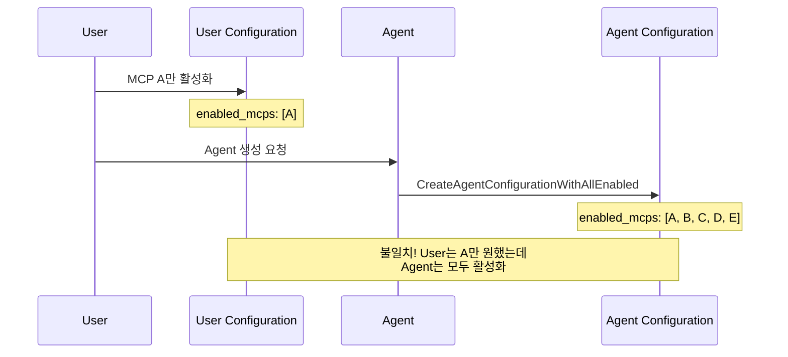
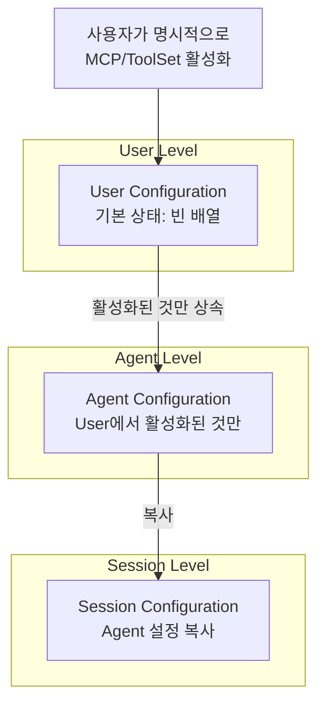
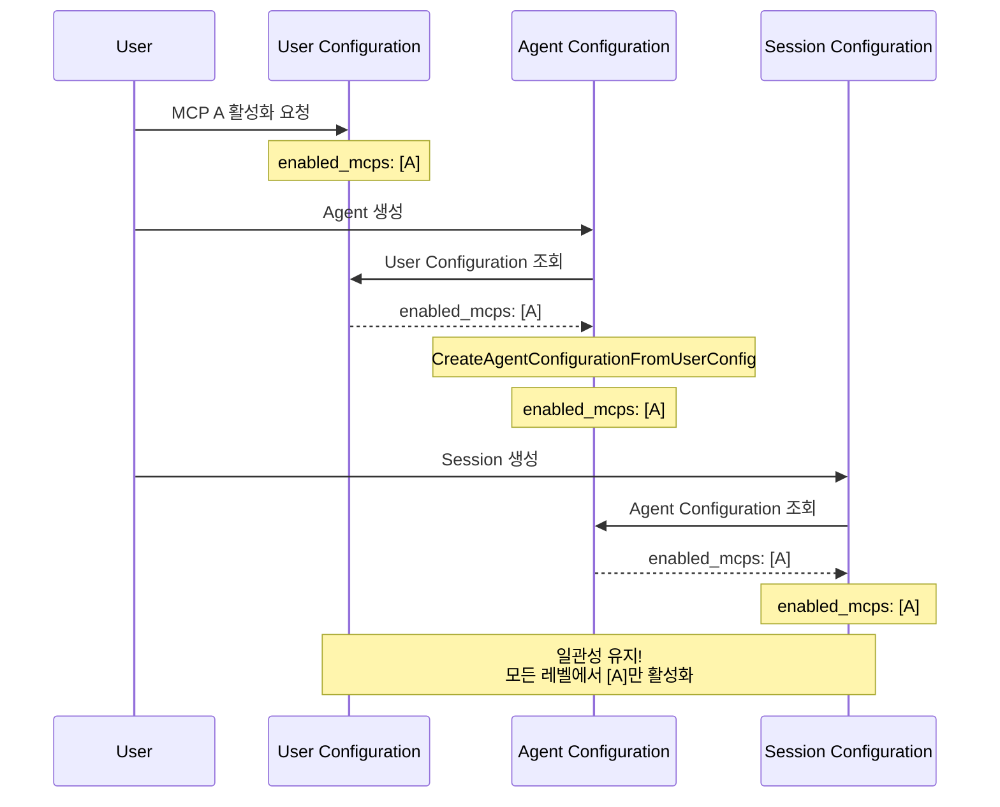

## 문제의 발견

Agent 생성 후 예상하지 못한 동작이 발생했다.

> "사용자가 활성화하지 않은 MCP가 Agent에서 사용 가능해요."
> "보안 점검에서 승인되지 않은 리소스 사용 문제가 나왔어요."

코드를 분석해보니 **Configuration 간의 상속 관계**가 없었다.

## 문제 상황

### 기존 구현의 문제


```go
// Agent 생성 시: 모든 MCP/ToolSet 자동 활성화
func CreateAgent(user *models.User, request CreateAgentRequest) (*models.Agent, error) {
    // ...
    CreateAgentConfigurationWithAllEnabled(agentID)  // 문제: 모든 것이 활성화됨
}
```


### 문제점

| 문제 | 설명 |
|-----|------|
| 과도한 활성화 | Agent 생성 시 모든 MCP/ToolSet 자동 활성화 |
| User 설정 무시 | User Configuration과 무관한 Agent 설정 |
| 보안 취약점 | 승인되지 않은 리소스 사용 가능 |
| 일관성 부재 | User → Agent → Session 간 설정 불일치 |

### 문제 시나리오



## 해결책: 계층적 상속 구조

### 핵심 원칙

> **Configuration은 상위 레벨에서 하위 레벨로 상속된다**

### 상속 구조



### User Configuration 기본 상태 변경


```go
// 변경 전: 모든 MCP/ToolSet 활성화 상태로 생성
func (s *userConfigService) CreateUserConfigurationWithAllEnabled(user *models.User) (*models.UserConfiguration, error) {
    allMcps, _ := s.getAllMcpServers(ctx)
    allToolSets, _ := s.getAllToolSets(ctx)

    config := &models.UserConfiguration{
        UserID:        user.ID,
        McpConfig:     allMcps,      // 모든 MCP 활성화
        ToolSetConfig: allToolSets,  // 모든 ToolSet 활성화
    }
}

// 변경 후: 빈 배열로 생성 (명시적 활성화 필요)
func (s *userConfigService) CreateUserConfiguration(user *models.User) (*models.UserConfiguration, error) {
    config := &models.UserConfiguration{
        UserID:        user.ID,
        McpConfig:     []models.McpConfig{},      // 빈 배열
        ToolSetConfig: []models.ToolSetConfig{},  // 빈 배열
    }
}
```


### Agent Configuration 상속 구현


```go
func (s *agentConfigService) CreateAgentConfigurationFromUserConfig(
    user *models.User,
    agentID string,
) (*models.AgentConfiguration, error) {

    // 1. User Configuration 조회
    userConfig, err := s.services.UserConfiguration.GetUserConfiguration(ctx, user)
    if err != nil {
        return nil, customErrors.Wrap("failed to get user configuration", err)
    }

    // 2. User Configuration에서 활성화된 것만 상속
    agentConfig := &models.AgentConfiguration{
        AgentID:       agentID,
        McpConfig:     filterEnabledMcps(userConfig.McpConfig),      // 활성화된 것만
        ToolSetConfig: filterEnabledToolSets(userConfig.ToolSetConfig), // 활성화된 것만
        CreatedAt:     time.Now(),
        CreatedBy:     user.ID,
    }

    // 3. MongoDB에 저장
    _, err = s.services.MongoDB.Collection(models.CollAgentConfigurations).InsertOne(ctx, agentConfig)

    return agentConfig, nil
}

// 활성화된 MCP만 필터링
func filterEnabledMcps(mcps []models.McpConfig) []models.McpConfig {
    var enabled []models.McpConfig
    for _, mcp := range mcps {
        if mcp.IsEnabled {
            enabled = append(enabled, mcp)
        }
    }
    return enabled
}
```


### Session Configuration 상속 (기존 유지)


```go
// Session은 Agent Configuration을 복사
func (s *sessionConfigService) CreateSessionConfigurationWithAgentData(
    sessionID, agentID, userID string,
) (*models.SessionConfiguration, error) {

    // 1. Agent Configuration 조회
    agentConfig, err := s.services.AgentConfiguration.GetAgentConfiguration(ctx, agentID)
    if err != nil {
        return nil, customErrors.Wrap("failed to get agent configuration", err)
    }

    // 2. Agent Configuration 복사
    sessionConfig := &models.SessionConfiguration{
        SessionID:     sessionID,
        McpConfig:     agentConfig.McpConfig,      // 복사
        ToolSetConfig: agentConfig.ToolSetConfig,  // 복사
        CreatedAt:     time.Now(),
        CreatedBy:     userID,
    }

    return sessionConfig, nil
}
```


## 변경 후 흐름

### 정상 상속 시나리오



## Agent 공유 검증 로직 수정

### 빈 Configuration 처리


```go
// 변경 전: Configuration이 비어있어도 검증 시도 → 실패
func (s *agentService) validateAgentShare(agentConfig *models.AgentConfiguration) error {
    if agentConfig != nil {
        // Configuration이 비어있어도 검증 시도
        for _, mcp := range agentConfig.McpConfig {
            // 검증 로직
        }
    }
}

// 변경 후: Configuration이 비어있으면 검증 건너뛰기
func (s *agentService) validateAgentShare(agentConfig *models.AgentConfiguration) error {
    // MCP 검증
    if agentConfig != nil && len(agentConfig.McpConfig) > 0 {
        for _, mcp := range agentConfig.McpConfig {
            // 검증 로직
        }
    }
    // Configuration이 비어있으면 검증 건너뛰기 (정상)

    // ToolSet 검증
    if agentConfig != nil && len(agentConfig.ToolSetConfig) > 0 {
        for _, toolSet := range agentConfig.ToolSetConfig {
            // 검증 로직
        }
    }

    return nil
}
```


## 적용 범위

### 영향 범위

| 대상 | 영향 | 호환성 |
|-----|------|--------|
| 신규 User | 빈 Configuration으로 시작 | 신규만 |
| 신규 Agent | User Configuration 상속 | 신규만 |
| 기존 Agent | 변경 없음 | 완전 호환 |
| Session | Agent Configuration 복사 (기존 유지) | 완전 호환 |

## 결과

### 일관성 보장

| 지표 | Before | After |
|-----|--------|-------|
| User-Agent 일관성 | 불일치 | 일치 |
| 명시적 활성화 | 자동 | 명시적 |
| 보안 | 취약 | 강화 |
| 설정 예측 가능성 | 낮음 | 높음 |

## 배운 점

### 1. 기본값은 최소 권한으로


```go
// 안티패턴: 모든 것 활성화
McpConfig: getAllMcps()  // 위험: 승인되지 않은 리소스 사용 가능

// 올바른 패턴: 빈 배열로 시작
McpConfig: []models.McpConfig{}  // 안전: 명시적 활성화 필요
```


### 2. 상속은 상위에서 하위로


```go
// 올바른 상속 구조
User Configuration (최상위)
    ↓ 활성화된 것만
Agent Configuration (중간)
    ↓ 복사
Session Configuration (최하위)
```


### 3. 빈 상태도 유효한 상태


```go
// 안티패턴: nil과 빈 배열을 다르게 처리
if config == nil || len(config) == 0 {
    return error  // 빈 상태를 에러로 처리
}

// 올바른 패턴: 빈 상태도 유효
if config != nil && len(config) > 0 {
    // 검증 로직
}
// 빈 상태면 검증 건너뛰기 (정상)
```


## 결론

Configuration 상속 구조의 핵심:

1. **계층적 상속:** User → Agent → Session 순서로 상속
2. **기본값 최소화:** 빈 배열로 시작, 명시적 활성화 필요
3. **일관성 보장:** 모든 레벨에서 동일한 활성화 상태
4. **하위 호환성:** 기존 데이터는 변경하지 않음

**"설정은 위에서 아래로 흐르고, 명시적 활성화만이 권한을 부여한다."**
