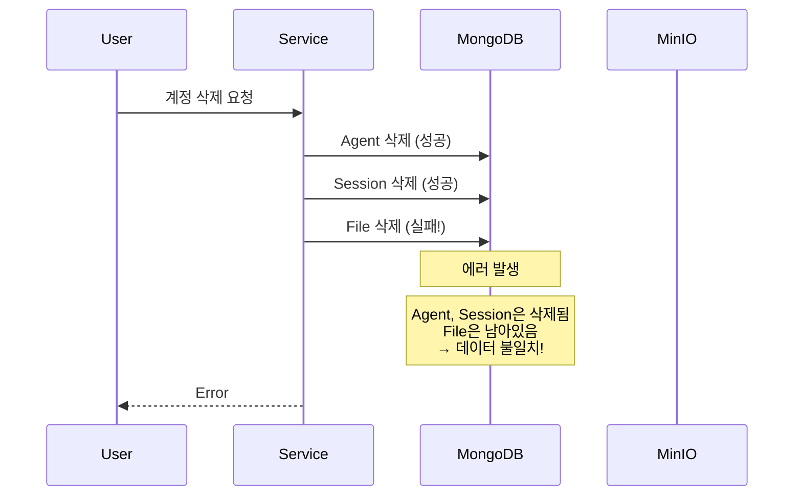
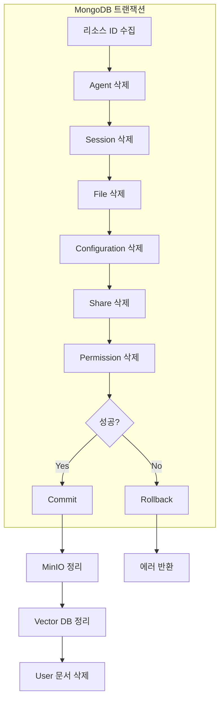
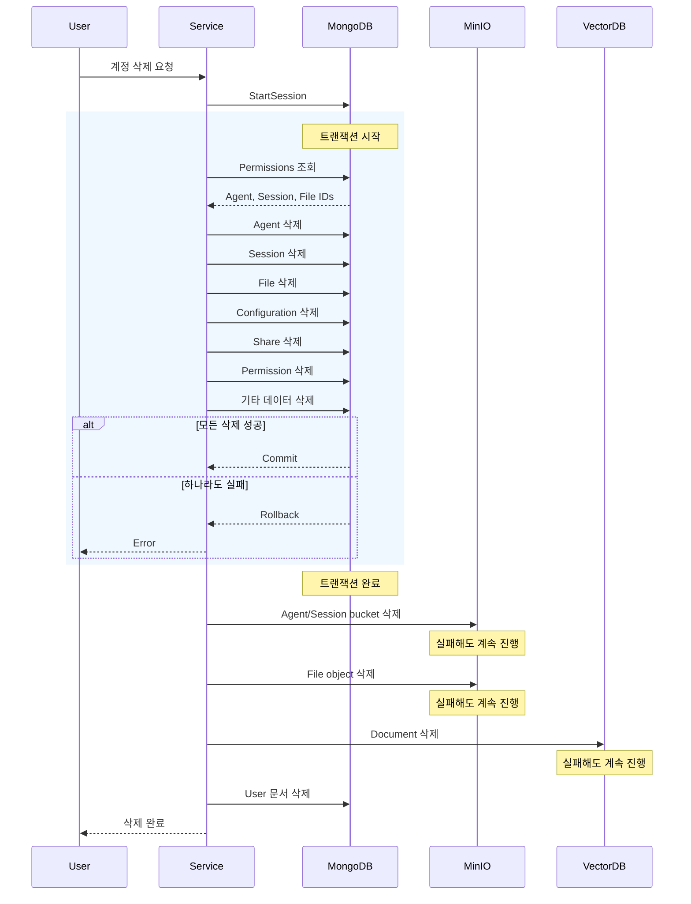

## 문제의 발견

사용자 계정 삭제 후 데이터 정합성 문제가 발생했다.

> "탈퇴한 사용자의 Agent가 아직 남아있어요."
> "삭제 중 에러가 났는데 일부 데이터만 삭제됐어요."

로그를 분석해보니 **트랜잭션 없이 순차 삭제**되고 있었다.

## 문제 상황

### 기존 구현의 문제


```go
func (s *userService) cleanupUserData(ctx context.Context, userID string) error {
    // 트랜잭션 없이 순차 삭제
    s.deleteUserAgents(ctx, userID)     // 실패 가능
    s.deleteUserSessions(ctx, userID)   // 실패 가능
    s.deleteUserFiles(ctx, userID)      // 실패 가능
    s.deleteUserTeams(ctx, userID)      // 실패 가능
    // 중간에 실패하면 일부만 삭제됨!
}
```


### 문제점

| 문제 | 설명 |
|-----|------|
| 원자성 부재 | 삭제 중 실패 시 롤백 불가 |
| 데이터 불일치 | 일부만 삭제된 상태로 남음 |
| Orphaned 리소스 | 주인 없는 Agent/Session/File 발생 |
| 정합성 위반 | 참조 무결성 깨짐 |

### 문제 시나리오



## 해결책: 트랜잭션 기반 캐스케이드 삭제

### 핵심 원칙

> **MongoDB 데이터는 트랜잭션 내에서, 외부 저장소는 트랜잭션 외부에서 처리**

### 삭제 구조



### 트랜잭션 구현


```go
func (s *userService) cleanupUserData(ctx context.Context, userID string) error {
    // MongoDB 트랜잭션 시작
    session, err := s.services.MongoDB.StartSession()
    if err != nil {
        return customErrors.New(customErrors.ErrDatabase, "failed to start session", err)
    }
    defer session.EndSession(ctx)

    // 트랜잭션 외부에서 사용할 리소스 ID 저장
    var userResourceIDs struct {
        agentIDs        []string
        sessionIDs      []string
        fileIDs         []string
        teamIDs         []string
        organizationIDs []string
    }

    // 트랜잭션 내에서 MongoDB 데이터 삭제
    _, err = session.WithTransaction(ctx, func(mongoCtx mongo.SessionContext) (any, error) {
        // 1. Permissions에서 소유 리소스 ID 수집
        permissions, err := s.getOwnedResourceIDs(mongoCtx, userID)
        if err != nil {
            return nil, err
        }

        // 리소스 ID 저장 (트랜잭션 외부에서 사용)
        userResourceIDs.agentIDs = permissions.AgentIDs
        userResourceIDs.sessionIDs = permissions.SessionIDs
        userResourceIDs.fileIDs = permissions.FileIDs

        // 2. Agent 관련 데이터 삭제
        if err := s.deleteAgentsInTransaction(mongoCtx, permissions.AgentIDs); err != nil {
            return nil, err
        }

        // 3. Session 관련 데이터 삭제
        if err := s.deleteSessionsInTransaction(mongoCtx, permissions.SessionIDs); err != nil {
            return nil, err
        }

        // 4. File 관련 데이터 삭제
        if err := s.deleteFilesInTransaction(mongoCtx, permissions.FileIDs); err != nil {
            return nil, err
        }

        // 5. 기타 데이터 삭제
        if err := s.deleteUserMiscDataInTransaction(mongoCtx, userID); err != nil {
            return nil, err
        }

        return nil, nil
    })

    if err != nil {
        s.logger.Errorf("transaction failed, rollback completed: %v", err)
        return err
    }

    // 트랜잭션 성공 후 외부 저장소 정리
    s.cleanupUserMinIOResources(ctx, userResourceIDs)
    s.cleanupUserVectorDBResources(ctx, userResourceIDs.fileIDs)

    return nil
}
```


### Agent 삭제 (트랜잭션 내)


```go
func (s *userService) deleteAgentsInTransaction(mongoCtx mongo.SessionContext, agentIDs []string) error {
    if len(agentIDs) == 0 {
        return nil
    }

    filter := bson.M{"_id": bson.M{"$in": agentIDs}}

    // 1. Agent 문서 삭제
    _, err := s.services.MongoDB.Collection(models.CollAgents).DeleteMany(mongoCtx, filter)
    if err != nil {
        return customErrors.Wrap("failed to delete agents", err)
    }

    // 2. Agent Configuration 삭제
    configFilter := bson.M{"agent_id": bson.M{"$in": agentIDs}}
    _, err = s.services.MongoDB.Collection(models.CollAgentConfigurations).DeleteMany(mongoCtx, configFilter)
    if err != nil {
        return customErrors.Wrap("failed to delete agent configurations", err)
    }

    // 3. Agent Share 삭제
    shareFilter := bson.M{
        "resource_type": models.ResourceAgent,
        "resource_id":   bson.M{"$in": agentIDs},
    }
    _, err = s.services.MongoDB.Collection(models.CollShares).DeleteMany(mongoCtx, shareFilter)
    if err != nil {
        return customErrors.Wrap("failed to delete agent shares", err)
    }

    // 4. Agent Permission 삭제
    permFilter := bson.M{
        "resource_type": models.ResourceAgent,
        "resource_id":   bson.M{"$in": agentIDs},
    }
    _, err = s.services.MongoDB.Collection(models.CollPermissions).DeleteMany(mongoCtx, permFilter)

    return err
}
```


### Team/Organization 처리


```go
// Team/Organization은 삭제하지 않음!
// 이유: 다른 멤버가 사용 중일 수 있음

func (s *userService) handleUserTeamsInTransaction(mongoCtx mongo.SessionContext, userID string, teamIDs []string) error {
    for _, teamID := range teamIDs {
        // 1. 팀 멤버 수 확인
        memberCount, _ := s.getTeamMemberCount(mongoCtx, teamID)

        if memberCount > 1 {
            // 다른 멤버가 있으면 User만 멤버에서 제거
            s.removeUserFromTeam(mongoCtx, teamID, userID)
            s.logger.Warnf("team %s has other members, removing user only (ownership transfer required)", teamID)
        } else {
            // User만 남은 경우에도 삭제하지 않음 (수동 처리 필요)
            s.logger.Warnf("team %s owned by deleted user, manual cleanup required", teamID)
        }
    }
    return nil
}
```


### MinIO 정리 (트랜잭션 외부)


```go
func (s *userService) cleanupUserMinIOResources(ctx context.Context, resourceIDs userResourceIDs) {
    // Agent bucket 삭제
    for _, agentID := range resourceIDs.agentIDs {
        bucketName := fmt.Sprintf("agent-%s", agentID)
        if err := s.services.MinIO.DeleteBucket(ctx, bucketName); err != nil {
            // 실패해도 계속 진행 (로그만 남김)
            s.logger.Warnf("failed to delete agent bucket %s: %v", bucketName, err)
        }
    }

    // Session bucket 삭제
    for _, sessionID := range resourceIDs.sessionIDs {
        bucketName := fmt.Sprintf("session-%s", sessionID)
        if err := s.services.MinIO.DeleteBucket(ctx, bucketName); err != nil {
            s.logger.Warnf("failed to delete session bucket %s: %v", bucketName, err)
        }
    }

    // File object 삭제
    for _, fileID := range resourceIDs.fileIDs {
        if err := s.services.MinIO.DeleteFile(ctx, fileID); err != nil {
            s.logger.Warnf("failed to delete file %s: %v", fileID, err)
        }
    }
}
```


### Vector DB 정리 (트랜잭션 외부)


```go
func (s *userService) cleanupUserVectorDBResources(ctx context.Context, fileIDs []string) {
    if len(fileIDs) == 0 {
        return
    }

    // Vector DB에서 문서 삭제
    for _, fileID := range fileIDs {
        if err := s.services.VectorDB.DeleteDocument(ctx, fileID); err != nil {
            // 실패해도 계속 진행 (로그만 남김)
            s.logger.Warnf("failed to delete vector document for file %s: %v", fileID, err)
        }
    }
}
```


## 전체 시퀀스



## 결과

### 데이터 정합성 개선

| 지표 | Before | After |
|-----|--------|-------|
| 원자성 | 없음 | 트랜잭션 보장 |
| 부분 삭제 | 발생 | 불가능 (롤백) |
| Orphaned 리소스 | 발생 | 없음 |
| 롤백 가능 | 불가 | 자동 롤백 |

### 삭제 대상 정리

| 리소스 | MongoDB | MinIO | Vector DB |
|-------|---------|-------|-----------|
| Agent | ✅ 트랜잭션 | ✅ 외부 | - |
| Session | ✅ 트랜잭션 | ✅ 외부 | - |
| File | ✅ 트랜잭션 | ✅ 외부 | ✅ 외부 |
| Team | ❌ 멤버 제거만 | - | - |
| Organization | ❌ 멤버 제거만 | - | - |

## 배운 점

### 1. 트랜잭션 범위는 동일 시스템으로 제한


```go
// 안티패턴: 다른 시스템을 트랜잭션에 포함
session.WithTransaction(func() {
    deleteFromMongoDB()
    deleteFromMinIO()      // 트랜잭션 불가!
    deleteFromVectorDB()   // 트랜잭션 불가!
})

// 올바른 패턴: MongoDB만 트랜잭션, 외부는 별도 처리
session.WithTransaction(func() {
    deleteFromMongoDB()  // 트랜잭션 내
})
deleteFromMinIO()        // 트랜잭션 외부 (실패해도 로그만)
deleteFromVectorDB()     // 트랜잭션 외부 (실패해도 로그만)
```


### 2. 리소스 ID는 트랜잭션 전에 수집


```go
var resourceIDs []string

session.WithTransaction(func(mongoCtx) {
    // 트랜잭션 내에서 ID 수집
    resourceIDs = getResourceIDs(mongoCtx)

    // 트랜잭션 내에서 MongoDB 삭제
    deleteDocuments(mongoCtx, resourceIDs)
})

// 트랜잭션 외부에서 ID 사용
cleanupMinIO(resourceIDs)  // 수집된 ID 사용
```


### 3. 외부 저장소 실패는 로그로 처리


```go
// 안티패턴: 외부 저장소 실패 시 전체 실패
if err := minIO.Delete(); err != nil {
    return err  // MongoDB 삭제 성공했는데 전체 실패?
}

// 올바른 패턴: 로그만 남기고 계속 진행
if err := minIO.Delete(); err != nil {
    logger.Warnf("failed to delete from MinIO: %v", err)
    // 계속 진행 - MongoDB는 이미 삭제됨
}
```


### 4. 공유 리소스는 삭제하지 않음


```go
// 안티패턴: Team을 자동 삭제
if userOwnsTeam(teamID) {
    deleteTeam(teamID)  // 다른 멤버가 있으면?
}

// 올바른 패턴: 멤버에서만 제거
if userOwnsTeam(teamID) {
    removeUserFromTeam(teamID, userID)
    logger.Warn("team ownership transfer required")
}
```


## 결론

트랜잭션 기반 사용자 삭제의 핵심:

1. **원자성 보장:** MongoDB 트랜잭션으로 전체 성공 또는 전체 롤백
2. **범위 제한:** 트랜잭션은 MongoDB만, 외부 저장소는 별도 처리
3. **Graceful 실패:** 외부 저장소 실패는 로그만 남기고 계속 진행
4. **공유 리소스 보호:** Team/Organization은 삭제하지 않고 멤버에서만 제거

**"트랜잭션은 원자성을, 로그는 추적성을 보장한다."**
