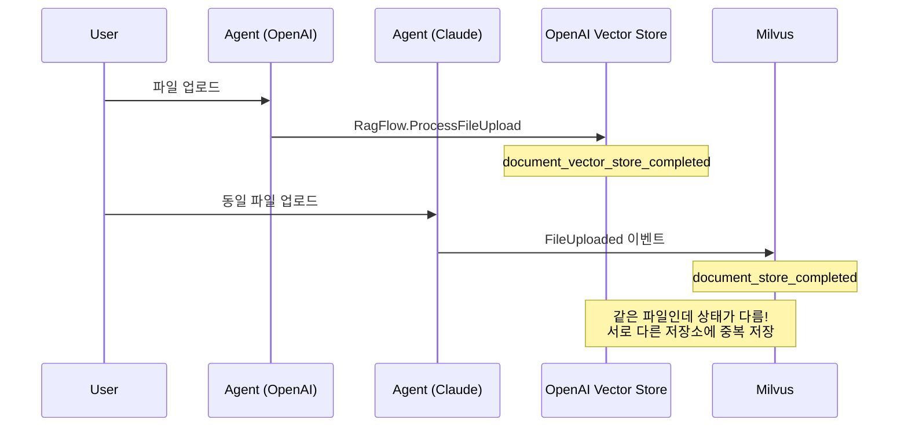
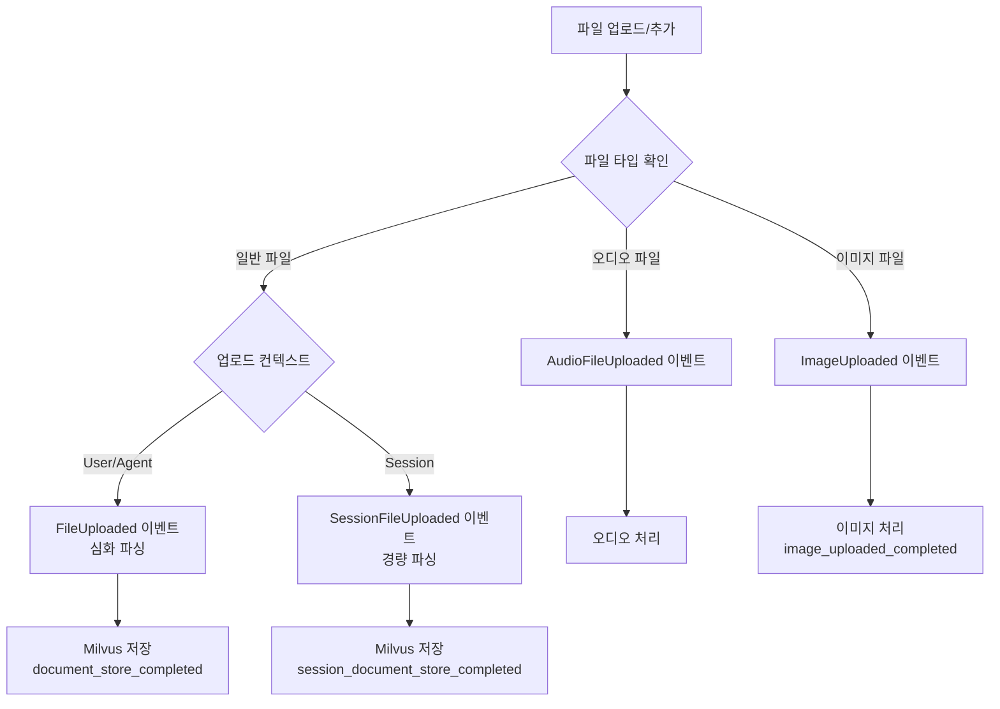
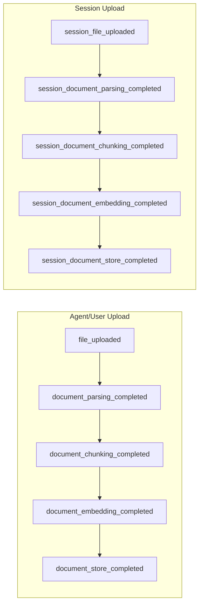

## 문제의 발견

파일 업로드와 추가 시 예상하지 못한 상태 불일치가 발생했다.

> "같은 파일인데 업로드 경로에 따라 상태가 달라요."
> "OpenAI 모델에서 업로드한 파일이 다른 모델에서 안 보여요."

코드를 분석해보니 **이중 벡터 저장소 구조**가 문제였다.

## 문제 상황

### 기존 시스템 구조


```go
// 모델 타입에 따른 분기
if agent.ModelType == "openai-api" {
    // OpenAI Vector Store 사용 (RagFlow 서비스)
    ragFlow.ProcessFileUpload(file)
} else {
    // Milvus 사용
    publishFileUploadedEvent(file)
}
```


### 발생하는 문제

| 문제 | 설명 |
|-----|------|
| 일관성 부족 | 같은 파일이 다른 상태로 저장 |
| 복잡한 분기 | 모델 타입에 따른 분기 처리 산재 |
| 유지보수 어려움 | 두 벡터 저장소 동시 관리 |
| Add/Upload 불일치 | Upload는 OpenAI, Add는 Milvus |

### 문제 시나리오



## 해결책: Milvus 단일 저장소 통일

### 핵심 원칙

> **모든 파일은 Milvus에 저장, 모델 타입에 따른 분기 제거**

### 통일된 처리 흐름



### Agent 파일 업로드 변경


```go
// 변경 전: 모델 타입에 따른 분기
func (s *agentService) UploadFileToAgent(ctx context.Context, agentID string, file *models.File) error {
    agent, _ := s.GetAgent(ctx, agentID)

    if agent.ModelType == "openai-api" {
        // OpenAI Vector Store 사용
        return s.services.RagFlow.ProcessFileUpload(ctx, file)
    } else {
        // Milvus 사용
        return s.publishFileUploadedEvent(ctx, file)
    }
}

// 변경 후: 파일 타입에 따른 분기 (모델 타입 무관)
func (s *agentService) UploadFileToAgent(ctx context.Context, agentID string, file *models.File) error {
    // 1. 오디오 파일 체크
    if s.publishAudioUploadEvent(ctx, file) {
        return nil
    }

    // 2. 이미지 파일 체크
    if models.IsImageFile(file.ContentType) {
        return s.publishImageUploadedEvent(ctx, file)
    }

    // 3. 일반 파일: 모든 모델에서 Milvus 사용
    return s.publishFileUploadedEvent(ctx, file)
}
```


### Session 파일 업로드 변경


```go
// 변경 전: 모델 타입에 따른 분기
func (s *agentService) UploadFileToAgentSession(ctx context.Context, sessionID string, file *models.File) error {
    agent, _ := s.getAgentBySessionID(ctx, sessionID)

    if agent.ModelType == "openai-api" {
        return s.services.RagFlow.ProcessFileUpload(ctx, file)
    } else {
        return s.publishSessionFileUploadedEvent(ctx, file)
    }
}

// 변경 후: 경량 파싱 이벤트 (모든 모델)
func (s *agentService) UploadFileToAgentSession(ctx context.Context, sessionID string, file *models.File) error {
    // 1. 오디오 파일 체크
    if s.publishAudioUploadEvent(ctx, file) {
        return nil
    }

    // 2. 이미지 파일 체크
    if models.IsImageFile(file.ContentType) {
        return s.publishImageUploadedEvent(ctx, file)
    }

    // 3. 일반 파일: 경량 파싱 이벤트 (Session 전용)
    message := &models.KafkaMessage{
        EventType: models.SessionFileUploaded,  // 경량 파싱
        FileID:    file.ID,
    }
    return s.services.Kafka.Publish(ctx, message)
}
```


### 파일 추가 (Add) 로직 변경


```go
// Agent에 파일 추가
func (s *agentService) AddFilesToAgent(ctx context.Context, agentID string, fileIDs []string) error {
    for _, fileID := range fileIDs {
        file, _ := s.services.File.GetFile(ctx, fileID)

        switch file.Status {
        case string(models.FileStatusDocumentStoreCompleted):
            // 이미 심화 파싱 완료 → ID만 추가 (이벤트 없음)
            s.logger.Debugf("file %s already completed, adding ID only", file.ID)

        default:
            // 심화 파싱 필요 → FileUploaded 이벤트 발행
            s.publishFileUploadedEvent(ctx, file)
        }

        filesToAdd = append(filesToAdd, file.ID)
    }

    return s.updateAgentFileIDs(ctx, agentID, filesToAdd)
}

// Session에 파일 추가
func (s *agentService) AddFilesToSession(ctx context.Context, sessionID string, fileIDs []string) error {
    for _, fileID := range fileIDs {
        file, _ := s.services.File.GetFile(ctx, fileID)

        switch file.Status {
        case string(models.FileStatusDocumentStoreCompleted):
            // 심화 파싱 완료 → ID만 추가
            s.logger.Debugf("file %s deep parsing completed, adding ID only", file.ID)

        case string(models.FileStatusSessionDocumentStoreCompleted):
            // 경량 파싱 완료 → ID만 추가
            s.logger.Debugf("file %s lightweight parsing completed, adding ID only", file.ID)

        default:
            // 파싱 필요 → SessionFileUploaded 이벤트 발행
            s.publishSessionFileUploadedEvent(ctx, file)
        }

        filesToAdd = append(filesToAdd, file.ID)
    }

    return s.updateSessionFileIDs(ctx, sessionID, filesToAdd)
}
```


## 파일 상태 관리

### 상태 정의

| 상태 | 설명 | 발생 시점 |
|-----|------|----------|
| `file_uploaded` | Agent/User 업로드 | 심화 파싱 요청 |
| `session_file_uploaded` | Session 업로드 | 경량 파싱 요청 |
| `document_store_completed` | 심화 파싱 완료 | Milvus 저장 완료 |
| `session_document_store_completed` | 경량 파싱 완료 | Milvus 저장 완료 |
| `image_uploaded_completed` | 이미지 처리 완료 | 벡터화 생략 |

### 상태 전환 흐름



### API 응답 상태 변환


```go
// DB 상태를 프론트엔드 표시 상태로 변환
func (s FileStatus) ToDisplayStatus() FileDisplayStatus {
    switch s {
    // 업로드됨 (파싱 전)
    case FileStatusFileUploaded,
         FileStatusSessionFileUploaded,
         FileStatusAudioFileUploaded,
         FileStatusImageUploaded:
        return FileDisplayStatusUploaded  // "uploaded"

    // 완료
    case FileStatusDocumentStoreCompleted,
         FileStatusSessionDocumentStoreCompleted,
         FileStatusImageUploadedCompleted:
        return FileDisplayStatusCompleted  // "completed"

    // 에러
    case FileStatusError, FileStatusDocumentStoreError:
        return FileDisplayStatusError  // "error"

    // 그 외 중간 단계
    default:
        return FileDisplayStatusProcessing  // "processing"
    }
}
```


## Kafka 이벤트 변경

### 제거된 이벤트


```go
// 완전 제거
OpenaiFileUploaded         // OpenAI Vector Store 이벤트
DocumentVectorStoreCompleted  // RagFlow 완료 이벤트
```


### 현재 사용 이벤트

| 이벤트 | 발행 주체 | 용도 |
|-------|----------|------|
| `FileUploaded` | API Gateway | 심화 파싱 요청 |
| `SessionFileUploaded` | API Gateway | 경량 파싱 요청 |
| `AudioFileUploaded` | API Gateway | 오디오 처리 |
| `ImageUploaded` | API Gateway | 이미지 처리 |
| `DocumentStoreCompleted` | 외부 서비스 | 심화 파싱 완료 |
| `SessionDocumentStoreCompleted` | 외부 서비스 | 경량 파싱 완료 |

### WebSocket 알림


```go
// API Gateway가 발행하는 이벤트는 즉시 WebSocket 알림
func SendFileUploadWebSocketNotification(services *Services, userID, fileID, fileName string, status models.FileStatus) {
    notification := &models.WebSocketNotification{
        Type:     "file_upload",
        UserID:   userID,
        FileID:   fileID,
        FileName: fileName,
        Status:   string(status),
    }
    services.WebSocket.Send(userID, notification)
}

// 호출 위치
// - UploadFileToAgentSession
// - UploadFileToAgent
// - UploadFileToUserBucket
// - AddFilesToSession
// - AddFilesToAgent
```


## 제거된 코드


```go
// 완전 제거된 함수/파일
hasOpenAIVector()           // OpenAI Vector Store 체크
IsOpenAISupportedFile()     // OpenAI 지원 파일 체크
rag_flow.go                 // RagFlow 서비스 전체

// 제거된 분기 로직
if agent.ModelType == "openai-api" {  // 모든 곳에서 제거
    // ...
}
```


## 결과

### 코드 단순화

| 지표 | Before | After |
|-----|--------|-------|
| 벡터 저장소 | 2개 (OpenAI + Milvus) | 1개 (Milvus) |
| 모델 타입 분기 | 여러 곳 | 없음 |
| 파일 상태 타입 | 혼재 | 통일 |
| 유지보수 복잡도 | 높음 | 낮음 |

### 일관성 보장

| 시나리오 | Before | After |
|---------|--------|-------|
| Agent 업로드 | 모델에 따라 다름 | 모두 Milvus |
| Session 업로드 | 모델에 따라 다름 | 모두 Milvus (경량) |
| 파일 상태 | 불일치 | 일관됨 |

## 배운 점

### 1. 단일 저장소의 이점


```go
// 안티패턴: 조건에 따른 다중 저장소
if condition {
    useStorageA()
} else {
    useStorageB()
}
// → 동기화 필요, 상태 불일치 가능

// 올바른 패턴: 단일 저장소
useStorage()
// → 동기화 불필요, 상태 일관성 보장
```


### 2. 파일 타입 분기 vs 모델 타입 분기


```go
// 안티패턴: 모델 타입에 따른 분기
if model == "openai" {
    processForOpenAI(file)
} else {
    processForOthers(file)
}

// 올바른 패턴: 파일 타입에 따른 분기
if isAudio(file) {
    processAudio(file)
} else if isImage(file) {
    processImage(file)
} else {
    processDocument(file)  // 모든 모델에서 동일
}
```


### 3. 경량/심화 파싱 구분


```go
// Session: 빠른 응답 필요 → 경량 파싱
SessionFileUploaded → session_document_store_completed

// Agent/User: 정확한 검색 필요 → 심화 파싱
FileUploaded → document_store_completed
```


### 4. 완료된 파일은 재처리하지 않음


```go
// 안티패턴: 항상 이벤트 발행
for _, file := range files {
    publishEvent(file)  // 이미 완료된 파일도 재처리
}

// 올바른 패턴: 상태 체크 후 선택적 처리
for _, file := range files {
    if file.Status == "document_store_completed" {
        continue  // 이미 완료 → 건너뛰기
    }
    publishEvent(file)
}
```


## 결론

파일 벡터 저장소 통일의 핵심:

1. **단일 저장소:** OpenAI Vector Store 제거, Milvus로 통일
2. **파일 타입 분기:** 모델 타입이 아닌 파일 타입에 따른 처리
3. **경량/심화 파싱:** Session은 경량, Agent/User는 심화
4. **상태 기반 처리:** 이미 완료된 파일은 재처리하지 않음

**"저장소는 하나로, 처리는 파일 특성에 맞게."**
